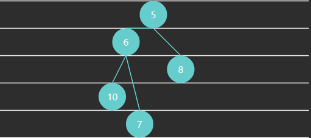

## 优先级队列

### 无序数组实现

**要点**

1. 入队保持顺序
2. 出队前找到优先级最高的出队，相当于一次选择排序

```java
public class PriorityQueue1<E extends Priority> implements Queue<E> {

    Priority[] array;
    int size;

    public PriorityQueue1(int capacity) {
        array = new Priority[capacity];
    }

    @Override // O(1)
    public boolean offer(E e) {
        if (isFull()) {
            return false;
        }
        array[size++] = e;
        return true;
    }

    // 返回优先级最高的索引值
    private int selectMax() {
        int max = 0;
        for (int i = 1; i < size; i++) {
            if (array[i].priority() > array[max].priority()) {
                max = i;
            }
        }
        return max;
    }

    @Override // O(n)
    public E poll() {
        if (isEmpty()) {
            return null;
        }
        int max = selectMax();
        E e = (E) array[max];
        remove(max);
        return e;
    }

    private void remove(int index) {
        if (index < size - 1) {
            System.arraycopy(array, index + 1,
                    array, index, size - 1 - index);
        }
        array[--size] = null; // help GC
    }

    @Override
    public E peek() {
        if (isEmpty()) {
            return null;
        }
        int max = selectMax();
        return (E) array[max];
    }

    @Override
    public boolean isEmpty() {
        return size == 0;
    }

    @Override
    public boolean isFull() {
        return size == array.length;
    }
}
```

* 视频中忘记了 help GC，注意一下

### 有序数组实现

**要点**

1. 入队后排好序，优先级最高的排列在尾部
2. 出队只需删除尾部元素即可

```java
public class PriorityQueue2<E extends Priority> implements Queue<E> {

    Priority[] array;
    int size;

    public PriorityQueue2(int capacity) {
        array = new Priority[capacity];
    }

    // O(n)
    @Override
    public boolean offer(E e) {
        if (isFull()) {
            return false;
        }
        insert(e);
        size++;
        return true;
    }

    // 一轮插入排序
    private void insert(E e) {
        int i = size - 1;
        while (i >= 0 && array[i].priority() > e.priority()) {
            array[i + 1] = array[i];
            i--;
        }
        array[i + 1] = e;
    }

    // O(1)
    @Override
    public E poll() {
        if (isEmpty()) {
            return null;
        }
        E e = (E) array[size - 1];
        array[--size] = null; // help GC
        return e;
    }

    @Override
    public E peek() {
        if (isEmpty()) {
            return null;
        }
        return (E) array[size - 1];
    }

    @Override
    public boolean isEmpty() {
        return size == 0;
    }

    @Override
    public boolean isFull() {
        return size == array.length;
    }
}
```

### 堆实现

计算机科学中，堆是一种基于树的数据结构，通常用**完全二叉树**实现。堆的特性如下

* 在大顶堆中，任意节点 C 与它的父节点 P 符合 $P.value \geq C.value$
* 而小顶堆中，任意节点 C 与它的父节点 P 符合 $P.value \leq C.value$
* 最顶层的节点（没有父亲）称之为 root 根节点

> In computer science, a **heap** is a specialized tree-based data structure which is essentially an almost complete tree that satisfies the **heap property**: in a *max heap*, for any given node C, if P is a parent node of C, then the *key* (the *value*) of P is greater than or equal to the key of C. In a *min heap*, the key of P is less than or equal to the key of C. The node at the "top" of the heap (with no parents) is called the **root** node

例1 - 满二叉树（Full Binary Tree）特点：每一层都是填满的


例2 - 完全二叉树（Complete Binary Tree）特点：最后一层可能未填满，靠左对齐



例3 - 大顶堆


例4 - 小顶堆


完全二叉树可以使用数组来表示


特征

* 如果从索引 0 开始存储节点数据
  * 节点 $i$ 的父节点为 $floor((i-1)/2)$，当 $i>0$ 时
  * 节点 $i$ 的左子节点为 $2i+1$，右子节点为 $2i+2$，当然它们得 $< size$
* 如果从索引 1 开始存储节点数据
  * 节点 $i$ 的父节点为 $floor(i/2)$，当 $i > 1$ 时
  * 节点 $i$ 的左子节点为 $2i$，右子节点为 $2i+1$，同样得 $< size$

代码

```java
public class PriorityQueue4<E extends Priority> implements Queue<E> {

    Priority[] array;
    int size;

    public PriorityQueue4(int capacity) {
        array = new Priority[capacity];
    }

    @Override
    public boolean offer(E offered) {
        if (isFull()) {
            return false;
        }
        int child = size++;
        int parent = (child - 1) / 2;
        while (child > 0 && offered.priority() > array[parent].priority()) {
            array[child] = array[parent];
            child = parent;
            parent = (child - 1) / 2;
        }
        array[child] = offered;
        return true;
    }


    private void swap(int i, int j) {
        Priority t = array[i];
        array[i] = array[j];
        array[j] = t;
    }

    @Override
    public E poll() {
        if (isEmpty()) {
            return null;
        }
        swap(0, size - 1);
        size--;
        Priority e = array[size];
        array[size] = null;
  
        shiftDown(0);  
        return (E) e;
    }

    void shiftDown(int parent) {
        int left = 2 * parent + 1;
        int right = left + 1;
        int max = parent;
        if (left < size && array[left].priority() > array[max].priority()) {
            max = left;
        }
        if (right < size && array[right].priority() > array[max].priority()) {
            max = right;
        }
        if (max != parent) {
            swap(max, parent);
            shiftDown(max);
        }
    }

    @Override
    public E peek() {
        if (isEmpty()) {
            return null;
        }
        return (E) array[0];
    }

    @Override
    public boolean isEmpty() {
        return size == 0;
    }

    @Override
    public boolean isFull() {
        return size == array.length;
    }
}
```

### 习题

#### E01. 合并多个有序链表-Leetcode 23

这道题目之前解答过，现在用刚学的优先级队列来实现一下

题目中要从小到大排列，因此选择用小顶堆来实现，自定义小顶堆如下

```java
public class MinHeap {

    ListNode[] array;
    int size;

    public MinHeap(int capacity) {
        array = new ListNode[capacity];
    }

    public void offer(ListNode offered) {
        int child = size++;
        int parent = (child - 1) / 2;
        while (child > 0 && offered.val < array[parent].val) {
            array[child] = array[parent];
            child = parent;
            parent = (child - 1) / 2;
        }
        array[child] = offered;
    }

    public ListNode poll() {
        if (isEmpty()) {
            return null;
        }
        swap(0, size - 1);
        size--;
        ListNode e = array[size];
        array[size] = null; // help GC

        down(0);

        return e;
    }

    private void down(int parent) {
        int left = 2 * parent + 1;
        int right = left + 1;
        int min = parent;
        if (left < size && array[left].val < array[min].val) {
            min = left;
        }
        if (right < size && array[right].val < array[min].val) {
            min = right;
        }
        if (min != parent) {
            swap(min, parent);
            down(min);
        }
    }

    private void swap(int i, int j) {
        ListNode t = array[i];
        array[i] = array[j];
        array[j] = t;
    }

    public boolean isEmpty() {
        return size == 0;
    }
}
```

代码

```java
public class E01Leetcode23 {
    public ListNode mergeKLists(ListNode[] lists) {
        // 1. 使用 jdk 的优先级队列实现
//        PriorityQueue<ListNode> queue = new PriorityQueue<>(Comparator.comparingInt(a -> a.val));
        // 2. 使用自定义小顶堆实现
        MinHeap queue = new MinHeap(lists.length);
        for (ListNode head : lists) {
            if (head != null) {
                queue.offer(head);
            }
        }
        ListNode s = new ListNode(-1, null);
        ListNode p = s;
        while (!queue.isEmpty()) {
            ListNode node = queue.poll();
            p.next = node;
            p = node;
            if (node.next != null) {
                queue.offer(node.next);
            }
        }
        return s.next;
    }
}
```

提问：

* 能否将每个链表的所有元素全部加入堆，再一个个从堆顶移除？

回答：

* 可以是可以，但对空间占用就高了，堆的一个优点就是用有限的空间做事情
