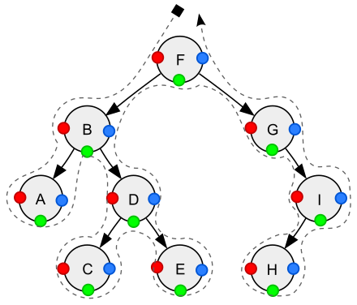

## 二叉树

二叉树是这么一种树状结构：每个节点最多有两个孩子，左孩子和右孩子

重要的二叉树结构

* 完全二叉树（complete binary tree）是一种二叉树结构，除最后一层以外，每一层都必须填满，填充时要遵从先左后右
* 平衡二叉树（balance binary tree）是一种二叉树结构，其中每个节点的左右子树高度相差不超过 1

### 存储

存储方式分为两种

1. 定义树节点与左、右孩子引用（TreeNode）
2. 使用数组，前面讲堆时用过，若以 0 作为树的根，索引可以通过如下方式计算
   * 父 = floor((子 - 1) / 2)
   * 左孩子 = 父 * 2 + 1
   * 右孩子 = 父 * 2 + 2

### 遍历

遍历也分为两种

1. 广度优先遍历（Breadth-first order）：尽可能先访问距离根最近的节点，也称为层序遍历
2. 深度优先遍历（Depth-first order）：对于二叉树，可以进一步分成三种（要深入到叶子节点）
   1. pre-order 前序遍历，对于每一棵子树，先访问该节点，然后是左子树，最后是右子树
   2. in-order 中序遍历，对于每一棵子树，先访问左子树，然后是该节点，最后是右子树
   3. post-order 后序遍历，对于每一棵子树，先访问左子树，然后是右子树，最后是该节点

#### 广度优先


| 本轮开始时队列 | 本轮访问节点 |
| -------------- | ------------ |
| [1]            | 1            |
| [2, 3]         | 2            |
| [3, 4]         | 3            |
| [4, 5, 6]      | 4            |
| [5, 6]         | 5            |
| [6, 7, 8]      | 6            |
| [7, 8]         | 7            |
| [8]            | 8            |
| []             |              |

1. 初始化，将根节点加入队列
2. 循环处理队列中每个节点，直至队列为空
3. 每次循环内处理节点后，将它的孩子节点（即下一层的节点）加入队列

> 注意
>
> * 以上用队列来层序遍历是针对  TreeNode 这种方式表示的二叉树
> * 对于数组表现的二叉树，则直接遍历数组即可，自然为层序遍历的顺序

#### 深度优先


| 栈暂存    | 已处理                                                            | 前序遍历 | 中序遍历 |
| --------- | ----------------------------------------------------------------- | -------- | -------- |
| [1]       | 1 ✔️ 左💤 右💤                                                  | 1        |          |
| [1, 2]    | 2✔️ 左💤 右💤<br />1✔️ 左💤 右💤                              | 2        |          |
| [1, 2, 4] | 4✔️ 左✔️ 右✔️<br />2✔️ 左💤 右💤<br />1✔️ 左💤 右💤     | 4        | 4        |
| [1, 2]    | 2✔️ 左✔️ 右✔️<br />1✔️ 左💤 右💤                          |          | 2        |
| [1]       | 1✔️ 左✔️ 右💤                                                 |          | 1        |
| [1, 3]    | 3✔️ 左💤 右💤<br />1✔️ 左✔️ 右💤                            | 3        |          |
| [1, 3, 5] | 5✔️ 左✔️ 右✔️<br />3✔️ 左💤 右💤<br />1✔️ 左✔️ 右💤   | 5        | 5        |
| [1, 3]    | 3✔️ 左✔️ 右💤<br />1✔️ 左✔️ 右💤                          |          | 3        |
| [1, 3, 6] | 6✔️ 左✔️ 右✔️<br />3✔️ 左✔️ 右💤<br />1✔️ 左✔️ 右💤 | 6        | 6        |
| [1, 3]    | 3✔️ 左✔️ 右✔️<br />1✔️ 左✔️ 右💤                        |          |          |
| [1]       | 1✔️ 左✔️ 右✔️                                               |          |          |
| []        |                                                                   |          |          |

#### 递归实现

```java
/**
 * <h3>前序遍历</h3>
 * @param node 节点
 */
static void preOrder(TreeNode node) {
    if (node == null) {
        return;
    }
    System.out.print(node.val + "\t"); // 值
    preOrder(node.left); // 左
    preOrder(node.right); // 右
}

/**
 * <h3>中序遍历</h3>
 * @param node 节点
 */
static void inOrder(TreeNode node) {
    if (node == null) {
        return;
    }
    inOrder(node.left); // 左
    System.out.print(node.val + "\t"); // 值
    inOrder(node.right); // 右
}

/**
 * <h3>后序遍历</h3>
 * @param node 节点
 */
static void postOrder(TreeNode node) {
    if (node == null) {
        return;
    }
    postOrder(node.left); // 左
    postOrder(node.right); // 右
    System.out.print(node.val + "\t"); // 值
}
```

#### 非递归实现

**前序遍历**

```java
LinkedListStack<TreeNode> stack = new LinkedListStack<>();
TreeNode curr = root;

while (!stack.isEmpty() || curr != null) {
    if (curr != null) {
        stack.push(curr);
        System.out.println(curr);
        curr = curr.left;
    } else {
        TreeNode pop = stack.pop();
        curr = pop.right;
    }

}
```

**中序遍历**

```java
LinkedListStack<TreeNode> stack = new LinkedListStack<>();
TreeNode curr = root;

while (!stack.isEmpty() || curr != null) {
    if (curr != null) {
        stack.push(curr);
        curr = curr.left;
    } else {
        TreeNode pop = stack.pop();
        System.out.println(pop);
        curr = pop.right;
    }
}
```

**后序遍历**

```java
LinkedListStack<TreeNode> stack = new LinkedListStack<>();
TreeNode curr = root;
TreeNode pop = null;

while (!stack.isEmpty() || curr != null) {
    if (curr != null) {
        stack.push(curr);
        curr = curr.left;
    } else {
        TreeNode peek = stack.peek();
        if (peek.right == null || peek.right == pop) {
            pop = stack.pop();
            System.out.println(pop);
        } else {
            curr = peek.right;
        }
    }
}
```

对于后序遍历，向回走时，需要处理完右子树才能 pop 出栈。如何知道右子树处理完成呢？

* 如果栈顶元素的 $right \equiv null$ 表示没啥可处理的，可以出栈
* 如果栈顶元素的 $right \neq null$，

  * 那么使用 lastPop 记录最近出栈的节点，即表示从这个节点向回走
  * 如果栈顶元素的 $right==lastPop$ 此时应当出栈

对于前、中两种遍历，实际以上代码从右子树向回走时，并未走完全程（stack 提前出栈了）后序遍历以上代码是走完全程了

**统一写法**

下面是一种统一的写法，依据后序遍历修改

```java
LinkedList<TreeNode> stack = new LinkedList<>();

TreeNode curr = root; // 代表当前节点
TreeNode pop = null; // 最近一次弹栈的元素
while (curr != null || !stack.isEmpty()) {
    if (curr != null) {
        colorPrintln("前: " + curr.val, 31);
        stack.push(curr); // 压入栈，为了记住回来的路
        curr = curr.left;
    } else {
        TreeNode peek = stack.peek();
        // 右子树可以不处理, 对中序来说, 要在右子树处理之前打印
        if (peek.right == null) {
            colorPrintln("中: " + peek.val, 36);
            pop = stack.pop();
            colorPrintln("后: " + pop.val, 34);
        }
        // 右子树处理完成, 对中序来说, 无需打印
        else if (peek.right == pop) {
            pop = stack.pop();
            colorPrintln("后: " + pop.val, 34);
        }
        // 右子树待处理, 对中序来说, 要在右子树处理之前打印
        else {
            colorPrintln("中: " + peek.val, 36);
            curr = peek.right;
        }
    }
}

public static void colorPrintln(String origin, int color) {
    System.out.printf("\033[%dm%s\033[0m%n", color, origin);
}
```

一张图演示三种遍历



* 红色：前序遍历顺序
* 绿色：中序遍历顺序
* 蓝色：后续遍历顺序

### 习题

#### E01. 前序遍历二叉树-Leetcode 144

#### E02. 中序遍历二叉树-Leetcode 94

#### E03. 后序遍历二叉树-Leetcode 145

#### E04. 对称二叉树-Leetcode 101

```java
public boolean isSymmetric(TreeNode root) {
    return check(root.left, root.right);
}

public boolean check(TreeNode left, TreeNode right) {
    // 若同时为 null
    if (left == null && right == null) {
        return true;
    }
    // 若有一个为 null (有上一轮筛选，另一个肯定不为 null)
    if (left == null || right == null) {
        return false;
    }
    if (left.val != right.val) {
        return false;
    }
    return check(left.left, right.right) && check(left.right, right.left);
}
```

类似题目：Leetcode 100 题 - 相同的树

#### E05. 二叉树最大深度-Leetcode 104

**后序遍历求解**

```java
/*
    思路：
    1. 得到左子树深度, 得到右子树深度, 二者最大者加一, 就是本节点深度
    2. 因为需要先得到左右子树深度, 很显然是后序遍历典型应用
    3. 关于深度的定义：从根出发, 离根最远的节点总边数,
        注意: 力扣里的深度定义要多一

        深度2         深度3         深度1
        1            1            1
       / \          / \
      2   3        2   3
                        \
                         4
 */
public int maxDepth(TreeNode node) {
    if (node == null) {
        return 0; // 非力扣题目改为返回 -1
    }
    int d1 = maxDepth(node.left);
    int d2 = maxDepth(node.right);
    return Integer.max(d1, d2) + 1;
}
```

**后序遍历求解-非递归**

```java
/*
    思路：
    1. 使用非递归后序遍历, 栈的最大高度即为最大深度
 */
public int maxDepth(TreeNode root) {
    TreeNode curr = root;
    LinkedList<TreeNode> stack = new LinkedList<>();
    int max = 0;
    TreeNode pop = null;
    while (curr != null || !stack.isEmpty()) {
        if (curr != null) {
            stack.push(curr);
            int size = stack.size();
            if (size > max) {
                max = size;
            }
            curr = curr.left;
        } else {
            TreeNode peek = stack.peek();
            if(peek.right == null || peek.right == pop) {
                pop = stack.pop();
            } else {
                curr = peek.right;
            }
        }
    }
    return max;
}
```

**层序遍历求解**

```java
/*
    思路：
    1. 使用层序遍历, 层数即最大深度
 */
public int maxDepth(TreeNode root) {
    if(root == null) {
        return 0;
    }
    Queue<TreeNode> queue = new LinkedList<>();
    queue.offer(root);
    int level = 0;
    while (!queue.isEmpty()) {
        level++;
        int size = queue.size();
        for (int i = 0; i < size; i++) {
            TreeNode node = queue.poll();
            if (node.left != null) {
                queue.offer(node.left);
            }
            if (node.right != null) {
                queue.offer(node.right);
            }
        }
    }
    return level;
}
```

#### E06. 二叉树最小深度-Leetcode 111

**后序遍历求解**

```java
public int minDepth(TreeNode node) {
    if (node == null) {
        return 0;
    }
    int d1 = minDepth(node.left);
    int d2 = minDepth(node.right);
    if (d1 == 0 || d2 == 0) {
        return d1 + d2 + 1;
    }
    return Integer.min(d1, d2) + 1;
}
```

相较于求最大深度，应当考虑：

* 当右子树为 null，应当返回左子树深度加一
* 当左子树为 null，应当返回右子树深度加一

上面两种情况满足时，不应该再把为 null 子树的深度 0 参与最小值比较，例如这样

```
    1
   /
  2
```

* 正确深度为 2，若把为 null 的右子树的深度 0 考虑进来，会得到错误结果 1

```
    1
     \
      3
       \
        4
```

* 正确深度为 3，若把为 null 的左子树的深度 0 考虑进来，会得到错误结果 1

**层序遍历求解**

遇到的第一个叶子节点所在层就是最小深度

例如，下面的树遇到的第一个叶子节点 3 所在的层就是最小深度，其他 4，7 等叶子节点深度更深，也更晚遇到

```
     1
    / \   
   2   3
  / \
 4   5 
    /
   7 
```

代码

```java
public int minDepth(TreeNode root) {
    if(root == null) {
        return 0;
    }
    Queue<TreeNode> queue = new LinkedList<>();
    queue.offer(root);
    int level = 0;
    while (!queue.isEmpty()) {
        level++;
        int size = queue.size();
        for (int i = 0; i < size; i++) {
            TreeNode node = queue.poll();
            if (node.left == null && node.right == null) {
                return level;
            }
            if (node.left != null) {
                queue.offer(node.left);
            }
            if (node.right != null) {
                queue.offer(node.right);
            }
        }
    }
    return level;
}
```

效率会高于之前后序遍历解法，因为找到第一个叶子节点后，就无需后续的层序遍历了

#### E07. 翻转二叉树-Leetcode 226

```java
public TreeNode invertTree(TreeNode root) {
    fn(root);
    return root;
}

private void fn(TreeNode node){
    if (node == null) {
        return;
    }
    TreeNode t = node.left;
    node.left = node.right;
    node.right = t;
    fn(node.left);
    fn(node.right);
}
```

先交换、再递归或是先递归、再交换都可以

#### E08. 后缀表达式转二叉树

```java
static class TreeNode {
    public String val;
    public TreeNode left;
    public TreeNode right;

    public TreeNode(String val) {
        this.val = val;
    }

    public TreeNode(TreeNode left, String val, TreeNode right) {
        this.left = left;
        this.val = val;
        this.right = right;
    }

    @Override
    public String toString() {
        return this.val;
    }
}

/*
    中缀表达式           (2-1)*3
    后缀（逆波兰）表达式   21-3*

    1.遇到数字入栈
    2.遇到运算符, 出栈两次, 与当前节点建立父子关系, 当前节点入栈

    栈
    |   |
    |   |
    |   |
    _____

    表达式树
        *
       / \
      -   3
     / \
    2   1

    21-3*
 */
public TreeNode constructExpressionTree(String[] tokens) {
    LinkedList<TreeNode> stack = new LinkedList<>();
    for (String t : tokens) {
        switch (t) {
            case "+", "-", "*", "/" -> { // 运算符
                TreeNode right = stack.pop();
                TreeNode left = stack.pop();
                TreeNode parent = new TreeNode(t);
                parent.left = left;
                parent.right = right;
                stack.push(parent);
            }
            default -> { // 数字
                stack.push(new TreeNode(t));
            }
        }
    }
    return stack.peek();
}
```

#### E09. 根据前序与中序遍历结果构造二叉树-Leetcode 105

* 先通过前序遍历结果定位根节点
* 再结合中序遍历结果切分左右子树

```java
public class E09Leetcode105 {

    /*
        preOrder = {1,2,4,3,6,7}
        inOrder = {4,2,1,6,3,7}

        根 1
            pre         in
        左  2,4         4,2
        右  3,6,7       6,3,7


        根 2
        左 4

        根 3
        左 6
        右 7
     */

    public TreeNode buildTree(int[] preOrder, int[] inOrder) {
        if (preOrder.length == 0) {
            return null;
        }
        // 创建根节点
        int rootValue = preOrder[0];
        TreeNode root = new TreeNode(rootValue);
        // 区分左右子树
        for (int i = 0; i < inOrder.length; i++) {
            if (inOrder[i] == rootValue) {
                // 0 ~ i-1 左子树
                // i+1 ~ inOrder.length -1 右子树
                int[] inLeft = Arrays.copyOfRange(inOrder, 0, i); // [4,2]
                int[] inRight = Arrays.copyOfRange(inOrder, i + 1, inOrder.length); // [6,3,7]

                int[] preLeft = Arrays.copyOfRange(preOrder, 1, i + 1); // [2,4]
                int[] preRight = Arrays.copyOfRange(preOrder, i + 1, inOrder.length); // [3,6,7]

                root.left = buildTree(preLeft, inLeft); // 2
                root.right = buildTree(preRight, inRight); // 3
                break;
            }
        }
        return root;
    }

}
```

* 代码可以进一步优化，涉及新数据结构，以后实现

#### E10. 根据中序与后序遍历结果构造二叉树-Leetcode 106

* 先通过后序遍历结果定位根节点
* 再结合中序遍历结果切分左右子树

```java
public TreeNode buildTree(int[] inOrder, int[] postOrder) {
    if (inOrder.length == 0) {
        return null;
    }
    // 根
    int rootValue = postOrder[postOrder.length - 1];
    TreeNode root = new TreeNode(rootValue);
    // 切分左右子树
    for (int i = 0; i < inOrder.length; i++) {
        if (inOrder[i] == rootValue) {
            int[] inLeft = Arrays.copyOfRange(inOrder, 0, i);
            int[] inRight = Arrays.copyOfRange(inOrder, i + 1, inOrder.length);

            int[] postLeft = Arrays.copyOfRange(postOrder, 0, i);
            int[] postRight = Arrays.copyOfRange(postOrder, i, postOrder.length - 1);

            root.left = buildTree(inLeft, postLeft);
            root.right = buildTree(inRight, postRight);
            break;
        }
    }
    return root;
}
```

* 代码可以进一步优化，涉及新数据结构，以后实现
