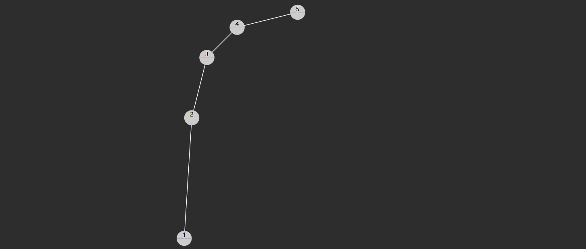

## 3.2 二叉搜索树

### 概述

#### 历史

> 二叉搜索树最早是由Bernoulli兄弟在18世纪中提出的，但是真正推广和应用该数据结构的是1960年代的D.L. Gries。他的著作《The Science of Programming》中详细介绍了二叉搜索树的实现和应用。
>
> 在计算机科学的发展中，二叉搜索树成为了一种非常基础的数据结构，被广泛应用在各种领域，包括搜索、排序、数据库索引等。随着计算机算力的提升和对数据结构的深入研究，二叉搜索树也不断被优化和扩展，例如AVL树、红黑树等。

#### 特性

二叉搜索树（也称二叉排序树）是符合下面特征的二叉树：

1. 树节点增加 key 属性，用来比较谁大谁小，key 不可以重复
2. 对于任意一个树节点，它的 key 比左子树的 key 都大，同时也比右子树的 key 都小，例如下图所示


轻易看出要查找 7 （从根开始）自然就可应用二分查找算法，只需三次比较

* 与 4 比，较之大，向右找
* 与 6 比，较之大，继续向右找
* 与 7 比，找到

查找的时间复杂度与**树高**相关，插入、删除也是如此。

* 如果这棵树长得还不赖（左右平衡）上图，那么时间复杂度均是 $O(\log{N})$
* 当然，这棵树如果长得丑（左右高度相差过大）下图，那么这时是最糟的情况，时间复杂度是 $O(N)$



> 注：
>
> * 二叉搜索树 - 英文 binary search tree，简称 BST
> * 二叉排序树 - 英文 binary ordered tree 或 binary sorted tree

### 实现

#### 定义节点

```java
static class BSTNode {
    int key; // 若希望任意类型作为 key, 则后续可以将其设计为 Comparable 接口
    Object value;
    BSTNode left;
    BSTNode right;

    public BSTNode(int key) {
        this.key = key;
        this.value = key;
    }

    public BSTNode(int key, Object value) {
        this.key = key;
        this.value = value;
    }

    public BSTNode(int key, Object value, BSTNode left, BSTNode right) {
        this.key = key;
        this.value = value;
        this.left = left;
        this.right = right;
    }
}
```

#### 查询

**递归实现**

```java
public Object get(int key) {
    return doGet(root, key);
}

private Object doGet(BSTNode node, int key) {
    if (node == null) {
        return null; // 没找到
    }
    if (key < node.key) {
        return doGet(node.left, key); // 向左找
    } else if (node.key < key) {
        return doGet(node.right, key); // 向右找
    } else {
        return node.value; // 找到了
    }
}
```

**非递归实现**

```java
public Object get(int key) {
    BSTNode node = root;
    while (node != null) {
        if (key < node.key) {
            node = node.left;
        } else if (node.key < key) {
            node = node.right;
        } else {
            return node.value;
        }
    }
    return null;
}
```

#### Comparable

如果希望让除 int 外更多的类型能够作为 key，一种方式是 key 必须实现 Comparable 接口。

```java
public class BSTTree2<T extends Comparable<T>> {
    static class BSTNode<T> {
        T key; // 若希望任意类型作为 key, 则后续可以将其设计为 Comparable 接口
        Object value;
        BSTNode<T> left;
        BSTNode<T> right;

        public BSTNode(T key) {
            this.key = key;
            this.value = key;
        }

        public BSTNode(T key, Object value) {
            this.key = key;
            this.value = value;
        }

        public BSTNode(T key, Object value, BSTNode<T> left, BSTNode<T> right) {
            this.key = key;
            this.value = value;
            this.left = left;
            this.right = right;
        }
    }

    BSTNode<T> root;

    public Object get(T key) {
        return doGet(root, key);
    }

    private Object doGet(BSTNode<T> node, T key) {
        if (node == null) {
            return null;
        }
        int result = node.key.compareTo(key);
        if (result > 0) {
            return doGet(node.left, key);
        } else if (result < 0) {
            return doGet(node.right, key);
        } else {
            return node.value;
        }
    }

}
```

还有一种做法不要求 key 实现 Comparable 接口，而是在构造 Tree 时把比较规则作为 Comparator 传入，将来比较 key 大小时都调用此 Comparator 进行比较，这种做法可以参考 Java 中的 java.util.TreeMap

#### 最小

**递归实现**

```java
public Object min() {
    return doMin(root);
}

public Object doMin(BSTNode node) {
    if (node == null) {
        return null;
    }
    // 左边已走到头
    if (node.left == null) { 
        return node.value;
    }
    return doMin(node.left);
}
```

**非递归实现**

```java
public Object min() {
    if (root == null) {
        return null;
    }
    BSTNode p = root;
    // 左边未走到头
    while (p.left != null) {
        p = p.left;
    }
    return p.value;
}
```

#### 最大

**递归实现**

```java
public Object max() {
    return doMax(root);
}

public Object doMax(BSTNode node) {
    if (node == null) {
        return null;
    }
    // 右边已走到头
    if (node.left == null) { 
        return node.value;
    }
    return doMin(node.right);
}
```

**非递归实现**

```java
public Object max() {
    if (root == null) {
        return null;
    }
    BSTNode p = root;
    // 右边未走到头
    while (p.right != null) {
        p = p.right;
    }
    return p.value;
}
```

#### 新增

**递归实现**

```java
public void put(int key, Object value) {
    root = doPut(root, key, value);
}

private BSTNode doPut(BSTNode node, int key, Object value) {
    if (node == null) {
        return new BSTNode(key, value);
    }
    if (key < node.key) {
        node.left = doPut(node.left, key, value);
    } else if (node.key < key) {
        node.right = doPut(node.right, key, value);
    } else {
        node.value = value;
    }
    return node;
}
```

* 若找到 key，走 else 更新找到节点的值
* 若没找到 key，走第一个 if，创建并返回新节点
  * 返回的新节点，作为上次递归时 node 的左孩子或右孩子
  * 缺点是，会有很多不必要的赋值操作

**非递归实现**

```java
public void put(int key, Object value) {
    BSTNode node = root;
    BSTNode parent = null;
    while (node != null) {
        parent = node;
        if (key < node.key) {
            node = node.left;
        } else if (node.key < key) {
            node = node.right;
        } else {
            // 1. key 存在则更新
            node.value = value;
            return;
        }
    }
    // 2. key 不存在则新增
    if (parent == null) {
        root = new BSTNode(key, value);
    } else if (key < parent.key) {
        parent.left = new BSTNode(key, value);
    } else {
        parent.right = new BSTNode(key, value);
    }
}
```

#### 前驱后继


一个节点的前驱（前任）节点是指比它小的节点中，最大的那个

一个节点的后继（后任）节点是指比它大的节点中，最小的那个

例如上图中

* 1 没有前驱，后继是 2
* 2 前驱是 1，后继是 3
* 3 前驱是 2，后继是 4
* ...

简单的办法是中序遍历，即可获得排序结果，此时很容易找到前驱后继

要效率更高，需要研究一下规律，**找前驱**分成 2 种情况：


1. 节点有左子树，此时前驱节点就是左子树的最大值，图中属于这种情况的有
   * 2 的前驱是1
   * 4 的前驱是 3
   * 6 的前驱是 5
   * 7 的前驱是 6
2. 节点没有左子树，若离它最近的祖先自从左而来，此祖先即为前驱，如
   * 3 的祖先 2 自左而来，前驱 2
   * 5 的祖先 4 自左而来，前驱 4
   * 8 的祖先 7 自左而来，前驱 7
   * 1 没有这样的祖先，前驱 null

**找后继**也分成 2 种情况


1. 节点有右子树，此时后继节点即为右子树的最小值，如
   * 2 的后继 3
   * 3 的后继 4
   * 5 的后继 6
   * 7 的后继 8
2. 节点没有右子树，若离它最近的祖先自从右而来，此祖先即为后继，如
   * 1 的祖先 2 自右而来，后继 2
   * 4 的祖先 5 自右而来，后继 5
   * 6 的祖先 7 自右而来，后继 7
   * 8 没有这样的祖先，后继 null

```java
public Object predecessor(int key) {
    BSTNode ancestorFromLeft = null;
    BSTNode p = root;
    while (p != null) {
        if (key < p.key) {
            p = p.left;
        } else if (p.key < key) {
            ancestorFromLeft = p;
            p = p.right;
        } else {
            break;
        }
    }

    if (p == null) {
        return null;
    }
    // 情况1 - 有左孩子
    if (p.left != null) {
        return max(p.left);
    }
    // 情况2 - 有祖先自左而来
    return ancestorFromLeft != null ? ancestorFromLeft.value : null;
}


public Object successor(int key) {
    BSTNode ancestorFromRight = null;
    BSTNode p = root;
    while (p != null) {
        if (key < p.key) {
            ancestorFromRight = p;
            p = p.left;
        } else if (p.key < key) {
            p = p.right;
        } else {
            break;
        }
    }

    if (p == null) {
        return null;
    }
    // 情况1 - 有右孩子
    if (p.right != null) {
        return min(p.right);
    }
    // 情况2 - 有祖先自右而来
    return ancestorFromRight != null ? ancestorFromRight.value : null;
}
```

#### 删除

要删除某节点（称为 D），必须先找到被删除节点的父节点，这里称为 Parent

1. 删除节点没有左孩子，将右孩子托孤给 Parent
2. 删除节点没有右孩子，将左孩子托孤给 Parent
3. 删除节点左右孩子都没有，已经被涵盖在情况1、情况2 当中，把 null 托孤给 Parent
4. 删除节点左右孩子都有，可以将它的后继节点（称为 S）托孤给 Parent，设 S 的父亲为 SP，又分两种情况
   1. SP 就是被删除节点，此时 D 与 S 紧邻，只需将 S 托孤给 Parent
   2. SP 不是被删除节点，此时 D 与 S 不相邻，此时需要将 S 的后代托孤给 SP，再将 S 托孤给 Parent

**非递归实现**

```java
/**
 * <h3>根据关键字删除</h3>
 *
 * @param key 关键字
 * @return 被删除关键字对应值
 */
public Object delete(int key) {
    BSTNode p = root;
    BSTNode parent = null;
    while (p != null) {
        if (key < p.key) {
            parent = p;
            p = p.left;
        } else if (p.key < key) {
            parent = p;
            p = p.right;
        } else {
            break;
        }
    }
    if (p == null) {
        return null;
    }
    // 删除操作
    if (p.left == null) {
        shift(parent, p, p.right); // 情况1
    } else if (p.right == null) {
        shift(parent, p, p.left); // 情况2
    } else {
        // 情况4
        // 4.1 被删除节点找后继
        BSTNode s = p.right;
        BSTNode sParent = p; // 后继父亲
        while (s.left != null) {
            sParent = s;
            s = s.left;
        }
        // 4.2 删除和后继不相邻, 处理后继的后事
        if (sParent != p) {          
            shift(sParent, s, s.right); // 不可能有左孩子
            s.right = p.right;
        }
        // 4.3 后继取代被删除节点
        shift(parent, p, s);
        s.left = p.left;
    }
    return p.value;
}

/**
 * 托孤方法
 *
 * @param parent  被删除节点的父亲
 * @param deleted 被删除节点
 * @param child   被顶上去的节点
 */
// 只考虑让 n1父亲的左或右孩子指向 n2, n1自己的左或右孩子并未在方法内改变
private void shift(BSTNode parent, BSTNode deleted, BSTNode child) {
    if (parent == null) {
        root = child;
    } else if (deleted == parent.left) {
        parent.left = child;
    } else {
        parent.right = child;
    }
}
```

**递归实现**

```java
public Object delete(int key) {
    ArrayList<Object> result = new ArrayList<>();
    root = doDelete(root, key, result);
    return result.isEmpty() ? null : result.get(0);
}

public BSTNode doDelete(BSTNode node, int key, ArrayList<Object> result) {
    if (node == null) {
        return null;
    }
    if (key < node.key) {
        node.left = doDelete(node.left, key, result);
        return node;
    }
    if (node.key < key) {
        node.right = doDelete(node.right, key, result);
        return node;
    }
    result.add(node.value);
    if (node.left != null && node.right != null) {
        BSTNode s = node.right;
        while (s.left != null) {
            s = s.left;
        }
        s.right = doDelete(node.right, s.key, new ArrayList<>());
        s.left = node.left;
        return s;
    }
    return node.left != null ? node.left : node.right;
}
```

说明

1. `ArrayList<Object> result` 用来保存被删除节点的值
2. 第二、第三个 if 对应没找到的情况，继续递归查找和删除，注意后续的 doDelete 返回值代表删剩下的，因此需要更新
3. 最后一个 return 对应删除节点只有一个孩子的情况，返回那个不为空的孩子，待删节点自己因没有返回而被删除
4. 第四个 if 对应删除节点有两个孩子的情况，此时需要找到后继节点，并在待删除节点的右子树中删掉后继节点，最后用后继节点替代掉待删除节点返回，别忘了改变后继节点的左右指针

#### 找小的

```java
public List<Object> less(int key) {
    ArrayList<Object> result = new ArrayList<>();
    BSTNode p = root;
    LinkedList<BSTNode> stack = new LinkedList<>();
    while (p != null || !stack.isEmpty()) {
        if (p != null) {
            stack.push(p);
            p = p.left;
        } else {
            BSTNode pop = stack.pop();
            if (pop.key < key) {
                result.add(pop.value);
            } else {
                break;
            }
            p = pop.right;
        }
    }
    return result;
}
```

#### 找大的

```java
public List<Object> greater(int key) {
    ArrayList<Object> result = new ArrayList<>();
    BSTNode p = root;
    LinkedList<BSTNode> stack = new LinkedList<>();
    while (p != null || !stack.isEmpty()) {
        if (p != null) {
            stack.push(p);
            p = p.left;
        } else {
            BSTNode pop = stack.pop();
            if (pop.key > key) {
                result.add(pop.value);
            }
            p = pop.right;
        }
    }
    return result;
}
```

但这样效率不高，可以用 RNL 遍历

> 注：
>
> - Pre-order, NLR
> - In-order, LNR
> - Post-order, LRN
> - Reverse pre-order, NRL
> - Reverse in-order, RNL
> - Reverse post-order, RLN

```java
public List<Object> greater(int key) {
    ArrayList<Object> result = new ArrayList<>();
    BSTNode p = root;
    LinkedList<BSTNode> stack = new LinkedList<>();
    while (p != null || !stack.isEmpty()) {
        if (p != null) {
            stack.push(p);
            p = p.right;
        } else {
            BSTNode pop = stack.pop();
            if (pop.key > key) {
                result.add(pop.value);
            } else {
                break;
            }
            p = pop.left;
        }
    }
    return result;
}
```

#### 找之间

```java
public List<Object> between(int key1, int key2) {
    ArrayList<Object> result = new ArrayList<>();
    BSTNode p = root;
    LinkedList<BSTNode> stack = new LinkedList<>();
    while (p != null || !stack.isEmpty()) {
        if (p != null) {
            stack.push(p);
            p = p.left;
        } else {
            BSTNode pop = stack.pop();
            if (pop.key >= key1 && pop.key <= key2) {
                result.add(pop.value);
            } else if (pop.key > key2) {
                break;
            }
            p = pop.right;
        }
    }
    return result;
}
```

#### 小结

优点：

1. 如果每个节点的左子树和右子树的大小差距不超过一，可以保证搜索操作的时间复杂度是 O(log n)，效率高。
2. 插入、删除结点等操作也比较容易实现，效率也比较高。
3. 对于有序数据的查询和处理，二叉查找树非常适用，可以使用中序遍历得到有序序列。

缺点：

1. 如果输入的数据是有序或者近似有序的，就会出现极度不平衡的情况，可能导致搜索效率下降，时间复杂度退化成O(n)。
2. 对于频繁地插入、删除操作，需要维护平衡二叉查找树，例如红黑树、AVL 树等，否则搜索效率也会下降。
3. 对于存在大量重复数据的情况，需要做相应的处理，否则会导致树的深度增加，搜索效率下降。
4. 对于结点过多的情况，由于树的空间开销较大，可能导致内存消耗过大，不适合对内存要求高的场景。

### 习题

#### E01. 删除节点-Leetcode 450

例题已经讲过，用非递归和递归均可实现，这里只给出递归参考代码

```java
public TreeNode deleteNode(TreeNode node, int key) {
    if (node == null) {
        return null;
    }
    if (key < node.val) {
        node.left = deleteNode(node.left, key);
        return node;
    }
    if (node.val < key) {
        node.right = deleteNode(node.right, key);
        return node;
    }
    if (node.left == null) { // 情况1 - 只有右孩子
        return node.right;
    }
    if (node.right == null) { // 情况2 - 只有左孩子
        return node.left;
    }
    TreeNode s = node.right; // 情况3 - 有两个孩子
    while (s.left != null) {
        s = s.left;
    }
    s.right = deleteNode(node.right, s.val);
    s.left = node.left;
    return s;
}
```

* 树节点 TreeNode 相当于例题中的 BSTNode

  * TreeNode  有属性：val, left, right，并未区分键值
  * BSTNode 有属性：key, value, left, right，区分了键值
* 它的 TreeNode 没有 key，比较用的是 TreeNode.val 属性与待删除 key 进行比较

#### E02. 新增节点-Leetcode 701

例题也讲过了（put），下面给出递归实现

```java
public TreeNode insertIntoBST(TreeNode node, int val) {
    if(node == null) {
        return new TreeNode(val);
    }
    if(val < node.val) {
        node.left = insertIntoBST(node.left, val);
    } else if(node.val < val) {
        node.right = insertIntoBST(node.right, val);
    }
    return node;
}
```

* 注意事项与上题相同，不再赘述
* 题目提示输入的 val 一定与树中节点不同，因此只需考虑**新增**情况，不会出现**更新**情况

#### E03. 查询节点-Leetcode 700

例题讲过，下面给出递归实现

```java
public TreeNode searchBST(TreeNode node, int val) {
    if(node == null) {
        return null;
    }
    if(val < node.val) {
        return searchBST(node.left, val);
    } else if(node.val < val) {
        return searchBST(node.right, val);
    } else {
        return node;
    }
}
```

#### E04. 验证二叉搜索树-Leetcode 98

**中序非递归实现**

```java
public boolean isValidBST(TreeNode root) {
    TreeNode p = root;
    LinkedList<TreeNode> stack = new LinkedList<>();
    long prev = Long.MIN_VALUE;
    while (p != null || !stack.isEmpty()) {
        if (p != null) {
            stack.push(p);
            p = p.left;
        } else {
            TreeNode pop = stack.pop();
            if (prev >= pop.val) {
                return false;
            }
            prev = pop.val;
            p = pop.right;
        }
    }
    return true;
}
```

* 记录 prev 需要用 long，否则若测试用例中最小的节点为 Integer.MIN_VALUE 则测试会失败
* 注意，如果相邻两个节点相等，也不应当通过测试，例如，下面的树也是不合法的

```
	2
   / 
  2 
```

**中序递归实现**

```java
public boolean isValidBST(TreeNode root) {
    if (root == null) {
        return true;
    }
    return doValid(new AtomicLong(Long.MIN_VALUE),root);
}

public boolean doValid(AtomicLong prev, TreeNode node) {
    if (node == null) {
        return true;
    }
    boolean a = doValid(prev, node.left);
    if (prev.get() >= node.val) {
        return false;
    }
    prev.set(node.val);
    boolean b = doValid(prev, node.right);
    return a && b;
}
```

* 为何不能用 Long 或 long？因为它们都是局部变量且不可变，因此每次赋值时，并不会改变其它方法调用时的 prev
* 要么把 prev 设置为 AtomicLong，要么把 prev 设置为全局变量，而不要采用方法参数这样的局部变量
* 上述代码并不是最有效率的，分析过程见视频讲解

**上下限递归**

```java
public boolean isValidBST(TreeNode node) {
    return doValid(node, Long.MIN_VALUE, Long.MAX_VALUE);
}

private boolean doValid(TreeNode node, long min, long max) {
    if (node == null) {
        return true;
    }
    if (node.val <= min || node.val >= max) {
        return false;
    }
    return doValid(node.left, min, node.val) && doValid(node.right, node.val, max);
}
```

* 设每个节点必须在一个范围内：$(min, max)$，不包含边界，若节点值超过这个范围，则返回 false
* 对于 node.left 范围肯定是 $(min, node.val)$
* 对于 node.right 范围肯定是 $(node.val, max)$
* 一开始不知道 min，max 则取 java 中长整数的最小、最大值
* 本质是前序遍历 + 剪枝

#### E05. 求范围和-Leetcode 938

**中序递归实现**

```java
public int rangeSumBST(TreeNode node, int low, int high) {
    if (node == null) {
        return 0;
    }
    int a = rangeSumBST(node.left, low, high);
    int b = 0;
    if (node.val >= low && node.val <= high) {
        b = node.val;
    }
    return a + b + rangeSumBST(node.right, low, high);
}
```

**中序非递归实现**

```java
public int rangeSumBST(TreeNode node, int low, int high) {
    TreeNode p = node;
    LinkedList<TreeNode> stack = new LinkedList<>();
    int sum = 0;
    while(p != null || !stack.isEmpty()) {
        if (p != null) {
            stack.push(p);
            p = p.left;
        } else {
            TreeNode pop = stack.pop();
            if (pop.val > high) {
                break;
            }
            if (pop.val >= low) {
                sum += pop.val;
            }
            p = pop.right;
        }
    }
    return sum;
}
```

* leedcode 执行耗时 4ms

**上下限递归实现**

```java
public int rangeSumBST(TreeNode node, int low, int high) {
    if (node == null) {
        return 0;
    }
    if (node.val < low) {
        return rangeSumBST(node.right, low, high);
    } 
    if (node.val > high) {
        return rangeSumBST(node.left, low, high);
    }
    return node.val + 
        rangeSumBST(node.left, low, high) + 
        rangeSumBST(node.right, low, high);
}
```

* leetcode 执行耗时 0 ms
* node.val < low 只需考虑它右子树的累加结果
* node.val > high 只需考虑它左子树的累加结果
* node.val 在范围内，需要把当前节点的值加上其左右子树的累加结果

#### E06. 根据前序遍历结果构造二叉搜索树-Leetcode 1008

**直接插入**

注意：根据前序遍历的结果，可以唯一地构造出一个二叉搜索树

```java
public TreeNode bstFromPreorder(int[] preorder) {
    TreeNode root = insert(null, preorder[0]);
    for (int i = 1; i < preorder.length; i++) {
        insert(root, preorder[i]);
    }
    return root;
}

private TreeNode insert(TreeNode node, int val) {
    if (node == null) {
        return new TreeNode(val);
    }
    if(val < node.val) {
        node.left = insert(node.left, val);
    } else if(node.val < val){
        node.right = insert(node.right, val);
    }
    return node;
}
```

**上限法**

```java
public TreeNode bstFromPreorder(int[] preorder) {
    return insert(preorder, Integer.MAX_VALUE);
}

int i = 0;
private TreeNode insert(int[] preorder, int max) {
    if (i == preorder.length) {
        return null;
    }
    int val = preorder[i];
    System.out.println(val + String.format("[%d]", max));
    if (val > max) {
        return null;
    }
    TreeNode node = new TreeNode(val);
    i++;
    node.left = insert(preorder, node.val); 
    node.right = insert(preorder, max);   
    return node;
}
```

依次处理 prevorder 中每个值, 返回创建好的节点或 null 作为上个节点的孩子

1. 如果超过上限, 返回 null
2. 如果没超过上限, 创建节点, 并将其左右孩子设置完整后返回
   * i++ 需要放在设置左右孩子之前，意思是从剩下的元素中挑选左右孩子

**分治法**

```java
public TreeNode bstFromPreorder(int[] preorder) {
    return partition(preorder, 0, preorder.length - 1);
}

private TreeNode partition(int[] preorder, int start, int end) {
    if (start > end) {
        return null;
    }
    TreeNode root = new TreeNode(preorder[start]);
    int index = start + 1;
    while (index <= end) {
        if (preorder[index] > preorder[start]) {
            break;
        }
        index++;
    }
    // index 就是右子树的起点
    root.left = partition(preorder, start + 1, index - 1);
    root.right = partition(preorder, index, end);
    return root;
}
```

* 刚开始 8, 5, 1, 7, 10, 12，方法每次执行，确定本次的根节点和左右子树的分界线
* 第一次确定根节点为 8，左子树 5, 1, 7，右子树 10, 12
* 对 5, 1, 7 做递归操作，确定根节点是 5， 左子树是 1， 右子树是 7
* 对 1 做递归操作，确定根节点是 1，左右子树为 null
* 对 7 做递归操作，确定根节点是 7，左右子树为 null
* 对 10, 12 做递归操作，确定根节点是 10，左子树为 null，右子树为 12
* 对 12 做递归操作，确定根节点是 12，左右子树为 null
* 递归结束，返回本范围内的根节点

#### E07. 二叉搜索树的最近公共祖先-Leetcode 235

要点：若 p，q 在 ancestor 的两侧，则 ancestor 就是它们的最近公共祖先

```java
public TreeNode lowestCommonAncestor(TreeNode root, TreeNode p, TreeNode q) {
    TreeNode ancestor = root;
    while (ancestor.val > p.val && ancestor.val > q.val || 
           ancestor.val < p.val && ancestor.val < q.val) {
        if (ancestor.val > p.val) {
            ancestor = ancestor.left;
        } else {
            ancestor = ancestor.right;
        }
    }
    return ancestor;
}
```

#### 其它题目

| 题号          | 名称                       |
| ------------- | -------------------------- |
| Leetcode 236  | 二叉树的最近公共祖先       |
| Leetcode 114  | 二叉树展开为链表           |
| Leetcode 108  | 有序数组构造平衡二叉搜索树 |
| Leetcode 1382 | 二叉搜索树变为平衡         |
