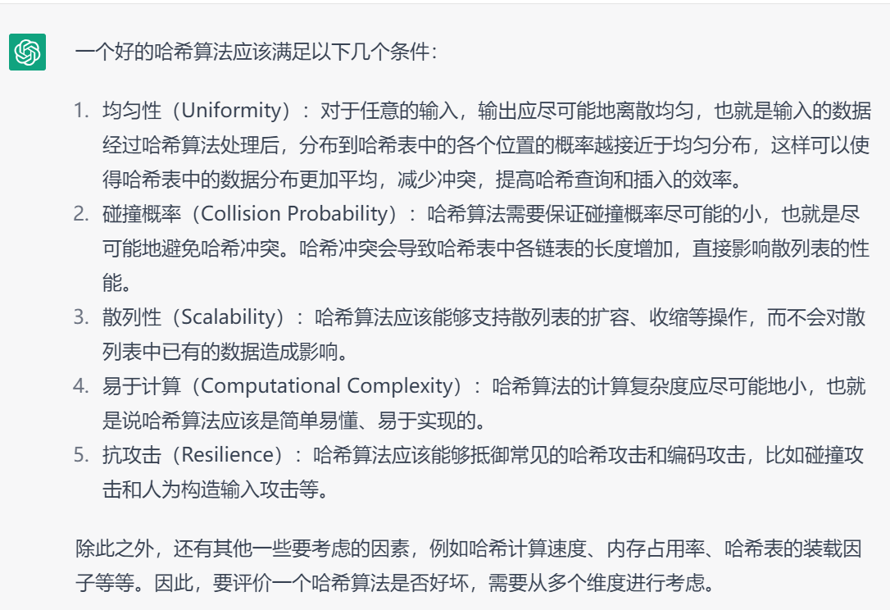

## 3.6 哈希表

### 第一版

未考虑 hash 码的生成，假定该 hash 码由我们提供

```java
public class HashTable {

    // 节点类
    static class Entry {
        int hash; // 哈希码
        Object key; // 键
        Object value; // 值
        Entry next;

        public Entry(int hash, Object key, Object value) {
            this.hash = hash;
            this.key = key;
            this.value = value;
        }
    }

    Entry[] table = new Entry[16];
    int size = 0; // 元素个数
    float loadFactor = 0.75f; // 12 阈值
    int threshold = (int) (loadFactor * table.length);

    /* 求模运算替换为位运算
        - 前提：数组长度是 2 的 n 次方
        - hash % 数组长度 等价于 hash & (数组长度-1)
     */

    // 根据 hash 码获取 value
    Object get(int hash, Object key) {
        int idx = hash & (table.length - 1);
        if (table[idx] == null) {
            return null;
        }
        Entry p = table[idx];
        while (p != null) {
            if (p.key.equals(key)) {
                return p.value;
            }
            p = p.next;
        }
        return null;
    }

    // 向 hash 表存入新 key value，如果 key 重复，则更新 value
    void put(int hash, Object key, Object value) {
        int idx = hash & (table.length - 1);
        if (table[idx] == null) {
            // 1. idx 处有空位, 直接新增
            table[idx] = new Entry(hash, key, value);
        } else {
            // 2. idx 处无空位, 沿链表查找 有重复key更新，否则新增
            Entry p = table[idx];
            while (true) {
                if (p.key.equals(key)) {
                    p.value = value; // 更新
                    return;
                }
                if (p.next == null) {
                    break;
                }
                p = p.next;
            }
            p.next = new Entry(hash, key, value); // 新增
        }
        size++;
        if (size > threshold) {
            resize();
        }
    }

    private void resize() {
        Entry[] newTable = new Entry[table.length << 1];
        for (int i = 0; i < table.length; i++) {
            Entry p = table[i]; // 拿到每个链表头
            if (p != null) {
            /*
                拆分链表，移动到新数组，拆分规律
                * 一个链表最多拆成两个
                * hash & table.length == 0 的一组
                * hash & table.length != 0 的一组
                                          p
                0->8->16->24->32->40->48->null
                            a
                0->16->32->48->null
                        b
                8->24->40->null
             */
                Entry a = null;
                Entry b = null;
                Entry aHead = null;
                Entry bHead = null;
                while (p != null) {
                    if ((p.hash & table.length) == 0) {
                        if (a != null) {
                            a.next = p;
                        } else {
                            aHead = p;
                        }
                        a = p; // 分配到a
                    } else {
                        if (b != null) {
                            b.next = p;
                        } else {
                            bHead = p;
                        }
                        b = p; // 分配到b
                    }
                    p = p.next;
                }
                // 规律： a 链表保持索引位置不变，b 链表索引位置+table.length
                if (a != null) {
                    a.next = null;
                    newTable[i] = aHead;
                }
                if (b != null) {
                    b.next = null;
                    newTable[i + table.length] = bHead;
                }
            }
        }
        table = newTable;
        threshold = (int) (loadFactor * table.length);
    }

    // 根据 hash 码删除，返回删除的 value
    Object remove(int hash, Object key) {
        int idx = hash & (table.length - 1);
        if (table[idx] == null) {
            return null;
        }
        Entry p = table[idx];
        Entry prev = null;
        while (p != null) {
            if (p.key.equals(key)) {
                // 找到了, 删除
                if (prev == null) { // 链表头
                    table[idx] = p.next;
                } else { // 非链表头
                    prev.next = p.next;
                }
                size--;
                return p.value;
            }
            prev = p;
            p = p.next;
        }
        return null;
    }
}
```

### 生成 hashCode


hash 算法是将任意对象，分配一个**编号**的过程，其中编号是一个有限范围内的数字（如 int 范围内）



**Object.hashCode**

* Object 的 hashCode 方法默认是生成随机数作为 hash 值（会缓存在对象头当中）
* 缺点是包含相同**值**的不同对象，他们的 hashCode 不一样，不能够用 hash 值来反映对象的**值**特征，因此诸多子类都会重写 hashCode 方法

**String.hashCode**

```java
public static void main(String[] args) {
    String s1 = "bac";               
    String s2 = new String("abc");   

    System.out.println(s1.hashCode());
    System.out.println(s2.hashCode());

    // 原则：值相同的字符串生成相同的 hash 码, 尽量让值不同的字符串生成不同的 hash 码
    /*
    对于 abc  a * 100 + b * 10 + c
    对于 bac  b * 100 + a * 10 + c
     */
    int hash = 0;
    for (int i = 0; i < s1.length(); i++) {
        char c = s1.charAt(i);
        System.out.println((int) c);
        // (a*10 + b)*10 + c  ==>  a*100 + b*10 + c  2^5
        hash = (hash << 5) - hash + c;   
    }
    System.out.println(hash);
}
```

* 经验表明如果每次乘的是较大质数，可以有更好地降低 hash 冲突，因此改【乘 10】为【乘 31】
* 【乘 31】可以等价为【乘 32 - hash】，进一步可以转为更高效地【左移5位 - hash】

**检查 hash 表的分散性**

```java
public void print() {
    int[] sum = new int[table.length];
    for (int i = 0; i < table.length; i++) {
        Entry p = table[i];
        while (p != null) {
            sum[i]++;
            p = p.next;
        }
    }
    System.out.println(Arrays.toString(sum));

    Map<Integer, Long> result = Arrays.stream(sum).boxed()
        .collect(Collectors.groupingBy(s -> s, Collectors.counting()));
    System.out.println(result);
}
```

测试

```java
public static void main(String[] args) throws IOException {
    // 测试 Object.hashCode
    HashTable table = new HashTable();
    for (int i = 0; i < 200000; i++) {
        Object obj = new Object();
        table.put(obj, obj);
    }
    table.print();
  
    // 测试 String.hashCode
    table = new HashTable();
    List<String> strings = Files.readAllLines(Path.of("words"));
    for (String string : strings) {
        table.put(string, string);
    }
    table.print();
}
```

**MurmurHash**


### 思考

1. 我们的代码里使用了尾插法，如果改成头插法呢？
2. JDK 的 HashMap 中采用了将对象 hashCode 高低位相互异或的方式减少冲突，怎么理解
3. 我们的 HashTable 中表格容量是 2 的 n 次方，很多优化都是基于这个前提，能否不用 2 的 n 次方作为表格容量？
4. JDK 的 HashMap 在链表长度过长会转换成红黑树，对此你怎么看

### 习题

#### E01. 两数之和-Leetcode 1

```java
public class E01Leetcode1 {
    public int[] twoSum(int[] nums, int target) {
        HashMap<Integer, Integer> map = new HashMap<>();
        for (int i = 0; i < nums.length; i++) {
            int k = target - nums[i];
            if (map.containsKey(k)) {
                return new int[]{i, map.get(k)};
            }
            map.put(nums[i], i);
        }
        return null; // 不会执行
    }
}
```

* 注意：题目明确说明**只会存在一个有效答案**，因此不会执行到最后的 return null

#### E02. 无重复字符的最长字串-Leetcode 3

```java
public int lengthOfLongestSubstring(String s) {
    HashMap<Character, Integer> map = new HashMap<>();
    int begin = 0;
    int maxLength = 0;
    for (int end = 0; end < s.length(); end++) {
        char ch = s.charAt(end);
        if (map.containsKey(ch)) { // 重复时调整 begin
            begin = Math.max(begin, map.get(ch) + 1);
            map.put(ch, end);
        } else { // 不重复
            map.put(ch, end);
        }
        System.out.println(s.substring(begin, end + 1));
        maxLength = Math.max(maxLength, end - begin + 1);
    }
    return maxLength;
}
```

begin 调整时的解释，遇到重复的 begin 应该向右调整，例如

```
abca
```

* 遇到重复的 a，这时 begin 应该调整到上个重复字符 a 索引加 1 处，即 map.get('a') + 1 = 1，

但还有一种情况需要考虑，就是连续遇到两次重复，例如

```
abba
```

* 遇到重复的 b，这时 begin 应该调整到上个重复字符 b 索引加 1 处，即 map.get('b') + 1 = 2
* 不过接下来，又遇到了重复的 a，此时若还执行 map.get('a') + 1 = 1，则 begin 相当于向左退了，不对
* 应该是 Math.max(2, map.get('a') + 1)，即 begin 应该是两个重复字符索引中更靠右者

题目中说明 s 由英文字母、数字、符号和空格组成，因此它的范围是有限的（在 0 ~127 之内），可以用数组来替代 HashMap 优化，如下

```java
public int lengthOfLongestSubstring(String s) {
    int[] map = new int[128];
    Arrays.fill(map, -1);
    int begin = 0;
    int maxLength = 0;
    for (int end = 0; end < s.length(); end++) {
        char ch = s.charAt(end);
        if (map[ch] != -1) { // 重复时调整 begin
            begin = Math.max(begin, map[ch] + 1);
            map[ch] = end;
        } else { // 不重复
            map[ch] = end;
        }
        System.out.println(s.substring(begin, end + 1));
        maxLength = Math.max(maxLength, end - begin + 1);
    }
    return maxLength;
}
```

#### E03. 字母异位词分组-Leetcode 49

解法1

```java
public List<List<String>> groupAnagrams(String[] strs) {
    HashMap<String, List<String>> map = new HashMap<>();
    for (String str : strs) {
        char[] chars = str.toCharArray();
        Arrays.sort(chars);
        String key = new String(chars);
        List<String> strings = map.computeIfAbsent(key, k -> new ArrayList<>());
        strings.add(str);
    }
    return new ArrayList<>(map.values());
}
```

解法2

```java
static class ArrayKey {
    int[] key = new int[26];

    public ArrayKey(String str) {
        for (int i = 0; i < str.length(); i++) {
            char ch = str.charAt(i);
            key[ch - 'a']++;
        }
    }

    @Override
    public boolean equals(Object o) {
        if (this == o) return true;
        if (o == null || getClass() != o.getClass()) return false;

        ArrayKey arrayKey = (ArrayKey) o;

        return Arrays.equals(key, arrayKey.key);
    }

    @Override
    public int hashCode() {
        return Arrays.hashCode(key);
    }
}

public List<List<String>> groupAnagrams(String[] strs) {
    HashMap<ArrayKey, List<String>> map = new HashMap<>();
    for (String str : strs) {
        List<String> strings = map.computeIfAbsent(new ArrayKey(str), k -> new ArrayList<>());
        strings.add(str);
    }
    return new ArrayList<>(map.values());
}
```

#### E04. 判断有没有重复元素-Leetcode 217

```java
public boolean containsDuplicate(int[] nums) { // 5ms
    HashSet<Integer> set = new HashSet<>();
    for (int key : nums) {
        if (!set.add(key)) {
            return true;
        }
    }
    return false;
}
```

#### E05. 找出出现一次的数字-Leetcode 136

解法1：用 HashSet

```java
public int singleNumber(int[] nums) {
    HashSet<Integer> set = new HashSet<>();
    for (int num : nums) {
        if (!set.add(num)) {
            set.remove(num);
        }
    }
    return set.toArray(new Integer[0])[0];
}
```

解法2：用 xor

```java
public int singleNumber(int[] nums) {
    int num = nums[0];
    for (int i = 1; i < nums.length; i++) {
        num = num ^ nums[i];
    }
    return num;
}
```

#### E06. 判断字母异位词-Leetcode 242

```java
public boolean isAnagram(String s, String t) { // 1ms
    return Arrays.equals(getKey(s), getKey(t));
}

private static int[] getKey(String s) {
    int[] array = new int[26];
    char[] chars = s.toCharArray();
    for (char ch : chars) {
        array[ch - 97]++;
    }
    return array;
}
```

* 其中用 s.toCharArray() 性能明显高于用 s.charAt() 一个个获取字符

#### E07. 第一个不重复字符-Leetcode 387

```java
public int firstUniqChar(String s) {
    int[] array = new int[26];
    char[] chars = s.toCharArray();
    for (char ch : chars) {
        array[ch-97]++;
    }
    for (int i = 0; i < chars.length; i++) {
        char ch = chars[i];
        if (array[ch - 97] == 1) {
            return i;
        }
    }
    return -1;
}
```

#### E08. 出现次数最多的单词-Leetcode 819

简洁解法 14 ms

```java
public String mostCommonWord(String paragraph, String[] banned) {
    Set<String> banSet = Set.of(banned);
    HashMap<String, Integer> map = new HashMap<>();
	String[] split = paragraph.toLowerCase().split("[^A-Za-z]+");
    for (String key : split) {
        if(banSet.contains(key)) {
            continue;
        }
        map.compute(key, (k, v) -> v == null ? 1 : v + 1);
    }
	Optional<Map.Entry<String, Integer>> optional = map.entrySet().stream().max(Map.Entry.comparingByValue());
    return optional.map(Map.Entry::getKey).orElse(null);
}
```

后两行避免 lambda，12 ms

```java
public String mostCommonWord(String paragraph, String[] banned) {
    Set<String> banSet = Set.of(banned);
    String[] split = paragraph.toLowerCase().split("[^A-Za-z]+");
    HashMap<String, Integer> map = new HashMap<>();
    for (String key : split) {
        if(banSet.contains(key)) {
            continue;
        }
        map.compute(key, (k, v) -> v == null ? 1 : v + 1);
    }
    Integer max = 0;
    String maxKey = null;
    for (Map.Entry<String, Integer> e : map.entrySet()) {
        Integer value = e.getValue();
        if (value > max) {
            max = value;
            maxKey = e.getKey();
        }
    }
    return maxKey;
}
```

避免正则匹配 5ms

```java
public String mostCommonWord(String paragraph, String[] banned) {
    Set<String> banSet = Set.of(banned);
    HashMap<String, Integer> map = new HashMap<>();
    char[] chars = paragraph.toLowerCase().toCharArray();
    StringBuilder sb = new StringBuilder();
    for (char ch : chars) {
        if (ch >= 'a' && ch <= 'z') {
            sb.append(ch);
        } else {
            put(banSet, map, sb);
            sb = new StringBuilder();
        }
    }
    put(banSet, map, sb);

    Integer max = 0;
    String maxKey = null;
    for (Map.Entry<String, Integer> e : map.entrySet()) {
        Integer value = e.getValue();
        if (value > max) {
            max = value;
            maxKey = e.getKey();
        }
    }
    return maxKey;
}

private static void put(Set<String> banSet, HashMap<String, Integer> map, StringBuilder sb) {
    if (sb.length() > 0) {
        String key = sb.toString();
        if(!banSet.contains(key)) {
            map.compute(key, (k, v) -> v == null ? 1 : v + 1);
        }
    }
}
```

sb 避免每次新建 4ms

```java
sb.setLength(0);
```

#### E09. 根据前序与中序遍历结果构造二叉树-Leetcode105 Improved

```java
public class E09Leetcode105Improved {
    //  用 hashmap 改善查找性能，其中 key 是 inOrder 值， value 是 inOrder 索引
    HashMap<Integer, Integer> map = new HashMap<>();

    public TreeNode buildTree(int[] preOrder, int[] inOrder) {
        for (int i = 0; i < inOrder.length; i++) {
            map.put(inOrder[i], i);
        }
        return helper(preOrder, 0, 0, inOrder.length - 1);
    }

    // preBegin 决定了每次在 preOrder 中找到根元素
    // inBegin 和 inEnd 可以用来获取区间内元素个数，结束递归等
    private TreeNode helper(int[] preOrder, int preBegin, int inBegin, int inEnd) {
        if (inBegin > inEnd) {
            return null;
        }
        int rootValue = preOrder[preBegin];
        TreeNode root = new TreeNode(rootValue);
        int i = map.get(rootValue);
        int leftSize = i - inBegin;
        System.out.println("元素：" + rootValue + " left[" + (preBegin + 1) + "] inOrder 索引范围[" + inBegin + "~" + (i - 1) + "]");
        System.out.println("元素：" + rootValue + " right[" + (preBegin + 1 + leftSize) + "] inOrder 索引范围[" + (i + 1) + "~" + inEnd + "]");
        root.left = helper(preOrder, preBegin + 1, inBegin, i - 1);
        root.right = helper(preOrder, preBegin + 1 + leftSize, i + 1, inEnd);
        return root;
    }

    public static void main(String[] args) {
        int[] preOrder = {1, 2, 4, 3, 6, 7};
        int[] inOrder = {4, 2, 1, 6, 3, 7};
        /*
        例如：
        根据根节点[1] 到中序遍历数组中一分为2，首次递归
            [1] 2  4  3  6  7  前
            0   1  2  3  4  5  前索引

            4  2  [1] 6  3  7  中
            0  1  2   3  4  5  中索引

            确定 preOrder 中 left 和 right 的递归起始索引，当然也要确定 inOrder 对应的两个索引位置
                left    right
            1   [2]  4  [3]  6  7  前
            0   1    2  3    4  5  前索引
            left  inOrder 索引范围： 0~1
            right inOrder 索引范围： 3~5

         */
        TreeNode root = new E09Leetcode105Improved().buildTree(preOrder, inOrder);
        System.out.println(root);
    }

}
```

#### E10. 根据中序与后序遍历结果构造二叉树-Leetcode106 Improved

```java
public class E10Leetcode106Improved {
    HashMap<Integer, Integer> map = new HashMap<>();

    public TreeNode buildTree(int[] inOrder, int[] postOrder) {
        for (int i = 0; i < inOrder.length; i++) {
            map.put(inOrder[i], i);
        }
        return helper(postOrder, postOrder.length - 1, 0, inOrder.length - 1);
    }

    /*
        inOrder = {4,2,1,6,3,7}
        postOrder = {4,2,6,7,3,1}
     */
    private TreeNode helper(int[] postOrder, int postEnd, int inBegin, int inEnd) {
        if (inBegin > inEnd) {
            return null;
        }
        int rootValue = postOrder[postEnd];
        TreeNode root = new TreeNode(rootValue);
        Integer i = map.get(rootValue);
//        int leftSize = i - inBegin;
        int rightSize = inEnd - i;
        System.out.println("元素：" + rootValue + " left[" + (postEnd - 1 - rightSize) + "] inOrder 索引范围[" + inBegin + "~" + (i - 1) + "]");
        System.out.println("元素：" + rootValue + " right[" + (postEnd - 1) + "] inOrder 索引范围[" + (i + 1) + "~" + inEnd + "]");
        root.left = helper(postOrder, postEnd - 1 - rightSize, inBegin, i - 1);
        root.right = helper(postOrder, postEnd - 1, i + 1, inEnd);
        return root;
    }

    public static void main(String[] args) {
        int[] postOrder = {4, 2, 6, 7, 3, 1};
        int[] inOrder = {4, 2, 1, 6, 3, 7};
        TreeNode root = new E10Leetcode106Improved().buildTree(inOrder, postOrder);
        System.out.println(root);
    }
}
```
