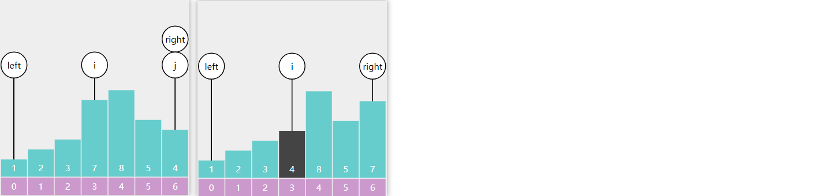
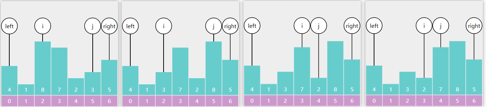

## 3.7 排序算法

### 概述

#### 比较排序算法

| 算法 |     最好     |     最坏     |     平均     |  空间  | 稳定 | 思想 |                                    注意事项                                    |
| :--: | :----------: | :----------: | :----------: | :-----: | :--: | :--: | :----------------------------------------------------------------------------: |
| 冒泡 |     O(n)     |  O($n^2$)  |  O($n^2$)  |  O(1)  |  Y  | 比较 |                              最好情况需要额外判断                              |
| 选择 |  O($n^2$)  |  O($n^2$)  |  O($n^2$)  |  O(1)  |  N  | 比较 |                              交换次数一般少于冒泡                              |
|  堆  | O($nlogn$) | O($nlogn$) | O($nlogn$) |  O(1)  |  N  | 选择 |                  堆排序的辅助性较强，理解前先理解堆的数据结构                  |
| 插入 |     O(n)     |  O($n^2$)  |  O($n^2$)  |  O(1)  |  Y  | 比较 |     插入排序对于近乎有序的数据处理速度比较快，复杂度有所下降，可以提前结束     |
| 希尔 |   O(nlogn)   |  O($n^2$)  | O($nlogn$) |  O(1)  |  N  | 插入 |           gap序列的构造有多种方式，不同方式处理的数据复杂度可能不同           |
| 归并 | O($nlogn$) | O($nlogn$) | O($nlogn$) |  O(n)  |  Y  | 分治 |                            需要额外的O(n)的存储空间                            |
| 快速 | O($nlogn$) |  O($n^2$)  | O($nlogn$) | O(logn) |  N  | 分治 | 快排可能存在最坏情况，需要把枢轴值选取得尽量随机化来缓解最坏情况下的时间复杂度 |

#### 非比较排序算法

| 非比较排序算法 | 时间复杂度 | 空间复杂度 | 稳定性 |
| -------------- | ---------- | ---------- | ------ |
| 计数排序       | O(n+k)     | O(n+k)     | 稳定   |
| 桶排序         | O(n+k)     | O(n+k)     | 稳定   |
| 基数排序       | O(d*(n+k)) | O(n+k)     | 稳定   |

其中

* n 是数组长度
* k 是桶长度
* d 是基数位数

#### 稳定 vs 不稳定


#### Java 中的排序

Arrays.sort

JDK 7~13 中的排序实现

| 排序目标                      | 条件                                       | 采用算法            |
| ----------------------------- | ------------------------------------------ | ------------------- |
| int[] long[] float[] double[] | size < 47                                  | 混合插入排序 (pair) |
|                               | size < 286                                 | 双基准点快排        |
|                               | 有序度低                                   | 双基准点快排        |
|                               | 有序度高                                   | 归并排序            |
| byte[]                        | `size <= 29`                             | 插入排序            |
|                               | size > 29                                  | 计数排序            |
| char[] short[]                | size < 47                                  | 插入排序            |
|                               | size < 286                                 | 双基准点快排        |
|                               | 有序度低                                   | 双基准点快排        |
|                               | 有序度高                                   | 归并排序            |
|                               | size > 3200                                | 计数排序            |
| Object[]                      | -Djava.util.Arrays.useLegacyMergeSort=true | 传统归并排序        |
|                               |                                            | TimSort             |

JDK 14~20 中的排序实现

| 排序目标                      | 条件                                         | 采用算法           |
| ----------------------------- | -------------------------------------------- | ------------------ |
| int[] long[] float[] double[] | size < 44 并位于最左侧                       | 插入排序           |
|                               | size < 65 并不是最左侧                       | 混合插入排序 (pin) |
|                               | 有序度低                                     | 双基准点快排       |
|                               | 递归次数超过 384                             | 堆排序             |
|                               | 对于整个数组或非最左侧 size > 4096，有序度高 | 归并排序           |
| byte[]                        | `size <= 64`                               | 插入排序           |
|                               | size > 64                                    | 计数排序           |
| char[] short[]                | size < 44                                    | 插入排序           |
|                               | 再大                                         | 双基准点快排       |
|                               | 递归次数超过 384                             | 计数排序           |
|                               | size > 1750                                  | 计数排序           |
| Object[]                      | -Djava.util.Arrays.useLegacyMergeSort=true   | 传统归并排序       |
|                               |                                              | TimSort            |

* 其中 TimSort 是用归并+二分插入排序的混合排序算法
* 值得注意的是从 JDK 8 开始支持 Arrays.parallelSort 并行排序
* 根据最新的提交记录来看 JDK 21 可能会引入基数排序等优化

#### 外部排序

### 1) 冒泡排序

要点

* 每轮冒泡不断地比较**相邻**的两个元素，如果它们是逆序的，则交换它们的位置
* 下一轮冒泡，可以调整未排序的右边界，减少不必要比较

以数组 3、2、1 的冒泡排序为例，第一轮冒泡


第二轮冒泡


未排序区域内就剩一个元素，结束


优化手段：每次循环时，若能确定**更合适的**右边界，则可以减少冒泡轮数

以数组 3、2、1、4、5 为例，第一轮结束后记录的 x，即为右边界


非递归版代码

```java
public class BubbleSort {

    private static void bubble(int[] a) {
        int j = a.length - 1;
        while (true) {
            int x = 0;
            for (int i = 0; i < j; i++) {
                if (a[i] > a[i + 1]) {
                    int t = a[i];
                    a[i] = a[i + 1];
                    a[i + 1] = t;
                    x = i;
                }
            }
            j = x;
            if (j == 0) {
                break;
            }
        }
    }

    public static void main(String[] args) {
        int[] a = {6, 5, 4, 3, 2, 1};
        System.out.println(Arrays.toString(a));
        bubble(a);
        System.out.println(Arrays.toString(a));
    }
}
```

### 2) 选择排序

要点

* 每一轮选择，找出最大（最小）的元素，并把它交换到合适的位置

以下面的数组选择最大值为例


非递归实现

```java
public class SelectionSort {
    public static void sort(int[] a) {
        // 1. 选择轮数 a.length - 1
        // 2. 交换的索引位置(right) 初始 a.length - 1, 每次递减
        for (int right = a.length - 1; right > 0 ; right--) {
            int max = right;
            for (int i = 0; i < right; i++) {
                if (a[i] > a[max]) {
                    max = i;
                }
            }
            if(max != right) {
                swap(a, max, right);
            }
        }
    }

    private static void swap(int[] a, int i, int j) {
        int t = a[i];
        a[i] = a[j];
        a[j] = t;
    }

    public static void main(String[] args) {
        int[] a = {6, 5, 4, 3, 2, 1};
        System.out.println(Arrays.toString(a));
        sort(a);
        System.out.println(Arrays.toString(a));
    }
}
```

### 3) 堆排序

要点：

* 建立大顶堆
* 每次将堆顶元素（最大值）交换到末尾，调整堆顶元素，让它重新符合大顶堆特性

建堆


交换，下潜调整


代码

```java
public class HeapSort {
    public static void sort(int[] a) {
        heapify(a, a.length);
        for (int right = a.length - 1; right > 0; right--) {
            swap(a, 0, right);
            down(a, 0, right);
        }
    }

    // 建堆 O(n)
    private static void heapify(int[] array, int size) {
        for (int i = size / 2 - 1; i >= 0; i--) {
            down(array, i, size);
        }
    }

    // 下潜
    // leetcode 上数组排序题目用堆排序求解，非递归实现比递归实现大约快 6ms
    private static void down(int[] array, int parent, int size) {
        while (true) {
            int left = parent * 2 + 1;
            int right = left + 1;
            int max = parent;
            if (left < size && array[left] > array[max]) {
                max = left;
            }
            if (right < size && array[right] > array[max]) {
                max = right;
            }
            if (max == parent) { // 没找到更大的孩子
                break;
            }
            swap(array, max, parent);
            parent = max;
        }
    }

    // 交换
    private static void swap(int[] a, int i, int j) {
        int t = a[i];
        a[i] = a[j];
        a[j] = t;
    }

    public static void main(String[] args) {
        int[] a = {2, 3, 1, 7, 6, 4, 5};
        System.out.println(Arrays.toString(a));
        sort(a);
        System.out.println(Arrays.toString(a));
    }
}
```

### 4) 插入排序

要点

* *将数组分为两部分* *[0 .. low-1]  [low .. a.length-1]*
  * *左边* *[0 .. low-1]* *是已排序部分*
  * *右边* *[low .. a.length-1]* *是未排序部分*
* *每次从未排序区域取出* *low* *位置的元素*, *插入到已排序区域*

例


代码

```java
public class InsertionSort {

    public static void sort(int[] a) {
        for (int low = 1; low < a.length; low++) {
            // 将 low 位置的元素插入至 [0..low-1] 的已排序区域
            int t = a[low];
            int i = low - 1; // 已排序区域指针

            while (i >= 0 && t < a[i]) { // 没有找到插入位置
                a[i + 1] = a[i]; // 空出插入位置
                i--;
            }

            // 找到插入位置
            if (i != low - 1) {
                a[i + 1] = t;
            }
        }
    }

    public static void main(String[] args) {
        int[] a = {9, 3, 7, 2, 5, 8, 1, 4};
        System.out.println(Arrays.toString(a));
        sort(a);
        System.out.println(Arrays.toString(a));
    }
}
```

### 5) 希尔排序

要点

* 简单的说，就是分组实现插入，每组元素间隙称为 gap
* 每轮排序后 gap 逐渐变小，直至 gap 为 1 完成排序
* 对插入排序的优化，让元素更快速地交换到最终位置

下图演示了 gap = 4，gap = 2，gap = 1 的三轮排序前后比较


代码

```java
public class ShellSort {
    public static void sort(int[] a) {
        for (int gap = a.length>>1; gap >0 ; gap=gap>>1) {
            for (int low = gap; low < a.length; low ++) {
                // 将 low 位置的元素插入至 [0..low-1] 的已排序区域
                int t = a[low];
                int i = low - gap; // 已排序区域指针

                while (i >= 0 && t < a[i]) { // 没有找到插入位置
                    a[i + gap] = a[i]; // 空出插入位置
                    i -= gap;
                }

                // 找到插入位置
                if (i != low - gap) {
                    a[i + gap] = t;
                }
            }      
        }
    }

    public static void main(String[] args) {
        int[] a = {9, 3, 7, 2, 5, 8, 1, 4};
        System.out.println(Arrays.toString(a));
        sort(a);
		System.out.println(Arrays.toString(a));
    }
}
```

### 6) 归并排序

#### 递归实现

要点

* 分 - 每次从中间切一刀，处理的数据少一半
* 治 - 当数据仅剩一个时可以认为有序
* 合 - 两个有序的结果，可以进行合并排序（参见数组练习 E01. 合并有序数组）


代码

```java
public class MergeSortTopDown {

    /*
        a1 原始数组
        i~iEnd 第一个有序范围
        j~jEnd 第二个有序范围
        a2 临时数组
     */
    public static void merge(int[] a1, int i, int iEnd, int j, int jEnd, int[] a2) {
        int k = i;
        while (i <= iEnd && j <= jEnd) {
            if (a1[i] < a1[j]) {
                a2[k] = a1[i];
                i++;
            } else {
                a2[k] = a1[j];
                j++;
            }
            k++;
        }
        if (i > iEnd) {
            System.arraycopy(a1, j, a2, k, jEnd - j + 1);
        }
        if (j > jEnd) {
            System.arraycopy(a1, i, a2, k, iEnd - i + 1);
        }
    }

    public static void sort(int[] a1) {
        int[] a2 = new int[a1.length];
        split(a1, 0, a1.length - 1, a2);
    }

    private static void split(int[] a1, int left, int right, int[] a2) {
        int[] array = Arrays.copyOfRange(a1, left, right + 1);
//        System.out.println(Arrays.toString(array));
        // 2. 治
        if (left == right) {
            return;
        }
        // 1. 分
        int m = (left + right) >>> 1;
        split(a1, left, m, a2);                 // left = 0 m = 0  9
        split(a1, m + 1, right, a2);       // m+1 = 1 right = 1  3
        // 3. 合
        merge(a1, left, m, m + 1, right, a2);
        System.arraycopy(a2, left, a1, left, right - left + 1);
    }

    public static void main(String[] args) {
        int[] a = {9, 3, 7, 2, 8, 5, 1, 4};
        System.out.println(Arrays.toString(a));
        sort(a);
        System.out.println(Arrays.toString(a));
    }
}
```

#### 时间复杂度

* 两个长度为 m 和 n 的链表合并，时间复杂度是 m + n
* 归并，时间复杂度：$f(n) = 2f(n/2) + n, f(1)=c$，等价解 $f(n) = nlog_2{n} + cn$

  ```
               8
            /     \
           4       4
          / \     / \
         2   2   2   2
        ||   ||  ||  ||
        11   11  11  11  

  f(8) = 2f(4) + 8
  f(4) = 2f(2) + 4
  f(2) = 2f(1) + 2
  f(1) = 1

  f(8) = 8 + 24
  f(4) = 4 + 8
  f(2) = 2 + 2
  f(1) = 1
  ```

  * 当 n = 16 时，结果 80
  * 当 n = 64 时，结果 448
* 若逐一合并，时间复杂度：$f(n)=\sum\limits_{n=0}^{n-1}n+1$，等价解 $f(n)=\frac{1}{2}(n^2+n)$

  ```
  1|0 => 1
  1|1 => 2
  1|2 => 3
  1|3 => 4
  1|4 => 5
  1|5 => 6
  1|6 => 7
  1|7 => 8

  36
  ```

  * 当 n = 16 时，结果 136
  * 当 n = 64 时，结果 2080

#### 非递归实现

```java
public class MergeSortBottomUp {

    /*
        a1 原始数组
        i~iEnd 第一个有序范围
        j~jEnd 第二个有序范围
        a2 临时数组
     */
    public static void merge(int[] a1, int i, int iEnd, int j, int jEnd, int[] a2) {
        int k = i;
        while (i <= iEnd && j <= jEnd) {
            if (a1[i] < a1[j]) {
                a2[k] = a1[i];
                i++;
            } else {
                a2[k] = a1[j];
                j++;
            }
            k++;
        }
        if (i > iEnd) {
            System.arraycopy(a1, j, a2, k, jEnd - j + 1);
        }
        if (j > jEnd) {
            System.arraycopy(a1, i, a2, k, iEnd - i + 1);
        }
    }

    public static void sort(int[] a1) {
        int n = a1.length;
        int[] a2 = new int[n];
        for (int width = 1; width < n; width *= 2) {
            for (int i = 0; i < n; i += 2 * width) {
                int m = Integer.min(i + width - 1, n - 1);
                int j = Integer.min(i + 2 * width - 1, n - 1);
                System.out.println(i + " " + m + " " + j);
                merge(a1, i, m, m + 1, j, a2);
            }
            System.arraycopy(a2, 0, a1, 0, n);
        }
    }

    public static void main(String[] args) {
        int[] a = {9, 3, 7, 2, 8, 5, 1, 4};
        System.out.println(Arrays.toString(a));
        sort(a);
        System.out.println(Arrays.toString(a));
    }
}
```

### 7) 归并+插入

* 小数据量且有序度高时，插入排序效果高
* 大数据量用归并效果好
* 可以结合二者

```java
public class MergeInsertionSort {

    public static void insertion(int[] a, int left, int right) {
        for (int low = left + 1; low <= right; low++) {
            int t = a[low];
            int i = low - 1;
            while (i >= left && t < a[i]) {
                a[i + 1] = a[i];
                i--;
            }
            if (i != low - 1) {
                a[i + 1] = t;
            }
        }
    }

    /*
        a1 原始数组
        i~iEnd 第一个有序范围
        j~jEnd 第二个有序范围
        a2 临时数组
     */
    public static void merge(int[] a1, int i, int iEnd, int j, int jEnd, int[] a2) {
        int k = i;
        while (i <= iEnd && j <= jEnd) {
            if (a1[i] < a1[j]) {
                a2[k] = a1[i];
                i++;
            } else {
                a2[k] = a1[j];
                j++;
            }
            k++;
        }
        if (i > iEnd) {
            System.arraycopy(a1, j, a2, k, jEnd - j + 1);
        }
        if (j > jEnd) {
            System.arraycopy(a1, i, a2, k, iEnd - i + 1);
        }
    }

    public static void sort(int[] a1) {
        int[] a2 = new int[a1.length];
        split(a1, 0, a1.length - 1, a2);
    }

    private static void split(int[] a1, int left, int right, int[] a2) {
//        int[] array = Arrays.copyOfRange(a1, left, right + 1);
//        System.out.println(Arrays.toString(array));

        // 2. 治
        if (right == left) {
            return;
        }
        if (right - left <= 32) {
            insertion(a1, left, right);
            System.out.println("insert..." + left + " " + right +" "+Arrays.toString(a1));
            return;
        }
        // 1. 分
        int m = (left + right) >>> 1;
        split(a1, left, m, a2);                 // left = 0 m = 0  9
        split(a1, m + 1, right, a2);       // m+1 = 1 right = 1  3
        System.out.println(left + " " + right + " "+Arrays.toString(a1));
        // 3. 合
        merge(a1, left, m, m + 1, right, a2);
        System.arraycopy(a2, left, a1, left, right - left + 1);
    }

    public static void main(String[] args) {
        int[] a = {9, 3, 7, 2, 8, 5, 1, 4};
        System.out.println(Arrays.toString(a));
        sort(a);
        System.out.println(Arrays.toString(a));
    }
}
```

### 8) 快速排序

单边循环（lomuto分区）要点

* 选择最右侧元素作为基准点
* j 找比基准点小的，i 找比基准点大的，一旦找到，二者进行交换
  * 交换时机：j 找到小的，且与 i 不相等
  * i 找到 >= 基准点元素后，不应自增
* 最后基准点与 i 交换，i 即为基准点最终索引

例：

i 和 j 都从左边出发向右查找，i 找到比基准点4大的5，j找到比基准点小的2，停下来交换


i 找到了比基准点大的5，j 找到比基准点小的3，停下来交换


j 到达right 处结束，right 与 i 交换，一轮分区结束



代码

```java
public class QuickSortLomuto {

    public static void sort(int[] a) {
        quick(a, 0, a.length - 1);
    }

    private static void quick(int[] a, int left, int right) {
        if (left >= right) {
            return;
        }
        int p = partition(a, left, right); // p代表基准点元素索引
        quick(a, left, p - 1);
        quick(a, p + 1, right);
    }

    private static int partition(int[] a, int left, int right) {
        int pv = a[right]; // 基准点元素值
        int i = left;
        int j = left;
        while (j < right) {
            if (a[j] < pv) { // j 找到比基准点小的了, 没找到大的
                if (i != j) {
                    swap(a, i, j);
                }
                i++;
            }
            j++;
        }
        swap(a, i, right);
        return i;
    }

    private static void swap(int[] a, int i, int j) {
        int t = a[i];
        a[i] = a[j];
        a[j] = t;
    }

    public static void main(String[] args) {
        int[] a = {5, 3, 7, 2, 9, 8, 1, 4};
        System.out.println(Arrays.toString(a));
        sort(a);
        System.out.println(Arrays.toString(a));
    }
}
```

双边循环要点

* 选择最左侧元素作为基准点
* j 找比基准点小的，i 找比基准点大的，一旦找到，二者进行交换
  * i 从左向右
  * j 从右向左
* 最后基准点与 i 交换，i 即为基准点最终索引

例：

i 找到比基准点大的5停下来，j 找到比基准点小的1停下来（包含等于），二者交换


i 找到8，j 找到3，二者交换，i 找到7，j 找到2，二者交换



i == j，退出循环，基准点与 i 交换


代码

```java
public class QuickSortHoare {

    public static void sort(int[] a) {
        quick(a, 0, a.length - 1);
    }

    private static void quick(int[] a, int left, int right) {
        if (left >= right) {
            return;
        }
        int p = partition(a, left, right);
        quick(a, left, p - 1);
        quick(a, p + 1, right);
    }

    private static int partition(int[] a, int left, int right) {
        int i = left;
        int j = right;
        int pv = a[left];
        while (i < j) {
            while (i < j && a[j] > pv) {
                j--;
            }
            while (i < j && pv >= a[i]) {
                i++;
            }
            swap(a, i, j);
        }
        swap(a, left, j);
        return j;
    }

    private static void swap(int[] a, int i, int j) {
        int t = a[i];
        a[i] = a[j];
        a[j] = t;
    }

    public static void main(String[] args) {
        int[] a = {9, 3, 7, 2, 8, 5, 1, 4};
        System.out.println(Arrays.toString(a));
        sort(a);
        System.out.println(Arrays.toString(a));
    }
}
```

#### 随机基准点

使用随机数作为基准点，避免万一最大值或最小值作为基准点导致的分区不均衡

例


改进代码

```java
int idx = ThreadLocalRandom.current().nextInt(right - left + 1) + left;
swap(a, idx, left);
```

#### 处理重复值

如果重复值较多，则原来算法中的分区效果也不好，如下图中左侧所示，需要想办法改为右侧的分区效果


改进代码

```java
public class QuickSortHandleDuplicate {

    public static void sort(int[] a) {
        quick(a, 0, a.length - 1);
    }

    private static void quick(int[] a, int left, int right) {
        if (left >= right) {
            return;
        }
        int p = partition(a, left, right);
        quick(a, left, p - 1);
        quick(a, p + 1, right);
    }

    /*
        循环内
            i 从 left + 1 开始，从左向右找大的或相等的
            j 从 right 开始，从右向左找小的或相等的
            交换，i++ j--

        循环外 j 和 基准点交换，j 即为分区位置
     */
    private static int partition(int[] a, int left, int right) {
        int idx = ThreadLocalRandom.current().nextInt(right - left + 1) + left;
        swap(a, left, idx);
        int pv = a[left];
        int i = left + 1;
        int j = right;
        while (i <= j) {
            // i 从左向右找大的或者相等的
            while (i <= j && a[i] < pv) {
                i++;
            }
            // j 从右向左找小的或者相等的
            while (i <= j && a[j] > pv) {
                j--;
            }
            if (i <= j) {
                swap(a, i, j);
                i++;
                j--;
            }
        }
        swap(a, j, left);
        return j;
    }

    private static void swap(int[] a, int i, int j) {
        int t = a[i];
        a[i] = a[j];
        a[j] = t;
    }

    public static void main(String[] args) {
//        int[] a = {4, 2, 1, 3, 2, 4}; // 最外层循环 = 要加
//        int[] a = {2, 1, 3, 2}; // 内层循环 = 要加
        int[] a = {2, 1, 3, 2}; // 内层if要加
        System.out.println(Arrays.toString(a));
        sort(a);
        System.out.println(Arrays.toString(a));
    }
}
```

* 核心思想是

  * 改进前，i 只找大于的，j 会找小于等于的。一个不找等于、一个找等于，势必导致等于的值分布不平衡
  * 改进后，二者都会找等于的交换，等于的值会平衡分布在基准点两边
* 细节：

  * 因为一开始 i 就可能等于 j，因此外层循环需要加等于条件保证至少进入一次，让 j 能减到正确位置
  * 内层 while 循环中 `i <= j` 的 = 也不能去掉，因为 i == j 时也要做一次与基准点的判断，好让 i 及 j 正确
  * i == j 时，也要做一次 i++ 和 j-- 使下次循环二者不等才能退出
  * 因为最后退出循环时 i 会大于 j，因此最终与基准点交换的是 j
* 内层两个 while 循环的先后顺序不再重要

### 9) 计数排序

方法1（简化后的计数排序）

```java
public static void sort(int[] a) {
    int min = a[0];
    int max = a[0];
    for (int i : a) {
        if (i > max) {
            max = i;
        } else if (i < min) {
            min = i;
        }
    }
    int[] counting = new int[max - min + 1];
    for (int i : a) {
        counting[i - min]++;
    }
    int k = 0;
    for (int i = 0; i < counting.length; i++) {
        while (counting[i] > 0) {
            a[k] = i + min;
            counting[i]--;
            k++;
        }
    }
}
```

针对 byte []，因为数据范围已知，省去了求最大、最小值的过程，java 中对 char[]、short[]、byte[] 的排序都可能采用 counting 排序

```java
public static void sort(byte[] a) {
    int[] counting = new int[256];
    for (int i : a) {
        counting[i & 0xFF]++;
    }
    int k = a.length-1;
    for (int i = 128 + 256; k >= 0; ) {      
        while (counting[--i & 0xFF] ==0);
        int v = i & 0xFF;
        int c = counting[i & 0xFF];
        for (int j = 0; j < c; j++) {
            a[k] = (byte) v;
            k--;
        }
    }
}
```

稳定计数排序

```java
public static void sort2(int[] a) {
    int min = a[0];
    int max = a[0];
    for (int i : a) {
        if (i > max) {
            max = i;
        } else if (i < min) {
            min = i;
        }
    }
    int[] counting = new int[max - min + 1];
    for (int i : a) {
        counting[i - min]++;
    }
    for (int i = 1; i < counting.length; i++) {
        counting[i] = counting[i] + counting[i - 1];
    }
    int[] b = new int[a.length];
    for (int i = a.length - 1; i >= 0; i--) {
        int j = a[i] - min;
        counting[j]--;
        b[counting[j]] = a[i];
    }
    System.arraycopy(b, 0, a, 0, a.length);
}
```

### 10) 桶排序

初步实现

```java
public class BucketSort {
    public static void main(String[] args) {
        int[] ages = {20, 18, 66, 25, 67, 30}; // 假设人类年龄 1~99 那么分为10个桶
        System.out.println(Arrays.toString(ages));
        sort(ages);
        System.out.println(Arrays.toString(ages));
    }

    public static void sort(int[] a) {
        DynamicArray[] buckets = new DynamicArray[10];
        for (int i = 0; i < buckets.length; i++) {
            buckets[i] = new DynamicArray();
        }
        for (int v : a) {
            DynamicArray bucket = buckets[v / 10];
            bucket.addLast(v);
        }
        for (DynamicArray bucket : buckets) {
            System.out.println(Arrays.toString(bucket.array()));
        }
        int k = 0;
        for (DynamicArray bucket : buckets) {
            int[] array = bucket.array();
            InsertionSort.sort(array);
            for (int v : array) {
                a[k++] = v;
            }
        }
    }
}
```

通用

```java
public class BucketSortGeneric {
    public static void main(String[] args) {
        int[] ages = {20, 10, 28, 66, 25, 31, 67, 30, 70}; // 假设人类年龄 1~99
        System.out.println(Arrays.toString(ages));
        sort(ages, 20);
        System.out.println(Arrays.toString(ages));
    }

    public static void sort(int[] a, int range) {
        int max = a[0];
        int min = a[0];
        for (int i = 1; i < a.length; i++) {
            if (a[i] > max) {
                max = a[i];
            }
            if (a[i] < min) {
                min = a[i];
            }
        }
        // 1. 准备桶
        DynamicArray[] buckets = new DynamicArray[(max - min) / range + 1];
        System.out.println(buckets.length);
        for (int i = 0; i < buckets.length; i++) {
            buckets[i] = new DynamicArray();
        }
        // 2. 放入年龄数据
        for (int age : a) {
            buckets[(age - min) / range].addLast(age);
        }
        int k = 0;
        for (DynamicArray bucket : buckets) {
            // 3. 排序桶内元素
            int[] array = bucket.array();
            InsertionSort.sort(array);
            System.out.println(Arrays.toString(array));
            // 4. 把每个桶排序好的内容，依次放入原始数组
            for (int v : array) {
                a[k++] = v;
            }
        }
    }
}
```

### 11) 基数排序

```java
public class RadixSort {
    public static void radixSort(String[] a, int length) {
        ArrayList<String>[] buckets = new ArrayList[128];
        for (int i = 0; i < buckets.length; i++) {
            buckets[i] = new ArrayList<>();
        }
        for (int i = length - 1; i >= 0 ; i--) {
            for (String s : a) {
                buckets[s.charAt(i)].add(s);
            }
            int k = 0;
            for (ArrayList<String> bucket : buckets) {
                for (String s : bucket) {
                    a[k++] = s;
                }
                bucket.clear();
            }
        }
    }

    public static void main(String[] args) {
        /*String[] phoneNumbers = new String[10];
        phoneNumbers[0] = "13812345678";
        phoneNumbers[1] = "13912345678";
        phoneNumbers[2] = "13612345678";
        phoneNumbers[3] = "13712345678";
        phoneNumbers[4] = "13512345678";
        phoneNumbers[5] = "13412345678";
        phoneNumbers[6] = "15012345678";
        phoneNumbers[7] = "15112345678";
        phoneNumbers[8] = "15212345678";
        phoneNumbers[9] = "15712345678";*/

        String[] phoneNumbers = new String[10];
        phoneNumbers[0] = "138";
        phoneNumbers[1] = "139";
        phoneNumbers[2] = "136";
        phoneNumbers[3] = "137";
        phoneNumbers[4] = "135";
        phoneNumbers[5] = "134";
        phoneNumbers[6] = "150";
        phoneNumbers[7] = "151";
        phoneNumbers[8] = "152";
        phoneNumbers[9] = "157";
        RadixSort.radixSort(phoneNumbers, 3);
        for (String phoneNumber : phoneNumbers) {
            System.out.println(phoneNumber);
        }
    }
}
```

基数排序是稳定排序，因此先排个位、再排十位，十位的排序不会打乱个位取值相等的元素顺序

### 习题

#### E01. 根据另一个数组次序排序-Leetcode 1122

```java
/*
    前提
    1. 元素值均 >= 0
    2. arr2 内元素唯一，且长度 <= 1000
 */
public class E01Leetcode1122 {
    public int[] relativeSortArray(int[] arr1, int[] arr2) {
        int[] count = new int[1001];
        for (int i : arr1) {
            count[i]++;
        }
        int[] result = new int[arr1.length];
        int k = 0;
        for (int i : arr2) {
            while (count[i] > 0) {
                result[k++] = i;
                count[i]--;
            }
        }
        for (int i = 0; i < count.length; i++) {
            while (count[i] > 0) {
                result[k++] = i;
                count[i]--;
            }
        }
        return result;
    }
}
```

#### E02. 按出现频率排序-Leetcode 1636

```java
public class E02Leetcode1636 {
    public int[] frequencySort(int[] nums) {
        int[] count = new int[201];
        for (int i : nums) {
            count[i + 100]++;
        }

        return Arrays.stream(nums).boxed().sorted((a, b) -> {
            int fa = count[a + 100];
            int fb = count[b + 100];
            if (fa == fb) {
                return Integer.compare(b, a);
            } else {
                return fa - fb;
            }
        }).mapToInt(Integer::intValue).toArray();
    }
}
```

#### E03. 最大间距-Leetcode 164

解法1：桶排序 - 超过**内存**限制

```java
public class E03Leetcode164_1 {
    public int maximumGap(int[] nums) {
        int n = nums.length;
        if (n < 2) {
            return 0;
        }

        sort(nums, 1);

        int ret = 0;
        for (int i = 1; i < n; i++) {
            ret = Math.max(ret, nums[i] - nums[i - 1]);
        }
        return ret;
    }

    public static void sort(int[] a, int range) {
        int max = a[0];
        int min = a[0];
        for (int i = 1; i < a.length; i++) {
            if (a[i] > max) {
                max = a[i];
            }
            if (a[i] < min) {
                min = a[i];
            }
        }
        // 1. 准备桶
        DynamicArray[] buckets = new DynamicArray[(max - min) / range + 1];
        for (int i = 0; i < buckets.length; i++) {
            buckets[i] = new DynamicArray();
        }
        // 2. 放入数据
        for (int age : a) {
            buckets[(age - min) / range].addLast(age);
        }
        int k = 0;
        for (DynamicArray bucket : buckets) {
            // 3. 排序桶内元素
            int[] array = bucket.array();
            InsertionSort.sort(array);
            // 4. 把每个桶排序好的内容，依次放入原始数组
            for (int v : array) {
                a[k++] = v;
            }
        }
    }

    public static void main(String[] args) {
        int[] nums = {13, 26, 16, 11};
        int r = new E03Leetcode164_1().maximumGap(nums);
        System.out.println(r);
    }
}
```

解法2：基数排序

```java
public class E03Leetcode164 {
    public int maximumGap(int[] a) {
        if (a.length < 2) {
            return 0;
        }
          
        // 计算最大值
        int max = a[0];
        for (int i = 1; i < a.length; i++) {
            max = Math.max(a[i], max);
        }

        // 准备10个桶
        ArrayList<Integer>[] buckets = new ArrayList[10];
        for (int i = 0; i < buckets.length; i++) {
            buckets[i] = new ArrayList<>();
        }

        // 没超过最大值
        long exp = 1;
        while (max >= exp) {
            for (int j : a) {
                buckets[(j / (int) exp) % 10].add(j);
            }
            int k = 0;
            for (ArrayList<Integer> bucket : buckets) {
                for (Integer i : bucket) {
                    a[k++] = i;
                }
                bucket.clear();
            }
            exp *= 10;
        }

        // 求最大间距
        int r = 0;
        for (int i = 1; i < a.length; i++) {
            r = Math.max(r, a[i] - a[i - 1]);
        }
        return r;
    }

    public static void main(String[] args) {
        int[] nums = {3, 6, 16, 1};
        int r = new E03Leetcode164().maximumGap(nums);
        System.out.println(r);
    }
}
```

解法3：桶排序 - 合理化桶个数

```java
public class E03Leetcode164_3 {
    public int maximumGap(int[] nums) {
        // 1. 处理特殊情况
        if (nums.length < 2) {
            return 0;
        }
        // 2. 桶排序
        int max = nums[0];
        int min = nums[0];
        for (int i1 = 1; i1 < nums.length; i1++) {
            if (nums[i1] > max) {
                max = nums[i1];
            }
            if (nums[i1] < min) {
                min = nums[i1];
            }
        }
        // 2.1 准备桶
        /*
            计算桶个数                   期望桶个数
            (max - min) / range + 1 = nums.length
            (max - min) / (nums.length - 1) = range
         */
        int range = Math.max((max - min) / (nums.length - 1), 1);
        DynamicArray[] buckets = new DynamicArray[(max - min) / range + 1];
        for (int i1 = 0; i1 < buckets.length; i1++) {
            buckets[i1] = new DynamicArray();
        }
        // 2.2 放入数据
        for (int age : nums) {
            buckets[(age - min) / range].addLast(age);
        }
        int k = 0;
        for (DynamicArray bucket : buckets) {
            // 2.3 排序桶内元素
            int[] array = bucket.array();
            InsertionSort.sort(array);
            System.out.println(Arrays.toString(array));
            // 2.4 把每个桶排序好的内容，依次放入原始数组
            for (int v : array) {
                nums[k++] = v;
            }
        }
        // 3. 寻找最大差值
        int r = 0;
        for (int i = 1; i < nums.length; i++) {
            r = Math.max(r, nums[i] - nums[i - 1]);
        }
        return r;
    }

    public static void main(String[] args) {
//        int[] nums = {1, 10000000};
//        int[] nums = {9, 1, 3, 5};
//        int[] nums = {1, 1, 1, 1};
//        int[] nums = {1, 1, 1, 1, 1, 5, 5, 5, 5, 5};
        int[] nums = {15252, 16764, 27963, 7817, 26155, 20757, 3478, 22602, 20404, 6739, 16790, 10588, 16521, 6644, 20880, 15632, 27078, 25463, 20124, 15728, 30042, 16604, 17223, 4388, 23646, 32683, 23688, 12439, 30630, 3895, 7926, 22101, 32406, 21540, 31799, 3768, 26679, 21799, 23740};
        int r = new E03Leetcode164_3().maximumGap(nums);
        System.out.println(r);
    }
}
```

解法4：在解法3的基础上，只保留桶内最大最小值

```java
public class E03Leetcode164_4 {
    public int maximumGap(int[] nums) {
        // 1. 处理特殊情况
        if (nums.length < 2) {
            return 0;
        }
        // 2. 桶排序
        // 桶个数 (max - min) / range + 1  期望桶个数 nums.length + 1
        // range = (max - min) / nums.length
        int max = nums[0];
        int min = nums[0];
        for (int i = 1; i < nums.length; i++) {
            if (nums[i] > max) {
                max = nums[i];
            }
            if (nums[i] < min) {
                min = nums[i];
            }
        }
        if (max == min) {
            return 0;
        }
        int range = Math.max(1, (max - min) / nums.length);
        int size = (max - min) / range + 1;
        Pair[] buckets = new Pair[size];
        // 2. 放入数据
        for (int i : nums) {
            int idx = (i - min) / range;
            if (buckets[idx] == null) {
                buckets[idx] = new Pair();
            }
            buckets[idx].add(i);
        }

        System.out.println(Arrays.toString(buckets));
        // 3. 寻找最大差值
        int r = 0;
        int lastMax = buckets[0].max;
        for (int i = 1; i < buckets.length; i++) {
            Pair pair = buckets[i];
            if (pair != null) {
                r = Math.max(r, pair.min - lastMax);
                lastMax = pair.max;
            }
        }
        return r;
    }

    static class Pair {
        int max = 0;
        int min = 1000_000_000;

        public void add(int v) {
            max = Math.max(max, v);
            min = Math.min(min, v);
        }

        @Override
        public String toString() {
            return "[" + min + "," + max + "]";
        }
    }

    public static void main(String[] args) {
        int[] nums = {9, 1, 6, 5};
//        int[] nums = {1, 10000000};
//        int[] nums = {1, 1, 1, 1};
//        int[] nums = {1, 1, 1, 1, 1, 5, 5, 5, 5, 5};
//        int[] nums = {15252, 16764, 27963, 7817, 26155, 20757, 3478, 22602, 20404, 6739, 16790, 10588, 16521, 6644, 20880, 15632, 27078, 25463, 20124, 15728, 30042, 16604, 17223, 4388, 23646, 32683, 23688, 12439, 30630, 3895, 7926, 22101, 32406, 21540, 31799, 3768, 26679, 21799, 23740};
        int r = new E03Leetcode164_4().maximumGap(nums);
        System.out.println(r);
    }
}
```

#### 排序数组-Leetcode 912

#### 排序链表-Leetcode 148

#### 其它题目

| 题目编号 | 题目标题                   | 排序算法类型     |
| -------- | -------------------------- | ---------------- |
| 1122     | 数组的相对排序             | 计数排序         |
| 1636     | 按照频率将数组升序排序     | 计数排序         |
| 164      | 最大间距                   | 基数排序、桶排序 |
| 315      | 计算右侧小于当前元素的个数 | 基数排序         |
| 347      | 前 K 个高频元素            | 桶排序           |

| 题目编号 | 题目标题                         | 排序算法类型     |
| -------- | -------------------------------- | ---------------- |
| 75       | 颜色分类                         | 三向切分快速排序 |
| 215      | 数组中的第K个最大元素            | 堆排序           |
| 493      | 翻转对                           | 归并排序         |
| 493      | 翻转对                           | 树状数组         |
| 524      | 通过删除字母匹配到字典里最长单词 | 循环排序         |
| 977      | 有序数组的平方                   | 双指针法         |
