## 4.1 图

### 1) 概念

图是由顶点（vertex）和边（edge）组成的数据结构，例如

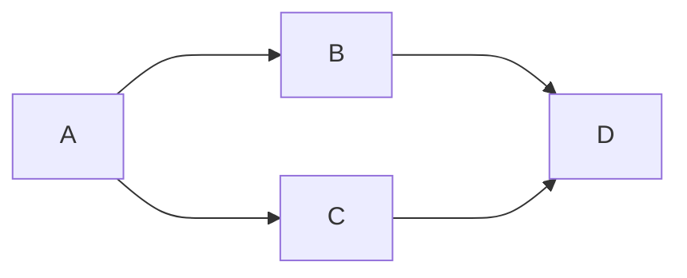

该图有四个顶点：A、B、C、D 以及四条有向边，有向图中，边是单向的

#### 有向 vs 无向

如果是无向图，那么边是双向的，下面是一个无向图的例子

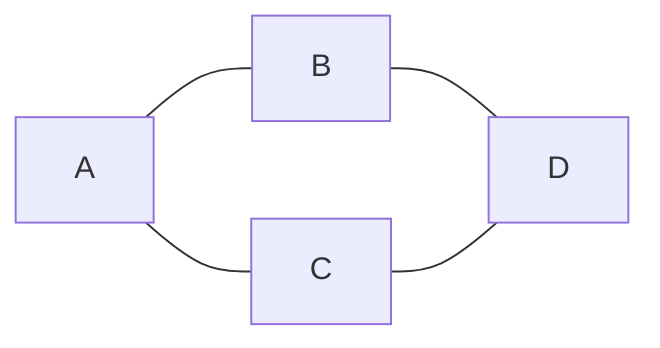

#### 度

**度**是指与该顶点相邻的边的数量

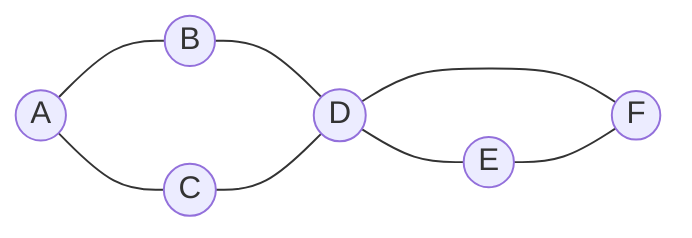

例如上图中

* A、B、C、E、F 这几个顶点度数为 2
* D 顶点度数为 4

有向图中，细分为**入度**和**出度**，参见下图

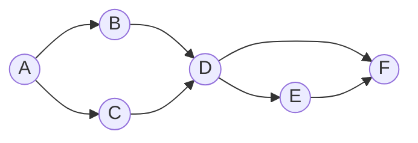

* A (2 out / 0 in)
* B、C、E (1 out / 1 in)
* D (2 out / 2 in)
* F (0 out / 2 in)

#### 权

边可以有权重，代表从源顶点到目标顶点的距离、费用、时间或其他度量。

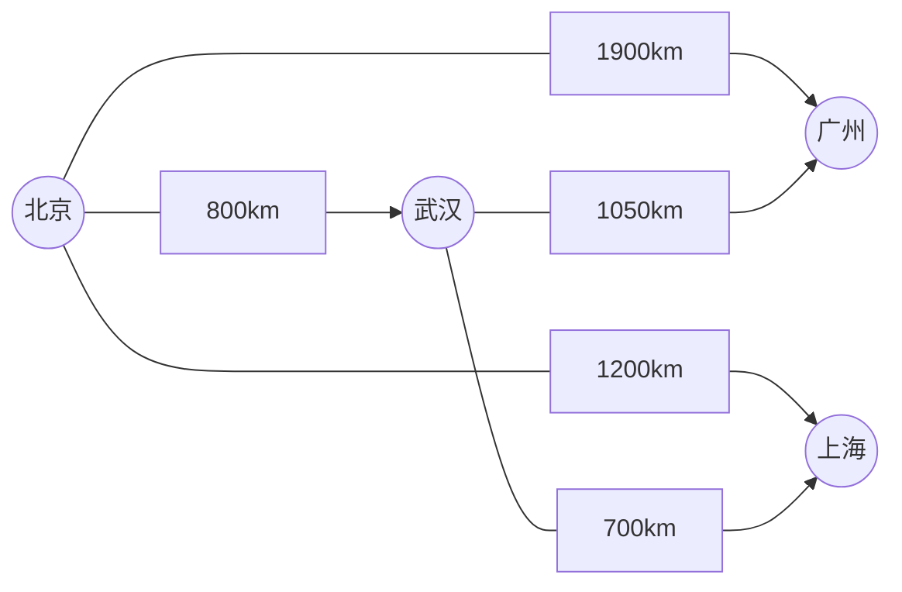

#### 路径

路径被定义为从一个顶点到另一个顶点的一系列连续边，例如上图中【北京】到【上海】有多条路径

* 北京 - 上海
* 北京 - 武汉 - 上海

路径长度

* 不考虑权重，长度就是边的数量
* 考虑权重，一般就是权重累加

#### 环

在有向图中，从一个顶点开始，可以通过若干条有向边返回到该顶点，那么就形成了一个环

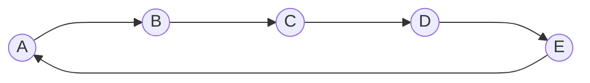

#### 图的连通性

如果两个顶点之间存在路径，则这两个顶点是连通的，所有顶点都连通，则该图被称之为连通图，若子图连通，则称为连通分量

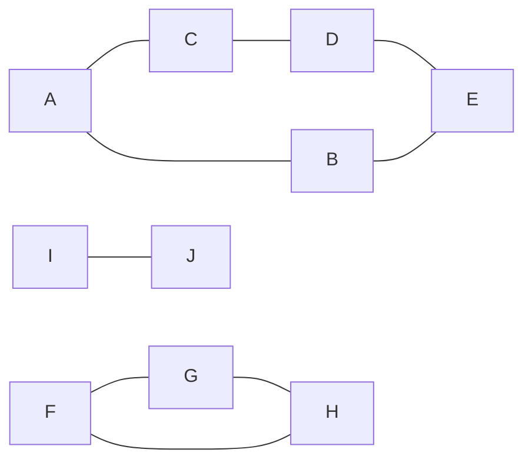

### 2) 图的表示

比如说，下面的图


用**邻接矩阵**可以表示为：

```
  A B C D
A 0 1 1 0
B 1 0 0 1 
C 1 0 0 1
D 0 1 1 0
```

用**邻接表**可以表示为：

```
A -> B -> C
B -> A -> D
C -> A -> D
D -> B -> C
```

有向图的例子


```
  A B C D
A 0 1 1 0
B 0 0 0 1
C 0 0 0 1
D 0 0 0 0
```

```
A - B - C
B - D
C - D
D - empty
```

### 3) Java 表示

顶点

```java
public class Vertex {
    String name;
    List<Edge> edges;
  
    // 拓扑排序相关
    int inDegree;
    int status; // 状态 0-未访问 1-访问中 2-访问过，用在拓扑排序

    // dfs, bfs 相关
    boolean visited;

    // 求解最短距离相关
    private static final int INF = Integer.MAX_VALUE;
    int dist = INF;
    Vertex prev = null;
}
```

边

```java
public class Edge {

    Vertex linked;
    int weight;

    public Edge(Vertex linked) {
        this(linked, 1);
    }

    public Edge(Vertex linked, int weight) {
        this.linked = linked;
        this.weight = weight;
    }
}
```

### 4) DFS

```java
public class Dfs {
    public static void main(String[] args) {
        Vertex v1 = new Vertex("v1");
        Vertex v2 = new Vertex("v2");
        Vertex v3 = new Vertex("v3");
        Vertex v4 = new Vertex("v4");
        Vertex v5 = new Vertex("v5");
        Vertex v6 = new Vertex("v6");

        v1.edges = List.of(new Edge(v3), new Edge(v2), new Edge(v6));
        v2.edges = List.of(new Edge(v4));
        v3.edges = List.of(new Edge(v4), new Edge(v6));
        v4.edges = List.of(new Edge(v5));
        v5.edges = List.of();
        v6.edges = List.of(new Edge(v5));

        dfs1(v1);
    }

    private static void dfs2(Vertex v) {
        LinkedList<Vertex> stack = new LinkedList<>();
        stack.push(v);
        while (!stack.isEmpty()) {
            Vertex pop = stack.pop();
            pop.visited = true;
            System.out.println(pop.name);
            for (Edge edge : pop.edges) {
                if (!edge.linked.visited) {
                    stack.push(edge.linked);
                }
            }
        }
    }

    private static void dfs1(Vertex v) {
        v.visited = true;
        System.out.println(v.name);
        for (Edge edge : v.edges) {
            if (!edge.linked.visited) {
                dfs(edge.linked);
            }
        }
    }
}
```

### 5) BFS

```java
public class Bfs {
    public static void main(String[] args) {
        Vertex v1 = new Vertex("v1");
        Vertex v2 = new Vertex("v2");
        Vertex v3 = new Vertex("v3");
        Vertex v4 = new Vertex("v4");
        Vertex v5 = new Vertex("v5");
        Vertex v6 = new Vertex("v6");

        v1.edges = List.of(new Edge(v3), new Edge(v2), new Edge(v6));
        v2.edges = List.of(new Edge(v4));
        v3.edges = List.of(new Edge(v4), new Edge(v6));
        v4.edges = List.of(new Edge(v5));
        v5.edges = List.of();
        v6.edges = List.of(new Edge(v5));

        bfs(v1);
    }

    private static void bfs(Vertex v) {
        LinkedList<Vertex> queue = new LinkedList<>();
        v.visited = true;
        queue.offer(v);
        while (!queue.isEmpty()) {
            Vertex poll = queue.poll();
            System.out.println(poll.name);
            for (Edge edge : poll.edges) {
                if (!edge.linked.visited) {
                    edge.linked.visited = true;
                    queue.offer(edge.linked);
                }
            }
        }
    }
}
```

### 6) 拓扑排序

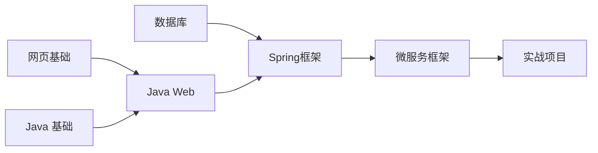

#### Kahn

```java
public class TopologicalSort {
    public static void main(String[] args) {
        Vertex v1 = new Vertex("网页基础");
        Vertex v2 = new Vertex("Java基础");
        Vertex v3 = new Vertex("JavaWeb");
        Vertex v4 = new Vertex("Spring框架");
        Vertex v5 = new Vertex("微服务框架");
        Vertex v6 = new Vertex("数据库");
        Vertex v7 = new Vertex("实战项目");

        v1.edges = List.of(new Edge(v3)); // +1
        v2.edges = List.of(new Edge(v3)); // +1
        v3.edges = List.of(new Edge(v4));
        v6.edges = List.of(new Edge(v4));
        v4.edges = List.of(new Edge(v5));
        v5.edges = List.of(new Edge(v7));
        v7.edges = List.of();

        List<Vertex> graph = List.of(v1, v2, v3, v4, v5, v6, v7);
        // 1. 统计每个顶点的入度
        for (Vertex v : graph) {
            for (Edge edge : v.edges) {
                edge.linked.inDegree++;
            }
        }
        /*for (Vertex vertex : graph) {
            System.out.println(vertex.name + " " + vertex.inDegree);
        }*/
        // 2. 将入度为0的顶点加入队列
        LinkedList<Vertex> queue = new LinkedList<>();
        for (Vertex v : graph) {
            if (v.inDegree == 0) {
                queue.offer(v);
            }
        }
        // 3. 队列中不断移除顶点，每移除一个顶点，把它相邻顶点入度减1，若减到0则入队
        List<String> result = new ArrayList<>();
        while (!queue.isEmpty()) {
            Vertex poll = queue.poll();
//            System.out.println(poll.name);
            result.add(poll.name);
            for (Edge edge : poll.edges) {
                edge.linked.inDegree--;
                if (edge.linked.inDegree == 0) {
                    queue.offer(edge.linked);
                }
            }
        }
        if (result.size() != graph.size()) {
            System.out.println("出现环");
        } else {
            for (String key : result) {
                System.out.println(key);
            }
        }
    }
}
```

#### DFS

```java
public class TopologicalSortDFS {

    public static void main(String[] args) {
        Vertex v1 = new Vertex("网页基础");
        Vertex v2 = new Vertex("Java基础");
        Vertex v3 = new Vertex("JavaWeb");
        Vertex v4 = new Vertex("Spring框架");
        Vertex v5 = new Vertex("微服务框架");
        Vertex v6 = new Vertex("数据库");
        Vertex v7 = new Vertex("实战项目");

        v1.edges = List.of(new Edge(v3));
        v2.edges = List.of(new Edge(v3));
        v3.edges = List.of(new Edge(v4));
        v6.edges = List.of(new Edge(v4));
        v4.edges = List.of(new Edge(v5));
        v5.edges = List.of(new Edge(v7));
        v7.edges = List.of();

        List<Vertex> graph = List.of(v1, v2, v3, v4, v5, v6, v7);
        LinkedList<String> result = new LinkedList<>();
        for (Vertex v : graph) {
            if(v.status==0) {
                dfs(v, result);
            }
        }
        System.out.println(result);
    }

    private static void dfs(Vertex v, LinkedList<String> result) {
        if (v.status == 2) {
            return;
        }
        if (v.status == 1) {
            throw new RuntimeException("发现环");
        }
        v.status = 1;
        for (Edge edge : v.edges) {
            dfs(edge.linked, result);
        }
        v.status = 2;
        result.push(v.name);
    }
}
```

### 7) 最短路径

#### Dijkstra


**Edsger Wybe Dijkstra**

> 艾兹格·维布·迪克斯特拉（Edsger Wybe Dijkstra，/ˈdaɪkstrə/ DYKE-strə；荷兰语：[ˈɛtsxər ˈʋibə ˈdɛikstra] 1930年5月11日-2002年8月6日）是一位荷兰计算机科学家、程序员、软件工程师、系统科学家和科学散文家。他因对开发结构化编程语言做出的基础贡献而获得了1972年的图灵奖，并担任德克萨斯大学奥斯汀分校的斯伦贝谢百年计算机科学主席，任职时间从1984年到2000年。在他于2002年去世前不久，他因其在程序计算的自稳定性方面的工作而获得了ACM PODC分布式计算有影响力论文奖。为了纪念他，该年度奖项在接下来的一年更名为迪克斯特拉奖。
>
> 迪克斯特拉在计算机科学领域的贡献
>
> 1. 最短路径算法，也称为迪克斯特拉算法，现代计算机科学本科课程中广泛教授
> 2. Shunting yard算法
> 3. THE OS 操作系统
> 4. 银行家算法
> 5. 用于协调多个处理器和程序的信号量构造
> 6. 在分布式计算领域提出概念：自稳定性

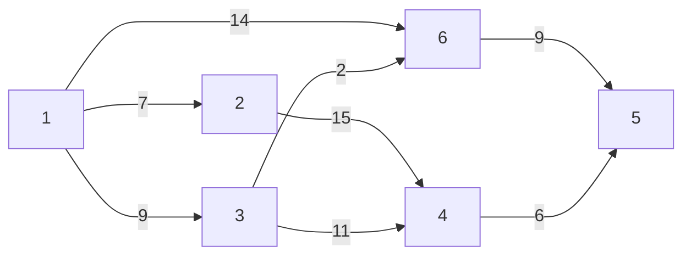

算法描述：

1. 将所有顶点标记为未访问。创建一个未访问顶点的集合。
2. 为每个顶点分配一个临时距离值
   * 对于我们的初始顶点，将其设置为零
   * 对于所有其他顶点，将其设置为无穷大。
3. 每次选择最小临时距离的未访问顶点，作为新的当前顶点
4. 对于当前顶点，遍历其所有未访问的邻居，并更新它们的临时距离为更小
   * 例如，1->6 的距离是 14，而1->3->6 的距离是11。这时将距离更新为 11
   * 否则，将保留上次距离值
5. 当前顶点的邻居处理完成后，把它从未访问集合中删除

```java
public class Dijkstra {
    public static void main(String[] args) {
        Vertex v1 = new Vertex("v1");
        Vertex v2 = new Vertex("v2");
        Vertex v3 = new Vertex("v3");
        Vertex v4 = new Vertex("v4");
        Vertex v5 = new Vertex("v5");
        Vertex v6 = new Vertex("v6");

        v1.edges = List.of(new Edge(v3, 9), new Edge(v2, 7), new Edge(v6, 14));
        v2.edges = List.of(new Edge(v4, 15));
        v3.edges = List.of(new Edge(v4, 11), new Edge(v6, 2));
        v4.edges = List.of(new Edge(v5, 6));
        v5.edges = List.of();
        v6.edges = List.of(new Edge(v5, 9));

        List<Vertex> graph = List.of(v1, v2, v3, v4, v5, v6);

        dijkstra(graph, v1);
    }

    private static void dijkstra(List<Vertex> graph, Vertex source) {
        ArrayList<Vertex> list = new ArrayList<>(graph);
        source.dist = 0;

        while (!list.isEmpty()) {
            // 3. 选取当前顶点
            Vertex curr = chooseMinDistVertex(list);
            // 4. 更新当前顶点邻居距离
            updateNeighboursDist(curr, list);
            // 5. 移除当前顶点
            list.remove(curr);
        }

        for (Vertex v : graph) {
            System.out.println(v.name + " " + v.dist);
        }
    }

    private static void updateNeighboursDist(Vertex curr, ArrayList<Vertex> list) {
        for (Edge edge : curr.edges) {
            Vertex n = edge.linked;
            if (list.contains(n)) {
                int dist = curr.dist + edge.weight;
                if (dist < n.dist) {
                    n.dist = dist;
                }
            }
        }
    }

    private static Vertex chooseMinDistVertex(ArrayList<Vertex> list) {
        Vertex min = list.get(0);
        for (int i = 1; i < list.size(); i++) {
            if (list.get(i).dist < min.dist) {
                min = list.get(i);
            }
        }
        return min;
    }

}
```

改进 - 优先级队列

1. 创建一个优先级队列，放入所有顶点（队列大小会达到边的数量）
2. 为每个顶点分配一个临时距离值
   * 对于我们的初始顶点，将其设置为零
   * 对于所有其他顶点，将其设置为无穷大。
3. 每次选择最小临时距离的未访问顶点，作为新的当前顶点
4. 对于当前顶点，遍历其所有未访问的邻居，并更新它们的临时距离为更小，若距离更新需加入队列
   * 例如，1->6 的距离是 14，而1->3->6 的距离是11。这时将距离更新为 11
   * 否则，将保留上次距离值
5. 当前顶点的邻居处理完成后，把它从队列中删除

```java
public class DijkstraPriorityQueue {
    public static void main(String[] args) {
        Vertex v1 = new Vertex("v1");
        Vertex v2 = new Vertex("v2");
        Vertex v3 = new Vertex("v3");
        Vertex v4 = new Vertex("v4");
        Vertex v5 = new Vertex("v5");
        Vertex v6 = new Vertex("v6");

        v1.edges = List.of(new Edge(v3, 9), new Edge(v2, 7), new Edge(v6, 14));
        v2.edges = List.of(new Edge(v4, 15));
        v3.edges = List.of(new Edge(v4, 11), new Edge(v6, 2));
        v4.edges = List.of(new Edge(v5, 6));
        v5.edges = List.of();
        v6.edges = List.of(new Edge(v5, 9));

        List<Vertex> graph = List.of(v1, v2, v3, v4, v5, v6);

        dijkstra(graph, v1);
    }

    private static void dijkstra(List<Vertex> graph, Vertex source) {
        PriorityQueue<Vertex> queue = new PriorityQueue<>(Comparator.comparingInt(v -> v.dist));
        source.dist = 0;
        for (Vertex v : graph) {
            queue.offer(v);
        }

        while (!queue.isEmpty()) {
            System.out.println(queue);
            // 3. 选取当前顶点
            Vertex curr = queue.peek();
            // 4. 更新当前顶点邻居距离
            if(!curr.visited) {
                updateNeighboursDist(curr, queue);
                curr.visited = true;
            }
            // 5. 移除当前顶点
            queue.poll();
        }

        for (Vertex v : graph) {
            System.out.println(v.name + " " + v.dist + " " + (v.prev != null ? v.prev.name : "null"));
        }
    }

    private static void updateNeighboursDist(Vertex curr, PriorityQueue<Vertex> queue) {
        for (Edge edge : curr.edges) {
            Vertex n = edge.linked;
            if (!n.visited) {
                int dist = curr.dist + edge.weight;
                if (dist < n.dist) {
                    n.dist = dist;
                    n.prev = curr;
                    queue.offer(n);
                }
            }
        }
    }

}
```

**问题**

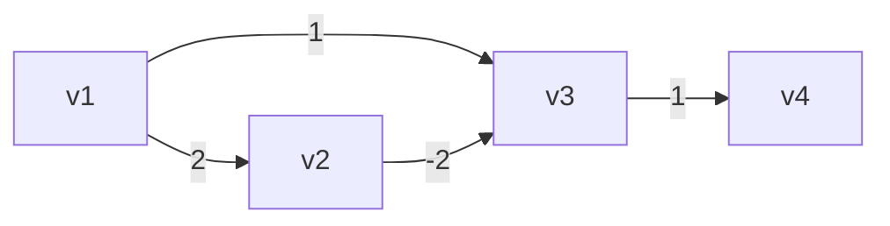

按照 Dijkstra 算法，得出

* v1 -> v2 最短距离2
* v1 -> v3 最短距离1
* v1 -> v4 最短距离2

事实应当是

* v1 -> v2 最短距离2
* v1 -> v3 最短距离0
* v1 -> v4 最短距离1

#### Bellman-Ford

```java
public class BellmanFord {
    public static void main(String[] args) {
        // 正常情况
        /*Vertex v1 = new Vertex("v1");
        Vertex v2 = new Vertex("v2");
        Vertex v3 = new Vertex("v3");
        Vertex v4 = new Vertex("v4");
        Vertex v5 = new Vertex("v5");
        Vertex v6 = new Vertex("v6");

        v1.edges = List.of(new Edge(v3, 9), new Edge(v2, 7), new Edge(v6, 14));
        v2.edges = List.of(new Edge(v4, 15));
        v3.edges = List.of(new Edge(v4, 11), new Edge(v6, 2));
        v4.edges = List.of(new Edge(v5, 6));
        v5.edges = List.of();
        v6.edges = List.of(new Edge(v5, 9));

        List<Vertex> graph = List.of(v4, v5, v6, v1, v2, v3);*/

        // 负边情况
        /*Vertex v1 = new Vertex("v1");
        Vertex v2 = new Vertex("v2");
        Vertex v3 = new Vertex("v3");
        Vertex v4 = new Vertex("v4");

        v1.edges = List.of(new Edge(v2, 2), new Edge(v3, 1));
        v2.edges = List.of(new Edge(v3, -2));
        v3.edges = List.of(new Edge(v4, 1));
        v4.edges = List.of();
        List<Vertex> graph = List.of(v1, v2, v3, v4);*/

        // 负环情况
        Vertex v1 = new Vertex("v1");
        Vertex v2 = new Vertex("v2");
        Vertex v3 = new Vertex("v3");
        Vertex v4 = new Vertex("v4");

        v1.edges = List.of(new Edge(v2, 2));
        v2.edges = List.of(new Edge(v3, -4));
        v3.edges = List.of(new Edge(v4, 1), new Edge(v1, 1));
        v4.edges = List.of();
        List<Vertex> graph = List.of(v1, v2, v3, v4);

        bellmanFord(graph, v1);
    }

    private static void bellmanFord(List<Vertex> graph, Vertex source) {
        source.dist = 0;
        int size = graph.size();
        // 1. 进行 顶点个数 - 1 轮处理
        for (int i = 0; i < size - 1; i++) {
            // 2. 遍历所有的边
            for (Vertex s : graph) {
                for (Edge edge : s.edges) {
                    // 3. 处理每一条边
                    Vertex e = edge.linked;
                    if (s.dist != Integer.MAX_VALUE && s.dist + edge.weight < e.dist) {
                        e.dist = s.dist + edge.weight;
                        e.prev = s;
                    }
                }
            }
        }
        for (Vertex v : graph) {
            System.out.println(v + " " + (v.prev != null ? v.prev.name : "null"));
        }
    }
}
```

**负环**

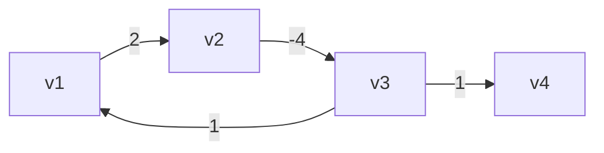

如果在【顶点-1】轮处理完成后，还能继续找到更短距离，表示发现了负环

#### Floyd-Warshall

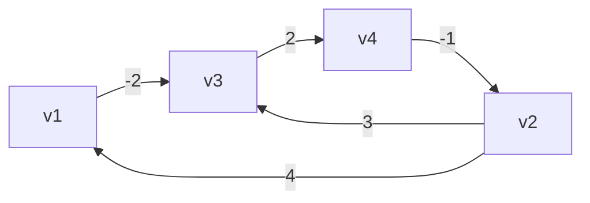

```java
public class FloydWarshall {
    public static void main(String[] args) {
        Vertex v1 = new Vertex("v1");
        Vertex v2 = new Vertex("v2");
        Vertex v3 = new Vertex("v3");
        Vertex v4 = new Vertex("v4");

        v1.edges = List.of(new Edge(v3, -2));
        v2.edges = List.of(new Edge(v1, 4), new Edge(v3, 3));
        v3.edges = List.of(new Edge(v4, 2));
        v4.edges = List.of(new Edge(v2, -1));
        List<Vertex> graph = List.of(v1, v2, v3, v4);

        /*
                直接连通
                v1  v2  v3  v4
            v1  0   ∞   -2  ∞
            v2  4   0   3   ∞
            v3  ∞   ∞   0   2
            v4  ∞   -1  ∞   0

                k=0 借助v1到达其它顶点
                v1  v2  v3  v4
            v1  0   ∞   -2  ∞
            v2  4   0   2   ∞
            v3  ∞   ∞   0   2
            v4  ∞   -1  ∞   0

                k=1 借助v2到达其它顶点
                v1  v2  v3  v4
            v1  0   ∞   -2  ∞
            v2  4   0   2   ∞
            v3  ∞   ∞   0   2
            v4  3   -1  1   0

                k=2 借助v3到达其它顶点
                v1  v2  v3  v4
            v1  0   ∞   -2  0
            v2  4   0   2   4
            v3  ∞   ∞   0   2
            v4  3   -1  1   0

                k=3 借助v4到达其它顶点
                v1  v2  v3  v4
            v1  0   -1   -2  0
            v2  4   0   2   4
            v3  5   1   0   2
            v4  3   -1  1   0
         */
        floydWarshall(graph);
    }

    static void floydWarshall(List<Vertex> graph) {
        int size = graph.size();
        int[][] dist = new int[size][size];
        Vertex[][] prev = new Vertex[size][size];
        // 1）初始化
        for (int i = 0; i < size; i++) {
            Vertex v = graph.get(i); // v1 (v3)
            Map<Vertex, Integer> map = v.edges.stream().collect(Collectors.toMap(e -> e.linked, e -> e.weight));
            for (int j = 0; j < size; j++) {
                Vertex u = graph.get(j); // v3
                if (v == u) {
                    dist[i][j] = 0;
                } else {
                    dist[i][j] = map.getOrDefault(u, Integer.MAX_VALUE);
                    prev[i][j] = map.get(u) != null ? v : null;
                }
            }
        }
        print(prev);
        // 2）看能否借路到达其它顶点
        /*
            v2->v1          v1->v?
            dist[1][0]   +   dist[0][0]
            dist[1][0]   +   dist[0][1]
            dist[1][0]   +   dist[0][2]
            dist[1][0]   +   dist[0][3]
         */
        for (int k = 0; k < size; k++) {
            for (int i = 0; i < size; i++) {
                for (int j = 0; j < size; j++) {
//                    dist[i][k]   +   dist[k][j] // i行的顶点，借助k顶点，到达j列顶点
//                    dist[i][j]                  // i行顶点，直接到达j列顶点
                    if (dist[i][k] != Integer.MAX_VALUE &&
                            dist[k][j] != Integer.MAX_VALUE &&
                            dist[i][k] + dist[k][j] < dist[i][j]) {
                        dist[i][j] = dist[i][k] + dist[k][j];
                        prev[i][j] = prev[k][j];
                    }
                }
            }
//            print(dist);
        }
        print(prev);
    }

    static void path(Vertex[][] prev, List<Vertex> graph, int i, int j) {
        LinkedList<String> stack = new LinkedList<>();
        System.out.print("[" + graph.get(i).name + "," + graph.get(j).name + "] ");
        stack.push(graph.get(j).name);
        while (i != j) {
            Vertex p = prev[i][j];
            stack.push(p.name);
            j = graph.indexOf(p);
        }
        System.out.println(stack);
    }

    static void print(int[][] dist) {
        System.out.println("-------------");
        for (int[] row : dist) {
            System.out.println(Arrays.stream(row).boxed()
                    .map(x -> x == Integer.MAX_VALUE ? "∞" : String.valueOf(x))
                    .map(s -> String.format("%2s", s))
                    .collect(Collectors.joining(",", "[", "]")));
        }
    }

    static void print(Vertex[][] prev) {
        System.out.println("-------------------------");
        for (Vertex[] row : prev) {
            System.out.println(Arrays.stream(row).map(v -> v == null ? "null" : v.name)
                    .map(s -> String.format("%5s", s))
                    .collect(Collectors.joining(",", "[", "]")));
        }
    }

}
```

**负环**

如果在 3 层循环结束后，在 dist 数组的对角线处（i==j 处）发现了负数，表示出现了负环

### 8) 最小生成树

#### Prim

```java
public class Prim {
    public static void main(String[] args) {
        Vertex v1 = new Vertex("v1");
        Vertex v2 = new Vertex("v2");
        Vertex v3 = new Vertex("v3");
        Vertex v4 = new Vertex("v4");
        Vertex v5 = new Vertex("v5");
        Vertex v6 = new Vertex("v6");
        Vertex v7 = new Vertex("v7");

        v1.edges = List.of(new Edge(v2, 2), new Edge(v3, 4), new Edge(v4, 1));
        v2.edges = List.of(new Edge(v1, 2), new Edge(v4, 3), new Edge(v5, 10));
        v3.edges = List.of(new Edge(v1, 4), new Edge(v4, 2), new Edge(v6, 5));
        v4.edges = List.of(new Edge(v1, 1), new Edge(v2, 3), new Edge(v3, 2),
                new Edge(v5, 7), new Edge(v6, 8), new Edge(v7, 4));
        v5.edges = List.of(new Edge(v2, 10), new Edge(v4, 7), new Edge(v7, 6));
        v6.edges = List.of(new Edge(v3, 5), new Edge(v4, 8), new Edge(v7, 1));
        v7.edges = List.of(new Edge(v4, 4), new Edge(v5, 6), new Edge(v6, 1));

        List<Vertex> graph = List.of(v1, v2, v3, v4, v5, v6, v7);

        prim(graph, v1);

    }

    static void prim(List<Vertex> graph, Vertex source) {
        ArrayList<Vertex> list = new ArrayList<>(graph);
        source.dist = 0;

        while (!list.isEmpty()) {
            Vertex min = chooseMinDistVertex(list);
            updateNeighboursDist(min);
            list.remove(min);
            min.visited = true;
            System.out.println("---------------");
            for (Vertex v : graph) {
                System.out.println(v);
            }
        }


    }

    private static void updateNeighboursDist(Vertex curr) {
        for (Edge edge : curr.edges) {
            Vertex n = edge.linked;
            if (!n.visited) {
                int dist = edge.weight;
                if (dist < n.dist) {
                    n.dist = dist;
                    n.prev = curr;
                }
            }
        }
    }

    private static Vertex chooseMinDistVertex(ArrayList<Vertex> list) {
        Vertex min = list.get(0);
        for (int i = 1; i < list.size(); i++) {
            if (list.get(i).dist < min.dist) {
                min = list.get(i);
            }
        }
        return min;
    }
}
```

#### Kruskal

```java
public class Kruskal {
    static class Edge implements Comparable<Edge> {
        List<Vertex> vertices;
        int start;
        int end;
        int weight;

        public Edge(List<Vertex> vertices, int start, int end, int weight) {
            this.vertices = vertices;
            this.start = start;
            this.end = end;
            this.weight = weight;
        }

        public Edge(int start, int end, int weight) {
            this.start = start;
            this.end = end;
            this.weight = weight;
        }

        @Override
        public int compareTo(Edge o) {
            return Integer.compare(this.weight, o.weight);
        }

        @Override
        public String toString() {
            return vertices.get(start).name + "<->" + vertices.get(end).name + "(" + weight + ")";
        }
    }

    public static void main(String[] args) {
        Vertex v1 = new Vertex("v1");
        Vertex v2 = new Vertex("v2");
        Vertex v3 = new Vertex("v3");
        Vertex v4 = new Vertex("v4");
        Vertex v5 = new Vertex("v5");
        Vertex v6 = new Vertex("v6");
        Vertex v7 = new Vertex("v7");

        List<Vertex> vertices = List.of(v1, v2, v3, v4, v5, v6, v7);
        PriorityQueue<Edge> queue = new PriorityQueue<>(List.of(
                new Edge(vertices,0, 1, 2),
                new Edge(vertices,0, 2, 4),
                new Edge(vertices,0, 3, 1),
                new Edge(vertices,1, 3, 3),
                new Edge(vertices,1, 4, 10),
                new Edge(vertices,2, 3, 2),
                new Edge(vertices,2, 5, 5),
                new Edge(vertices,3, 4, 7),
                new Edge(vertices,3, 5, 8),
                new Edge(vertices,3, 6, 4),
                new Edge(vertices,4, 6, 6),
                new Edge(vertices,5, 6, 1)
        ));

        kruskal(vertices.size(), queue);
    }

    static void kruskal(int size, PriorityQueue<Edge> queue) {
        List<Edge> result = new ArrayList<>();
        DisjointSet set = new DisjointSet(size);
        while (result.size() < size - 1) {
            Edge poll = queue.poll();
            int s = set.find(poll.start);
            int e = set.find(poll.end);
            if (s != e) {
                result.add(poll);
                set.union(s, e);
            }
        }

        for (Edge edge : result) {
            System.out.println(edge);
        }
    }
}
```

### 9) 不相交集合（并查集合）

#### 基础

```java
public class DisjointSet {
    int[] s;
    // 索引对应顶点
    // 元素是用来表示与之有关系的顶点
    /*
        索引  0  1  2  3  4  5  6
        元素 [0, 1, 2, 3, 4, 5, 6] 表示一开始顶点直接没有联系（只与自己有联系）

    */

    public DisjointSet(int size) {
        s = new int[size];
        for (int i = 0; i < size; i++) {
            s[i] = i;
        }
    }

    // find 是找到老大
    public int find(int x) {
        if (x == s[x]) {
            return x;
        }
        return find(s[x]);
    }

    // union 是让两个集合“相交”，即选出新老大，x、y 是原老大索引
    public void union(int x, int y) {
        s[y] = x;
    }

    @Override
    public String toString() {
        return Arrays.toString(s);
    }

}
```

#### 路径压缩

```java
public int find(int x) { // x = 2
    if (x == s[x]) {
        return x;
    }
    return s[x] = find(s[x]); // 0    s[2]=0
}
```

#### Union By Size

```java
public class DisjointSetUnionBySize {
    int[] s;
    int[] size;
    public DisjointSetUnionBySize(int size) {
        s = new int[size];
        this.size = new int[size];
        for (int i = 0; i < size; i++) {
            s[i] = i;
            this.size[i] = 1;
        }
    }

    // find 是找到老大 - 优化：路径压缩
    public int find(int x) { // x = 2
        if (x == s[x]) {
            return x;
        }
        return s[x] = find(s[x]); // 0    s[2]=0
    }

    // union 是让两个集合“相交”，即选出新老大，x、y 是原老大索引
    public void union(int x, int y) {
//        s[y] = x;
        if (size[x] < size[y]) {
            int t = x;
            x = y;
            y = t;
        }
        s[y] = x;
        size[x] = size[x] + size[y];
    }

    @Override
    public String toString() {
        return "内容："+Arrays.toString(s) + "\n大小：" + Arrays.toString(size);
    }

    public static void main(String[] args) {
        DisjointSetUnionBySize set = new DisjointSetUnionBySize(5);

        set.union(1, 2);
        set.union(3, 4);
        set.union(1, 3);
        System.out.println(set);
    }


}
```

### 图-相关题目

| 题目编号 | 题目标题               | 算法思想         |
| -------- | ---------------------- | ---------------- |
| 547      | 省份数量               | DFS、BFS、并查集 |
| 797      | 所有可能路径           | DFS、BFS         |
| 1584     | 连接所有点的最小费用   | 最小生成树       |
| 743      | 网络延迟时间           | 单源最短路径     |
| 787      | K 站中转内最便宜的航班 | 单源最短路径     |
| 207      | 课程表                 | 拓扑排序         |
| 210      | 课程表 II              | 拓扑排序         |
