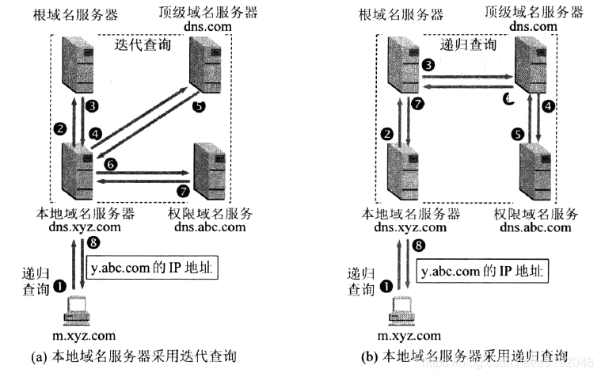

# 网络配置

## 网卡文件

网卡文件位置：/etc/sysconfig/network-scripts/

命名格式：ifcfg-eth0

```
#网卡文件内容
DEVICE=eth0				#网络接口的名称
HWADDR=00:0C:29:11:30:39		#网络接口的硬件地址（MAC 地址）
TYPE=Ethernet				#网络接口的类型
UUID=5ab36190-a5df-4bf1-94d8-6c126afd05f1	#网络接口的 UUID
NM_CONTROLLED=yes			#表示NetworkManager控制这个网络接口，no表示NM不控制，而是由系统的网络服务network服务来管理。
BOOTPROTO=static			#网络接口的引导协议，静态：static，动态：dhcp
IPADDR=192.168.1.2			#静态 IP 地址
NETMASK=255.255.255.0			#子网掩码
GATEWAY=192.168.1.1			#网关的 IP 地址
DNS1=8.8.8.8				#首选DNS地址
DNS2=8.8.4.4				#备用DNS地址
ONBOOT=yes				网络接口是否开机自启，yes:自启，no:不自启
```

## DNS文件

DNS文件位置：/etc/resolv.conf

```
#DNS配置信息
nameserver 192.168.134.2	#nameserver是域名服务器
```

## 主机名文件

主机名文件位置：

* /etc/hosts
* /etc/hostname

```
127.0.0.1   localhost localhost.localdomain localhost4 localhost4.localdomain4
::1         localhost localhost.localdomain localhost6 localhost6.localdomain6
127.0.0.1   xxxx
```

## 网络设备相关

### IP

`ip` 命令是用于配置和显示 Linux 操作系统中网络设备、路由、策略路由和隧道的工具。它是 `iproute2` 工具集的一部分，提供了更多功能和灵活性。

#### 显示网络设备信息

```
ip link show		#显示简要网络设备信息
ip a			#显示完整网络设备信息，包括接口名称、MAC 地址、状态等。
ip link show up		#只显示处于启用状态的网络设备。
ip link show dev eth0	#显示指定设备（这里是 eth0）的详细信息
ip addr show		#显示所有接口的 IP 地址信息，或ip a
```

#### 配置网络设备

```
ip link set dev eth0 up			#启用指定设备。
ip link set dev eth0 down		#禁用指定设备。
ip addr add 192.168.1.2/24 dev eth0	#给指定设备分配IP地址192.168.1.2和子网掩码/24。
ip addr del 192.168.1.2/24 dev eth0	#删除指定设备的IP地址192.168.1.2。
ip link set dev eth0 address XX:XX:XX:XX:XX:XX	#修改指定设备（eth0）的MAC地址。
```

#### 显示统计信息

```
ip -s link		#显示网络设备的详细统计信息，包括接收和发送的数据包数量
ip -s -d link show eth0	#显示指定设备（eth0）的详细信息
ip -s -z link show eth0	#显示设备的统计信息并设置计数器清零
```

* `-s`：显示摘要信息。
* `-d`：显示详细信息。
* `-z`：在显示设备统计信息后将其清零。

## 路由相关

#### 显示路由表

```
ip route show		#显示路由表，包括目标网络、网关、接口等信息，简写：ip r
ip route show default 	#显示默认路由。简写：ip r s default
ip route show table all	#示所有路由表的信息。或ip route show all
```

字段详解

```
default via 192.168.1.1 dev eth0
192.168.1.0/24 dev eth0 proto kernel scope link src 192.168.1.100 metric 100
```

* 目标（Destination）：
  * 表示目标网络的地址或主机地址。例如，`default` 表示默认路由，`192.168.1.0/24` 表示一个网络。
* 接口（Gateway）：
  * `via` 后面的地址表示下一跳的网关地址。`dev` 后面的值表示出口的网络接口。
* 协议（Protocol）：
  * `proto` 后面的值表示该路由的协议。`kernel` 表示由内核管理的路由，`static` 表示静态路由，`dhcp` 表示通过 DHCP 获取的路由等。
* 作用域（Scope）：
  * `scope` 字段表示路由的作用域。`link` 表示本地链路，`global` 表示全局路由。
* 源（Source）：
  * `src` 后面的值表示该路由的源地址。
* 优先级（Metric）：
  * `metric` 后面的值表示路由的优先级。值越小表示优先级越高。

#### 静态路由

```
#添加静态路由，添加到 192.168.2.0/24 网络的静态路由，通过 192.168.1.1 网关，经过 eth0 接口。
ip route add 192.168.2.0/24 via 192.168.1.1 dev eth0
#删除路由，删除路由表中的 192.168.2.0/24 目标。
ip route del 192.168.2.0/24
```

#### 策略路由

```
#显示策略路由，显示策略路由规则，包括优先级、源地址、目标地址等信息。简写：ip ru
ip rule show
#添加策略路由规则，添加一个策略路由规则，从源地址 192.168.1.2 到路由表 10。
ip rule add from 192.168.1.2 table 10
```

`ip rule show` 命令用于显示 Linux 系统上的路由规则。路由规则用于指定在进行路由选择时应该遵循的策略。

字段详解

```
ip rule show
0:      from all lookup local 
32766:  from all lookup main 
32767:  from all lookup default 
```

* `0: from all lookup local`：
  * 表示默认的本地查找规则。这是一个特殊的规则，用于本地通信，例如回环接口（`lo`）上的通信。
* `32766: from all lookup main`：
  * 表示主要查找规则。主要查找表包含主要的路由规则。
* `32767: from all lookup default`：
  * 表示默认查找规则。默认查找表包含默认的路由规则。

这些规则的数字是优先级，数字越小，优先级越高。规则按照优先级从高到低的顺序逐个检查，直到找到匹配的规则为止。

```
ip rule add from 192.168.1.2 table 10
```

* `ip rule add`： 表示添加一个路由规则。
* `from 192.168.1.2`： 指定规则应用的条件。这里是指从源地址为 `192.168.1.2` 的数据包。
* `table 10`： 指定规则匹配时应该使用的路由表。这里是指当数据包匹配上述条件时，使用路由表编号为 `10` 的路由表。

解释：当来自源地址为 `192.168.1.2` 的数据包到达系统时，应该使用路由表编号为 `10` 的路由表进行路由选择。在 Linux 中，可以有多个路由表，每个表可以包含不同的路由规则。

这种设置常见于策略路由的场景，其中特定源地址的流量被引导到不同的路由表，以实现对该流量的特定路由策略。这可以用于实现例如分流、负载均衡、VPN 策略等复杂的网络配置。

##### 静态路由和策略路由区别：

1. 静态路由（Static Routing）：

* 定义： 静态路由是在网络管理员手动配置的路由，手动指定了目标网络和下一跳路由器的地址。
* 管理： 静态路由的维护需要手动进行，管理员需要了解网络拓扑并手动配置路由表。
* 用途： 静态路由通常用于小型网络或网络中的基础设施，其中网络拓扑较为简单且变化不频繁。

2. 策略路由（Policy Routing）：

* 定义： 策略路由是根据某些特定的条件或策略选择路由的一种方式，可以根据数据包的源地址、目标地址、服务类型等条件来选择不同的路由。
* 管理： 策略路由通过配置路由规则，定义了在不同条件下应该使用的路由表。这种方式更为灵活，可以根据实际需求动态调整路由。
* 用途： 策略路由通常用于大型网络或需要更复杂路由控制的环境，例如多路径负载均衡、流量分流等。

主要区别：

1. 配置方式：
   * 静态路由： 管理员手动配置每个路由表项。
   * 策略路由： 管理员配置路由规则，定义根据不同条件使用不同路由表。
2. 灵活性：
   * 静态路由： 较为固定，需要手动更新和调整。
   * 策略路由： 更灵活，可以根据特定条件动态选择路由。
3. 复杂性：
   * 静态路由： 简单，适用于较小规模的网络。
   * 策略路由： 更复杂，适用于需要更精细控制的网络环境。

#### 显示和配置ARP（Address Resolution Protocol）

```
ip neigh show		#显示 ARP 表，包括IP地址、MAC地址、接口等信息。简写：ip n

#配置ARP缓存
ip neigh add 192.168.1.1 lladdr 00:11:22:33:44:55 nud permanent dev eth0
```

* `ip neigh add`：添加一个ARP表项。
* `192.168.1.1`：目标 IP 地址。
* `lladdr 00:11:22:33:44:55`：目标 MAC 地址。
* `nud permanent`：设置条目为永久。
* `dev eth0`：指定网络设备。

#### 设备多播和广播

```
ip link set dev eth0 multicast on
ip link set dev eth0 broadcast on
```

* `multicast on`：启用设备的多播功能。
* `broadcast on`：启用设备的广播功能。

#### 设置VLAN

```
ip link show type vxlan			#显示 VXLAN 接口。
ip link show type vlan id 10		#显示 VLAN ID 为 10 的 VLAN 接口。
ip link set dev eth0 vf 0 vlan 10	#为 VF（Virtual Function）设置 VLAN ID。

ip link add link eth0 name eth0.10 type vlan id 10	#添加 VLAN
```

* `link eth0`：指定父接口。
* `name eth0.10`：指定 VLAN 接口的名称。
* `type vlan`：指定接口类型为 VLAN。
* `id 10`：指定 VLAN ID。

```
#添加一个 VXLAN 接口
ip link add vxlan0 type vxlan id 100 remote 203.0.113.1 local 203.0.113.2 dev eth0
```

#### 使用 MPLS（多协议标签交换）

```
ip route add 192.168.2.0/24 via 192.168.1.1 encap mpls 100
```

`encap mpls 100`：将路由封装为 MPLS 报文，标签为 100。

## 网络命名空间（netns）

网络命名空间（Network Namespace，通常缩写为 netns）是一种将网络资源隔离开的机制，允许在同一系统上创建多个独立的网络栈。每个网络命名空间都有自己的网络接口、IP 地址、路由表等网络配置，使得在一个系统上可以创建多个独立的网络环境。这对于容器化、虚拟化以及网络实验和测试非常有用。

```
ip netns				#显示所有网络命名空间
ip netns list				#查看网络命名空间列表
ip netns add namespace1			#添加一个名为namespace1的命名空间
ip netns exec namespace1 command	#在网络命名空间中执行命令
```

* `ip netns add`：创建一个新的网络命名空间。
* `ip netns exec`：在指定的网络命名空间中执行命令。

##### 相关命令

进入网络命名空间

```
ip netns exec mynamespace /bin/bash	#在 mynamespace 中执行 shell
```

设置网络接口的 IP 地址

```
ip netns exec mynamespace ip addr add 192.168.1.1/24 dev veth1	#为 `veth1` 设置 IP 地址
```

启用网络接口

```
ip netns exec mynamespace ip link set dev veth1 up
```

添加路由

```
#在 mynamespace 中添加默认路由
ip netns exec mynamespace ip route add default via 192.168.1.1
```

创建虚拟网络接口

```
ip link add veth0 type veth peer name veth1
```

创建一对虚拟以太网接口 `veth0` 和 `veth1`，它们是通过虚拟线缆连接的，数据包通过其中一个接口发送，将从另一个接口接收。

将虚拟接口添加到网络命名空间

```
ip link set veth1 netns mynamespace	#将 veth1 添加到 mynamespace 中
```

##### 使用网络命名空间的主要步骤：

1：创建网络命名空间

```
ip netns add ns1
```

2：创建虚拟网络接口

```
ip link add veth0 type veth peer name veth1	#创建一对虚拟以太网接口 veth0 和 veth1
```

3：将一个接口添加到网络命名空间

```
ip link set veth1 netns ns1		#将 veth1 添加到 ns1 命名空间中
```

4：为命名空间内的接口分配 IP 地址

```
ip netns exec ns1 ip addr add 192.168.1.1/24 dev veth1
```

5：启用命名空间内的接口

```
ip netns exec ns1 ip link set dev veth1 up
```

6：在主机命名空间中为 veth0 分配 IP 地址

```
ip addr add 192.168.1.2/24 dev veth0
```

7：在主机命名空间中启用 veth0

```
ip link set dev veth0 up
```

8：设置路由

```
ip netns exec ns1 ip route add default via 192.168.1.2	#在 ns1 中设置默认路由，指向主机的 veth0。
```

现在，你就在一个新的网络命名空间中创建了一个独立的网络环境。你可以在 `ns1` 中执行网络相关的命令，就好像它是一个独立的系统一样。

## 其他工具性命令：

### ping

`ping` 是一个用于测试网络连通性的命令行工具，通常用于确定本地主机与目标主机之间是否能够正常通信。

```
ping example.com	#向example.com发送ICMP Echo请求和ARP请求，等待目标主机响应。如果连接正常，将看到每个响应的时间。

ping -c 5 example.com		#发送 ICMP Echo 请求的次数
ping -i 2 example.com		#发送 ICMP Echo 请求的时间间隔（以秒为单位）
ping -t example.com		#持续 ping
ping -D example.com		#显示每个 ICMP Echo 请求和响应的时间戳
ping -s 1024 example.com	#设置发送的 ICMP Echo 请求中的数据包大小，此处为1024字节
ping -i 5 -a 2 example.com	#设置 Echo 请求的标识符，此处标识符为2
ping -v example.com		#显示每个 ICMP Echo 请求和响应的详细信息

ping -I eth0 example.com	#指定发送 ICMP Echo 请求时使用的源 IP 地址
ping -w 5 example.com		#设置超时时间，即等待目标主机响应的最长时间（以秒为单位）
ping -A example.com &		#后台运行 ping
ping6 example.com		#使用 IPv6 进行 ping

ping -t 10 example.com		#设置 IP 头部的生存时间（TTL），这对于跟踪数据包经过的路由器数量很有用。
ping -R example.com		#显示每一跳的路径信息
ping -p 12345 example.com	#设置 ICMP Echo 请求的源端口号。

ping -M do -s 1472 example.com	#启用 DF（Don't Fragment）标志，通过逐跳的数据包来测量 MTU（最大传输单元）。
ping -a example.com		#使用 FQDN 进行 ping，而不是解析为 IP 地址
ping -q -c 5 example.com	#启用安静模式，只显示最终的统计信息
ping -c 5 example.com | grep "time"	#通过管道传递结果到其他命令
```

字段简介

```
ping -c 4 bing.com
PING bing.com (13.107.21.200) 56(84) bytes of data.
64 bytes from 13.107.21.200 (13.107.21.200): icmp_seq=1 ttl=115 time=37.0 ms
64 bytes from 13.107.21.200 (13.107.21.200): icmp_seq=2 ttl=115 time=40.4 ms
64 bytes from 13.107.21.200 (13.107.21.200): icmp_seq=3 ttl=115 time=37.1 ms
64 bytes from 13.107.21.200 (13.107.21.200): icmp_seq=4 ttl=115 time=36.6 ms

--- bing.com ping statistics ---
4 packets transmitted, 4 received, 0% packet loss, time 3003ms
rtt min/avg/max/mdev = 36.550/37.763/40.366/1.536 ms
```

* 4 packets transmitted
  * 发送的数据包数量。发送了 4 个数据包
* 4 received
  * 接收的数据包数量。收到了 4 个数据包
* 0% packet loss
  * 丢包率。这里为0丢包
* `time 3003ms`
  * 表示整个 ping 过程的持续时间为 3002 毫秒（ms）
* rtt
  * 表示往返时间（Round-Trip Time）
* min/avg/max/mdev
  * 最小往返时间，平均往返时间，最大往返时间，往返时间的平均偏差
  * 平均偏差也可以说是网络的抖动（Jitter）
  * Jitter（抖动）： 衡量网络往返时间的变化或不稳定性。

### traceroute(tracert)

`traceroute` 命令通常用于跟踪数据包从源到目的地的路径，同时显示每一跳的延迟，每个数据包具有逐跳递增的 TTL（Time to Live）字段，以便观察数据包经过的路由器和节点。在 Windows 上，对应的命令是 `tracert`（或 `pathping`）。

运行原理

1. 发出 ICMP Echo 请求：
   * `traceroute` 发送一个 ICMP Echo 请求（类似于 Ping 请求）到目标主机，但设置了较短的 TTL 值，通常为 1。
2. 首次到达目标主机：
   * 第一个数据包到达目标主机，但由于 TTL 为 1，目标主机会将其丢弃，并返回一个 ICMP Time Exceeded 错误消息。
3. 逐跳递增 TTL：
   * `traceroute` 发送第二个 ICMP Echo 请求，TTL 设置为 2。这样，数据包可以到达目标主机，但只能通过第一个路由器。
4. 迭代过程：
   * `traceroute` 通过逐渐递增 TTL 的方式，发送多个数据包，每个数据包经过不同数量的路由器，直到到达目标主机。每个中间路由器都会在 TTL 耗尽时返回一个 ICMP Time Exceeded 消息。
5. 收集结果：
   * `traceroute` 收集每个数据包的返回信息，包括每个路由器的 IP 地址和响应时间。
6. 显示结果：
   * `traceroute` 将结果显示在终端上，以展示数据包经过的每个中间节点的 IP 地址和往返时间（RTT）。

> 某些网络可能对 ICMP Echo 请求作出限制或过滤，这可能影响 `traceroute` 的能力显示完整的路径。

```
traceroute example.com		#跟踪到 example.com 的路径，并显示每一跳的 IP 地址、主机名（如果可用）和延迟。
traceroute -n example.com	#显示数字 IP 地址而不是尝试解析主机名
traceroute -p 80 example.com	#指定数据包的目标端口号
traceroute -m 15 example.com	#设置最大跃点数，即数据包最多经过多少个路由器。
traceroute -q 3 example.com	#设置每一跳发送的数据包数量
traceroute -w 2 example.com	#设置等待每一跳的超时时间，单位为秒。
traceroute -U example.com	#使用 UDP 数据包进行跟踪
traceroute -T example.com	#使用 TCP 数据包进行跟踪
traceroute -n -I example.com	#显示每一跳的详细信息
traceroute -6 example.com	#使用 IPv6 进行跟踪
traceroute -d example.com	#显示每一跳的时间戳
traceroute -A example.com	#启用 AS（自治系统）路径分析，显示每一跳的自治系统号。
```

### ss

`ss` 命令（Socket Statistics）用于显示套接字统计信息，包括网络连接、路由表、接口统计等。它是 `netstat` 命令的替代品，并提供了更多的功能和性能。

字段简介：

```
Netid	State      Recv-Q    Send-Q     Local Address:Port     Peer Address:Port
tcp	ESTAB      0         0          192.168.1.2:ssh         203.0.113.1:12345
tcp	LISTEN     0         0          *:http                 *:*                                
```

1. Netid：
   * 网络标识符，用于标识网络套接字所属的协议族。协议族包括 IPv4、IPv6、UNIX 等
2. State：
   * 连接的状态，例如 ESTAB（已建立）、LISTEN（监听）、TIME-WAIT（等待关闭）等。
3. Recv-Q：
   * 接收队列的大小，表示等待应用程序接收的数据量。
4. Send-Q：
   * 发送队列的大小，表示等待发送的数据量。
5. Local Address:Port：
   * 本地地址和端口号。
6. Peer Address:Port：
   * 远程地址和端口号。

这个示例表示：

* 有一个已建立的连接（ESTAB）从本地地址 `192.168.1.2` 的 SSH 端口（默认是 22）到远程地址 `203.0.113.1` 的端口 `12345`
* 有一个处于监听状态（LISTEN）的套接字，等待连接到本地的 HTTP 端口（80）。

常用命令：

```
ss		#显示系统上所有的套接字信息，包括 TCP、UDP、RAW 和 UNIX 套接字。
ss -t		#显示 TCP 套接字信息
ss -u		#显示 UDP 套接字信息
ss -l		#显示所有处于监听状态的套接字信息
ss -a		#显示所有连接的套接字信息，包括监听和非监听状态。
ss -x		#显示所有的 UNIX 域套接字信息
ss -i		#显示详细的接口统计信息，包括数据包的收发情况。
ss -p		#显示与套接字关联的进程信息
ss -e		#显示详细的进程信息，包括命令和用户。
ss sport = :80	#只显示符合条件的套接字信息，示例显示本地端口为 80 的套接字信息。
ss -t4		#显示 IPv4 的 TCP 套接字信息，-t6 用于显示 IPv6 的 TCP 套接字信息。
ss -s		#显示连接状态的统计信息，包括 ESTAB（已建立）、SYN-SENT（发送 SYN）、SYN-RECV（接收 SYN）等。
ss -r		#显示路由表信息
ss -m		#显示 TCP 内存使用情况
watch -n 1 ss	#时更新套接字信息，每 1 秒执行一次。


ss -p -A process_name	#显示特定进程的套接字信息，其中 process_name 是进程的名称。
ss -p -U username	#显示特定用户的套接字信息，其中 username 是用户名。
ss state FIN-WAIT-1	#state 可以仅显示指定状态的套接字信息，示例显示状态为 FIN-WAIT-1 的套接字信息。
ss dport = :80 or sport = :80	#只显示符合条件的套接字信息。示例显示目标端口或源端口为 80 的套接字信息。
ss state time-wait	#显示处于指定状态的套接字信息，示例显示处于 TIME-WAIT 状态的套接字信息。
ss -t -a -Z		#-Z 选项可以显示 SELinux 安全上下文信息，结合 -t 和 -a 可以显示所有 TCP 套接字信息。
ss -o state all		#显示更详细的 TCP 连接信息，示例显示所有状态的 TCP 连接信息。
watch -n 1 ss -t -a	#实时更新指定类型的套接字信息，每 1 秒执行一次。
ss -t -o state established	#显示已建立连接的 IP 地址和端口，示例显示所有已建立连接的 TCP 地址和端口。
ss -i -e		#显示网络接口的详细信息
ss -tulwn		#显示所有监听的 TCP 和 UDP 连接。
```

### netstat

用于显示网络状态和连接信息的命令行工具。它可以列出网络接口、路由表、连接状态等信息，用于网络故障排除和监视网络活动。

显示所有打开的网络连接

```
netstat -tulpan		#列出所有打开的 TCP 和 UDP 连接的详细信息，包括本地地址、远程地址、状态、进程 ID 等。
```

* `-t`：显示 TCP 连接。
* `-u`：显示 UDP 连接。
* `-l`：仅显示监听状态的连接。
* `-p`：显示与连接关联的进程信息。
* `-a`：显示所有连接，包括监听和非监听状态。
* `-4`：仅显示 IPv4 连接
* `-6`：仅显示 IPv6 连接

显示进程和端口的关联信息

```
netstat -ap		#显示每个网络连接的进程 ID（PID）和进程名称，以及相关的本地和远程端口信息。
```

显示所有网络接口的信息

```
netstat -i		#列出所有网络接口的信息，包括接口名称、接收和发送的数据包数量、错误等。
netstat -ie		#显示每个网络接口的详细信息，包括硬件地址、IP 地址、广播地址、掩码等。
netstat -ae		#显示每个套接字的详细信息，包括传输队列、接收队列、错误等
```

显示路由表

```
netstat -r		#显示系统的路由表，包括目标网络、网关、接口、Flags 等信息。
```

显示网络统计信息

```
netstat -s		#显示各种网络统计信息，包括接收和发送的数据包、错误、丢弃的数据包等。
```

显示套接字状态

```
netstat -o		#显示系统中所有套接字的详细状态，包括连接状态、套接字类型等。
```

使用 `watch` 实时监控连接状态

```
#使用 watch 命令每秒钟更新一次系统中的 ESTABLISHED（已建立）连接，提供实时的连接状态。
watch -n 1 'netstat -an | grep ESTABLISHED'
```

查看特定进程的网络连接

```
netstat -tulpan | grep <PID>	#显示特定进程的所有网络连接信息
```

查看端口的监听进程

```
fuser -n tcp <port>/udp <port>	#显示特定端口上正在监听的进程
```

查看打开文件描述符的网络连接

`lsof`（List Open Files）命令可以列出所有打开的文件描述符，包括网络连接。

```
lsof -i
```

查看网络性能统计信息

```
netstat -s | grep -i <keyword>
```

替代 `<keyword>` 为关键词，例如 `retransmitted`、`errors` 等，以查看与网络性能相关的统计信息。

使用 `tcpdump` 结合 `netstat` 进行深入分析：

```
tcpdump -i <interface> port <port> -nn -vv -X
```

抓取特定端口的数据包，并使用 `-X` 选项以 ASCII 模式显示负载内容。结合 `netstat` 和 `tcpdump` 可以更深入地分析网络连接。

dns查询

DNS 查询可以分为递归查询和迭代查询，它们之间的差别在于查询的处理方式。

1. 递归查询（Recursive Query）：

* 特点：
  * 客户端向本地 DNS 服务器发起查询请求。
  * 本地 DNS 服务器负责从根域开始，沿着 DNS 层次结构一级一级地查询，直到找到最终的目标域名对应的 IP 地址。
  * 本地 DNS 服务器将查询结果返回给客户端。
* 处理流程：
  1. 客户端向本地 DNS 服务器发出完整的查询请求，包括域名和查询类型。
  2. 本地 DNS 服务器负责从根域开始查询，向根域服务器询问，获得顶级域（TLD）服务器的地址。
  3. 本地 DNS 服务器再向 TLD 服务器发出查询请求，获取目标域的授权域名服务器地址。
  4. 本地 DNS 服务器继续向目标域的授权域名服务器发出查询请求，直到获取目标域的 IP 地址。
  5. 本地 DNS 服务器将查询结果返回给客户端。

2. 迭代查询（Iterative Query）：

* 特点：
  * 客户端向本地 DNS 服务器发起查询请求。
  * 本地 DNS 服务器负责向根域服务器或其他 DNS 服务器发出迭代查询请求，但本地 DNS 服务器不会等待查询结果，而是将中间查询结果返回给客户端。
  * 客户端根据中间结果继续向下一个 DNS 服务器发起查询请求，直到找到最终的目标域名对应的 IP 地址。
* 处理流程：
  1. 客户端向本地 DNS 服务器发出查询请求，包括域名和查询类型。
  2. 本地 DNS 服务器向根域服务器或其他 DNS 服务器发起查询请求，但不等待结果。
  3. 本地 DNS 服务器将中间结果返回给客户端，包括下一个需要查询的 DNS 服务器地址。
  4. 客户端根据中间结果，向下一个 DNS 服务器发起查询请求，重复这个过程，直到获取目标域的 IP 地址。

对比：

* 递归查询：
  * 由本地 DNS 服务器负责向下查询，最终将查询结果返回给客户端。
  * 客户端不需要处理中间查询过程。
* 迭代查询：
  * 由客户端负责向下查询，每次查询的中间结果由本地 DNS 服务器返回给客户端。
  * 客户端需要处理中间查询过程，直到获取最终结果。

网络图片演示：



### nslookup

`nslookup` 是一个用于查询域名系统 (DNS) 的命令行工具，它允许用户查找域名对应的 IP 地址以及执行其他与 DNS 相关的查询。

```
nslookup example.com	#查询 example.com 的域名解析信息，包括主机名和对应的 IP 地址。
```

反向解析

```
nslookup 8.8.8.8	#反向解析，查询 IP 地址 8.8.8.8 对应的主机名
```

指定 DNS 服务器

```
nslookup example.com 8.8.4.4	#使用指定的 DNS 服务器（例如，Google 的 DNS 服务器 8.8.4.4）来查询 example.com
```

查询邮件交换 (MX) 记录

```
nslookup -query=mx example.com	#查询 example.com 的邮件交换 (MX) 记录，显示邮件服务器的优先级和对应的主机名。
```

查询其他类型的记录

```
#查询 example.com 的域名服务器 (NS) 记录。其他可能的记录类型包括 cname（别名）、soa（起始授权机构）、ptr（指针）等。
nslookup -query=ns example.com
```

关闭递归查询

```
nslookup -norecurse example.com
```

默认情况下，`nslookup` 会尝试进行递归查询。使用 `-norecurse` 选项可以关闭递归查询，只显示本地 DNS 缓存中的信息。

设置调试模式

```
nslookup
set debug
example.com
```

在 `nslookup` 的交互式模式中，使用 `set debug` 可以启用调试模式，显示详细的查询和响应信息。

使用默认服务器进行查询

```
nslookup -sil example.com	#-sil 选项表示“使用 Internet 上的默认 DNS 服务器进行查询”。
```

使用 `awk` 过滤和提取信息

```
nslookup example.com | awk '/Address/,/Server/'
```

使用 `awk` 过滤 `nslookup` 命令的输出，只显示 IP 地址和服务器信息。

通过循环批量查询多个域名

```
for domain in example.com google.com yahoo.com; do nslookup $domain; done
```

通过 `for` 循环批量查询多个域名的解析信息。

通过 `dig` 命令执行高级 DNS 查询

```
dig +short example.com
```

`dig` 命令是另一个强大的 DNS 工具，这个示例使用 `+short` 选项只显示紧凑的查询结果。

### tcpdump

`tcpdump` 是一个用于抓取和分析网络数据包的命令行工具。它在 linux 系统上广泛使用，并提供了强大的网络调试和故障排除功能，非常好用。

tcpdump [options] [filter_expression]

* `options`：用于指定 `tcpdump` 的各种选项。
* `filter_expression`：指定过滤要抓取的数据包的表达式。
  * `-i dev` :	选项后面跟着网络接口的名称，用于指定抓取数据包的接口。
  * `host ip` :	host跟着目标主机的 IP 地址，以抓取与该主机相关的数据包。
  * `port n` :	port跟着目标端口号，以抓取在该端口上发送或接收的数据包。
  * `src xxxx dst xxx` :	`src` 和 `dst`跟着源和目标主机的 IP 地址，以抓取在这两个主机之间传输的数据包。
  * `-w filename`： 将抓取的数据包保存到文件中。
  * `-r filename`：从文件中读取数据包并进行分析。
  * `icmp`：抓取 icmp 协议的数据包

保存或读取数据文件

```
tcpdump -w output.pcap		#保存抓取的数据包到文件中
tcpdump -r input.pcap		#从文件中读取数据包并进行分析
```

主机过滤

```
tcpdump host 192.168.1.1	#抓取指定主机的数据包
tcpdump dst host 192.168.1.2	#抓取所有发往指定主机的数据包
tcpdump src 192.168.1.2 and dst 192.168.1.3	#抓取指定源和目标主机之间的数据包
```

端口过滤

```
tcpdump port 80			#抓取所有发往或来自指定端口的数据包
tcpdump dst port 8080		#抓取所有发往指定端口的数据包
tcpdump src port 22		#抓取所有源端口为 22 的数据包
```

协议类型过滤

```
tcpdump icmp			#抓取 ICMP 协议的数据包
tcpdump arp			#抓取 ARP 
tcpdump udp			#抓取 udp
tcpdump tcp			#抓取 tcp
```

数据包大小过滤

```
tcpdump greater 100		#抓取大于100字节的数据包
tcpdump less 50			#抓取小于50字节的数据包
```

负载过滤

```
#抓取包含特定字符串的数据包
tcpdump 'tcp and tcp[13] & 8 != 0'	#抓取所有包含 TCP PSH 标志的数据包
```

网络接口过滤

```
tcpdump -i eth0			#抓取指定网络接口上的所有数据包
```

子网过滤

```
tcpdump net 192.168.1.0/24	#抓取指定子网中的所有数据包
```

方向过滤

```
tcpdump outbound/out host 192.168.1.2	#抓取所有发往目标主机的数据包
tcpdump inbound/in src host 192.168.1.2	#抓取所有由源主机发出的数据包
```

时间戳过滤

```
#抓取在指定时间范围内捕获的数据包
tcpdump -tttt -r file.pcap 'after 2023-01-01 12:00:00 and before 2023-01-01 13:00:00'
#上面例子从一个保存的 pcap 文件中抓取在指定时间范围内捕获的数据包。
```

VLAN 标签过滤

```
tcpdump vlan 10		#抓取指定 VLAN ID 的数据包
```

IP 片段过滤

```
#抓取包含指定 IP 片段的数据包
tcpdump ip[0] & 0xf != 5	#抓取所有 IP 片段偏移不是 5 的 IP 数据包
```

TTL（Time to Live）过滤

```
tcpdump ip[8] <= 10		#抓取 TTL 值小于等于 10 的数据包
```

组合过滤条件

```
tcpdump dst port 80 and src host 192.168.1.2	#抓取发往指定端口且源主机是特定 IP 的数据包
tcpdump dst port 80 or src host 192.168.1.2	#抓取发往指定端口或源主机是特定 IP 的数据包
```

应用层协议过滤

```
#抓取所有 HTTP 请求和响应
tcpdump -A -s 0 'tcp port 80'	#-A 选项用于以ASCII模式显示数据包的负载内容

#抓取所有 DNS 查询和响应
tcpdump -A -s 0 'udp port 53'
```

按照连接状态过滤

```
#抓取所有建立的 TCP 连接
tcpdump 'tcp[tcpflags] & (tcp-syn) != 0'	    #抓取所有具有 SYN 标志的 TCP 数据包，即建立连接的数据包。

#抓取所有关闭的 TCP 连接
tcpdump 'tcp[tcpflags] & (tcp-fin|tcp-rst) != 0'    #抓取所有包含 FIN 或 RST 标志的 TCP 数据包，即关闭连接的数据包。
```

流量分析过滤

```
#抓取流量最高的前N个主机
tcpdump -nn -c 10 | awk '{print $3}' | sort | uniq -c | sort -nr | head -n 10

#抓取流量最高的前N个端口
tcpdump -nn -c 10 | awk '{print $5}' | cut -d. -f2 | sort | uniq -c | sort -nr | head -n 10
```

保存捕获的数据包并使用 Wireshark 进行分析

```
#抓取数据包并保存到文件
tcpdump -w capture.pcap

#使用 Wireshark 打开保存的文件进行分析
wireshark capture.pcap
```

捕获并将数据包实时传输到远程主机

```
#将实时捕获的数据包传输到远程主机
tcpdump -w - | ssh user@remote_host 'cat > capture.pcap'
```

其他：

ifconfig包含在net-tools中，而net-tools不再维护，此处不再记录ifconfig用法。

### curl

`curl` 是一个用于在命令行下进行网络数据传输的工具，支持多种协议，如HTTP、HTTPS、FTP等。

语法：

curl [options] [URL]

常用选项

* `-O` 或 `--remote-name`： 将下载的文件保存为远程文件的名称
* `-L` 或 `--location`： 如果服务器返回重定向，自动跟随
* `-H` 或 `--header`： 设置HTTP头
* `-X` 或 `--request`： 指定HTTP请求方法
* `-d` 或 `--data`： 发送POST请求的数据
* `-u` 或 `--user`： 提供用户名和密码进行HTTP基本身份验证
* `-s` 或 `--silent`： 静默模式，不输出进度信息和错误
* `-F` 或 `--form`： 用于模拟文件上传，常用于处理HTML表单中的文件上传
* `--limit-rate`： 限制下载速度
* `-x proxy.example.com:8080` ：通过代理下载
* `-o output.html`：输出到文件
* `-C` : 进行断点续传

```
curl https://www.example.com			#输出到标准输出，获取网页内容
curl -O https://www.example.com/file.zip	#将下载的文件保存为远程文件的名称
curl -L https://www.example.com			#
curl -H "Content-Type: application/json" https://api.example.com/data		#设置HTTP头为 Content-Type
application/json" 

curl -X POST https://api.example.com/submit	#设置请求方法为POST
curl -X POST -d "key1=value1&key2=value2" https://api.example.com/submit	#发送POST请求的数据
curl -u username:password https://api.example.com/data				#账号和密码为username:password
curl -s https://www.example.com					#静默模式

curl -F "file=@localfile.txt" https://api.example.com/upload	#上传localfile.txt
curl --limit-rate 1M -O https://www.example.com/largefile.zip	#限制下载速度为1M每秒

curl -x proxy.example.com:8080 https://www.example.com		#通过代理下载


#同时请求多个URL
curl https://www.example1.com https://www.example2.com
#断点续传
curl -C - -O https://www.example.com/largefile.zip
```

# Reference Links

**#文章内容参考以下链接**

**#网络配置**

https://tonydeng.github.io/sdn-handbook/linux/config.html

**#dns递归和迭代图片**

https://blog.csdn.net/a3192048/article/details/84715996
