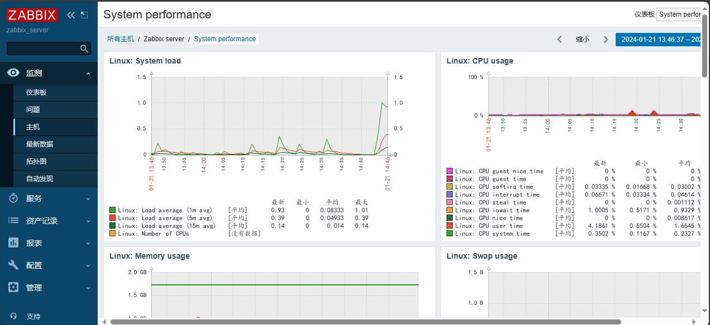
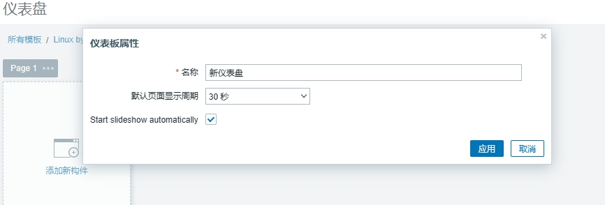
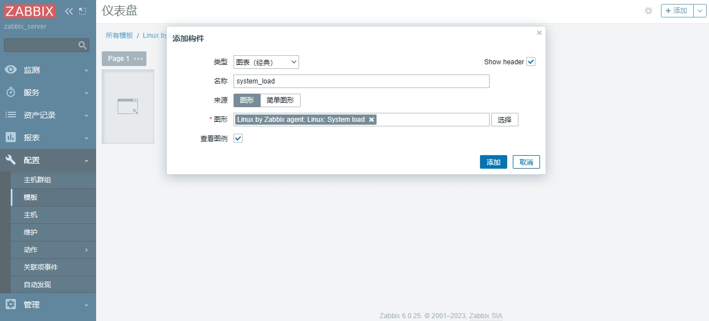
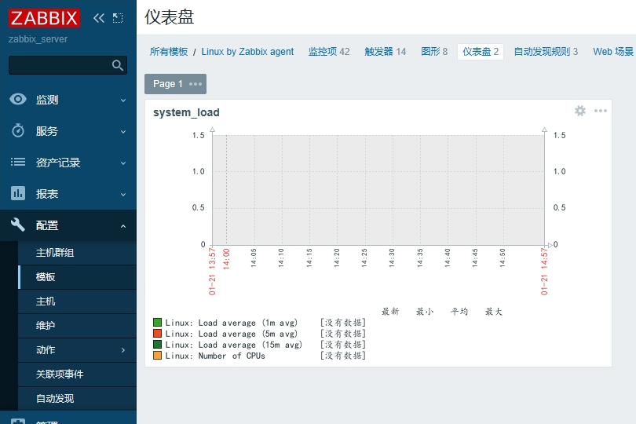
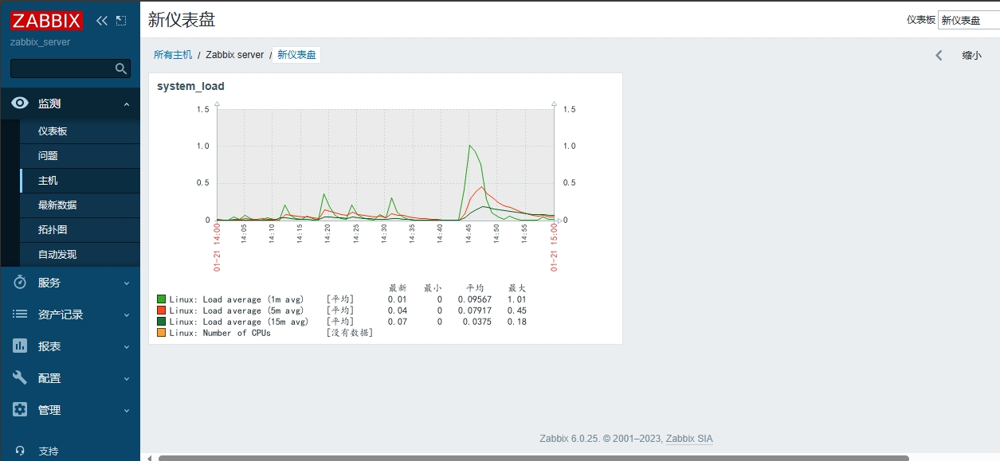

## 仪表盘（聚合图形）

> 提示：
>
> 在zabbix6.0版本中，没有聚合图形功能，替代功能是”仪表盘“

在一个页面显示多个数据图标，方便了解多组数据

### 创建仪表盘

配置 > 模板 > 仪表盘 > 创建仪表盘

#### 设置仪表盘属性

* 默认页面显示周期：页面数据刷新间隔

#### 添加构建

重要选项简介：

* 类型
  * 有图形原型，Item value， URL，图表（经典），文本，时钟可选
  * 常用的是：图表（经典）。
* 名称：构建显示的名称
* 来源
  * 数据来源
* 监控项：数据来源的监控项

以图表（经典）创建一个单个控件的示例

保存设置，创建完成。

### 查看仪表盘数据

监测 > 主机 > 选择对应主机的仪表盘

右上角可以切换仪表盘

* Owner：使用默认的Admin用户
* Name：名称设置为Web2_host
* Columns：列数设置为2列
* Rows：行数设置为4列

选择刚刚创建的聚合图形（web2_host)

点击后面的构造行数（constructor）

点击Change（更改），设置每行每列需要显示的数据图标

# Reference Links：

#培训视频

https://www.bilibili.com/video/BV1Mb4y1f7JT
