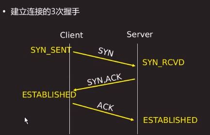
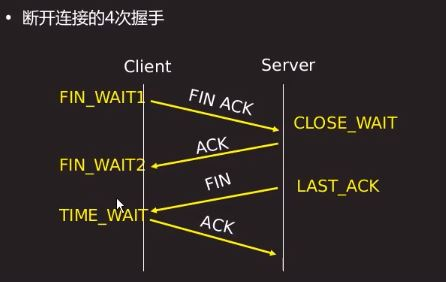
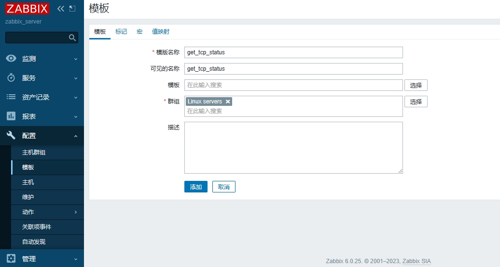
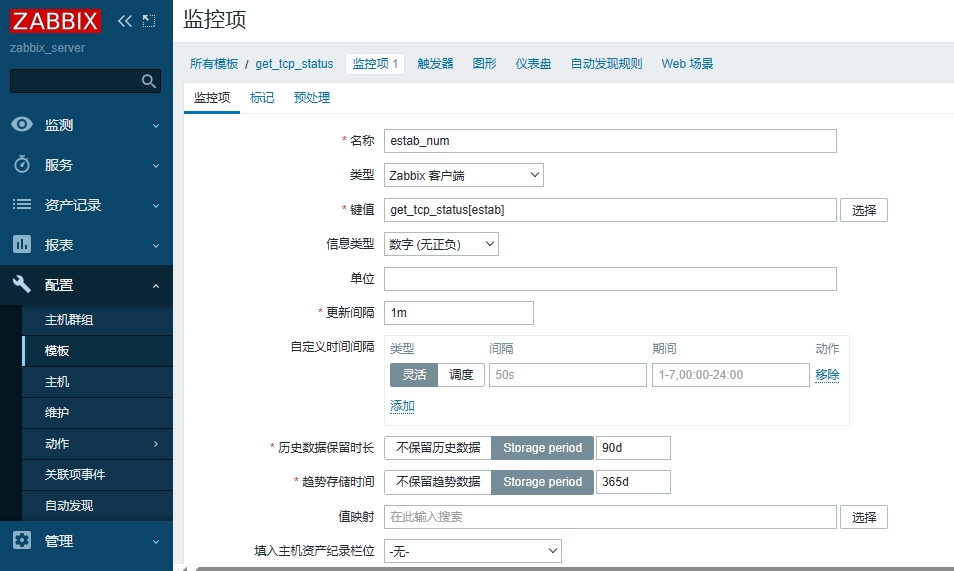
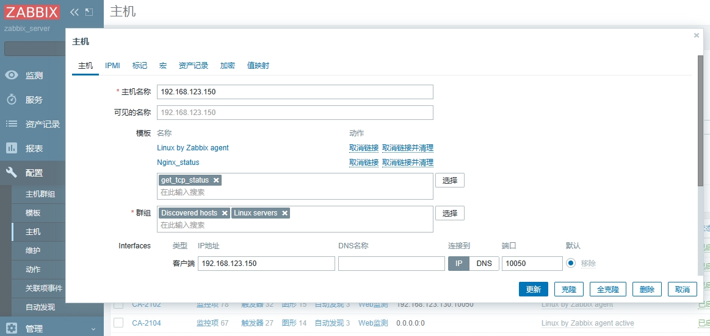

# TCP连接





## TCP 连接的一些常见状态

1. **CLOSED（关闭）：**
   * 初始状态或连接终止后的状态。在这个状态下，连接未建立或已经被关闭。
2. **LISTEN（监听）：**
   * 服务器正在等待来自客户端的连接请求。在这个状态下，服务器已经绑定到了一个端口并在等待客户端连接。
3. **SYN_SENT（同步已发送）：**
   * 客户端已发送连接请求（SYN），等待服务器的确认。
4. **SYN_RECEIVED（同步已接收）：**
   * 服务器已收到客户端的连接请求，并已回复一个确认（SYN-ACK）。
5. **ESTABLISHED（已建立）：**
   * 连接已经建立，数据可以在客户端和服务器之间传输。
6. **FIN_WAIT_1（等待对方的连接结束）：**
   * 连接方已经关闭连接，等待对方的确认。在这个状态下，一方（通常是客户端）发送了连接结束（FIN）。
7. **FIN_WAIT_2（等待对方的连接结束）：**
   * 等待对方发送连接结束（FIN）。在这个状态下，另一方已经确认了连接结束（ACK）。
8. **CLOSE_WAIT（等待关闭）：**
   * 已收到对方发送的连接结束（FIN），正在等待本地应用程序关闭连接。
9. **CLOSING（关闭中）：**
   * 双方都已发送连接结束（FIN），等待对方的最后确认。
10. **LAST_ACK（最后确认）：**
    * 本地已经发送连接结束（FIN）并接收到对方的确认，正在等待对方的最后确认。
11. **TIME_WAIT（时间等待）：**
    * 连接已经关闭，但是在等待一段时间，以确保在网络中的所有分组都被正确处理。这是为了处理可能在网络中滞留的未确认分组。

# 自定义监控命令编写

监控TCP状态的示例脚本（未检测完整状态）

```
#!/bin/bash
case $1 in
estab)
    ss -antp | awk 'BEGIN{ X=0 }/^ESTAB/{ x++ } END{ print x }';;	#如果没有相关连接则返回0
close_wait)
    ss -antp | awk 'BEGIN{ X=0 }/^CLOSE-WAIT/{ x++ } END{ print x }';;
time_wait)
    ss -antp | awk 'BEGIN{ X=0 }/^CLOSE-WAIT/{ x++ } END{ print x }';;
esac
```

### 更改配置文件

```
sudo vim /etc/zabbix/zabbix_agentd.d/get_tcp_status.conf
UserParameter=get_tcp_status[*],/etc/zabbix/scripts/get_tcp_status.sh $1
```

更改完成后，重启agent服务

```
systemctl stop zabbix-agent
systemctl start zabbix-agent
```

### 测试脚本

```
zabbix_get -s 127.0.0.1 -k get_tcp_status[estab]
#返回结果
476
```

# 配置Server端监控项

## 添加监控模板



## 配置监控项



## 主机链接监控模板



## 查看监控数据

能够监测到数据，说明配置正常


# 扩展思考

mysql（mysqladmin命令）

* 并发连接数
* 慢查询
* 增删改查数量

NoSQL数据库（数据库状态）

php-fpm（生成status页面）

* 并发，队列，进程数量等

tomcat（服务器状态）

硬件设备（交换机，路由器等）

* 一般通过SNMP监控
