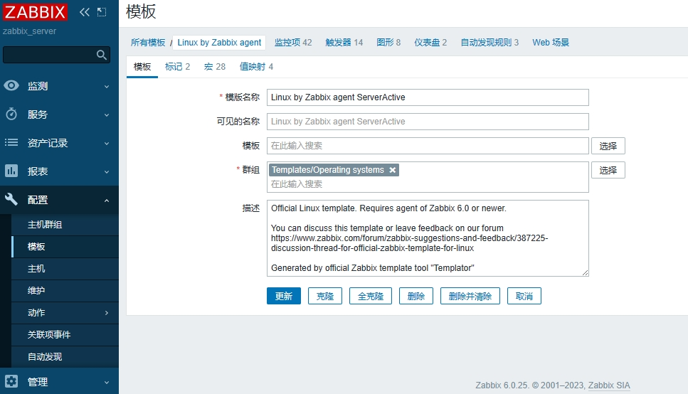
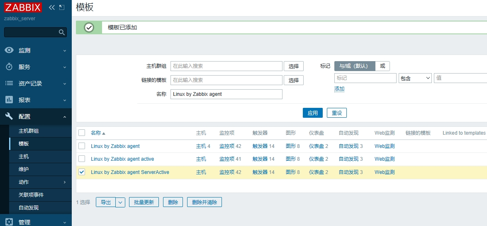
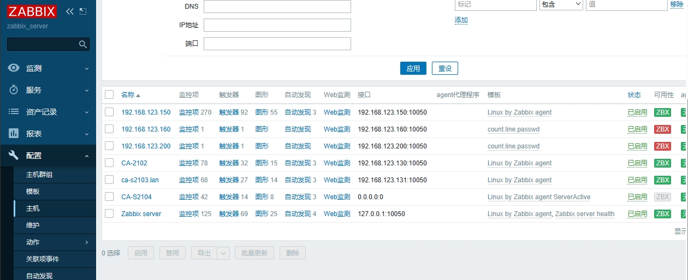

## 主被动监控简介

* 主动和被动给都是对被监控端主机而言的
* 默认zabbix采用的是被动监控
  * 被动监控：Server向Agent发起连接，发送监控key，Agent接受请求，响应监控数据
  * 主动监控：Agent向Server发起连接，Agent请求需要监测的监控项目列表，Server响应Agent发送一个items列表，Agent确认收到监控列表，TCP连接完成，会话关闭，Agent开始周期性的收集数据。
* 区别：
  * Server不用每次需要数据都连接Agent，Agent会自己收集并处理数据，Server仅需要保存数据即可。
* 当监控主机达到一定量级后，zabbix服务器会越来越慢，可以考虑使用主动监控，释放服务器压力

## 配置主动监控

### 客户端配置

创建新主机

获取zabbix agent下载源并安装

```
sudo vim  /etc/yum.repos.d/epel.repo
#在epel块添加以下内容
[epel]
excludepkgs=zabbix*
```

```
sudo rpm -Uvh https://repo.zabbix.com/zabbix/6.0/rhel/9/x86_64/zabbix-release-6.0-4.el9.noarch.rpm
sudo dnf clean all
```

安装zabbix agent

```
sudo dnf -y install zabbix-agent
```

配置zabbix agent端

```
sudo vim /etc/zabbix/zabbix_agentd.conf
#更改以下配置
Server=127.0.0.1,192.168.123.200	#注释该行
StartAgents=0				#禁止被动监控（有服务进程没有端口）
ServerActive=192.168.123.200:10051		#监控服务器IP，一定要取消127.0.0.1

Hostname=ca-s2104			#告诉监控服务器，是谁发送的数据信息，需要和zabbix服务器配置的监控主机名称一致

RefreshActiveCHecks=120			#默认120秒检测一次
```

启动服务

```
sudo systemctl start zabbix-agent && sudo systemctl enable zabbix-agent
#设置自启
sudo systemctl status zabbix-agent

#查看端口是否开启
sudo ss -lntup | grep zabbix		#无端口返回
ps -aux | grep zabbix			#有服务进程
zabbix   1538103  0.0  0.0  16212   884 ?        S    21:24   0:00 /usr/sbin/zabbix_agentd -c /etc/zabbix/zabbix_agentd.conf
zabbix   1538104  0.0  0.0  16212  2288 ?        S    21:24   0:00 /usr/sbin/zabbix_agentd: collector [idle 1 sec]
zabbix   1538105  0.0  0.0  16472  4628 ?        S    21:24   0:00 /usr/sbin/zabbix_agentd: active checks #1 [idle 1 sec]
```

### 服务器配置

步骤：

* 克隆模板
* 修改监控模式

#### 克隆已有模板

为了方便，克隆系统自带模板

Configuration > Templates > 选择Linux by Zabbix agent  > 点击“克隆全部”，新模板名称Linux by Zabbix agent ServerActive


点击“全克隆”，然后更改模板名称为：Linux by Zabbix agent ServerActive 。然后添加即可。




成功添加克隆模板，如下图：



#### 修改监控模式

将模板中的所有监控项目全部修改成主动监控模式

Configuration > Templates > 选择新克隆的模板，点击后面的 Items（监控项）> 点击全选，点击批量更新 >将类型修改为：Zabbix agent（Active主动模式）

点击进入“Linux by Zabbix agent ServerActive”这个模板，全选监控项，点击批量更新。


将“类型”更改成：Zabbix客户端（主动式）

~~设置“更新间隔”成灵活调度模式，间隔：50s，期间：1-7,00:00-24:00~~


> ~~注意：~~
>
> ~~如果不设置更新间隔，则会报错：~~
>
> ~~监控项不会刷新。指定的更新间隔要求至少具有一个灵活或调度间隔。~~

更改完成后，监控项的类型变成了：Zabbix客户端(主动式)。说明更改成功


> 提示：
>
> 有些其他模板的监控项虽然设置成了"Zabbix客户端(主动式)" ，但并不会生效。因为这些设置不支持主动模式。

停用不支持主动模式的监控项，如下：

* Linux: Zabbix agent ping
* Linux: Zabbix agent availability
* Linux: Version of Zabbix agent running

> 不止以上三项


#### 添加监控主机

步骤：

* 添加被监控的主机（主动模式）
* 为主机添加监控模板

添加被监控的主机

* 名称：ca-s2104。将主机添加到Linux server组
  * 必须与被监控端的配置文件Hostname一致
* IP地址为：0.0.0.0
* 端口为：0
  * 不填写IP无法创建成功


添加成功，列表出现CA-S2104



#### 选择监控模板

为主机添加监控模板

选择刚刚创建的模板（主动模式） > 添加连接模板到主机

（刚刚在设置监控主机时，已一起设置了监控模板)


#### 查看数据图标

Monitoring > Graphs > 选择要查看的主机组，主机以及图形


> 提示：
>
> 配置完成后可能并不会立即刷新显示全部数据，有些数据会过很久才显示。
