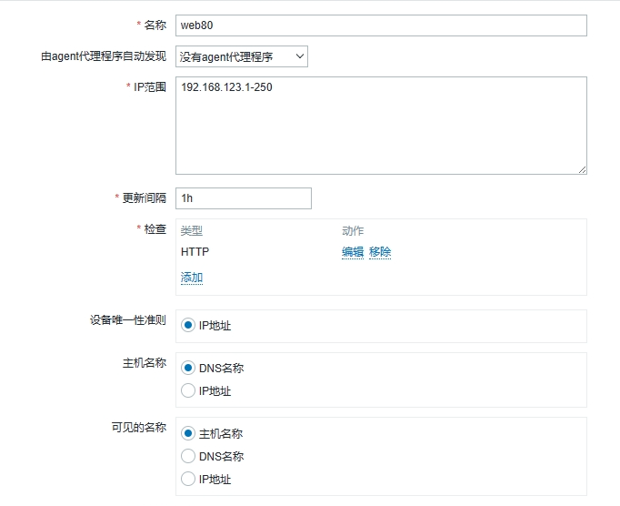
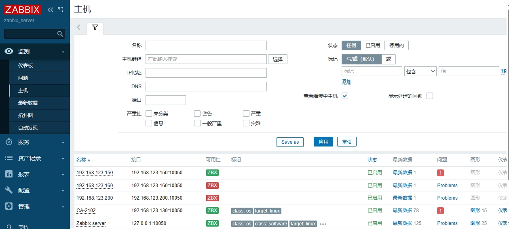

# 自动发现

当Zabbix需要监控的设备越来越多，手动添加监控设备效率太低，此时可以考虑使用自动发现功能

## 自动发现实现的功能：

发现主机、添加主机、添加主机到组、链接模板等

## 自动发现（Discovery）流程

* 创建自动发现规则
* 创建Action动作（发现主机后自动执行什么动作）
* 通过动作，执行添加主机，链接模板到主机等操作

## 创建自动发现规则

"Configuration > Discovery > Create discovery rule"

### 填写规则：

* 名称：唯一不重复
* IP范围：自动发现的IP范围（逗号隔开可以写多个）
* 更新间隔：多久做一次自动发现（默认为1小时，此实验修改为1m）
* 检查：通过HTTP，FTP，Agent的自定义key等方式检查

添加成功

### 创建动作

"Configuration > Actions > Event source(Discovery) > Create action"

* 添加动作名称，添加触发动作的条件
* 操作（触发动作后要执行的操作指令），操作细节如下：
  * 添加主机到组，与模板链接（HTTP模板）

添加动作

添加操作

自动发现规则创建完成

## 测试自动发现功能

* 创建一台新主机，按照上面的zabbix客户端步骤安装agent，检查是否可以自动发现该主机
* 登录zabbix服务器的web页面，查看是否已经生成该主机

添加了一台 IP为 192.168.123.150 的主机，下图显示自动发现并成功添加

> 注意点：
>
> 1. 自动发现功能需要网络内有DNS服务器解析主机名，没有的话，需要手动更改host
> 2. 配置完自动发现后，可能很久才能识别(发现)主机，如果长时间不识别主机，可以删除就的自动发现并重新配置

## 拓扑图

* 绘制图谱图可以快速了解服务器架构
* 告警信息可以显示在拓扑图的设备图标上

告警信息显示示例：

以下途中有2个告警：

* over_user_num_01
* Linux:High swap space usage(less than 50% free)

> 提示
>
> zabbix安装后默认自带一个拓扑图，可以删除，自己重新创建

### 创建一个新的拓扑图

Monitoring > Maps(拓扑图) > 创建拓扑图

只需要填写名称，然后“添加”即可。

### 为拓扑图添加设备

Monitoring > Maps(拓扑图) > 点击对应拓扑图的“构造函数”

功能简介：

* 添加：可以添加各种组件的图标，如：云，服务器，工作站，交换机，路由器，防火墙等。
* 形状：方框，可调整成不同形状。
* 网格：背景XY坐标网格，默认显示，可以关闭，也可以调整网格大小。

示例：

地图元素：

* 类型：
  * 图片，主机拓扑图，触发器，主机群组
* 标记：
  * 组件的显示名称
* 图标：
  * 更改组件外观：云，服务器，工作站，交换机，路由器，防火墙等。

# Reference Links：

#培训视频

https://www.bilibili.com/video/BV1Mb4y1f7JT

#笔记参考

https://github.com/adampielak/zabbix-notes
