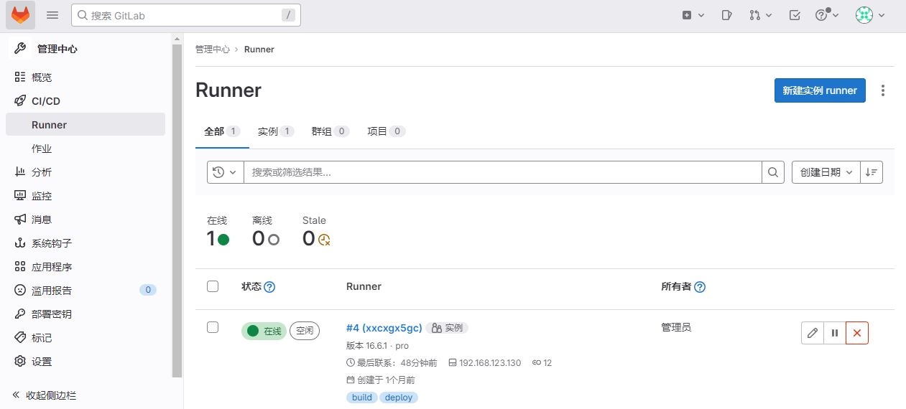
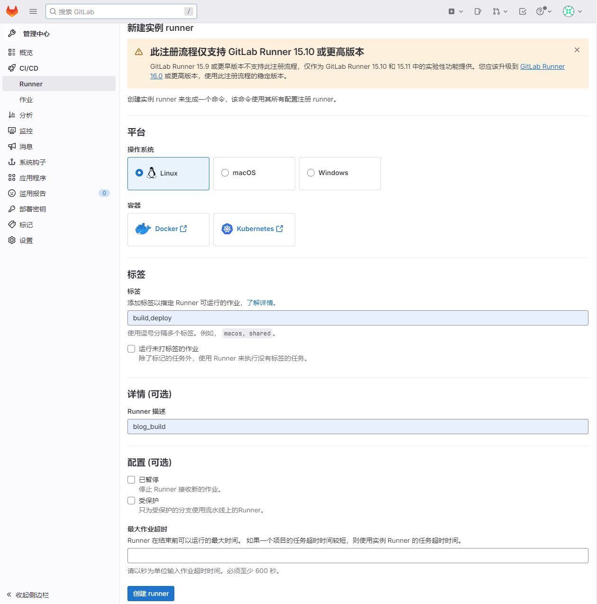
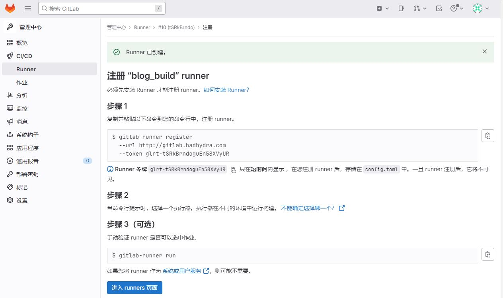
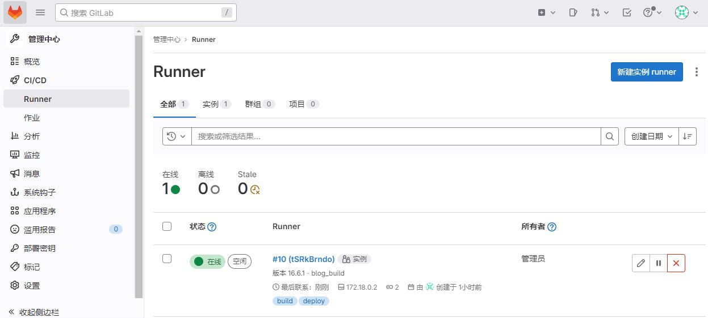
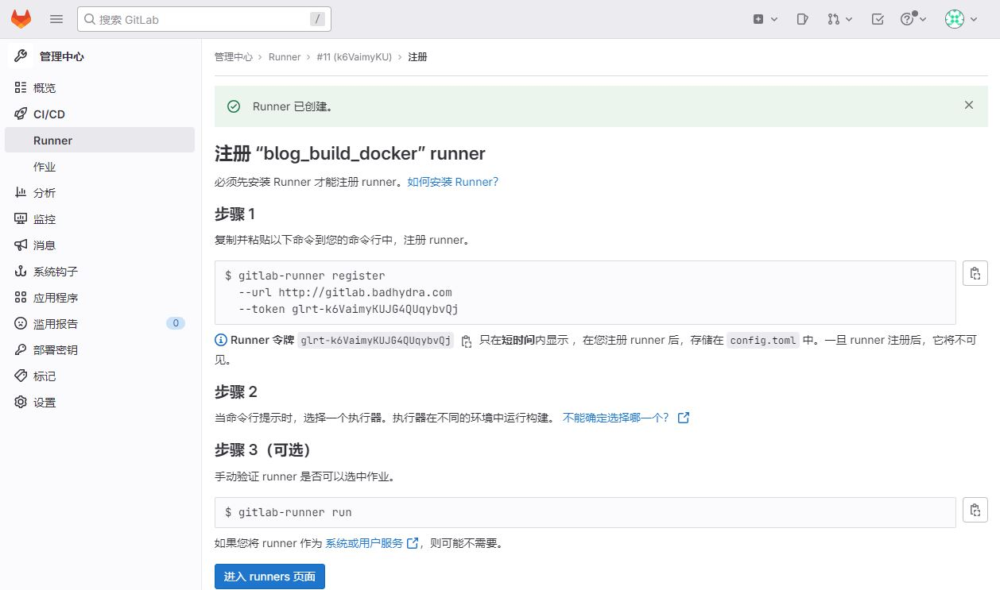
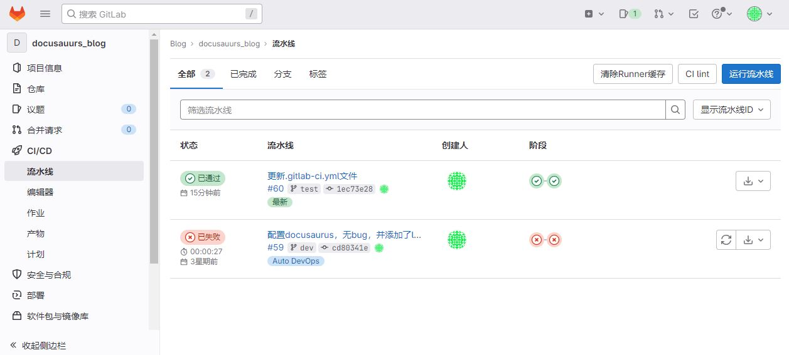
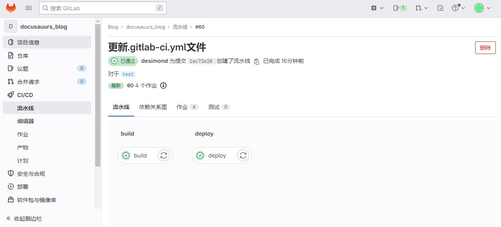
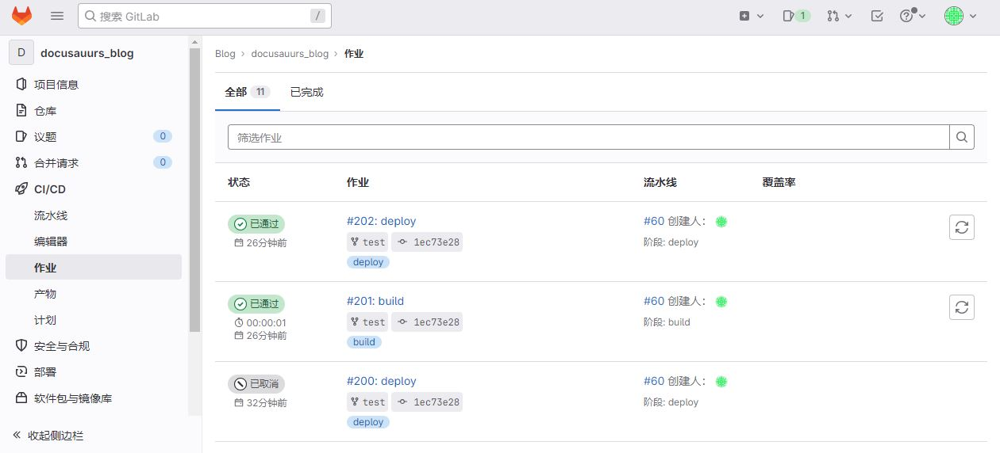
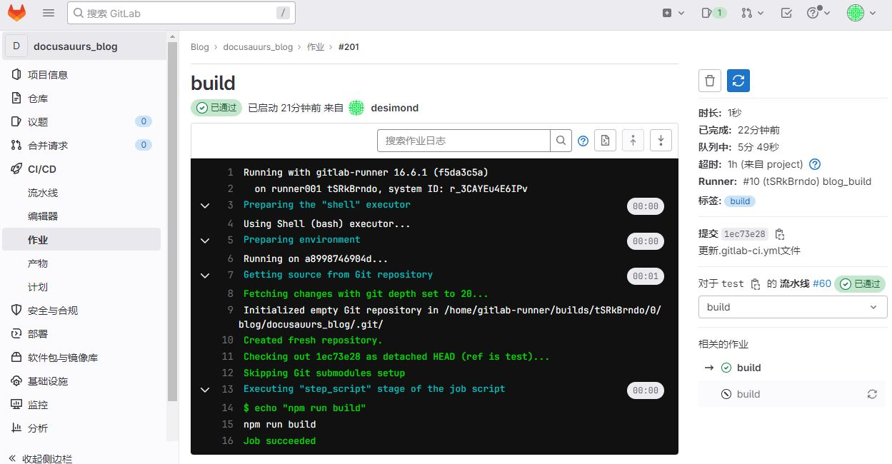
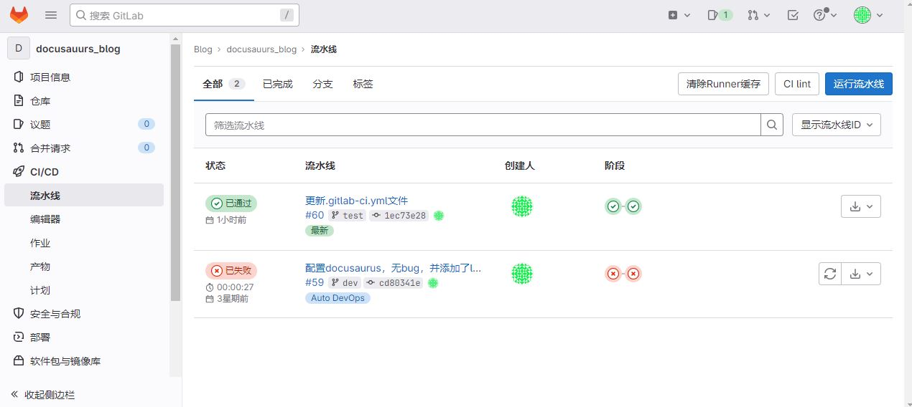

# 简介

CI/CD 代表 **持续集成（Continuous Integration）**和 **持续交付（Continuous Delivery）**的缩写。这是一种软件开发实践，旨在通过自动化和频繁的代码集成、测试以及部署，提高软件开发的效率和质量。

1. **持续集成（Continuous Integration，CI）：** 开发人员在代码仓库中提交代码时，自动触发构建和测试过程。这有助于确保新代码与现有代码协同工作，并且不会引入破坏性的错误。持续集成的目标是频繁地整合代码，以便及早地发现和解决问题。
2. **持续交付（Continuous Delivery，CD）：** 一旦代码通过了持续集成的测试阶段，它可以自动地部署到测试环境或者生产环境中。持续交付的目标是确保软件随时都可以交付给用户，以便快速响应需求变化。
3. **持续部署（Continuous Deployment）：** 这是 CI/CD 中的一种更进一步的实践，它涉及到将通过持续集成和持续交付的代码自动部署到生产环境，从而使新功能和改进可以立即被最终用户使用。

# GitLab CI/CD

GitLab CI/CD 是 GitLab 提供的一套集成的持续集成和持续交付工具，用于自动化构建、测试和部署应用程序。它与 GitLab 的源代码仓库集成在一起，为开发团队提供了在代码提交时自动执行各种操作的能力。GitLab CI/CD 可以帮助团队加速软件交付流程，确保代码质量，以及简化部署过程。

## 主要组成

* **Runner：** 用于执行构建和部署的运行时环境，可以在不同的操作系统和架构上运行。GitLab Runner 通过与 GitLab 服务器通信，接收作业（Job）并执行相应的操作。
* **Pipeline：** 定义了一系列的阶段（Stages）和作业（Jobs），用于描述 CI/CD 流水线。流水线中的每个阶段和作业都可以执行一系列的操作，例如构建、测试、部署等。
* **Artifact：** 构建过程中生成的中间产物，可以被传递到后续的作业中，或者存储供后续的部署使用。

## 工作原理

1. **触发器：** CI/CD 流水线的开始通常由代码仓库中的代码提交触发。这可以是通过开发人员直接提交代码，或者是通过合并请求（Merge Request）的方式。当有新的提交或合并请求时，GitLab 触发 CI/CD 流水线的执行。
2. **流水线定义：** CI/CD 流水线由一系列的阶段（Stages）和作业（Jobs）组成，这些定义在代码仓库中的 `.gitlab-ci.yml` 配置文件中。该文件描述了每个阶段和作业的执行步骤、依赖关系和其他配置。
3. **Runner 的注册和选择：** 在 CI/CD 流水线执行之前，需要有至少一个 GitLab Runner 注册到 GitLab 服务器。Runner 可以是直接运行在物理机器上，也可以是运行在容器中。当 CI/CD 流水线触发时，GitLab 会选择一个可用的 Runner 来执行流水线中的作业。
4. **作业执行：** 流水线中的作业会按照定义的顺序依次执行。每个作业运行在独立的环境中，可以包括构建、测试、部署等步骤。Runner 负责从代码仓库获取代码，执行作业，并将结果报告回 GitLab 服务器。
5. **Artifact 的传递：** 在作业执行过程中，可以生成一些中间产物（Artifact），比如编译后的二进制文件、打包后的应用程序等。这些 Artifact 可以被传递给后续的作业，实现流水线中各个阶段之间的数据共享。
6. **持续集成（CI）阶段：** 在 CI 阶段，通常会包括代码编译、单元测试、代码静态分析等操作。这有助于确保新代码的质量，并及早地发现潜在的问题。
7. **持续交付（CD）阶段：** 如果 CI 阶段通过，流水线可以进入 CD 阶段。这个阶段可能包括集成测试、部署到预生产环境、自动化测试等。如果一切顺利，代码可以自动地部署到生产环境。
8. **通知和报告：** 在整个流水线执行完成后，GitLab CI/CD 会生成相应的报告，包括每个作业的执行结果、代码覆盖率、部署状态等。这些报告可以通过 GitLab 的界面查看，也可以通过邮件等方式通知相关的团队成员。
9. **自动化和反馈循环：** 整个流水线的自动化过程不仅提高了软件交付的效率，还为团队提供了及时的反馈。如果有问题出现，团队可以及时修复，并迅速重新触发 CI/CD 流水线。

# **GitLab Runner**

## 简介

GitLab Runner 是 GitLab CI/CD 的执行引擎，负责运行 CI/CD 流水线中定义的作业。它可以在不同的环境中运行，包括本地开发机、云服务、容器等。Runner 会与 GitLab 服务器通信，接收作业并执行相关的操作。

## 主要特点

1. **容器化支持：** Runner 可以在容器中运行，支持 Docker 和 Kubernetes。这使得它能够轻松地与容器化的应用程序和微服务架构集成，实现更好的灵活性和资源隔离。
2. **并行执行：** GitLab Runner 允许并行执行多个作业，提高了整个 CI/CD 流水线的效率。它能够在多个执行环境中同时运行作业，从而更快地完成构建、测试和部署等任务。
3. **作业的隔离性：** 每个作业都在独立的环境中运行，防止不同作业之间相互影响。这种隔离性确保了 CI/CD 流水线中的安全性和可靠性。
4. **Artifact 支持：** Runner 可以传递构建过程中生成的 Artifact 给后续的作业。这有助于确保流水线中的各个阶段之间能够有效地共享数据和结果。
5. **灵活的配置：** Runner 的配置可以通过 GitLab CI/CD 的配置文件进行定义。这种灵活性使得 Runner 能够适应不同的项目和流水线需求。
6. **自动注册：** Runner 支持自动注册到 GitLab 服务器，简化了配置和管理的过程。新的 Runner 可以轻松地加入 CI/CD 系统，而不需要手动的管理步骤。
7. **缓存机制：** Runner 支持缓存构建过程中的依赖项，减少了构建时间。通过智能地使用缓存，Runner 能够更加高效地执行作业。

## 主要功能

* **执行作业：** 根据 GitLab CI/CD 流水线的定义，Runner 在相应的环境中执行各个作业，例如构建、测试、部署等。
* **环境隔离：** 每个作业都运行在独立的环境中，防止不同作业之间的相互影响。
* **Artifact 传递：** 将产生的 Artifact（例如编译后的二进制文件、打包后的应用程序等）传递给后续的作业，确保流水线中各个阶段的协同工作。R

# 安装gitlab和runner

创建名为 gitlab.yaml 的yaml格式文件，类似如下：

```
version: '3.6'
services:
  gitlab:
    image: 'gitlab/gitlab-ce:latest'
    container_name: gitlab_server
    restart: always
    hostname: 'gitlab.badhydra.com'		#主機名，請確認DNS可以正確解析
    networks:
      gitlab_network:
    environment:
      GITLAB_OMNIBUS_CONFIG: |
        external_url 'https://gitlab.badhydra.com'
        # Add any other gitlab.rb configuration here, each on its own line
    ports:
      - '88:80'
      - '4433:443'
      - '2205:22'
    volumes:
      - '/data/app/gitlab/conf:/etc/gitlab'	#用于存储应用程序数据
      - '/data/app/gitlab/logs:/var/log/gitlab'	#用于存储日志
      - '/data/app/gitlab/data:/var/opt/gitlab'	#用于存储 GitLab 配置文件
    shm_size: '128m'

  gitlab-runner:
    image: 'gitlab/gitlab-runner:latest'
    container_name: gitlab_runner
    restart: always
    networks:
      gitlab_network:
    volumes:
      - /var/run/docker.sock:/var/run/docker.sock
      - /data/app/gitlab_runner/conf/:/etc/gitlab-runner

networks:
    gitlab_network:
```

使用docker compose运行 gitlab_runner.yaml

```
docker compose -f ./gitlab_runner.yaml up -d
```

#安裝過程可能需要幾分鐘，可以使用 docker logs 查看

```
docker logs -f gitlab_server
docker logs -f gitlab_runner
```

## 登录gitlab

查看gitlab的密碼

```
docker exec -it gitlab_server grep 'Password:' /etc/gitlab/initial_root_password
```

使用浏览器登录gitlab

```
http://gitlab.xxxx.com		#内网可以用IP登录 http://xxxxxx:88
#账号：root
#密码：initial_root_passwd返回的密码
```

# 类型和状态

### 类型

1. **Shared Runner（共享 Runner）：**
   * 共享 Runner 是由 GitLab 提供并在多个项目之间共享使用的 Runner。这种类型的 Runner 适用于小型团队或者对资源要求较低的项目。
   * 简单易用，无需为每个项目单独配置 Runner。
2. **Specific Runner（特定 Runner）：**
   * 特定 Runner 是为特定项目配置的 Runner，其资源和配置仅供该项目使用。每个项目可以配置自己的特定 Runner。
   * 可以根据项目的需要进行定制化配置，独立的资源隔离。
3. **Group Runner（组 Runner）：**
   * 组 Runner 是为 GitLab 项目组配置的 Runner，可以在项目组内的所有项目中共享使用。
   * 适用于需要在项目组内多个项目之间共享资源的情况。
4. **Instance-level Runner（实例级别 Runner）：**
   * 实例级别 Runner 是配置在整个 GitLab 实例上的 Runner，可供所有项目使用。
   * 可以为整个 GitLab 实例提供全局性的 Runner，适用于大型企业级部署。

### 状态

1. **Active（活跃）：**
   * Runner 处于活跃状态表示它可以接收并执行作业。这是正常运行状态。
2. **Paused（暂停）：**
   * Runner 处于暂停状态表示它不会接收新的作业。可以通过暂停 Runner 来阻止新的作业执行，但不影响已经在运行的作业。
3. **Locked（锁定）：**
   * Runner 处于锁定状态表示它被管理员手动锁定，不接收新的作业。这可能是由于维护、升级或其他管理操作而导致的。
4. **Untagged（未标记）：**
   * Runner 未被标记为可接收作业的任何特定标签。Untagged Runner 可以接收任意标签的作业。
5. **Tagged（已标记）：**
   * Runner 被标记为可接收特定标签的作业。标签通常用于指定某个作业需要在具有特定特性的 Runner 上执行。
6. **Online（在线）/Offline（离线）：**
   * Runner 处于在线状态表示它可以接收作业，处于离线状态表示它不能接收作业。这反映了 Runner 是否能够正常连接到 GitLab 服务器。

# Runner注册

之前步骤中我们已经安装完gitlab 和 runner了。

**步骤：**

1. 创建 runner
2. 注册 runner

## 创建runner

管理员 > 管理中心 > CI/CD > Runner > 新建实例 Runner



### 新建一个 runner

**关键项简介：**

* 标签：build,deploy
  * 标签允许在 CI/CD 配置中指定某个作业（Job）应该由带有特定标签的 Runner 执行。这样可以使你的 CI/CD 流水线更加灵活，能够根据不同的需求选择合适的 Runner
  * 可以通过标签将 Runner 分类，以便更精细地控制资源的分配和利用。
  * 标签可以是任何字符串，但最好遵循一致的命名规范，以方便管理和理解。
  * Runner 可以分配多个标签。这样，一个 Runner 可以被多个不同的作业选择，只要这些作业在 CI/CD 配置中指定了相应的标签。
  * 标签在创建runner后可以再次更改。



创建成功，显示如下信息，复制保存生成的信息，如下：

```
#注册命令
gitlab-runner register  --url http://gitlab.badhydra.com  --token glrt-tSRkBrndoguEn58XVyUR

#runner令牌
glrt-tSRkBrndoguEn58XVyUR
```

> 注意：
>
> runner令牌要妥善保存。



## 注册 Runner

### 注册shell类型runner

进入gitlab_runner 容器

```
sudo docker exec -it gitlab_runner  /bin/bash
```

输入获得的注册命令

参数选择：

* name：runner001
* executor：shell
  * 配置文件保存位置：/etc/gitlab-runner/config.toml
  * executor可以通过更改配置文件更改

```
gitlab-runner register  --url http://gitlab.badhydra.com  --token glrt-tSRkBrndoguEn58XVyUR
#交互信息
Runtime platform                                    arch=amd64 os=linux pid=99 revision=f5da3c5a version=16.6.1
Running in system-mode.  
                 
Enter the GitLab instance URL (for example, https://gitlab.com/):
[http://gitlab.badhydra.com]: 
Verifying runner... is valid                        runner=tSRkBrndo
Enter a name for the runner. This is stored only in the local config.toml file:
[a8998746904d]: runner001
Enter an executor: docker-autoscaler, docker+machine, custom, docker, parallels, shell, ssh, virtualbox, instance, docker-windows, kubernetes:
shell
Runner registered successfully. Feel free to start it, but if it's running already the config should be automatically reloaded!
 
Configuration (with the authentication token) was saved in "/etc/gitlab-runner/config.toml" 
```

### 验证是否注册成功

登录gitlab web页面，查看 Runner 状态，注册成功的话会显示 在线，类似下图：



### 注册docker类型runner

在gitlab web 页面新建一个runner



进入gitlab_runner 容器

```
sudo docker exec -it gitlab_runner  /bin/bash
```

输入获得的注册命令

* name：runner002
* executor：docker
* Docker image：docker:stable

```
gitlab-runner register  --url https://gitlab.badhydra.com  --token glrt-k6VaimyKUJG4QUqybvQj
#交互信息
Runtime platform                                    arch=amd64 os=linux pid=606 revision=f5da3c5a version=16.6.1
Running in system-mode.              
                                     
Enter the GitLab instance URL (for example, https://gitlab.com/):
[http://gitlab.badhydra.com]: 
Verifying runner... is valid                        runner=k6VaimyKU
Enter a name for the runner. This is stored only in the local config.toml file:
[a8998746904d]: runner002   
Enter an executor: custom, ssh, virtualbox, docker-autoscaler, instance, kubernetes, docker, docker-windows, parallels, shell, docker+machine:
docker
Enter the default Docker image (for example, ruby:2.7):

Enter the default Docker image (for example, ruby:2.7):
docker:stable
Runner registered successfully. Feel free to start it, but if it's running already the config should be automatically reloaded!
 
Configuration (with the authentication token) was saved in "/etc/gitlab-runner/config.toml" 
```

更改特权模式

要启动构建和服务容器，需要使用 `privileged` 模式，可以在runner配置文件config.toml中开启特权模式

```
sudo vim /data/app/gitlab_runner/conf/config.toml
#修改privileged
  [runners.docker]
    tls_verify = false
    image = "docker:stable"
    privileged = true			#将false修改成true
```

## 非交互式创建 Runner

在完成创建 Runner 容器之后注册，类似以下操作：

```
sudo gitlab-runner register \
  --non-interactive \
  --url "https://gitlab.badhydra.com/" \	#地址
  --token "$RUNNER_TOKEN" \			#Runner令牌
  --executor "shell" \				#执行器为shell
  --docker-image alpine:latest \
  --description "docker-runner"
```

或者可以在创建 Runner docker时 同时注册 Runner，类似以下操作：

```
docker run --rm -v /srv/gitlab-runner/config:/etc/gitlab-runner gitlab/gitlab-runner register \	#挂载目录
  --non-interactive \
  --executor "docker" \			#执行器为docker
  --docker-image alpine:latest \
  --url "https://gitlab.badhydra.com/"\	#地址
  --token "$RUNNER_TOKEN" \		#Runner令牌
  --description "docker-runner"
```

> 说明：
>
> 更详细的注册操作可以查看文末的官网文档链接

# 示例：运行一个流水线

## 创建CI文件

**步骤：**

1. 在项目根目录创建一个名为：.gitlab-ci.yml 的yml格式的文件，复制以下内容。
2. 将添加了 .gitlab-ci.yml 文件的代码 push 到 gitlab 上。

```
#.gitlab-ci.yml
stages:
  - build
  - deploy

build:
  stage: build
  tags:
    - build			#带有该标签的runner会执行该阶段操作
  only:
    - test			#只构建test这个分支
  script:
    - echo "npm run build"	#输出一句话

deploy:
  stage: deploy
  tags:
    - deploy
  only:
    - test
  script:
    - echo "hello deploy"
```

### 关键项简介

```
stages:
  - build
  - deploy
```

* `stages`：定义流水线阶段。上述代码分别是 `build` 和 `deploy`。流水线会按照这两个阶段的顺序执行，先执行 `build` 阶段，然后再执行 `deploy` 阶段。

```
build:
  stage: build
  tags:
    - build
  only:
    - test			#只构建test这个分支
```

* `build`：定义了 `build` 阶段中的一个作业（job），名为 `build`。
* `tags`：该作业属于 `build` 阶段，使用了 `build` 标签，表示只有带有 `build` 标签的 Runner 才会执行这个作业。
* `only: - test` 表示只有在 `test` 分支上的提交（push）触发时才会执行这个作业。其他分支上的提交不会触发 `build` 阶段的这个作业。
* `script` 下面的命令 `echo "npm run build"` 表示在执行这个作业时运行的命令

> 注意：
>
> * CI 文件名称必须是：.gitlab-ci.yml
> * CI 文件后缀必须是 ：yml ，不能是 yaml

## 查看流水线信息

### 流水线状态

push代码后，会自动调用runner运行流水线。

登录 gitlab 网页查看流水线状态，如下图，#60 这个编号流水线是刚刚推送的代码，状态是已通过，说明编写的 CI 文件 没问题。

* 状态：
  * 已通过，说明运行正常。
  * 已失败，说明流水线配置有问题。



### 流水线图示

点进流水线可以查看到流水线图示信息，如下图：



## 查看作业信息

### 作业状态

进入”CI/CD > 作业 “可以查看每个作业的状态信息



### 作业详细信息

点击对应作业可以查看该作业的详细操作信息



# 流水线语法

## 语法检查工具

gitlab自带CI语法检查工具：CI Lint

CI/CD > 流水线 > 右上角有 CI Lint 选项



## 具体语法

### **job**

* 定义了流水线中的一个作业（也叫任务或阶段），它包含了要执行的一系列操作和指令。
* 一个文件中可以定义多个作业。
* 每个作业必须具有唯一的名称（不能使用关键字）。
* 每个作业是独立执行的。
* 每个作业至少要包含一个script。

### script

* 是 Job 中要执行的命令列表，可以是shell或者脚本。

一个简单的 Job 定义如下：

```
my_job:
  tags:
    - my_tag
  script:
    - echo "Hello, this is my job!"
    - npm install
    - npm run build
```

* `my_job` ：是 Job 的名称，你可以自定义。
* **`tags`：** 指定用于执行该 Job 的 Runner 的标签。只有带有指定标签的 Runner 才能执行这个 Job。
* **`script`** ：在这个例子中，有三条命令。

### before_script 和 after_script

#### before_script

* 用于指定在每个作业开始执行之前都要运行的脚本。这通常用于配置环境、设置变量、安装依赖等操作。
* 每个作业都会在执行 `before_script` 中定义的脚本之前运行。
* `before_script`失败将导致整个作业失败，其他作业将不再执行。

```
before_script:
  - echo "This script runs before each job."	#打印信息
  - export MY_VARIABLE="some_value"		#设置一个环境变量 `MY_VARIABLE` 的值
```

#### after_script

* 用于指定在每个作业完成执行之后都要运行的脚本。这通常用于清理工作、收集日志、或者其他一些善后操作。
* 每个作业都会在执行 `after_script` 中定义的脚本之后运行。
* 指定的脚本将在新的shell中执行，与任何 `after_script` 或 `script` 脚本分开。
* 作业失败不会影响到 `after_script` 运行。

```
after_script:
  - echo "This script runs after each job."	#打印信息
  - rm -rf temp_directory			#删除一个临时目录
```

#### 组合使用

`before_script` 和 `after_script` 可以与每个作业的独立 `script` 部分组合使用。例如：

```
before_script:
  - echo "Setting up environment..."

build:
  script:
    - echo "Building..."
  after_script:
    - echo "Cleaning up after build."

test:
  script:
    - echo "Testing..."
  after_script:
    - echo "Cleaning up after test."
```

### stages

* 用于定义流水线中的阶段（stages），
* 位于文件的顶层，stages的定义将适用于整个CI/CD 流水线。
* 同意阶段的作业并行运行，不同阶段按照顺序执行。

```
stages:
  - build
  - test
  - deploy
```

在这个例子中，定义了三个阶段：`build`、`test` 和 `deploy`。这些阶段按照定义的顺序将组成整个 CI/CD 流水线的执行阶段。

### pre 和 post

#### pre

* 用于指定在流水线中所有作业执行之前都要运行的脚本，是整个管道第一个运行阶段。
* 这个脚本可以包含在流水线开始前执行的全局设置、环境准备或者其他全局操作。

```
pre:
  - echo "This script runs before any job in the pipeline."
  - apt-get update
  - apt-get install -y some-package
```

在上述例子中，`pre` 部分包含了三条命令，分别是打印信息、更新包管理器和安装某个软件包。这些命令会在流水线中的任何作业执行之前运行。

> 注意：
>
> 作业之前和脚本之前是两种概念，作业位于脚本前。

#### post

* 用于指定在流水线中所有作业执行之后都要运行的脚本，是整个管道最后一个运行阶段。
* 这个脚本可以包含在流水线结束后执行的全局清理、报告收集或其他全局善后操作。

#### 注意点：

* pre 和 post 的顺序无法更改。
* 如果仅包含 pre 或 post 阶段的作业，则不会创建管道。

### stage

* 是用于为作业（job）指定所属阶段的关键字。
* 每个作业必须属于一个阶段，而 `stage` 关键字允许你明确指定每个作业所属的阶段。
* 同一stage作业可以并行执行。

```
build:
  stage: build
  script:
    - echo "Building..."
```

在上述例子中，`build` 作业明确指定了它所属的阶段是 `build`。这样，它将在 `build` 阶段执行。

#### stages 和 stage 差别

* **`stages` 是全局定义：** `stages` 关键字应该位于 `.gitlab-ci.yml` 文件的顶层，它决定了整个 CI/CD 流水线的执行顺序和结构，对整个文件生效。
* **`stage` 是作业级别定义：** `stage` 关键字是用于为每个作业指定所属的阶段，它是在作业级别使用的，用于定义该作业在流水线中的执行顺序。

### variables

* 用于定义全局或作业级别的环境变量。这些变量可以在作业脚本中使用，用于配置和传递参数、密钥等信息。

格式：

* 可以通过 `$VARIABLE_NAME` 或者 `${VARIABLE_NAME}` 的方式引用变量的值。

#### 全局级别的 `variables`：

在 `variables` 下定义的变量将会在整个 CI/CD 流水线中的所有作业中共享。

```
variables:
  GLOBAL_VARIABLE: "global_value"

stages:
  - build
  - test

build:
  stage: build
  script:
    - echo "Building..."
    - echo "Global variable value: $GLOBAL_VARIABLE"

test:
  stage: test
  script:
    - echo "Testing..."
    - echo "Global variable value: $GLOBAL_VARIABLE"
```

在上述例子中，`GLOBAL_VARIABLE` 是一个在整个流水线中都可用的全局变量，可以在 `build` 和 `test` 作业的脚本中使用。

#### 作业级别的 `variables`：

还可以在每个作业下定义作业特定的变量，这些变量仅在当前作业的执行环境中有效。

```
stages:
  - deploy

deploy:
  stage: deploy
  script:
    - echo "Deploying..."
  variables:
    JOB_VARIABLE: "job_value"
```

在这个例子中，`JOB_VARIABLE` 是仅在 `deploy` 作业中有效的变量，可以在 `deploy` 作业的脚本中使用。

### tags

* 用于指定能够执行当前作业的 Runner 标签
* 通过使用 `tags`，可以选择性地将特定的作业分配给带有特定标签的 Runner，以便在不同环境中执行作业。

#### 在作业级别使用 `tags`

```
stages:
  - build

build:
  stage: build
  script:
    - echo "Building..."
  tags:
    - my_runner_tag
```

在上述例子中，`build` 作业指定了一个 `tags` 部分，其中包含一个标签 `my_runner_tag`。这表示只有带有标签为 `my_runner_tag` 的 Runner 才会执行这个作业。其他没有这个标签的 Runner 不会执行该作业。

#### 多个标签的情况

```
stages:
  - deploy

deploy:
  stage: deploy
  script:
    - echo "Deploying..."
  tags:
    - production
    - my_runner_tag
```

在这个例子中，`deploy` 作业指定了两个标签：`production` 和 `my_runner_tag`。只有带有这两个标签的 Runner 才会执行该作业。

#### 使用通配符：

```
stages:
  - test

test:
  stage: test
  script:
    - echo "Running tests..."
  tags:
    - "*-runner"
```

在这个例子中，`test` 作业指定了一个标签，该标签是一个通配符 `*-runner`。这表示所有以 `-runner` 结尾的标签的 Runner 都可以执行该作业。

### allow_failure 和 rules

#### allow_failure

* 它用于指定作业是否允许失败，并且在作业失败时是否继续执行后续的作业。
* 是 GitLab CI/CD 配置文件 `.gitlab-ci.yml` 中作业（job）级别的一个关键字。

```
stages:
  - test
  - deploy

test:
  stage: test
  script:
    - echo "Running tests..."
  allow_failure: true

deploy:
  stage: deploy
  script:
    - echo "Deploying..."
```

在上述例子中，`test` 作业被标记为 `allow_failure: true`。这表示即使 `test` 作业执行失败，整个 CI/CD 流水线也会继续执行后续的作业，例如 `deploy`。通常情况下，如果 `test` 作业失败，整个流水线会被标记为失败，但通过使用 `allow_failure`，你可以允许失败的作业不中断整个流水线的执行。

### 搭配 rules 使用

`allow_failure` 通常与 `rules` 关键字一起使用，以根据某些条件来决定是否允许失败。以下是一个示例：

```
stages:
  - test
  - deploy

test:
  stage: test
  script:
    - echo "Running tests..."
  rules:
    - exists:
        - "*.txt"
  allow_failure: true

deploy:
  stage: deploy
  script:
    - echo "Deploying..."
```

在这个例子中，`test` 作业的 `rules` 中指定了一个条件，即只有当仓库中存在至少一个 `.txt` 文件时，`test` 作业才会执行。如果 `test` 作业由于条件不满足而被跳过，它被标记为允许失败，不会中断整个流水线的执行。

#### 使用场景：

* **非关键性测试：** 当某个作业是一些非关键性的测试，它们的失败不应该中断整个流水线时，可以使用 `allow_failure`。
* **尝试性任务：** 有时你可能希望执行一些可能会失败的任务，但仍希望流水线继续执行。

### when

* 用于指定作业何时执行，可以根据不同的条件来决定作业的触发时机。

```
stages:
  - build
  - test
  - deploy

build:
  stage: build
  script:
    - echo "Building..."

test:
  stage: test
  script:
    - echo "Testing..."
  when: manual

deploy:
  stage: deploy
  script:
    - echo "Deploying..."
```

在上述例子中，`test` 作业的 `when: manual` 意味着这个作业需要手动触发。当流水线执行到 `test` 阶段时，该作业不会自动执行，而是需要手动点击 GitLab 页面上的 "Play" 按钮来触发执行。

#### when 条件：

* **`on_success`：** 当之前的阶段中的所有作业都执行成功时，当前作业才会执行。
* **`on_failure`：** 当之前的阶段中的任何作业执行失败时，当前作业才会执行。
* **`manual`：** 作业需要手动触发，不会自动执行，需要在 GitLab 页面上手动点击 "Play" 按钮。
* **`always`：** 无论之前的阶段中的作业执行成功或失败，当前作业都会执行。
* **自定义条件：** 除了上述内置条件外，你还可以使用自定义条件，例如只有在指定的变量满足特定条件时才执行。

```
#on_success
test:
  stage: test
  script:
    - echo "Testing..."
  when: on_success

#on_failure
test:
  stage: test
  script:
    - echo "Testing..."
  when: on_failure

#manual
test:
  stage: test
  script:
    - echo "Testing..."
  when: manual

#always
test:
  stage: test
  script:
    - echo "Testing..."
  when: always

#自定义条件
test:
  stage: test
  script:
    - echo "Testing..."
  when:
    variables:
      - $CUSTOM_VARIABLE == "true"
```

#### 使用场景：

* **手动触发：** 当作业需要手动触发时，可以使用 `when: manual`。
* **条件触发：** 根据上游作业的成功或失败情况，决定是否触发当前作业。

### retry

* 用于指定作业失败时的重试次数。
* `retry` 只对作业执行失败的情况有效，对于成功的作业不会触发重试。

```
stages:
  - test

test:
  stage: test
  script:
    - echo "Running tests..."
  retry: 3
```

在上述例子中，`test` 作业的 `retry` 设置为 `3`，表示如果该作业在第一次执行时失败，GitLab CI/CD 会自动重试该作业最多 3 次。

#### 自定义重试条件：

你还可以使用 `retry` 关键字结合 `when` 关键字，根据失败时的条件来决定是否重试。

```
stages:
  - test

test:
  stage: test
  script:
    - echo "Running tests..."
  when: always
  retry:
    max: 3
    when:
      - script_failure		#自定义条件有很多，这里仅演示一种
```

在这个例子中，`retry` 设置了最大重试次数为 `3`，且仅在 `when` 为 `script_failure` 时才重试。这意味着只有当作业在执行脚本时失败时，才会触发重试。

> 注意：
>
> * 在使用 `retry` 时，需要注意作业执行所需的时间，以免重试次数过多导致执行时间过长。
> * 可以结合 `allow_failure` 使用，以确保在允许失败的情况下，作业依然可以重试。

### timeout

* 用于设置作业的最大执行时间，值是一个字符串。
* 如果作业在规定的时间内没有完成，GitLab CI/CD 将强制中断作业的执行，并将其标记为超时，值是一个字符串。
* 以下时间单位，
  * 秒（seconds）
  * 分钟（minutes）
  * 小时（hours
* 合理设置 `timeout` 可以防止作业由于某种原因一直挂起，导致流水线长时间占用资源。

```
stages:
  - test

test:
  stage: test
  script:
    - echo "Running tests..."
  timeout: 5 minutes
```

在上述例子中，`test` 作业的 `timeout` 设置为 `5 minutes`，表示该作业的最大执行时间为 5 分钟。如果作业在这个时间内没有完成，GitLab CI/CD 将中断该作业的执行。

#### 无限制的超时

如果你希望某个作业没有超时限制，可以将 `timeout` 设置为 `never`。

```
stages:
  - long_running_job

long_running_job:
  stage: long_running_job
  script:
    - echo "Running a long job..."
  timeout: never
```

在这个例子中，`long_running_job` 作业被设置为永不超时，它可以运行任意长的时间。

### parallel

* 用于指定作业的并行度。
* 通过设置 `parallel`，可以在同一阶段中并行执行多个相同的作业实例，从而提高整个流水线的执行效率。
* 此值必须大于2或小于等于50。
* 命名方式是：命令job_name 1/N 到 job_name N/N，N为实例总数。

```
stages:
  - test

test:
  stage: test
  script:
    - echo "Running tests..."
  parallel: 5
```

在上述例子中，`test` 作业的 `parallel` 设置为 `5`，表示该作业允许同时并行执行 5 个实例。这意味着在同一阶段中，会创建 5 个相同的作业实例并同时运行。

#### 动态并行度

`parallel` 还可以设置为一个动态的值，通常与 CI/CD 变量结合使用。

```
stages:
  - test

test:
  stage: test
  script:
    - echo "Running tests..."
  parallel:
    matrix:
      - INSTANCE: 3
      - INSTANCE: 5
```

在这个例子中，`test` 作业的 `parallel` 使用了矩阵构建（matrix build），它会根据矩阵中的值分别创建 3 个和 5 个相同的作业实例，并在同一阶段中并行执行。

### only

* `only` 允许你根据提交的分支、标签、变量等条件来决定哪些作业将被执行。
* 使用通配符和正则表达式可以更灵活地匹配多个条件。

```
stages:
  - test

test:
  stage: test
  script:
    - echo "Running tests..."
  only:
    - master
```

在上述例子中，`test` 作业的 `only` 设置为 `master`，表示该作业只有在提交的分支是 `master` 时才会执行。

#### 多个条件：

可以使用 `only` 来指定多个条件，作业只有在满足所有条件的情况下才会执行。

```
stages:
  - deploy

deploy:
  stage: deploy
  script:
    - echo "Deploying..."
  only:
    - master
    - tags
```

在这个例子中，`deploy` 作业的 `only` 设置为 `master` 和 `tags`，表示该作业只有在提交的分支是 `master` 或者是一个标签时才会执行。

#### 使用通配符：

```
stages:
  - deploy

deploy:
  stage: deploy
  script:
    - echo "Deploying..."
  only:
    - branches
      - /^feature\/.*/ # 匹配以 "feature/" 开头的分支
    - tags
```

在这个例子中，`deploy` 作业的 `only` 设置使用了两个通配符条件，一个用于匹配以 "feature/" 开头的分支，另一个用于匹配标签。

#### 使用变量：

```
stages:
  - test

test:
  stage: test
  script:
    - echo "Running tests..."
  only:
    - variables
      - $CI_COMMIT_BRANCH == "main"
      - $CUSTOM_VARIABLE == "true"
```

在这个例子中，`test` 作业的 `only` 设置使用了两个变量条件，一个用于匹配提交的分支是否是 `main`，另一个用于匹配自定义变量 `$CUSTOM_VARIABLE` 的值是否是 "true"。

### except

* `except` 允许你根据提交的分支、标签、变量等条件来决定哪些作业不执行。

```
stages:
  - test

test:
  stage: test
  script:
    - echo "Running tests..."
  except:
    - master
```

在上述例子中，`test` 作业的 `except` 设置为 `master`，表示该作业在提交的分支是 `master` 时不会执行。

#### 多个条件：

可以使用 `except` 来指定多个条件，作业只有在不满足所有条件的情况下才会执行。

```
stages:
  - deploy

deploy:
  stage: deploy
  script:
    - echo "Deploying..."
  except:
    - master
    - tags
```

在这个例子中，`deploy` 作业的 `except` 设置为 `master` 和 `tags`，表示该作业在提交的分支是 `master` 或者是一个标签时不会执行。

#### 使用通配符：

```
stages:
  - deploy

deploy:
  stage: deploy
  script:
    - echo "Deploying..."
  except:
    - branches
      - /^feature\/.*/ # 排除以 "feature/" 开头的分支
    - tags
```

在这个例子中，`deploy` 作业的 `except` 设置使用了两个通配符条件，一个用于排除以 "feature/" 开头的分支，另一个用于排除标签。

#### 使用变量：

```
stages:
  - test

test:
  stage: test
  script:
    - echo "Running tests..."
  except:
    - variables
      - $CI_COMMIT_BRANCH == "main"
      - $CUSTOM_VARIABLE == "true"
```

在这个例子中，`test` 作业的 `except` 设置使用了两个变量条件，一个用于排除提交的分支是 `main`，另一个用于排除自定义变量 `$CUSTOM_VARIABLE` 的值是 "true"。

### rules

* `rules` 允许根据多个条件（包括分支、标签、变量等。）来决定作业是否执行，提供更灵活的流水线控制。
* `rules` 不能与 `only/except` 组合使用
* 可用规则：
  * exists：它检查指定的条件是否存在，如果条件满足，则执行作业。
  * changes：允许根据代码库中文件的变更情况来决定作业是否执行。
    * 可以使用路径匹配规则来指定具体的目录或文件，更加精细地控制变更的检测范围。

```
stages:
  - test

test:
  stage: test
  script:
    - echo "Running tests..."
  rules:
    - changes

```

在这个例子中，`test` 作业的 `rules` 设置包含了 `changes` 条件，表示该作业会在任何代码变更时执行。

#### 使用路径匹配：

可以使用路径匹配来指定具体的目录或文件，作业只有在指定的路径发生变更时才会执行。

```
stages:
  - test

test:
  stage: test
  script:
    - echo "Running tests..."
  rules:
    - changes:
        - "src/**/*"
```

在这个例子中，`test` 作业的 `rules` 设置包含了 `changes` 条件，并且指定了路径匹配规则。只有当 `src/` 目录下的文件发生变更时，`test` 作业才会执行。

#### 多个路径匹配：

```
stages:
  - test

test:
  stage: test
  script:
    - echo "Running tests..."
  rules:
    - changes:
        - "src/**/*"
        - "*.md"
```

在这个例子中，`test` 作业的 `rules` 设置包含了 `changes` 条件，并且指定了两个路径匹配规则。只要 `src/` 目录下的文件或者任何 `.md` 文件发生变更，`test` 作业就会执行。

```
stages:
  - test

test:
  stage: test
  script:
    - echo "Running tests..."
  rules:
    - exists:
        - "$CI_COMMIT_TAG"
    - changes:
        - "src/**/*"
```

在上述例子中，`test` 作业的 `rules` 设置包含两个条件。第一个条件是检查是否存在提交标签（`$CI_COMMIT_TAG` 存在），第二个条件是检查是否有变更发生在 `src/` 目录下。只有当这两个条件同时满足时，`test` 作业才会执行。

#### 多个条件：

`rules` 允许设置多个条件，作业只有在满足所有条件的情况下才会执行。

```
stages:
  - deploy

deploy:
  stage: deploy
  script:
    - echo "Deploying..."
  rules:
    - exists:
        - "$CI_COMMIT_TAG"
	- "$CUSTOM_VARIABLE"
    - changes:
        - "src/**/*"
    - manual
```

在这个例子中，`deploy` 作业的 `rules` 设置包含三个条件。它要求提交标签存在、发生变更在 `src/` 目录下，并且是手动触发执行。只有在这四个条件同时满足时，`deploy` 作业才会执行。

#### 使用通配符：

```
stages:
  - deploy

deploy:
  stage: deploy
  script:
    - echo "Deploying..."
  rules:
    - changes:
        - "src/**/*"
    - exists:
        - "master"
    - changes:
        - "*.md"
```

在这个例子中，`deploy` 作业的 `rules` 设置使用了三个条件，一个用于检查变更是否发生在 `src/` 目录下，一个用于检查是否提交的分支是 `master`，另一个用于检查是否有变更发生在 `.md` 文件中。只有在满足其中一个条件时，`deploy` 作业才会执行。

#### 使用变量：

```
stages:
  - test

test:
  stage: test
  script:
    - echo "Running tests..."
  rules:
    - exists:
        - "$CI_COMMIT_TAG"
    - changes:
        - "$CI_COMMIT_BRANCH == 'main'"
```

在这个例子中，`test` 作业的 `rules` 设置使用了两个条件，一个用于检查是否存在提交标签，另一个用于检查提交的分支是否是 `main`。只有在这两个条件同时满足时，`test` 作业才会执行。

### if

* 用于在运行时判断是否执行作业，提供了灵活的条件判断机制。
* 可以使用 GitLab CI/CD 内置变量、自定义变量、逻辑操作符和正则表达式等来定义条件。

#### 使用变量：

```
stages:
  - test

test:
  stage: test
  script:
    - echo "Running tests..."
  if: '$CI_COMMIT_BRANCH == "main"'
```

在这个例子中，`test` 作业使用了 `if` 关键字，定义了一个条件，即只有当提交的分支是 `main` 时执行。

#### 使用逻辑操作符：

可以使用逻辑操作符（如 `&&`、`||` 等）来组合多个条件。

```
stages:
  - test

test:
  stage: test
  script:
    - echo "Running tests..."
  if: '$CI_COMMIT_BRANCH == "main" && $CI_COMMIT_MESSAGE =~ /trigger-ci/'
```

在这个例子中，`test` 作业的 `if` 设置使用了两个条件，一个是检查提交的分支是否是 `main`，另一个是检查提交消息中是否包含 "trigger-ci" 字符串。只有当这两个条件同时满足时才执行该作业。

#### 使用正则表达式：

```
stages:
  - test

test:
  stage: test
  script:
    - echo "Running tests..."
  if: '$CI_COMMIT_REF_NAME =~ /^feature\/.*/'
```

在这个例子中，`test` 作业的 `if` 设置使用了正则表达式，只有当提交的分支名称以 "feature/" 开头时才执行该作业。

> 注意：
>
> **不能混用：**
>
> 由于 `rules` 和 `if` 是用于定义作业的触发条件和执行规则的两个独立关键字，通常不建议在同一个作业中混合使用它们。在一个作业中，要么使用 `rules`，要么使用 `if`。
>
> **选择使用 `rules` 还是 `if`：**
>
> * **`rules`：** 提供了更丰富的条件判断能力，可以基于多个条件的组合来定义触发规则。
> * **`if`：** 提供了更简单的条件判断，通常用于简单的分支或变量判断。
>
> **例外情况：**
>
> 在某些特定的情况下，可能会在一个作业中同时使用 `rules` 和 `if`，但它们会被视为独立的条件，并非组合使用。例如：
>
> ```
> stages:
>   - test
>
> test:
>   stage: test
>   script:
>     - echo "Running tests..."
>   rules:
>     - exists:
>         - "$CI_COMMIT_TAG"
>   if: '$CI_COMMIT_BRANCH == "main"'
> ```
>
> 在这个例子中，`test` 作业定义了两个条件，一个是基于 `rules` 的存在标签条件，另一个是基于 `if` 的分支判断条件。在这种情况下，两个条件是独立的，只要满足其中之一，作业就会执行。

### workflow

* `workflow` 关键字允许你在一个流水线中定义多个作业，并设置它们的执行规则。
* 使用 `rules` 属性定义流水线的触发规则，确保在满足条件时触发整个流水线。
* 使用 `needs` 属性来指定作业之间的依赖关系，确保某个作业在其依赖的作业执行成功后才会执行。
* `workflow` 可以帮助你更好地组织和控制流水线的执行流程，确保各个作业按照预期的顺序执行。

```
stages:
  - build
  - test
  - deploy

job_build:
  stage: build
  script:
    - echo "Building..."

job_test:
  stage: test
  script:
    - echo "Testing..."

job_deploy:
  stage: deploy
  script:
    - echo "Deploying..."

workflow:
  rules:
    - exists
```

在这个例子中，定义了三个作业 `job_build`、`job_test`、`job_deploy`，它们分别属于不同的阶段（`build`、`test`、`deploy`）。然后使用 `workflow` 定义了作业的执行规则，这里使用了 `exists` 条件，表示只要有提交发生，流水线就会触发执行。

#### 指定依赖关系：

可以使用 `needs` 属性来指定作业之间的依赖关系，确保某个作业只有在其依赖的作业执行成功后才会执行。

```
stages:
  - build
  - test
  - deploy

job_build:
  stage: build
  script:
    - echo "Building..."

job_test:
  stage: test
  script:
    - echo "Testing..."
  needs:
    - job_build

job_deploy:
  stage: deploy
  script:
    - echo "Deploying..."
  needs:
    - job_test
```

在这个例子中，`job_test` 依赖于 `job_build`，而 `job_deploy` 依赖于 `job_test`。这样，当 `job_test` 执行成功后，才会触发执行 `job_deploy`。

### cache

* 用于配置流水线作业的缓存策略，以提高流水线的执行效率。
* 通过缓存，可以避免重复下载、编译和构建依赖。
* 全局缓存定义在job之外，正对所有job生效
* job中的cache优先于全局
* 缓存保存在GitLab Runner 所在的工作目录中。
  * 通常是 `<Runner工作目录>/cache/<项目ID>/<cache-key>`。

格式：

* `key` 属性用于标识唯一的缓存，通常使用 GitLab CI/CD 内置变量。
* `paths` 属性用于指定要缓存的目录或文件列表。

```
stages:
  - build

job_build:
  stage: build
  script:
    - echo "Building..."
  cache:
    key: "$CI_COMMIT_REF_NAME"
    paths:
      - node_modules/
```

在这个例子中，`job_build` 作业的 `cache` 设置了两个属性：

* `key`：表示缓存的唯一标识，通常使用 `$CI_COMMIT_REF_NAME`，这样每个分支都会有自己的缓存。
* `paths`：指定要缓存的目录或文件，这里缓存了 `node_modules/` 目录，以避免重复安装 Node.js 依赖。

#### 按关键字和文件进行缓存：

可以按照特定的关键字和文件列表进行缓存

```
stages:
  - build

job_build:
  stage: build
  script:
    - echo "Building..."
  cache:
    key: "$CI_COMMIT_REF_NAME"
    paths:
      - node_modules/
      - package-lock.json
```

在这个例子中，除了缓存 `node_modules/` 目录外，还缓存了 `package-lock.json` 文件，以确保 Node.js 依赖和锁文件都可以被缓存。

#### 全局缓存：

可以使用全局缓存来共享缓存信息，以避免相同的依赖在不同作业中重复下载。

```
stages:
  - build

job_build:
  stage: build
  script:
    - echo "Building..."
  cache:
    key: "$CI_COMMIT_REF_NAME"
    paths:
      - node_modules/

job_test:
  stage: build
  script:
    - echo "Testing..."
  cache:
    key: "$CI_COMMIT_REF_NAME"
    paths:
      - node_modules/
```

在这个例子中，`job_build` 和 `job_test` 都使用相同的缓存 `key` 和 `paths`，这样它们会共享缓存信息，避免了相同的依赖在两个作业中重复下载。

或者使用以下形式，把全局缓存提取出来

```
stages:
  - build
cache:
  key: "$CI_COMMIT_REF_NAME"
  paths:
    - node_modules/

job_build:
  stage: build
  script:
    - echo "Building..."

job_test:
  stage: build
  script:
    - echo "Testing..."
  cache:
    key: "$CI_COMMIT_REF_NAME"
    paths:
      - node_modules/
```

#### 缓存策略：

缓存可以根据不同的条件进行设置，例如根据分支、标签、文件变更等，以满足特定的流水线需求。

```
stages:
  - build

job_build:
  stage: build
  script:
    - echo "Building..."
  cache:
    key: "$CI_COMMIT_REF_NAME"
    paths:
      - node_modules/
  only:
    - master
    - /^feature\/.*/

job_test:
  stage: build
  script:
    - echo "Testing..."
  cache:
    key: "$CI_COMMIT_REF_NAME"
    paths:
      - node_modules/
  only:
    - master
    - /^feature\/.*/
```

在这个例子中，`job_build` 和 `job_test` 都有相同的缓存设置，但通过 `only` 属性，它们只会在 `master` 分支和以 "feature/" 开头的分支上执行，从而满足不同分支的缓存需求。

### artifacts

* 用于定义在作业执行完成后需要保留的文件或目录。
* Artifacts 可以在作业之间传递文件，也可以在 GitLab CI/CD界面上查看和下载。
* 它通常用于保存构建产物、测试报告等，以便后续阶段或作业可以使用这些数据。

格式：

* `paths` 属性用于指定需要保留的文件或目录列表。
* `name` 属性用于指定所创建的工件存档的名称，可以为每个档案使用唯一的名称。
* `expire_in` 属性设置保留产物的时间，超过指定时间后将被自动清理。

```
stages:
  - build

job_build:
  stage: build
  script:
    - echo "Building..."
  artifacts:
    name: "$CI_JOB_NAME"
    paths:
      - build/
```

在这个例子中，`job_build` 作业的 `artifacts` 设置了 `name`属性和一个 `paths` 属性，用于指定构建产物的名称和所在的目录。这个目录中的文件或子目录会在作业执行完成后被保留，并可以在后续作业中使用。

#### 指定多个目录：

可以指定多个目录或文件，以便保留多个产物。

```
stages:
  - build

job_build:
  stage: build
  script:
    - echo "Building..."
  artifacts:
    paths:
      - build/
      - reports/
```

在这个例子中，`job_build` 作业的 `artifacts` 设置包含了两个目录，`build/` 和 `reports/`。这两个目录中的文件都会在作业执行完成后被保留。

#### 指定目录和文件：

除了目录外，还可以指定具体的文件。

```
stages:
  - build

job_build:
  stage: build
  script:
    - echo "Building..."
  artifacts:
    paths:
      - build/
      - reports/test_results.xml
```

在这个例子中，`job_build` 作业的 `artifacts` 设置包含了一个目录 `build/` 和一个文件 `reports/test_results.xml`。这些文件和目录都会在作业执行完成后被保留。

#### 使用 `expire_in`：

可以使用 `expire_in` 属性指定保留产物的时间，超过指定时间后将被自动清理。

```
stages:
  - build

job_build:
  stage: build
  script:
    - echo "Building..."
  artifacts:
    paths:
      - build/
    expire_in: 1 week
```

在这个例子中，`job_build` 作业的 `artifacts` 设置包含了一个目录 `build/`，并且指定了 `expire_in` 为 1 周。这意味着 `build/` 目录中的文件将在 1 周后自动被清理。

#### 使用 `when`：

用于作业失败时或成功而上传工件

* on_success仅在作业成功时上传工件。默认值。
* on_failure仅在作业失败时上传工件。
* always 上传工件，无论作业状态如何。

```
stages:
  - build

job_build:
  stage: build
  script:
    - echo "Building..."
  artifacts:
    paths:
      - build/
    expire_in: 1 week
    when: on_fauilure		#仅在作业失败时上传
```

### reports: junit-单元测试报告

* 该功能比较吃系统资源。
* 该功能默认禁用，需要手动启用：

```
#进入gitlab控制台
rails console 
#开启功能
Feature.enable(:junit_pipline_view)
```

当你的 GitLab CI/CD 项目中包含了针对 Java 或其他语言的 JUnit 单元测试时，你可以使用 `artifacts` 中的 `reports` 来保存 JUnit 测试报告，以便在 GitLab CI/CD 界面上查看测试结果。

以下是一个基本的例子，展示了如何在 GitLab CI/CD 中配置 JUnit 测试报告的保存和查看：

```
stages:
  - test

job_test:
  stage: test
  script:
    - echo "Running JUnit tests..."
    # 在这里运行你的单元测试命令，生成测试报告
    - ./gradlew test
  artifacts:
    reports:
      junit: build/test-results/test/*.xml
```

在这个例子中：

* `job_test` 作业用于运行 JUnit 单元测试。
* `artifacts` 中的 `reports` 部分指定了 JUnit 测试报告的保存位置，这里是 `build/test-results/test/*.xml`。这个路径通常是 Java 项目中 JUnit 测试报告默认生成的位置。
* 测试报告会在作业执行完成后被保存，并在 GitLab CI/CD 界面上以可视化形式呈现。

#### 报告查看

在 GitLab CI/CD 界面上，你可以通过导航到项目的 Jobs 页面，找到对应的作业（例如 `job_test`），然后点击作业的页面来查看 JUnit 测试报告。报告会以表格形式列出测试用例的执行结果、耗时等信息，方便你快速了解项目的测试覆盖率和质量。

### reposts：cobertura-覆盖率

可以使用 `artifacts` 中的 `reports` 来保存代码覆盖率报告，以便在 GitLab CI/CD 界面上查看和分析代码覆盖率。

下面是一个基本的例子，展示了如何在 GitLab CI/CD 中配置 Cobertura 代码覆盖率报告的保存和查看：

```
stages:
  - test

job_test:
  stage: test
  script:
    - echo "Running tests..."
    # 在这里运行你的测试命令，生成代码覆盖率报告
    - ./gradlew test
    - ./gradlew cobertura
  artifacts:
    reports:
      cobertura: build/reports/cobertura/coverage.xml
```

在这个例子中：

* `job_test` 作业用于运行测试和生成代码覆盖率报告。
* `artifacts` 中的 `reports` 部分指定了 Cobertura 代码覆盖率报告的保存位置，这里是 `build/reports/cobertura/coverage.xml`。这个路径通常是 Cobertura 生成的默认报告位置，可以自定义其他路径。

#### 报告查看

在 GitLab CI/CD 界面上，你可以通过导航到项目的 Pipelines 页面，找到最新的流水线，点击流水线号。在流水线详情页面，你可以找到执行 `job_test` 作业的记录，点击该记录，然后在作业详情页面的 "Artifacts" 部分找到并查看代码覆盖率报告。

### dependencies

* 用于指定作业的依赖关系。
* 是在作业级别定义的，而不是在全局定义的。
  * 每个作业都可以指定自己的依赖关系。

```
stages:
  - build
  - test

job_build:
  stage: build
  script:
    - echo "Building..."

job_test:
  stage: test
  script:
    - echo "Running tests..."
  dependencies:
    - job_build
```

在这个例子中：

* 有两个阶段（`build` 和 `test`）和两个作业（`job_build` 和 `job_test`）。
* `job_test` 作业使用了 `dependencies` 关键字，指定了它依赖于 `job_build` 作业。
* 这表示只有在 `job_build` 成功执行后，`job_test` 才会被触发执行。

通过这样的配置，你可以建立作业之间的明确依赖关系，确保作业按照指定的顺序执行。

### need

* 用于指定作业之间的依赖关系。
* 与 `dependencies` 不同，`needs` 提供更灵活的方式来定义作业之间的依赖，并允许在同一阶段（stage）内的作业之间建立依赖关系。
* 如果nedds：设置为指向因only/except规则而为实例化的作业，或不存在，则创建管道时会出现yaml错误

```
stages:
  - build
  - test

job_build:
  stage: build
  script:
    - echo "Building..."

job_test:
  stage: test
  script:
    - echo "Running tests..."
  needs:
    - job: job_build		#build执行后，test就会执行，无论是否存在其他stage
```

在这个例子中：

* 有两个阶段（`build` 和 `test`）和两个作业（`job_build` 和 `job_test`）。
* `job_test` 作业使用了 `needs` 关键字，指定了它需要依赖于 `job_build` 作业。
* 这表示在 `job_build` 成功执行后，`job_test` 就会被触发执行。

`needs` 还支持更复杂的依赖配置，例如指定依赖的 artifacts、artifacts 下载策略等。

```
job_test:
  stage: test
  script:
    - echo "Running tests..."
  needs:
    - job: job_build
      artifacts: true
      download: true
```

在这个例子中，`job_test` 作业不仅依赖于 `job_build` 作业的成功执行，还指定了需要下载 `job_build` 作业的 artifacts。

### include

* 用于导入其他 YAML 文件中的 CI/CD 配置。
* 通过使用 `include`，你可以将一个或多个外部文件的配置合并到主配置文件中，以简化配置管理、复用配置和模块化配置。

```
include:
  - local: /path/to/my-external-config.yml
  - remote: https://example.com/external-config.yml
  - template: MyTemplate.gitlab-ci.yml
```

* `local` 用于引入本地文件。
* `remote` 用于引入远程文件（通过 URL）。
* `template` 用于引入模板。只能引入官方的模板

#### 常见的应用场景：

1. **模块化配置：**
   将大型项目的 CI/CD 配置拆分为多个小文件，每个文件包含一个阶段或任务的配置。通过 `include` 将这些小文件组合在一起，使得配置更易于维护和理解。
2. **共享配置：**
   如果你有多个项目使用相似的 CI/CD 配置，可以将共享的部分提取到一个单独的文件，并通过 `include` 在各个项目的配置中重复使用。
3. **使用外部模板：**
   GitLab CI/CD 允许你定义和使用模板，可以通过 `include` 导入这些模板。这样，你可以在多个项目中重复使用标准配置。

#### 示例：

假设有一个主配置文件 `.gitlab-ci.yml`，它引入了两个外部文件：`stages.yml` 和 `jobs.yml`。

**主配置文件 `.gitlab-ci.yml`：**

```
include:
  - local: .stages.yml
  - local: .jobs.yml

stages:
  - build
  - test

build_job:
  script:
    - echo "Building..."

test_job:
  script:
    - echo "Running tests..."
```

**外部文件 `.stages.yml`：**

```
stages:
  - deploy
```

**外部文件 `.jobs.yml`：**

```
deploy_job:
  script:
    - echo "Deploying..."
```

在这个例子中，`.gitlab-ci.yml` 主配置文件使用 `include` 引入了两个外部文件，`.stages.yml` 和 `.jobs.yml`。这两个外部文件分别包含了构建阶段和一个部署任务的配置。

运行顺序是按照阶段和作业的定义顺序执行的。顺序是：

1. `build` 阶段
2. `test` 阶段
3. `deploy` 阶段

### extends

* 用于继承另一个作业的配置，并在当前作业的配置基础上进行修改或扩展。
* 这有助于避免在多个作业中重复相似的配置，提高配置的可维护性和可读性。
* 继承的配置可以包括作业的任何部分，
  * 例如 `script`、`before_script`、`after_script`、`tags` 等。

```
job_template:
  script:
    - echo "This is a template job."

custom_job:
  extends: .job_template
  script:
    - echo "This is a custom job based on the template."
```

在这个例子中，`custom_job` 作业继承了 `job_template` 作业的配置。当 `custom_job` 执行时，它将执行 `job_template` 中定义的脚本，并在此基础上添加了自己的脚本。

更详细的示例：

```
.job_template:
  script:
    - echo "Default script from template"
  tags:
    - my-tag

custom_job:
  extends: .job_template
  script:
    - echo "Custom script for this job"
  tags:
    - my-custom-tag
```

在这个示例中：

* `.job_template` 定义了一个模板作业，包括默认的脚本和标签。
* `custom_job` 作业使用 `extends` 继承了模板作业的配置，并在此基础上定义了自己的脚本和标签。

### trigger

* 用于构建分布式 CI/CD 流水线，允许在一个项目中的 CI/CD 流水线中触发另一个项目的 CI/CD 流水线。
* 它允许你设置一种流水线的触发方式，例如在其他仓库的某个事件发生时触发当前仓库的 CI/CD 流水线。

示例：

假设有两个 GitLab 项目：`project-a` 和 `project-b`。

**`project-a` 的 `.gitlab-ci.yml` 配置文件：**

```
stages:
  - build
  - trigger

build_job:
  stage: build
  script:
    - echo "Building project-a..."

trigger_project_b:
  stage: trigger
  trigger:
    project: your-username/project-b
    branch: main
```

在 `project-a` 的配置文件中：

* 有一个 `build_job` 作业，它属于 `build` 阶段，执行构建操作。
* 有一个名为 `trigger_project_b` 的作业，它属于 `trigger` 阶段。这个作业使用了 `trigger` 关键字，并指定了触发的项目 (`your-username/project-b`) 以及触发的分支 (`main`)。

**`project-b` 的 `.gitlab-ci.yml` 配置文件：**

```
stages:
  - deploy

deploy_job:
  stage: deploy
  script:
    - echo "Deploying project-b..."
```

在 `project-b` 的配置文件中：

* 有一个 `deploy_job` 作业，它属于 `deploy` 阶段，执行部署操作。

现在，当 `project-a` 的 CI/CD 流水线运行到 `trigger_project_b` 作业时，它将触发 `project-b` 的 CI/CD 流水线，使得 `project-b` 的 `deploy_job` 作业执行。

### images

> 环境需要：
>
> 创建一个docker类型的runner，按照上面的教程创建

* 用于指定在 CI/CD 作业运行时所使用的 Docker 镜像。
* CI文件中不写image参数时，默认使用默认镜像(注册runner时填写的镜像)。
* 镜像分为：
  * 局部镜像，全局镜像和默认默认镜像。
  * 优先级从高到低。

```
image: node:18.0			#全局镜像
stages:
  - build

build_job:
  stage: build
  script:
    - echo "Building project..."
  image: docker:latest			#局部镜像
```

在这个示例中：

* `build_job` 作业属于 `build` 阶段。
* `image` 配置项指定了 Docker 镜像为 `docker:latest`。

#### 注意点：

1. **Docker 镜像的选择：**
   * `image` 可以是一个公共 Docker 镜像的名称，也可以是私有仓库中的 Docker 镜像。
   * 你可以使用 Docker Hub 上的官方镜像，也可以使用其他注册表上的镜像。
2. **指定镜像的版本：**
   * 可以通过在镜像名称后添加冒号和版本号来指定特定版本的镜像，例如 `docker:20.04`。
   * 如果不指定版本，通常会使用 `latest` 版本。
3. **多阶段构建：**
   * 在多阶段构建中，你可以在不同阶段使用不同的 Docker 镜像。每个作业可以根据需要指定不同的 `image`。
4. **缓存问题：**
   * 使用不同的 Docker 镜像可能导致缓存无效，因为每个镜像都有自己的文件系统层次结构。在使用不同的镜像时，Runner 通常会重新下载所有的依赖项，而无法重用之前的缓存。
5. **定制镜像：**
   * 你也可以使用自定义的 Docker 镜像，其中包含了你项目所需的所有依赖项。这可以通过编写 Dockerfile 并将其构建为自定义镜像来实现。
6. **Runner 执行环境：**
   * Runner 会在 Docker 镜像中执行作业中定义的脚本。因此，镜像中需要包含适当的运行时和工具。

#### CI文件示例：

```
image: node:18.0		#镜像版本，优先级高于注册runner时填写镜像(默认镜像)
stages:
  - build
  - deploy

cache:
  key: "$CI_JOB_NAME"	#缓存名称
  paths:
    - node_modules/		#缓存包，避免重新下载

build:
  stage: build
  tags:
    - build
  only:
    - test			#build分支为test
  script:
    - echo "hello docker!"
    - echo "当前目录是："
    - pwd
    - npm install		#下载包
    - npm run build		#编译文件
    - ls
  artifacts:
    paths:
      - build/			#将编译后的文件打包供下载
   
deploy:
  stage: deploy			#deploy阶段仅打印信息作为测试
  tags:
    - deploy
  only:
    - test
  script:
    - echo "hello deploy"
```

### services

* 用于指定在 CI/CD 作业运行时应启动的服务（例如数据库、缓存等）。
* 通过指定 `services`，你可以为作业提供所需的服务，使其能够在一个完整的运行时环境中执行。
* 可以指定一个或多个服务，每个服务由名称和版本组成。

  * 服务名称通常是 Docker Hub 上的官方服务镜像名称
  * 而版本则是你想要使用的具体版本。
* GitLab Runner 会在作业运行前启动指定的服务，并在作业执行期间保持运行。

  * 这允许作业可以连接到服务，并在其上执行测试、集成等任务。

```
stages:
  - test

test_job:
  stage: test
  script:
    - echo "Running tests..."
  services:
    - postgres:latest
```

在这个示例中：

* `test_job` 作业属于 `test` 阶段。
* `services` 配置项指定了一个服务，即 PostgreSQL 数据库，版本为 `latest`。

### environment

* 它允许你定义不同阶段（例如测试、生产）的环境，并为这些环境提供一些配置信息。
* 通常，`environment` 关键字与 `deploy` 阶段一起使用，以便在部署到不同环境时设置相关的配置。

```
stages:
  - deploy

deploy_to_staging:
  stage: deploy
  script:
    - echo "Deploying to staging environment..."
  environment:
    name: staging
    url: https://staging.example.com
```

* `deploy_to_staging` 作业属于 `deploy` 阶段，用于将应用程序部署到一个环境。
* `environment` 配置项用于定义部署的环境，其中包括环境的名称 (`staging`) 和 URL (`https://staging.example.com`)。

#### 关键点简介：

1. **环境名称 (`name`)：**
   * `name` 字段定义了环境的名称。它是一个用于标识特定环境的字符串。在上述示例中，环境名称为 `staging`。
2. **环境 URL (`url`)：**
   * `url` 字段可选，用于指定与部署环境相关联的 URL。这通常是部署到该环境后应用程序可访问的 URL。在上述示例中，环境 URL 为 `https://staging.example.com`。
3. **环境保留：**
   * GitLab 会保留每个环境的部署历史，允许你查看先前的部署并回滚到特定版本。这对于跟踪和管理不同环境的状态非常有用。
4. **环境 URL 变量：**
   * 你还可以使用环境 URL 作为变量，以便在作业脚本中引用。例如，可以在脚本中使用 `$CI_ENVIRONMENT_URL` 来获取环境 URL。
5. **环境的顺序：**
   * 环境的顺序通常是按照它们在 `.gitlab-ci.yml` 文件中定义的顺序来显示的。在 GitLab 界面中，你可以通过 "Operations" > "Environments" 查看已经定义的环境列表。
6. **手动停止环境：**
   * 在 GitLab 界面上，你可以手动停止一个环境，这将取消该环境的所有活动作业并标记环境为停止状态。

### inherit

使用或禁用全局定义的环境变量(variables) 或 默认值(default)

使用true、false巨顶是否使用，默认为true

```
inherit:
  default: false		#不需要的话就false
  variables: false
```

继承其中的一部分变量或者默认值使用list

```
inherit:
  default:
    - parameter1
    - parameter2
  variables:
    - VARIABLE1
    - VARIABLE2
```

#### 防止全局变量被传递

可以使用 [`inherit:variables:false`](https://docs.gitlab.cn/jh/ci/yaml/index.html#inheritvariables) 阻止全局 CI/CD 变量到达下游流水线。

父子流水线

```
variables:
  GLOBAL_VAR: value

trigger-job:
  inherit:
    variables: false		#GLOBAL_VAR变量在trigger-job阶段失效
  variables:
    JOB_VAR: value
  trigger:
    include:
      - local: path/to/child-pipeline.yml
```

多项目流水线

```
variables:
  GLOBAL_VAR: value

trigger-job:
  inherit:
    variables: false
  variables:
    JOB_VAR: value
  trigger: my-group/my-project
```

在此示例中，`GLOBAL_VAR` 变量在触发流水线中不可用，但 `JOB_VAR` 可用。

# Reference Links：

#学习视频参考：

https://www.bilibili.com/video/BV18y4y1S7VC

#笔记参考：

http://docs.idevops.site/gitlabci/

#runner 安装

https://docs.gitlab.com/runner/install/docker.html

#runner注册

https://docs.gitlab.cn/16.8/runner/register/index.html

https://blog.csdn.net/qq_42933340/article/details/131073727
