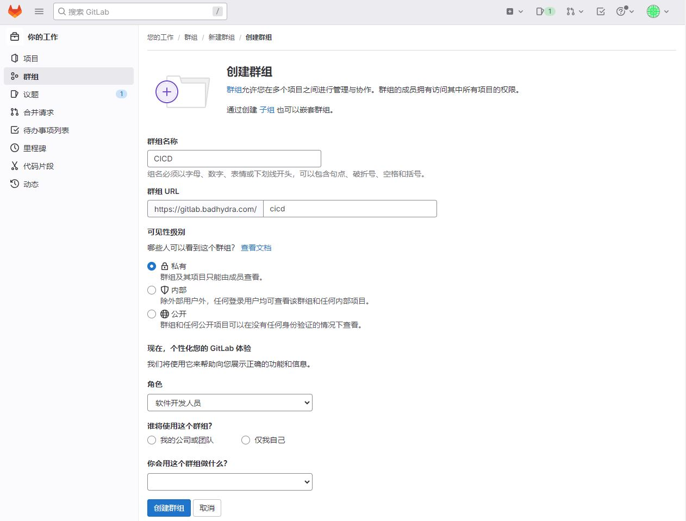
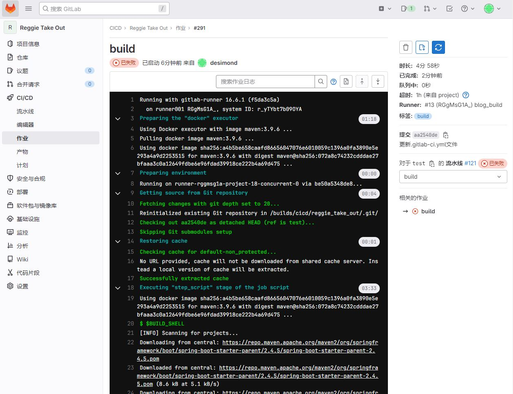
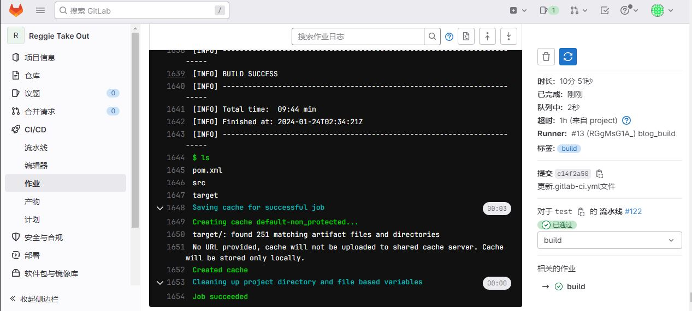

# CI/CD模板

## 简介

* CI/CD模板允许你在项目中轻松共享和重用CI/CD配置。通过使用模板，你可以减少配置文件的重复，并确保在项目之间保持一致性。
* 模板文件以 `.gitlab-ci.yml` 为扩展名，通常存储在项目的特定目录中，如 `/.gitlab` 或 `/templates`。

简单的示例：

```
# .gitlab-ci.yml

include:
  - template: Jobs/Build.gitlab-ci.yml
  - template: Jobs/Test.gitlab-ci.yml
  - template: Jobs/Deploy.gitlab-ci.yml
```

```
#Build.gitlab-ci.yml
.build:				#模板阶段以 . 开头
  stage: build
  tags:
    - build
  script: 
    - $BUILD_SHELL
    - ls
```

在这个示例中：

* `include` 关键字用于包含其他文件，这些文件通常是CI/CD模板。
* `Jobs/Build.gitlab-ci.yml`、`Jobs/Test.gitlab-ci.yml` 和 `Jobs/Deploy.gitlab-ci.yml` 是具体的CI/CD模板文件。

## 模板分类

**内置模板：**

* GitLab 提供了一些内置的 CI/CD 模板，可以直接使用。这些模板涵盖了常见的 CI/CD 需求，如构建、测试、部署等。

**自定义模板：**

* 除了使用内置模板外，你还可以创建自定义的 CI/CD 模板以满足特定项目的需求。自定义模板通常包含一组作业定义、阶段定义或全局配置。

**参数化模板：**

* 模板支持参数化，允许你将变量传递到模板中。这样可以使模板更加灵活，适应不同的场景。

```
include:
  - template: Jobs/Build.gitlab-ci.yml
    parameters:
      MY_VARIABLE: "some_value"
```

**局部模板：**

* 项目还可以定义局部模板，这些模板仅在项目内可见，不会影响其他项目。局部模板存储在项目的 `.gitlab-ci` 目录中。

**共享模板：**

* GitLab 提供了一种将 CI/CD 模板存储在特定的模板项目中的方式，这样就可以在多个项目中共享相同的模板。

```
include:
  - project: 'group/my-templates'
    file: '/path/to/my-template.yml'
```

## 示例：

### 模板库规划

创建一个Group用来保存作业和模板，其他项目使用模板时，直接调用该库的模板就行。



创建一个仓库，名为：gitlab_ci，用来保存gitlab ci的操作文件


建两个文件夹用来保存作业和模板

* jobs：保存作业
* templates：保存模板


# 构建工具集成（未完成，占位）

## 后端项目Maven集成

### 创建模板库

先在jobs目录中创建一个build.yml，然后在里面编写build作业模板。

```
.build:
  stage: build
  tags:
    - build
  script: 
    - $BUILD_SHELL
    - ls
```

然后我们在template目录中创建maven流水线模板。 templates/java-pipeline.yml

```
include:
  - project: 'CICD/gitlab_ci'
    ref: main
    file: 'jobs/build.yml'

variables:
  BUILD_SHELL: 'mvn clean package  -DskipTests'              ##构建命令
  CACHE_DIR: 'target/'
  
cache:
  paths:
    - ${CACHE_DIR}
  
stages:
  - build

build:
  stage: build
  extends: .build
```

### 克隆一个java项目

我在网上随便找了一个瑞吉外卖springboot项目

```
https://github.com/xustudyxu/reggie_take_out
```

然后在项目根目录创建CI文件，复制以下内容

```
#.gitlab-ci.yml
image: maven:3.8.1		#使用shell执行器的话不用配置iamge
include:
  - project: 'CICD/gitlab_ci'
    ref: main
    file: 'templates/java-pipeline.yml'

variables:
  BUILD_SHELL: 'mvn clean package  -DskipTests'              ##构建命令
  CACHE_DIR: 'target/'
```

配置好后触发自动执行，或者也可点击“CD/CD > 流水线 > 点击运行流水线”手动触发任务

如果配置自动触发的话，需要tag符合runner的tag

会自动下载maven包



最后没报错



### 通用流水线设置

“设置 > CI/CD > 流水线通用设置”处可以设置仓库通用的流水线文件.gitlab-ci.yml。该文件的优先级比根目录的流水线文件高

## 前端项目Npm集成

前端项目操作和java后端差不多，具体步骤都是

创建组 > 创建npm专用仓库 > 创建作业和模板 > 在项目根目录添加 CI 文件 > 运行流水线

以下是build模板示例：web-pipeline.yml

```
#web-pipeline.yml
include:
  - project: 'cicd/gitlab_ci_npm'
    ref: main
    file: 'jobs/build.yml
variables:
  BUILD_SHELL: 'npm run build'
  CACHE_DIR: 'dist/'

cache:
  paths:
    - ${CACHE_DIR}
    - node_modules/

stages:
  - install
  - build

install:
  stage: install
  script:
    - 'npm install'

build:
  stage: build
  extends: .build
```

build文件示例：build.yml

```
#.build.yml
.build:
  stage: build
  tags:
    - build
  script: 
    - $BUILD_SHELL
    - ls
```

根目录流水线示例： .gitlab-ci.yml

```
#.gitlab-ci.yml
image: maven:3.8.1		#使用shell执行器的话不用配置iamge
include:
  - project: 'CICD/gitlab_ci_npm'
    ref: main
    file: 'templates/web-pipeline.yml'

variables:
  BUILD_SHELL: 'npm run build'
  CACHE_DIR: 'dist/'
```

# 集成 SonarQube 代码扫描

## docker安装SonarQube

```
#编辑docker-compose.yml文件
version: '3'
services:
  postgres:
    image: postgres:12.3
    restart: always
    container_name: postgres
    ports:
      - 5432:5432
    volumes:
      - /data/app/postgres/postgresql:/var/lib/postgresql
      - /data/app/postgres/data:/var/lib/postgresql/data
      - /data/app/sonar/etc/localtime:/etc/localtime:ro
    environment:
      TZ: Asia/Shanghai
      POSTGRES_USER: sonar
      POSTGRES_PASSWORD: sonar
      POSTGRES_DB: sonar

  sonar:
    image: sonarqube:7.9.2-community
    container_name: sonar
    depends_on:
      - postgres
    volumes:
      - /data/app/sonar/sonarqube/extensions:/opt/sonarqube/extensions
      - /data/app/sonar/sonarqube/logs:/opt/sonarqube/logs
      - /data/app/sonar/sonarqube/data:/opt/sonarqube/data
      - /data/app/sonar/sonarqube/conf:/opt/sonarqube/conf
      # 设置与宿主机时间同步
      - /etc/localtime:/etc/localtime:ro
    ports:
      - 9000:9000
    command:
      # 内存设置
      - -Dsonar.ce.javaOpts=-Xmx2048m
      - -Dsonar.web.javaOpts=-Xmx2048m
      # 设置服务代理路径
      - -Dsonar.web.context=/
      # 此设置用于集成gitlab时，回调地址设置
      #- -Dsonar.core.serverBaseURL=https://sonarqube.badhydra.com
    environment:
      TZ: Asia/Shanghai
      SONARQUBE_JDBC_USERNAME: sonar
      SONARQUBE_JDBC_PASSWORD: sonar
      SONARQUBE_JDBC_URL: jdbc:postgresql://postgres:5432/sonar
```

### 测试是否正常安装

浏览器访问：

默认账号密码：admin/admin

```
https://sonar.badhydra.com	#需要配置dns解析，没有的话就是用ip连接：http://ip:9000
```

> 提示：
>
> 记得放行防火墙，云主机可能需要配置安全组

## 编写流水线文件

编写sonar作业文件：jobs/codeanalysis.yml

```
.codeanalysis-java:
  stage: code_analysis
  tags:
    - build
  script:
    - echo $CI_MERGE_REQUEST_IID $CI_MERGE_REQUEST_SOURCE_BRANCH_NAME  $CI_MERGE_REQUEST_TARGET_BRANCH_NAME
    - "$SCANNER_HOME/bin/sonar-scanner -Dsonar.projectKey=${CI_PROJECT_NAME} \
                                      -Dsonar.projectName=${CI_PROJECT_NAME} \
                                      -Dsonar.projectVersion=${CI_COMMIT_REF_NAME} \
                                      -Dsonar.ws.timeout=30 \
                                      -Dsonar.projectDescription=${CI_PROJECT_TITLE} \
                                      -Dsonar.links.homepage=${CI_PROJECT_URL} \
                                      -Dsonar.sources=${SCAN_DIR} \
                                      -Dsonar.sourceEncoding=UTF-8 \
                                      -Dsonar.java.binaries=target/classes \
                                      -Dsonar.java.test.binaries=target/test-classes \
                                      -Dsonar.java.surefire.report=target/surefire-reports \
                                      -Dsonar.branch.name=${CI_COMMIT_REF_NAME}"
  artifacts:		#制品收集，提供下载
    paths:
      - "$ARTIFACT_PATH"
```

参数简介：

* `$SCANNER_HOME/bin/sonar-scanner`: 这是 SonarQube 扫描器的可执行文件路径，`${SCANNER_HOME}` 是一个环境变量，指向扫描器的安装目录。
* `-Dsonar.projectKey=${CI_PROJECT_NAME}`: 定义 SonarQube 项目的唯一键。在这里，它使用 GitLab CI/CD 环境变量 `${CI_PROJECT_NAME}` 作为项目的唯一标识。
* `-Dsonar.projectName=${CI_PROJECT_NAME}`: 定义 SonarQube 项目的名称。在这里，它同样使用 GitLab CI/CD 环境变量 `${CI_PROJECT_NAME}` 作为项目的名称。
* `-Dsonar.projectVersion=${CI_COMMIT_REF_NAME}`: 定义 SonarQube 项目的版本。它使用 GitLab CI/CD 环境变量 `${CI_COMMIT_REF_NAME}` 作为项目的版本。
* `-Dsonar.ws.timeout=30`: 设置 SonarQube Web Service 的超时时间为 30 秒。
* `-Dsonar.projectDescription=${CI_PROJECT_TITLE}`: 定义 SonarQube 项目的描述。它使用 GitLab CI/CD 环境变量 `${CI_PROJECT_TITLE}` 作为项目的描述。
* `-Dsonar.links.homepage=${CI_PROJECT_URL}`: 定义 SonarQube 项目的主页链接。它使用 GitLab CI/CD 环境变量 `${CI_PROJECT_URL}` 作为主页链接。
* `-Dsonar.sources=${SCAN_DIR}`: 定义 SonarQube 分析的源代码路径。它使用变量 `${SCAN_DIR}` 作为源代码的路径。
* `-Dsonar.sourceEncoding=UTF-8`: 设置源代码的字符编码为 UTF-8。
* `-Dsonar.java.binaries=target/classes`: 定义 Java 二进制文件的路径。
* `-Dsonar.java.test.binaries=target/test-classes`: 定义 Java 测试二进制文件的路径。
* `-Dsonar.java.surefire.report=target/surefire-reports`: 定义 Surefire 测试报告的路径。
* `-Dsonar.branch.name=${CI_COMMIT_REF_NAME}`: 定义 SonarQube 项目的分支名称。它使用 GitLab CI/CD 环境变量 `${CI_COMMIT_REF_NAME}` 作为分支名称。

> 提示：
>
> 可以查看sonar的官方文档了解更多的内置变量

在模板仓库创建流水线文件template/java-pipeline.yml

```
include:
  - project: 'cicd/gitlab_ci'
    ref: main
    file: 'jobs/build.yml'
  - project: 'cicd/gitlab_ci'
    ref: main
    file: 'jobs/test.yml'
  - project: 'cicd/gitlab_ci'
    ref: main
    file: 'jobs/codeanalysis.yml'

variables:
  BUILD_SHELL: 'mvn clean package  -DskipTests'  ##构建命令
  CACHE_DIR: 'target/'
  TEST_SHELL : 'mvn test'                                   ##测试命令
  JUNIT_REPORT_PATH: 'target/surefire-reports/TEST-*.xml'   ##单元测试报告
  # 代码扫描
  SCANNER_HOME : "/usr/local/buildtools/sonar-scanner-3.2.0.1227-linux"
  SCAN_DIR : "src"
  ARTIFACT_PATH : 'target/*.jar'                            ##制品目录

  
cache:
  paths:
    - ${CACHE_DIR}
  
stages:
  - build
  - test
  - code_analysis


build:
  stage: build
  extends: .build
  rules:
    - when: on_success


test:
  stage: test
  extends: .test
  rules:
    - when: on_success

  
code_analysis:
  stage: code_analysis
  extends: .codeanalysis-java
```

# 集成 Pull request

# Reference Links：

http://docs.idevops.site/gitlabci/chapter04/01/1/

#docker安装sonarqube

https://blog.csdn.net/weixin_51203422/article/details/121181899

#sonarqube配置

http://docs.idevops.site/gitlabci/chapter04/01/2/

#runner构建docker 镜像

https://docs.gitlab.cn/jh/ci/docker/using_docker_build.html

#自动部署参考

https://juejin.cn/post/7126801972354613255

https://www.cnblogs.com/Sunzz/p/13716477.html

https://cloud.tencent.com/developer/article/1644680

#发布策略简介

https://www.cnblogs.com/IT-Evan/p/Release.html
