## OpenStack简介

什么是云计算：云计算是一种按使用量付费的模式，这种模式提供可用的、便捷的、按需的网络访问， 进入可配置的计算资源共享池（资源包括网络，服务器，存储，应用软件，服务）

OpenStack：是由 Rackspace 和 NASA 共同开发的云计算平台， 是一个开源的 IaaS（基础设施及服务）云计算平台，让任何人都可以自行建立和提供云端运算服务，由Python编写，半年发布一次版本。

### 云计算所包含的几个层次服务

* SaaS（ Software as a Service）： 把在线软件作为一种服务
* Paas（ Platform as a Service）： 把平台作为一种服务。
* Iaas（ Infrastructure as a Service）：把硬件设备作为一种服务。

## openstack 架构

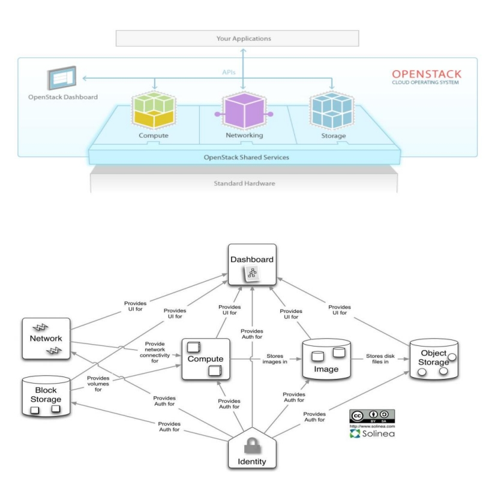

### openstack 构成组件

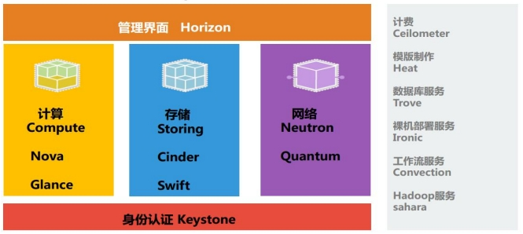

#### OpenStack 共享服务组件

* 数据库服务（ Database Service ）：MairaDB 及 MongoDB
* 消息传输（Message Queues）：RabbitMQ
* 缓存（cache）： Memcached
* 时间（time sync）：NTP
* 存储（storge provider）：ceph、GFS、LVM、ISICI 等
* 高可用及负载均衡：pacemaker、HAproxy、keepalive、lvs 等

#### OpenStack 核心组件

* 身份服务（ Identity Service ）：Keystone
* 计算（ Compute ）： Nova
* 镜像服务（ Image Service ）： Glance
* 网络 & 地址管理（ Network ）： Neutron
* 对象存储（ Object Storage ）： Swift
* 块存储 (Block Storage) ： Cinder
* UI 界面 (Dashboard) ： Horizon
* 测量 (Metering) ： Ceilometer
* 部署编排 (Orchestration) ： Heat

## （未完成，占位）

## Rabbitmq-消息队列

### 队列（MQ）概念：

MQ 全称为 Message Queue, 消息队列（ MQ ）是一种应用程序对应用程序的通信方法。应用程序通过读写出入队列的消息（针对应用程序的数据）来通信，而无需专用连接来链接它们。

消息传递指的是程序之间通过在消息中发送数据进行通信，而不是通过直接调用彼此来通信，直接调用通常是用于诸如远程过程调用的技术。排队指的是应用程序通过队列来通信。队列的使用除去了接收和发送应用程序同时执行的要求。

排队指的是应用程序通过 队列来通信。队列的使用除去了接收和发送应用程序同时执行的要求。

AMQP 即 Advanced Message Queuing Protocol 高级消息队列协议，是应用层协议的一个开放标准，为面向消息的中间件设计。

消息中间件主要用于组件之间的解耦，消息的发送者无需知道消息使用者的存在，反之亦然。AMQP 的主要特征是面向消息、队列、路由（包括点对点和发布 / 订阅）、可靠性、安全

### Rabbitmq 概念

属于一个流行的开源消息队列系统。属于 AMQP( 高级消息队列协议 ) 标准的一个 实现。是应用层协议的一个开放标准，为面向消息的中间件设计。用于在分布式系统中存储转发消息，在易用性、扩展性、高可用性等方面表现不俗。

### RabbitMQ 特点

* 使用 Erlang 编写
* 支持持久化
* 支持 HA
* 提供 C# , erlang，java，perl，python，ruby 等的 client 开发端

### RabbitMQ 中的概念名词

* Broker：简单来说就是消息队列服务器实体。
* Exchange：消息交换机，它指定消息按什么规则，路由到哪个队列。
* Queue：消息队列载体，每个消息都会被投入到一个或多个队列。
* Binding：绑定，它的作用就是把 exchange 和 queue 按照路由规则绑定起来。
* Routing Key：路由关键字， exchange 根据这个关键字进行消息投递。
* vhost：虚拟主机，一个 broker 里可以开设多个 vhost，用作不同用户的权限分离。
* producer：消息生产者，就是投递消息的程序。
* consumer：消息消费者，就是接受消息的程序。
* channel：消息通道，在客户端的每个连接里，可建立多个 channel，每个channel 代表一个会话任务。

### RabbitMQ 架构

MQ 是消费 - 生产者模型的一个典型的代表，一端往消息队列中不断写入消息，而另一端则可以读取或者订阅队列中的消息。 MQ 则是遵循了 AMQP 协议的具体实现和产品。

在项目中，将一些无需即时返回且耗时的操作提取出来，进行了异步处理，而这种异步处理的方式大大的节省了服务器的请求响应时间，从而提高了系统的吞吐量。

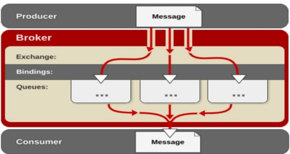

### RabbitMQ 工作原理

1. 客户端连接到消息队列服务器，打开一个 channel。
2. 客户端声明一个 exchange，并设置相关属性。
3. 客户端声明一个 queue，并设置相关属性。
4. 客户端使用 routing key，在 exchange 和 queue 之间建立好绑定关系。
5. 客户端投递消息到 exchange。
6. exchange 接收到消息后，就根据消息的 key 和已经设置的 binding，进行消息路由，将消息投递到一个或多个队列里

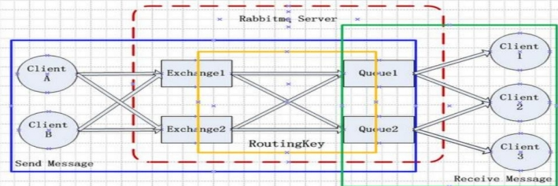

### Rabbitmq  metadata

元数据可以持久化在 RAM 或 Disc. 从这个角度可以把 RabbitMQ 集群中的节点分成两种 :RAM Node 和 Disk Node。

* RAM Node 只会将元数据存放在 RAM
* Disk node 会将元数据持久化到磁盘

单节点系统就没有什么选择了 , 只允许 disk node, 否则由于没有数据冗余一旦重启就会丢掉所有的配置信息 。

但在集群环境中可以选择哪些节点是 RAM node。在集群中声明 (declare) 创建 exchange queue binding, 这类操作要等到所有的节点都完成创建才会返回 : 如果是内存节点就要修改内存数据 , 如果是 disk node 就要等待写磁盘。

有些场景 exchang queue 相当固定 , 变动很少 ,那即使全都是 disc node, 也没有什么影响 . 如果使用 Rabbitmq 做 RPC（ RPC :Remote Procedure Call—远程过程调用）, RPC 或者类似 RPC 的场景这个问题就严重了 , 频繁创建销毁临时队列 , 磁盘读写能力就很快成为性能瓶颈了。所以 , 大多数情况下 , 我们尽量把 Node 创建为RAM Node. 这里就有一个问题了 , 要想集群重启后元数据可以恢复就需要把集群元数据持久化到磁盘 , 那需要规划 RabbitMQ 集群中的 RAM Node 和 Disc Node

只要有一个节点是 Disc Node 就能提供条件把集群元数据写到磁盘 ,RabbitMQ 的确也是这样要求的 :集群中只要有一个 disk node 就可以 , 其它的都可以是 RAM node. 节点加入或退出集群一定至少要通知集群中的一个 disk node 。

如果集群中 disk node 都宕掉 , 就不要变动集群的元数据 。声明 exchange queue 修改用户权限 , 添加用户等等这些变动在节点重启之后无法恢复 。

有一种情况要求所有的 disk node 都要在线情况在才能操作 , 那就是增加或者移除节点。

RAM node启动的时候会连接到预设的 disk node 下载最新的集群元数据 . 如果你有两个 disk node(d1 d2), 一个RAM node 加入的时候你只告诉 d1, 而恰好这个 RAM node 重启的时候 d1 并没有启动 , 重启就会失败 . 所以加入 RAM 节点的时候 , 把所有的 disk node 信息都告诉它 ,RAM node 会把 disk node 的信息持久化到磁盘以便后续启动可以按图索骥 。

## Memcache-缓存系统

### 缓存系统

在大型海量并发访问网站及 openstack 等集群中，对于关系型数据库，尤其是大型关系型数据库，如果对其进行每秒上万次的并发访问，并且每次访问都在一个有上亿条记录的数据表中查询某条记录时，其效率会非常低，对数据库而言，这也是无法承受的。

缓冲系统的使用可以很好的解决大型并发数据访问所带来的效率低下和数据库压力等问题，缓存系统将经常使用的活跃数据存储在内存中避免了访问重复数据时，数据库查询所带来的频繁磁盘ｉ/ｏ和大型关系表查询时的时间开销，因此缓存系统几乎是大型网站的必备功能模块。缓存系统可以认为是基于内存的数据库，相对于后端大型生产数据库而言基于内存的缓存数据库能够提供快速的数据访问操作，从而提高客户端的数据请求访问反馈，并降低后端数据库的访问压力。

### Memcached 概念

Memcached 是一个开源的、高性能的分布式内存对象缓存系统。通过在内存中缓存数据和对象来减少读取数据库的次数，从而提高网站访问速度，加速动态 WEB 应用、减轻数据库负载。

Memcached 是一种内存缓存，把经常需要存取的对象或数据缓存在内存中，缓存的这些数据通过 API 的方式被存取，数据经过利用 HASH 之后被存放到位于内存上的 HASH 表内，HASH 表中的数据以 key-value 的形式存放，由于Memcached 没有实现访问认证及安全管理控制，因此在面向 internet的系统架构中，Memcached 服务器通常位于用户的安全区域。

当 Memcached 服务器节点的物理内存剩余空间不足，Memcached 将使用最近最少使用算法（LRU，LastRecentlyUsed）对最近不活跃的数据进行清理，从而整理出新的内存空间存放需要存储的数据。Memcached 在解决大规模集群数据缓存的诸多难题上有具有非常明显的优势并且还易于进行二次开发，因此越来越多的用户将其作为集群缓存系统，此外，Memcached 开放式的 API，使得大多数的程序语言都能使用 Memcached，如 javac、C/C++C#，Perl、python、PHP、Ruby 各种流行的编程语言。

由于 Memcached 的诸多优势，其已经成为众多开源项目的首选集群缓存系统。如 openstack 的 keystone 身份认证项目。就会利用 Memcached 来缓存租户的 Token 等身份信息，从而在用户登陆验证时无需查询存储在 MySQL 后端数据库中的用户信息，这在数据库高负荷运行下的大型 openstack 集群中能够极大地提高用户的身份验证过程，在如 web 管理界面 Horizon 和对象存储 Swift 项目也都会利用Memcached 来缓存数据以提高客户端的访问请求响应速率。

### Memcached 缓存流程

1. 检查客户端请求的数据是否在 Memcache中，如果存在，直接将请求的数据返回，不在对数据进行任何操作。
2. 如果请求的数据不在 Memcache 中，就去数据库查询，把从数据库中获取的数据返回给客户端，同时把数据缓存一份 Memcache。
3. 每次更新数据库的同时更新 Memcache中的数据库。确保数据信息一致性。
4. 当分配给 Memcache 内存空间用完后，会使用 LRU(least Recently Used ，最近最少使用 ) 策略加到其失效策略，失效的数据首先被替换掉，然后在替换掉最近未使用的数据。

### Memcached 功能特点

1. 协议简单
   其使用基于文本行的协议，能直接通过 telnet 在 Memcached 服务器上存取数据
2. 基于 libevent 的事件处理
   libevent 利用 C 开发的程序库，它将 BSD 系统的 kqueue,Linux 系统的 epoll 等事件处理功能封装成为一个接口，确保即使服务器端的链接数。加也能发挥很好的性能。Memcached 利用这个库进行异步事件处理。
3. 内置的内存管理方式
   Memcached 有一套自己管理内存的方式，这套方式非常高效，所有的数据都保存在 Memcached 内置的内存中，当存入的数据占满空间时，使用LRU 算法自动删除不使用的缓存，即重用过期的内存空间。Memecached 不考虑数据的容灾问题，一旦重启所有数据全部丢失。
4. 节点相互独立的分布式
   各个 Memecached 服务器之间互不通信，都是独立的存取数据，不共享任何信息。通过对客户端的设计，让 Memcached 具有分布式，能支持海量缓存和大规模应用。

### 使用 Memcached 应该考虑的因素

1. Memcached 服务单点故障
   在Memcached集群系统中每个节点独立存取数据，彼此不存在数据同步镜像机制，如果一个Memcached节点故障或者重启，则该节点缓存在内存的数据全部会丢失，再次访问时数据再次缓存到该服务器。
2. 存储空间限制
   Memcache 缓存系统的数据存储在内存中，必然会受到寻址空间大小的限制，32 为系统可以缓存的数据为 2G，64 位系统缓存的数据可以是无限的，要看 Memcached 服务器物理内存足够大即可。
3. 存储单元限制
   Memcache 缓存系统以 key-value 为单元进行数据存储，能够存储的数据 key 尺寸大小为 250 字节，能够存储的 value 尺寸大小为 1MB，超过这个值不允许存储。
4. 数据碎片
   Memcache 缓存系统的内存存储单元是按照 Chunk 来分配的，这意味着不可能，所有存储的 value 数据大小正好等于一个 Chunk 的大小，因此必然会造成内存碎片，而浪费存储空间。
5. 利旧算法局限性
   Memcache 缓存系统的 LRU 算法，并不是针对全局空间的存储数据的，而是针对 Slab 的，Slab 是Memcached 中具有同样大小的多个 Chunk 集合。
6. 数据访问安全性
   Memcache 缓存系统的慢慢 Memcached 服务端并没有相应的安全认证机制通过，通过非加密的 telnet连接即可对 Memcached 服务器端的数据进行各种操作。

## Keystone-身份认证

### Keystone 介绍

keystone 是 OpenStack 的组件之一，用于为 OpenStack 家族中的其它组件成员提供统一的认证服务，包括身份验证、令牌的发放和校验、服务列表、用户权限的定义等等。云环境中所有的服务之间的授权和认证都需要经过 keystone。因此 keystone 是云平台中第一个即需要安装的服务。

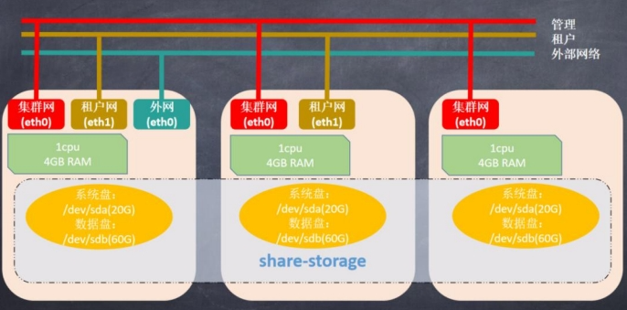

作为 OpenStack 的基础支持服务，Keystone 做下面这几件事情：

1. 管理用户及其权限
2. 维护 OpenStack Services 的 Endpoint
3. Authentication（认证）和 Authorization（鉴权）

### Keystone关键概念

学习 Keystone，得理解下面这些概念

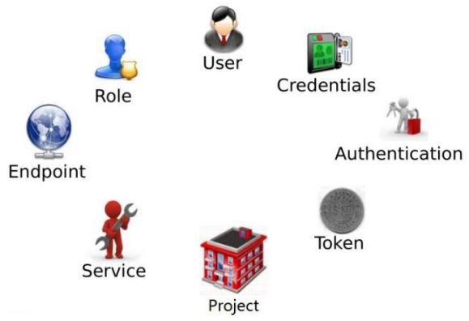

#### User

User 指代任何使用 OpenStack 的实体，可以是真正的用户，其他系统或者服务。

当 User 请求访问 OpenStack 时，Keystone 会对其进行验证。Horizon 在 Identity->Users 管理 User

除了 admin 和 demo，OpenStack 也为 nova、cinder、glance、neutron 服务创建了相应的 User。

admin 也可以管理这些 User。

#### Credentials

Authentication 是 Keystone 验证 User 身份的过程。User 访问 OpenStack 时向 Keystone 提交用户名和密码形式的 Credentials，Keystone 验证通过后会给 User 签发一个 Token 作为后续访问的Credential。

#### Token

Token 是由数字和字母组成的字符串，User 成功 Authentication 后 Keystone 生成 Token 并分配给 User。

* Token 用做访问 Service 的 Credential
* Service 会通过 Keystone 验证 Token 的有效性
* Token 的有效期默认是 24 小时

#### Project

Project 用于将 OpenStack 的资源（计算、存储和网络）进行分组和隔离。

根据 OpenStack 服务的对象不同，Project 可以是一个客户（公有云，也叫租户）、部门或者项目组（私有云）。

资源的所有权是属于 Project 的，而不是 User。

在 OpenStack 的界面和文档中，Tenant / Project / Account 这几个术语是通用的，但长期看会倾向使用 Project。

每个 User（包括 admin）必须挂在 Project 里才能访问该 Project 的资源。 一个 User 可以属于多个Project。

admin 相当于 root 用户，具有最高权限。

admin可以在 Identity->Projects 中管理 Project，通过 Manage Members 将 User 添加到 Project。

#### Service

OpenStack 的 Service 包括 Compute (Nova)、Block Storage (Cinder)、Object Storage (Swift)、Image Service (Glance) 、 Networking Service (Neutron) 等 。

每 个 Service 都会提供若干个Endpoint，User 通过 Endpoint 访问资源和执行操作。

#### Endpoint

Endpoint 是一个网络上可访问的地址，通常是一个 URL。Service 通过 Endpoint 暴露自己的 API。Keystone 负责管理和维护每个 Service 的 Endpoint。

#### Role

安全包含两部分：Authentication（认证）和 Authorization（鉴权）

* Authentication 解决的是“你是谁？”的问题
* Authorization 解决的是“你能干什么？”的问题

Keystone 借助 Role 实现 Authorization，Keystone 定义 Role。

可以为 User 分配一个或多个 Role，操作：Identity->Project->ManageMembers。

Service 决定每个 Role 能做什么事情 Service 通过各自的 policy.json 文件对 Role 进行访问控制。

OpenStack 默认配置只区分 admin 和非 admin Role。 如果需要对特定的 Role 进行授权，可以修改policy.json。

### Keystone 基本架构


* Token： 用来生成和管理 token
* Catalog：用来存储和管理 service/endpoint
* Identity：用来管理 tenant/user/role 和验证
* Policy：用来管理访问权限

## Glance-镜像服务

Glance 是 Openstack 项目中负责镜像管理的模块，其功能包括虚拟机镜像的查找、注册和检索等。

Glance 提供 Restful API 可以查询虚拟机镜像的 metadata 及获取镜像。

Glance 可以将镜像保存到多种后端存储上，比如简单的文件存储或者对象存储。

### Glance关键概念

#### Image

在传统 IT 环境下，安装一个系统要么从安装 CD 从头安装，要么用 Ghost 等克隆工具恢复。

云环境下需要更高效的方案，这就是 Image。 Image 是一个模板，里面包含了基本的操作系统和其他的软件。

#### Image Service

Image Service 的功能是管理 Image，让用户能够发现、获取和保存 Image。在 OpenStack 中，提供 Image Service 的是 Glance。

具体功能如下：

提供 REST API 让用户能够查询和获取 image 的元数据和 image 本身支持多种方式存储 image，包括普通的文件系统、Swift、Amazon S3 等对 Instance 执行 Snapshot 创建新的 image

### Glance 架构

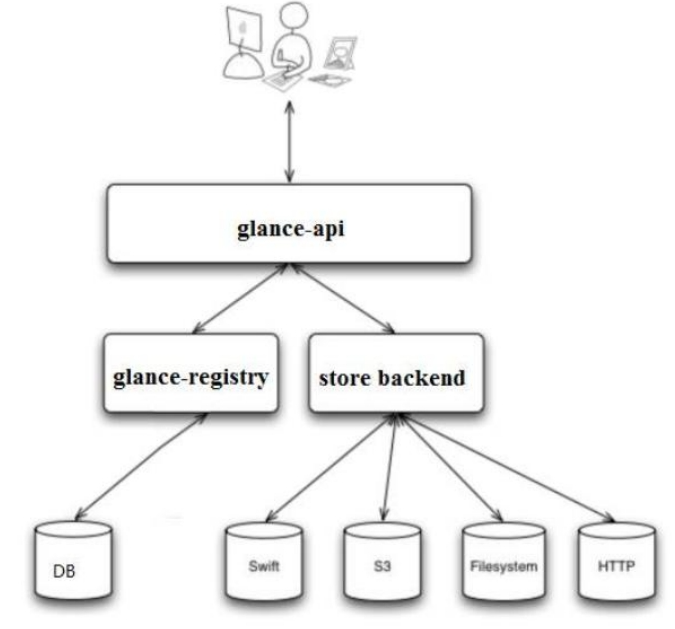

### glance-api

glance-api 是系统后台运行的服务进程。 对外提供 REST API，响应 image 查询、获取和存储的调用。

glance-api 不会真正处理请求。 如果操作是与 image metadata（元数据）相关，glance-api 会把请求转发给 glance-registry； 如果操作是与 image 自身存取相关，glance-api 会把请求转发给该 image 的 store backend。

### glance-registry

glance-registry 是系统后台运行的服务进程。 负责处理和存取 image 的 metadata，例如image 的大小和类型。

Glance 支持多种格式的 image，包括Raw，vhd，vmdk，vdi，iso，qcow2等。

### Database

Image 的 metadata 会保持到 database 中，默认是 MySQL。 在控制节点上可以查看 glance的 database 信息。

### Store backend

Glance 自己并不存储 image。 真正的 image 是存放在 backend 中的。 Glance 支持多种backend，包括：

* A directory on a local file system（这是默认配置）
* GridFS
* Ceph RBD
* Amazon S3
* Sheepdog
* OpenStack Block Storage (Cinder)
* OpenStack Object Storage (Swift)
* 8、VMware ESX 具体使用哪种 backend，是在 /etc/glance/glance-api.conf 中配置的

### glance 创建镜像

OpenStack 为终端用户提供了 Web UI（Horizon）和命令行 CLI 两种交换界面。两种方式我们都要会用。可能有些同学觉得既然有更友好的 Web UI 了，干嘛还要用 CLI？ 这里有下面的理由：

* Web UI 的功能没有 CLI 全，有些操作只提供了 CLI。 即便是都有的功能，CLI 可以使用的参数更多
* 一般来说，CLI 返回结果更快，操作起来更高效
* CLI 可放在脚本中进行批处理
* 有些耗时的操作 CLI 更合适，比如创建镜像（后面将涉及）

## Nova-计算服务

### nova 介绍

Nova 是 OpenStack 最核心的服务，负责维护和管理云环境的计算资源。OpenStack 作为 IaaS 的云操作系统，虚拟机生命周期管理也就是通过 Nova 来实现的

用途与功能 :

1) 实例生命周期管理
2) 管理计算资源
3) 网络和认证管理
4) REST 风格的 API
5) 异步的一致性通信
6) Hypervisor 透明：支持 Xen,XenServer/XCP,KVM, UML, VMware vSphere and Hyper-V

### Nova 架构


Nova 的架构比较复杂，包含很多组件。 这些组件以子服务（后台 deamon 进程）的形式运行，可以分为以下几类：

#### API

nova-api是整个 Nova 组件的门 户 ， 接收和响应客户的 API 调用 。所有对 Nova 的请求都首先由nova-api 处理。nova-api 向外界暴露若干 HTTP REST API 接口在 keystone 中我们可以查询 nova-api 的 endponits。

客户端就可以将请求发送到 endponits 指定的地址，向 nova-api 请求操作。 当然，作为最终用户的我们不会直接发送 Rest AP I 请求。 OpenStack CLI，Dashboard 和其他需要跟 Nova 交换的组件会使用这些 API。

Nova-api 对接收到的 HTTP API 请求会做如下处理：

1. 检查客户端传入的参数是否合法有效
2. 调用 Nova 其他子服务的处理客户端 HTTP 请求
3. 格式化 Nova 其他子服务返回的结果并返回给客户端

nova-api 接收哪些请求？

简单的说，只要是跟虚拟机生命周期相关的操作，nova-api 都可以响应。 大部分操作都可以在Dashboard 上找到。打开 Instance 管理界面

除了提供 OpenStack 自己的 API，nova-api 还支持 Amazon EC2 API。 也就是说，如果客户以前使用 Amazon EC2，并且用 EC2 的 API 开发了些工具来管理虚机，那么如果现在要换成OpenStack，这些工具可以无缝迁移到 OpenStack，因为 nova-api 兼容 EC2 API，无需做任何修改。

#### Compute Core

##### nova-scheduler

虚机调度服务，负责决定在哪个计算节点上运行虚机。创建 Instance 时，用户会提出资源需求，例如 CPU、内存、磁盘各需要多少。OpenStack 将这些需求定义在 flavor 中，用户只需要指定用哪个 flavor 就可以了。

nova-scheduler是如何实现调度的。 在 /etc/nova/nova.conf 中 ， nova 通 过driver=filter_scheduler 这个参数来配置nova-scheduler。

Filter scheduler 是 nova-scheduler 默认的调度器，调度过程分为两步：

1. 通过过滤器（filter）选择满足条件的计算节点（运行 nova-compute）
2. 通过权重计算（weighting）选择在最优（权重值最大）的计算节点上创建 Instance

Nova 允许使用第三方 scheduler，配置 scheduler_driver 即可。 这又一次体现了 OpenStack 的开放性。Scheduler 可以使用多个 filter 依次进行过滤，过滤之后的节点再通过计算权重选出最适合的节点。

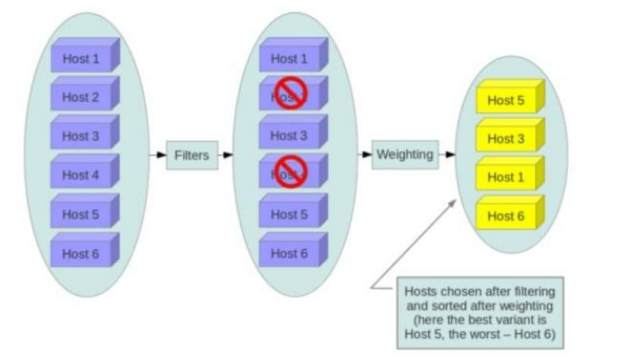

上图是调度过程的一个示例：

1. 最开始有 6 个计算节点 Host1-Host6
2. 通过多个 filter 层层过滤，Host2 和 Host4 没有通过，被刷掉了
3. Host1，Host3，Host5，Host6 计算权重，结果 Host5 得分最高，最终入选

当 Filter scheduler 需要执行调度操作时，会让 filter 对计算节点进行判断，filter 返回 True 或 False。经过前面一堆 filter 的过滤，nova-scheduler 选出了能够部署 instance 的计算节点。如果有多个计算节点通过了过滤，那么最终选择哪个节点呢？

Scheduler 会对每个计算节点打分，得分最高的获胜。 打分的过程就是 weight，翻译过来就是计算权重值，那么 scheduler 是根据什么来计算权重值呢？目前 nova-scheduler 的默认实现是根据计算节点空闲的内存量计算权重值： 空闲内存越多，权重越大，instance 将被部署到当前空闲内存最多的计算节点上。

##### nova-compute

nova-compute 是管理虚机的核心服务，在计算节点上运行。通过调用 Hypervisor API 实现节点上 的 instance 的生命周期管理。 OpenStack 对 instance 的 操 作 ， 最 后 都 是 交 给nova-compute 来 完 成 的 。 nova-compute 与 Hypervisor 一 起 实 现 OpenStack 对 instance 生命周期的管理。

通过 Driver 架构支持多种 Hypervisor Hypervisor 是计算节点上跑的虚拟化管理程序，虚机管理最底层的程序。 不同虚拟化技术提供自己的 Hypervisor。 常用的 Hypervisor 有 KVM，Xen， VMWare 等。nova-compute 为这些 Hypervisor 定义了统一的接口，Hypervisor 只需要实现这些接口，就可以 Driver 的形式即插即用到 OpenStack 系统中。 下面是 Nova Driver 的架构示意图

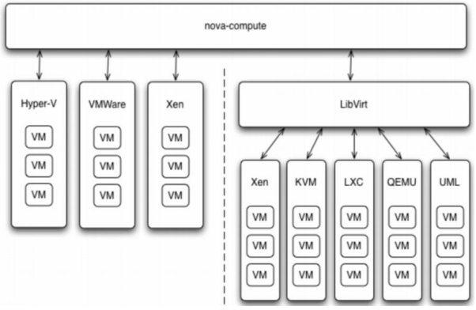

##### nova-conductor

nova-compute 经常需要更新数据库，比如更新和获取虚机的状态。 出于安全性和伸缩性的考虑，nova-compute 并不会直接访问数据库，而是将这个任务委托给 nova-conductor。

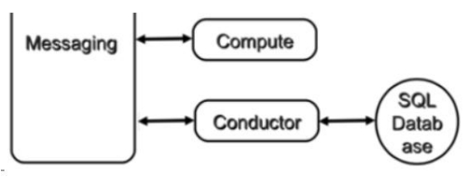

这样做有两个显著好处：

1. 更高的系统安全性
2. 更好的系统伸缩性

##### Console Interface

* nova-console： 用户可以通过多种方式访问虚机的控制台：
* nova-novncproxy： 基于 Web 浏览器的 VNC 访问
* nova-spicehtml5proxy： 基于 HTML5 浏览器的 SPICE 访问
* nova-xvpnvncproxy： 基于 Java 客户端的 VNC 访问
* nova-consoleauth： 负责对访问虚机控制台请求提供 Token 认证
* nova-cert： 提供 x509 证书支

##### Database

Nova 会有一些数据需要存放到数据库中，一般使用 MySQL。数据库安装在控制节点上。 Nova使用命名为 “nova” 的数据库

##### Message Queue

在前面我们了解到 Nova 包含众多的子服务，这些子服务之间需要相互协调和通信。为解耦各个子服务，Nova 通过 Message Queue 作为子服务的信息中转站。 所以在架构图上我们看到了子服务之间没有直接的连线，是通过 Message Queue 联系的。

OpenStack 默认是用 RabbitMQ 作为 Message Queue。 MQ 是 OpenStack 的核心基础组件，我们后面也会详细介绍。

### Nova组件如何协同工作的

对于 Nova，这些服务会部署在两类节点上：计算节点和控制节点。计算节点上安装了 Hypervisor，上面运行虚拟机。 由此可知：

1. 只有 nova-compute 需要放在计算节点上。
2. 其他子服务则是放在控制节点上的。

涉及的 nova-* 子服务很全，下面是流程图。

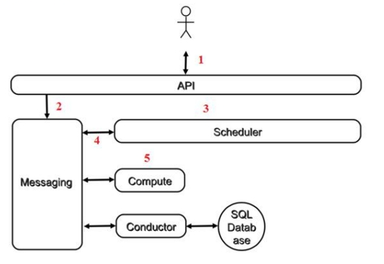

1. 客户（可以是 OpenStack 最终用户，也可以是其他程序）向 API（nova-api）发送请求：“帮我创建一个虚机”
2. API 对请求做一些必要处理后，向 Messaging（RabbitMQ）发送了一条消息
3. Scheduler 创建一个虚机”
4. Scheduler（nova-scheduler）从 Messaging 获取到 API 发给它的消息，
5. 行调度算法，从若干计算节点中选出节点 A
6. Scheduler 向 Messaging 发送了一条消息：“在计算节点 A 上创建这个虚机”

计算节点 A 的 Compute（nova-compute）从 Messaging 中获取到 Scheduler 发给它的消息，然后在本节点的 Hypervisor 上启动虚机。

在 虚 机 创 建的 过 程 中 ， Compute 如 果 需 要 查询 或 更 新 数 据 库 信息 ， 会 通 过 Messaging 向Conductor（nova-conductor）发送消息，Conductor 负责数据库访问。

## Neutron-网路服务

### Neutron 概述

传统的网络管理方式很大程度上依赖于管理员手工配置和维护各种网络硬件设备；而云环境下的网络已经变得非常复杂，特别是在多租户场景里，用户随时都可能需要创建、修改和删除网络，网络的连通性和隔离不已经太可能通过手工配置来保证了。

如何快速响应业务的需求对网络管理提出了更高的要求。传统的网络管理方式已经很难胜任这项工作，而“软件定义网络（software-defined networking, SDN）”所具有的灵活性和自动化优势使其成为云时代网络管理的主流。

Neutron 的设计目标是实现“网络即服务（Networking as a Service）”。为了达到这一目标，在设计上遵循了基于 SDN 实现网络虚拟化的原则，在实现上充分利用了 Linux 系统上的各种网络相关的技术。
SDN 模式服务— NeutronSDN( 软件定义网络 ), 通过使用它，网络管理员和云计算操作员可以通过程序来动态定义虚拟网络设备。Openstack 网络中的 SDN 组件就是 Quantum.但因为版权问题而改名为 Neutron

### Neutron 网络基本概念

Neutron 为整个 OpenStack 环境提供网络支持，包括二层交换，三层路由，负载均衡，防火墙和 VPN 等。Neutron 提供了一个灵活的框架，通过配置，无论是开源还是商业软件都可以被用来实现这些功能。

#### neutwork

network 是一个隔离的二层广播域。Neutron 支持多种类型的 network，包括 local, flat, VLAN, VxLAN 和 GRE。

##### local

local 网络与其他网络和节点隔离。local 网络中的 instance 只能与位于同一节点上同一网络的 instance 通信，local 网络主要用于单机测试。

##### flat

flat 网络是无 vlan tagging 的网络。flat 网络中的 instance 能与位于同一网络的 instance 通信，并且可以跨多个节点。

##### vlan

vlan 网络是具有 802.1q tagging 的网络。vlan 是一个二层的广播域，同一 vlan 中的 instance可以通信，不同 vlan 只能通过 router 通信。vlan 网络可跨节点，是应用最广泛的网络类型。

##### vxlan

vxlan 是基于隧道技术的 overlay 网络。vxlan 网络通过唯一的 segmentation ID（也叫 VNI）与其他 vxlan 网络区分。vxlan 中数据包会通过 VNI 封装成 UDP 包进行传输。因为二层的包通过封装在三层传输，能够克服 vlan 和物理网络基础设施的限制。

##### gre

gre 是与 vxlan 类似的一种 overlay 网络。主要区别在于使用 IP 包而非 UDP 进行封装。不同 network 之间在二层上是隔离的。

以 vlan 网络为例，network A 和 network B 会分配不同的 VLAN ID，这样就保证了 network A 中的广播包不会跑到 network B 中。当然，这里的隔离是指二层上的隔离，借助路由器不同 network 是可能在三层上通信的。

network 必须属于某个 Project（ Tenant 租户），Project 中可以创建多个 network。 network与 Project 之间是 1 对多 关系。

#### subnet

subnet 是一个 IPv4 或者 IPv6 地址段。instance 的 IP 从 subnet 中分配。每个 subnet 需要定义 IP 地址的范围和掩码。

network 与 subnet 是 1 对多 关系。一个 subnet 只能属于某个 network；一个 network 可以有多个 subnet，这些 subnet 可以是不同的 IP 段，但不能重叠。下面的配置是有效的：

```
network A subnet A-a: 10.10.1.0/24 {"start": "10.10.1.1", "end": "10.10.1.50"}
subnet A-b: 10.10.2.0/24 {"start": "10.10.2.1", "end": "10.10.2.50"}
```

但下面的配置则无效，因为 subnet 有重叠

```
network A subnet A-a: 10.10.1.0/24 {"start": "10.10.1.1", "end": "10.10.1.50"}
subnet A-b: 10.10.1.0/24 {"start": "10.10.1.51", "end": "10.10.1.100"}
```

这里不是判断 IP 是否有重叠，而是 subnet 的 CIDR 重叠（都是 10.10.1.0/24）。但是，如果subnet 在不同的 network 中，CIDR 和 IP

```
network A subnet A-a: 10.10.1.0/24 {"start": "10.10.1.1", "end": "10.10.1.50"}
network B subnet B-a: 10.10.1.0/24 {"start": "10.10.1.1", "end": "10.10.1.50"}
```

这里大家不免会疑惑： 如果上面的 IP 地址是可以重叠的，那么就可能存在具有相同 IP 的两个instance，这样会不会冲突？ 简单的回答是：不会！

具体原因： 因为 Neutron 的 router 是通过 Linux network namespace 实现的。network namespace 是一种网络的隔离机制。通过它，每个 router 有自己独立的路由表。上面的配置有两种结果：

1. 如果两个 subnet 是通过同一个 router 路由，根据 router 的配置，只有指定的一个 subnet可被路由。
2. 如果上面的两个 subnet 是通过不同 router 路由，因为 router 的路由表是独立的，所以两个 subnet 都可以被路由

#### port

port 可以看做虚拟交换机上的一个端口。port 上定义了 MAC 地址和 IP 地址，当 instance 的虚拟网卡 VIF（Virtual Interface） 绑定到 port 时，port 会将 MAC 和 IP 分配给 VIF。

subnet 与 port 是 1 对多 关系。一个 port 必须属于某个 subnet；一个 subnet 可以有多个port。

### 二层交换 Switching

Nova 的 Instance 是通过虚拟交换机连接到虚拟二层网络的。Neutron 支持多种虚拟交换机，包括 Linux 原生的 Linux Bridge 和 Open vSwitch。 Open vSwitch（OVS）是一个开源的虚拟交换机，它支持标准的管理接口和协议。

利用 Linux Bridge 和 OVS，Neutron 除了可以创建传统的 VLAN 网络，还可以创建基于隧道技术的 Overlay 网络，比如 VxLAN 和 GRE（Linux Bridge 目前只支持 VxLAN）。在后面章节我们会学习如何使用和配置 Linux Bridge 和 Open vSwitch

#### 三层路由 Routing

Instance 可以配置不同网段的 IP，Neutron 的 router（虚拟路由器）实现 instance 跨网段通信。router 通过 IP forwarding，iptables 等技术来实现路由和 NAT。

#### 负载均衡 Load Balancing

Openstack 在 Grizzly 版本第一次引入了 Load-Balancing-as-a-Service（LBaaS），提供了将负载分发到多个 instance 的能力。LBaaS 支持多种负载均衡产品和方案，不同的实现以 Plugin的形式集成到 Neutron，目前默认的 Plugin 是 HAProxy。

#### 防火墙 Firewalling

Neutron 通过下面两种方式来保障 instance 和网络的安全性。

Security Group ：通过 iptables 限制进出 instance 的网络包。
Firewall-as-a-Service ：FWaaS，限制进出虚拟路由器的网络包，也是通过 iptables 实现。

### Neutron 优点

Openstack 中的 SDN 组件架构也属于可插拔类型。通过各种插件可以管控不同种类的交换机、路由器、防火墙、负载均衡器并实现 firewall as a service 等许多功能。通过软件来定义的网络，可以对整个云计算设施进行更为精细的掌控。

### Neutron 部署方案

#### 方案 1：控制节点 + 计算节点：

控制节点：部署的服务包括：neutron server, core plugin 的 agent 和 service plugin 的 agent。

计算节点：部署 core plugin 的 agent，负责提供二层网络功能。

这里有几点需要说明：

1. core plugin 和 service plugin 已经集成到 neutron server，不需要运行独立的 plugin 服务。
2. 控制节点和计算节点都需要部署 core plugin 的 agent，因为通过该 agent 控制节点与计算节点才能建立二层连接。
3. 可以部署多个控制节点和计算节点。

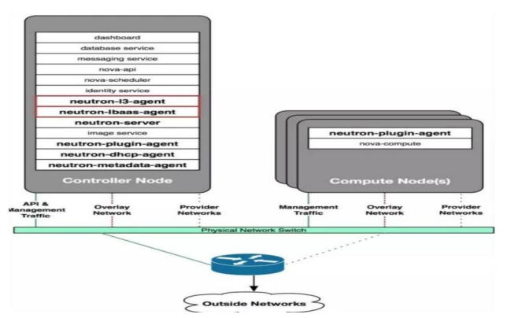

#### 方案 2：控制节点 + 网络节点 + 计算节点

在这个部署方案中，OpenStack 由控制节点，网络节点和计算节点组成。

控制节点：部署 neutron server 服务。

网络节点：部署的服务包括：core plugin 的 agent 和 service plugin 的 agent。

计算节点：部署 core plugin 的 agent，负责提供二层网络功能。

这个方案的要点是将所有的 agent 从控制节点分离出来，部署到独立的网络节点上。控制节点只负责通过 neutron server 响应 API 请求。由独立的网络节点实现数据的交换，路由以及 load balance 等高级网络服务。可以通过增加网络节点承担更大的负载。可以部署多个控制节点、网络节点和计算节点。该方案特别适合规模较大的 OpenStack 环境。

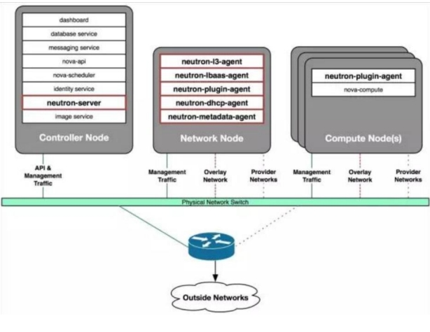

### 配置多个网卡区分不同类型的网络数据

OpenStack 至少包含下面几类网络流量

* Management
* API
* VM
* External

#### Management 网络

用于节点之间 message queue 内部通信以及访问 database 服务，所有的节点都需要连接到management 网络。

#### API 网络

OpenStack 各组件通过该网络向用户暴露 API 服 务 。 Keystone, Nova, Neutron, Glance, Cinder, Horizon 的endpoints 均配置在 API 网络上。通常，管理员也通过 API 网络 SSH 管理各个节点。

##### VM 网络

VM 网络也叫 tenant 网络，用于 instance 之间通信。VM 网络可以选择的类型包括 local, flat, vlan, vxlan 和 gre。VM 网络由 Neutron 配置和管理。

##### External 网络

External 网络指的是 VM 网络之外的网络，该网络不由 Neutron 管理。 Neutron 可以将router attach 到 External 网络，为 instance 提供访问外部网络的能力。 External 网络可能是企业的 intranet，也可能是 internet。

这几类网络只是逻辑上的划分，物理实现上有非常大的自由度。

我们可以为每种网络分配单独的网卡；也可以多种网络共同使用一个网卡；为提高带宽和硬件冗余，可以使用 bonding 技术将多个物理网卡绑定成一个逻辑的网卡

### Neutron 架构

与 OpenStack 的其他服务的设计思路一样，Neutron 也是采用分布式架构，由多个组件（子服务）共同对外提供网络服务。

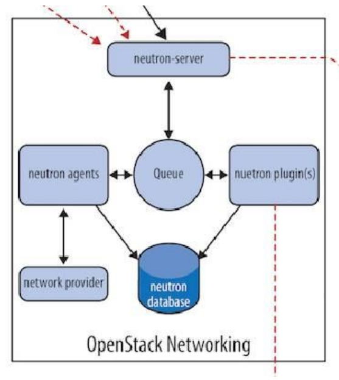

#### Neutron 组件构成

* Neutron Server

  * 对外提供 OpenStack 网络 API，接收请求，并调用 Plugin 处理请求。Plugin处理 Neutron Server 发来的请求，维护 OpenStack 逻辑网络状态， 并调用 Agent 处理请求。
* Agent

  * 处理 Plugin 的请求，负责在 network provider 上真正实现各种网络功能。
* network provider

  * 提 供 网 络 服 务 的 虚 拟 或 物 理 网 络 设 备 ， 例 如 Linux Bridge， Open vSwitch 或 者 其 他 支 持Neutron 的物理交换机。
* Queue

  * Neutron Server，Plugin 和 Agent 之间通过 Messaging Queue 通信和调用。
* Database

  * 存放 OpenStack 的网络状态信息，包括 Network, Subnet, Port,Router 等。

#### 组件工作流程

以创建一个 VLAN100 的 network 为例，假设 network provider 是 linux bridge， 流程如下：

1. Neutron Server 接收到创建 network 的请求，通过 Message Queue（RabbitMQ）通知已注册的 Linux Bridge Plugin。
2. Plugin 将要创建的 network 的信息（例如名称、VLAN ID 等）保存到数据库中，并通过Message Queue 通知运行在各节点上的 Agent。
3. Agent 收到消息后会在节点上的物理网卡（比如 eth2）上创建 VLAN 设备（比如 eth2.100），并创建 bridge （比如 brqXXX） 桥接 VLAN 设备。
   1. plugin 解决的是 What 的问题，即网络要配置成什么样子？而至于如何配置 How 的工作则交由 agent 完成。
   2. plugin，agent 和 network provider 是配套使用的，比如上例中 network provider 是 linux bridge，那么就得使用 linux bridge 的 plungin 和 agent；如果 network provider 换成了OVS 或者物理交换机，plugin 和 agent 也得替换。
   3. plugin 的一个主要的职责是在数据库中维护 Neutron 网络的状态信息，这就造成一个问题：所有 network provider 的 plugin 都要编写一套非常类似的数据库访问代码。为了解决这个问题，Neutron 在 Havana 版本实现了一个 ML2（Modular Layer 2）
   4. plugin，对 plgin 的功能进行抽象和封装。有了 ML2 plugin，各种 network provider 无需开发自己的 plugin，只需要针对 ML2 开发相应的 driver 就可以了，工作量和难度都大大减少。

plugin 按照功能分为两类： core plugin 和 service plugin。

* core plugin 维护 Neutron 的netowrk, subnet 和 port 相关资源的信息，与 core plugin 对应的 agent 包括 linux bridge,OVS 等；
* service plugin 提供 routing, firewall, load balance 等服务，也有相应的 agent。

### neutron server 组件详解

#### Neutron server 分层模型

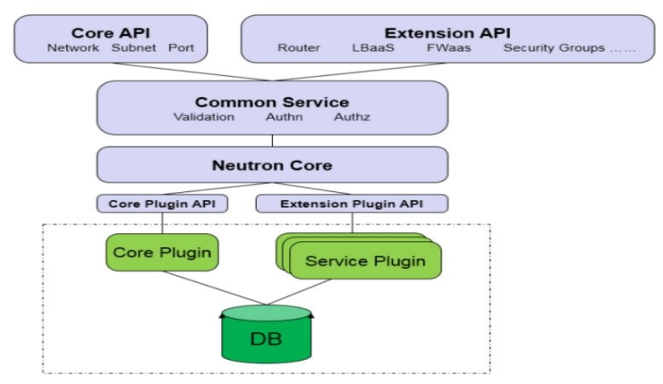

上图是 Neutron Server 的分层结构，至上而下依次为：

* Core API：对外提供管理 network, subnet 和 port 的 RESTful API。
* Extension API：对外提供管理 router, load balance, firewall 等资源 的 RESTful API。
* Commnon Service：认证和校验 API 请求。
* Neutron Core：Neutron server 的核心处理程序，通过调用相应的 Plugin 处理请求。
* Core Plugin API：定义了 Core Plgin 的抽象功能集合，Neutron Core 通过该 API 调用相应的Core Plgin。
* Extension Plugin API：定义了 Service Plgin 的抽象功能集合，Neutron Core 通过该 API 调用相应的 Service Plgin。
* Core Plugin：实现了 Core Plugin API，在数据库中维护 network, subnet 和 port 的状态，并负责调用相应的 agent 在 network provider 上执行相关操作，比如创建 network。
* Service Plugin：实现了 Extension Plugin API，在数据库中维护 router, load balance, security group 等资源的状态，并负责调用相应的 agent 在 network provider 上执行相关操作，比如创建 router。

##### 归纳起来，Neutron Server 包括两部分

1. 提供 API 服务。
2. 运行 Plugin。

即 Neutron Server = API + Plugin

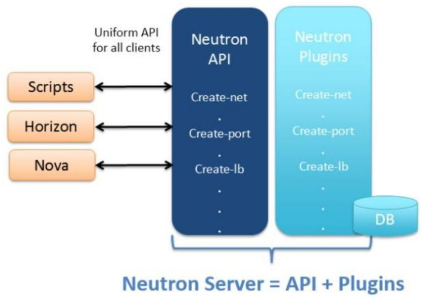

### ML2 Core Plugin 详解

#### Neutron 是如何支持多种 network provider？

上节提到 Core Plugin，其功能是维护数据库中 network, subnet 和 port 的状态，并负责调用相应的 agent 在 network provider 上执行相关操作，比如创建 network。

openstack 中有两大常见 Core Plugin： linux bridge plugin 和 open vswitch plugin。

Neutron 可以通过开发不同的 plugin 和 agent 支持不同的网络技术。这是一种相当开放的架构。不过随着支持的 network provider 数量的增加，开发人员发现了两个突出的问题：

1. 只 能 在 OpenStack 中 使 用 一 种 core plugin ， 多 种 network provider 无 法 共存。只使用一个 core plugin 本身没有问题。但问题在于传统的 core plugin 与 core plugin agent 是一一对应的。也就是说，如果选择了 linux bridge plugin，那么 linux bridge agent 将是唯一选择，就必须在 OpenStack 的所有节点上使用 linux bridge 作为虚拟交换机（即 network provider）。同样的，如果选择 open vswitch plugin， 所有节点上只能使用 open vswitch，而不能使用其他的 network

   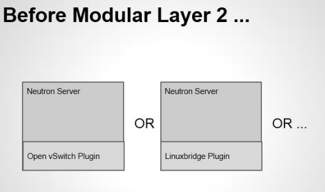
2. 不同 plugin 之间存在大量重复代码，开发新的 plugin 工作量大。所有传统的 core plugin 都需要编写大量重复和类似的数据库访问的代码，大大增加了 plugin开发和维护的工作量。

   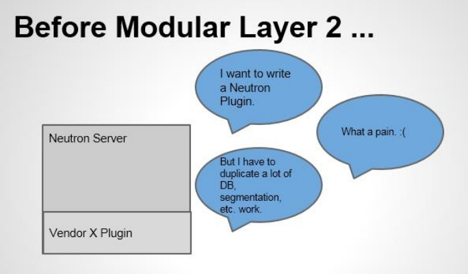

#### ML2 能解决传统 core plugin 的问题

Moduler Layer 2（ML2）：是 Neutron 在 Havana 版本实现的一个新的 core plugin，用于替代原有的 linux bridge plugin 和 open vswitch plugin。 作为新一代的 core plugin，提供了一个框架，允许在 OpenStack 网络中同时使用多种 Layer 2 网络技术，不同的节点可以使用不同的网络实现机制。

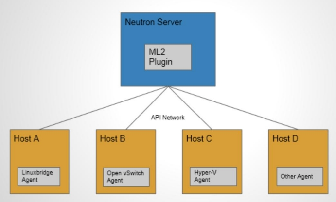

如上图所示，采用 ML2 plugin 后，可以在不同节点上分别部署 linux bridge agent, open vswitch agent, hyper-v agent 或其他第三方 agent。

ML2 不但支持异构部署方案，同时能够与现有的 agent 无缝集成：以前用的 agent 不需要变，只需要将 Neutron server 上的传统 core plugin 替换为 ML2。有了 ML2，要支持新的 network provider 就变得简单多了：无需从头开发 core plugin，只需要开发相应的 mechanism driver，大大减少了要编写和维护的代码。

#### ML2 Core Plugin 详解：

ML2 对二层网络进行抽象和建模，引入了 type driver 和 mechansim driver。这两类 driver 解耦了 Neutron 所支持的网络类型（type）与访问这些网络类型的机制（mechanism），其结果就是使得 ML2 具有非常好的弹性，易于扩展，能够灵活支持多种 type 和 mechanism。

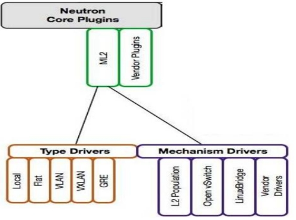

* Type Driver

  * Neutron 支持的每一种网络类型都有一个对应的 ML2 type driver。type driver 负责维护网络类型的状态，执行验证，创建网络等。 ML2 支持的网络类型包括 local, flat, vlan, vxlan 和 gre。
* Mechansim Driver

  * Neutron 支持的每一种网络机制都有一个对应的 ML2 mechansim driver。

mechanism driver 负责获取由 type driver 维护的网络状态，并确保在相应的网络设备（物理或虚拟）上正确实现这些状态。

type 和 mechanisim 都 太 抽 象 ， 现 在 我 们 举 一 个 具 体 的 例 子 ： type driver 为 vlan ，mechansim driver 为 linux bridge，我们要完成的操作是创建 network vlan100，那么：vlan type driver 会确保将 vlan100 的信息保存到 Neutron 数据库中，包括 network 的名称，vlan ID 等

linux bridge mechanism driver 会确保各节点上的 linux brige agent 在物理网卡上创建ID为 100 的 vlan 设备 和 brige 设备，并将两者进行桥接。

mechanism driver 有三种类型：

* Agent-based 包括 linux bridge, open vswitch 等。
* Controller-based 包括 OpenDaylight, VMWare NSX 等。
* 基于物理交换机 包括 Cisco Nexus, Arista, Mellanox 等。 比如前面那个例子如果换成 Cisco 的 mechanism driver，则会在 Cisco 物理交换机的指定 trunk 端口上添加 vlan100。

linux bridge 和 open vswitch 的 ML2 mechanism driver 作用是配置各节点上的虚拟交换机。

linux bridge driver 支持的 type 包括 local, flat, vlan, and vxlan。open vswitch driver 除这4 种 type 还支持 gre。
L2 population driver 作用是优化和限制 overlay 网络中的广播流量。 vxlan 和 gre 都属于 overlay 网络。

ML2 core plugin 已经成为 OpenStack Neutron 的首选 plugin，本教程后面会讨论如何在实验环境中配置 ML2 的各种 type 和 mechansim。

### Service Plugin / Agent 详解

Core Plugin/Agent 负责管理核心实体：net, subnet 和 port。而对于更高级的网络服务，则由Service Plugin/Agent 管理。

Service Plugin 及其 Agent 提供更丰富的扩展功能，包括路由，load balance，firewall 等，如图所示：

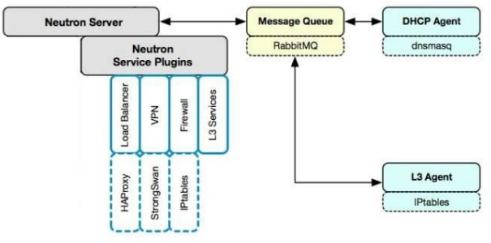

* DHCP
  * dhcp agent 通过 dnsmasq 为 instance 提供 dhcp 服务。
* Routing
  * l3 agent 可以为 project（租户）创建 router，提供 Neutron subnet 之间的路由服务。路由功能默认通过 IPtables 实现。
* Firewall
  * l3 agent 可以在 router 上配置防火墙策略，提供网络安全防护。另一个与安全相关的功能是Security Group，也是通过 IPtables 实现。
  * Firewall 与 Security Group 的区别在于：
    * Firewall 安全策略位于 router，保护的是某个 project 的所有 network。
    * Security Group 安全策略位于 instance，保护的是单个 instance。
* Load Balance
  * Neutron 默认通过 HAProxy 为 project 中的多个 instance 提供 load balance 服务。

### Neutron 架构框架总结

前面我们详细讨论了 Neutron 架构，包括 Neutron Server，Core 和 Service Agent。现在用两张图做个总结。

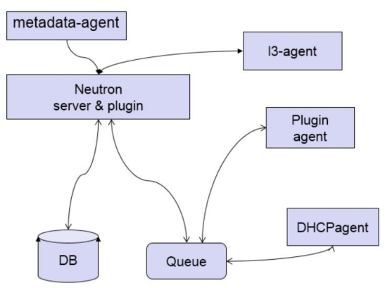

与 OpenStack 其他服务一样，Neutron 采用的是分布式架构，包括 Neutorn Server、各种plugin/agent、database 和 message queue。

1. Neutron server 接收 api 请求。
2. plugin/agent 实现请求。
3. database 保存 neutron 网络状态。
4. message queue 实现组件之间通信。

metadata-agent 之前没有讲到，这里做个补充：

instance 在启动时需要访问 nova-metadata-api 服务获取 metadata 和 userdata，这些data 是该 instance 的定制化信息，比如 hostname, ip， public key 等。但 instance 启动时并没有 ip，那如何通过网络访问到 nova-metadata-api 服务呢？

答 案 就 是 neutron-metadata-agent 该 agent 让 instance 能 够 通 过 dhcp-agent 或 者l3-agent 与 nova-metadata-api

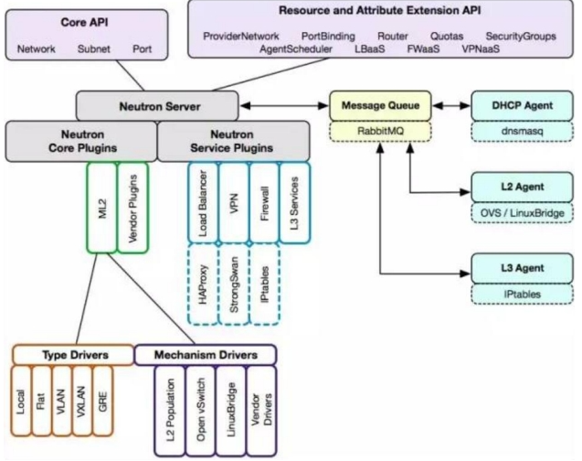

1. Neutron 通过 plugin 和 agent 提供的网络服务。
2. plugin 位于 Neutron server，包括 core plugin 和 service plugin
3. agent 位于各个节点，负责实现网络服务。
4. core plugin 提供 L2 功能，ML2 是推荐的 plugin
5. 使用最广泛的 L2 agent 是 linux bridage 和 open vswitch。
6. service plugin 和 agent 提供扩展功能，包括 dhcp, routing, load balance, firewall, vpn等。

### neutron— 网络实践

#### 虚拟机获取 ip

##### 用 namspace 隔离 DHCP 服务

Neutron 通 过 dnsmasq 提 供 DHCP 服 务 ， 而 dnsmasq 通 过 Linux Network Namespace 独立的为每个 network 服务隔离

在二层网络上，VLAN 可以将一个物理交换机分割成几个独立的虚拟交换机。类似地，在三层网络上，Linux network namespace 可以将一个物理三层网络分割成几个独立的虚拟三层网络。每个 namespace 都有自己独立的网络栈，包括 route table，firewall rule，network interface device 等。

Neutron 通过 namespace 为每个 network 提供独立的 DHCP 和路由服务，从而允许租户创建重叠的网络。如果没有 namespace，网络就不能重叠，这样就失去了很多灵活性。每个 dnsmasq 进程都位于独立的 namespace, 命名为 qdhcp-networkid

其实，宿主机本身也有一个 namespace，叫 root namespace，拥有所有物理和虚拟 interface device。物理 interface 只能位于 root namespace。

新创建的 namespace 默认只有一个 loopback device。管理员可以将虚拟 interface，例如bridge，tap 等设备添加到某个 namespace。

##### 获取 dhcp IP 过程分析

在创建 instance 时，Neutron 会为其分配一个 port，里面包含了 MAC 和 IP 地址信息。这些信息会同步更新到 dnsmasq 的 host 文件。同时 nova-compute 会设置虚机 VIF 的 MAC 地址。一切准备就绪，instance 获取 IP 的过程如下：

1. vm 开机启动，发出 DHCPDISCOVER 广播，该广播消息在整个 net 中都可以被收到。
2. 广 播 到 达 veth  ， 然 后 传 送 给 veth pair 的 另 一 端。dnsmasq 在 它 上 面 监 听 ， dnsmasq 检 查 其 host 文 件 ， 发 现 有 对 应 项 ， 于 是 dnsmasq以 DHCPOFFER 消息将 IP（192.168.254.18）、子网掩码（255.255.255.0）、地址租用期限等信息发送给 vm。
3. vm 发送 DHCPREQUEST 消息确认接受此 DHCPOFFER。
4. dnsmasq 发送确认消息 DHCPACK，整个过程结束。

### VXLAN

#### overlay network 概念

overlay network 是指建立在其他网络上的网络。overlay network 中的节点可以看作通过虚拟（或逻辑）链路连接起来的。overlay network 在底层可能由若干物理链路组成，但对于节点，不需要关心这些底层实现。

例如 P2P 网络就是 overlay network，隧道也是。vxlan 和 gre 都是基于隧道技术实现的，它们也都是 overlay network。

目前 linux bridge 只支持 vxlan，不支持 gre；open vswitch 两者都支持。vxlan 与 gre 实现非常类似，而且 vxlan 用得较多。

#### VXLAN 简介

VXLAN 为 Virtual eXtensible Local Area Network。正如名字所描述的，VXLAN 提供与 VLAN相同的以太网二层服务，但拥有更强的扩展性和灵活性。与 VLAN 相比，

#### VXLAN 有下面几个优势

##### 支持更多的二层网段

VLAN 使用 12-bit 标记 VLAN ID，最多支持 4094 个 VLAN，这对大型云部署会成为瓶颈。VXLAN 的 ID （VNI 或者 VNID）则用 24-bit 标记，支持 16777216 个二层网段。

##### 能更好地利用已有的网络路径

VLAN 使用 Spanning Tree Protocol 避免环路，这会导致有一半的网络路径被 block 掉。VXLAN 的数据包是封装到 UDP 通过三层传输和转发的，可以使用所有的路径。

##### 避免物理交换机 MAC 表耗尽

由于采用隧道机制，TOR (Top on Rack) 交换机无需在 MAC 表中记录虚拟机的信息。

#### VXLAN 封装和包格式

VXLAN 是将二层建立在三层上的网络。通过将二层数据封装到 UDP 的方式来扩展数据中心的二层网段数量。

VXLAN 是一种在现有物理网络设施中支持大规模多租户网络环境的解决方案。VXLAN 的传输协议是 IP + UDP。

VXLAN 定义了一个 MAC-in-UDP 的封装格式。在原始的 Layer 2 网络包前加上 VXLAN header，然后放到 UDP 和 IP 包中。通过 MAC-in-UDP 封装，VXLAN 能够在 Layer 3 网络上建立起了一条Layer 2 的隧道。

##### VXLAN 包的格式如下

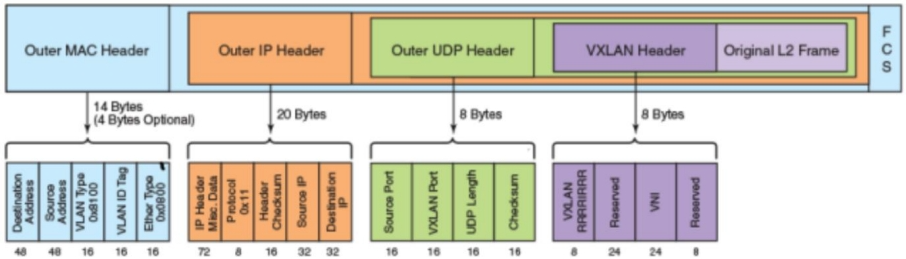

如上图所示，VXLAN 引入了 8-byte VXLAN header，其中 VNI 占 24-bit。VXLAN 和原始的 L2 frame被封装到 UDP 包中。这 24-bit 的 VNI 用于标示不同的二层网段，能够支持 16777216 个 LAN。

##### VXLAN Tunnel Endpoint

VXLAN 使用 VXLAN tunnel endpoint (VTEP) 设备处理 VXLAN 的封装和解封。每个 VTEP 有一个 IP interface，配置了一个 IP 地址。VTEP 使用该 IP 封装 Layer 2 frame，并通过该 IP interface 传输和接收封装后的 VXLAN 数据包。

下面是 VTEP 的示意图：

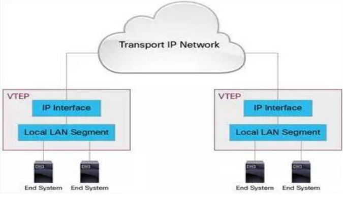

VXLAN 独立于底层的网络拓扑；反过来，两个 VTEP 之间的底层 IP 网络也独立于 VXLAN。VXLAN 数据包是根据外层的 IP header 路由的，该 header 将两端的 VTEP IP 作为源和目标 IP。

#### VXLAN 包转发流程

VXLAN 在 VTEP 间建立隧道，通过 Layer 3 网络传输封装后的 Layer 2 数据。下面例子演示了数据如何在 VXLAN 上传输：

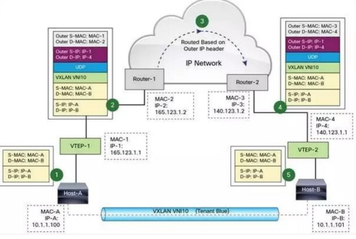

图中 Host-A 和 Host-B 位于 VNI 10 的 VXLAN，通过 VTEP-1 和 VTEP-2之间建立的 VXLAN 隧道通信。数据传输过程如下：

1. Host-A 向 Host-B 发送数据时，Host-B 的 MAC 和 IP 作为数据包的目标 MAC 和 IP，Host-A 的MAC 作为数据包的源 MAC 和 IP，然后通过 VTEP-1 将数据发送出去。
2. VTEP-1 从自己维护的映射表中找到 MAC-B 对应的 VTEP-2，然后执行 VXLAN 封装，加上 VXLAN头，UDP 头，以及外层 IP 和 MAC 头。此时的外层 IP 头，目标地址为 VTEP-2 的 IP，源地址为 VTEP-1的 IP。同时由于下一跳是 Router-1，所以外层 MAC 头中目标地址为 Router-1 的 MAC。
3. 数据包从 VTEP-1 发送出后，外部网络的路由器会依据外层 IP 头进行路由，最后到达与 VTEP-2 连接的路由器 Router-2。
4. Router-2 将数据包发送给 VTEP-2。VTEP-2 负责解封数据包，依次去掉外层 MAC 头，外层 IP 头，UDP 头 和 VXLAN 头。VTEP-2 依据目标 MAC 地址将数据包发送给 Host-B。上面的流程我们看到 VTEP 是 VXLAN 的最核心组件，负责数据的封装和解封。隧道也是建立在 VTEP之间的，VTEP 负责数据的传送。

VTEP 是如何提前获知 IP -- MAC -- VTEP 相关信息的呢？

1. Neutron 知道每一个 port 的状态和信息； port 保存了 IP，MAC 相关数据。
2. instance 启动时，其 port 状态变化过程为：down -> build -> active。
3. 每当 port 状态发生变化时，Neutron 都会通过 RPC 消息通知各节点上的 Neutron agent，使得VTEP 能够更新 VM 和 port 的相关信息。

VTEP 可以根据这些信息判断出其他 Host 上都有哪些 VM，以及它们的 MAC 地址，这样就能直接与之通信，从而避免了不必要的隧道连接和广播。

### Linux 对 VXLAN 的支持

VTEP 可以由专有硬件来实现，也可以使用纯软件实现。目前比较成熟的 VTEP 软件实现包括：

1. 带 VXLAN 内核模块的 Linux
2. Open vSwitch


实现方式：

1. Linux vxlan 创建一个 UDP Socket，默认在 8472 端口监听。
2. Linux vxlan 在 UDP socket 上接收到 vxlan 包后，解包，然后根据其中的 vxlan ID 将它转给某个vxlan interface，然后再通过它所连接的 linux bridge 转给虚机。
3. Linux vxlan 在收到虚机发来的数据包后，将其封装为多播 UDP 包，从网卡发出。

### ML2 mechanism driver： Linux Bridge 和 Open vSwitch

网卡分配示例：

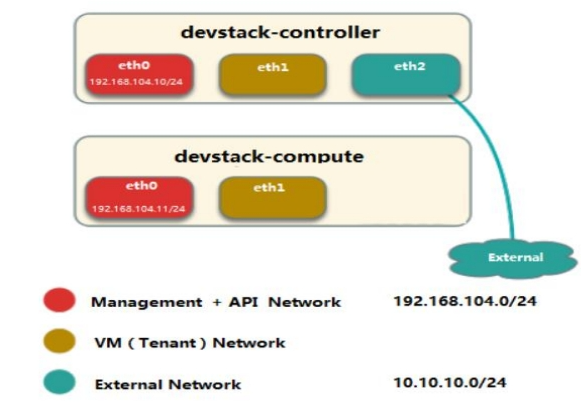

控制节点三个网卡（eth0, eth1, eth2），计算节点两网卡（eth0, eth1）。合并 Management 和 API 网络，使用 eth0，IP 段为 192.168.104.0/24。VM 网络使用 eht1。控制节点的 eth2 与 External 网络连接，IP 段为 10.10.10.0/24。

#### Linux Bridge


#### Open vSwitch

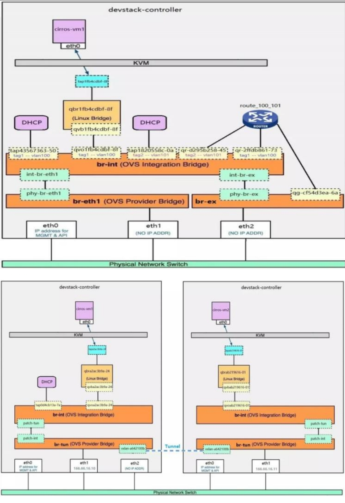

Open vSwitch 中的网络设备

* br-ex：连接外部（external）网络的网桥。
* br-int：集成（integration）网桥，所有 instance 的虚拟网卡和其他虚拟网络设备都将连接到该网桥。
* br-tun：隧道（tunnel）网桥，基于隧道技术的 VxLAN 和 GRE 网络将使用该网桥进行通信。
* tap interface：命名为 tapXXXX。
* linux bridge：命名为 qbrXXXX。
* veth pair：命名为 qvbXXXX, qvoXXXX
* OVS integration bridge：命名为 br-int。
* OVS patch ports：命名为 int-br-ethX 和 phy-br-ethX（X 为 interface 的序号）。
* OVS provider bridge：命名为 br-ethX（X 为 interface 的序号）。
* 物理 interface：命名为 ethX（X 为 interface 的序号）。
* OVS tunnel bridge：命名为 br-tun

## cinder— 存储服务

### cinder 介绍

#### 理解 Block Storag

* 操作系统获得存储空间的方式一般有两种：
  * 通过某种协议（SAS,SCSI,SAN,iSCSI 等）挂接裸硬盘，然后分区、格式化、创建文件系统；或者直接使用裸硬盘存储数据（数据库）
  * 通过 NFS、CIFS 等 协议，mount 远程的文件系统第一种裸硬盘的方式叫做 Block Storage（块存储），每个裸硬盘通常也称作 Volume（卷） 第二种叫
    做文件系统存储。NAS 和 NFS 服务器，以及各种分布式文件系统提供的都是这种存储。

#### 理解 Block Storage Service

Block Storage Servicet 提供对 volume 从创建到删除整个生命周期的管理。从 instance 的角度看，挂载的每一个 Volume 都是一块硬盘。OpenStack 提供 Block Storage Service 的是 Cinder，其具体功能是：

* 提供 REST API 使用户能够查询和管理 volume、volume snapshot 以及 volume type
* 提供 scheduler 调度 volume 创建请求，合理优化存储资源的分配
* 通过 driver 架构支持多种 back-end（后端）存储方式，包括 LVM，NFS，Ceph 和其他诸如 EMC、IBM 等商业存储产品和方

### Cinder 架构

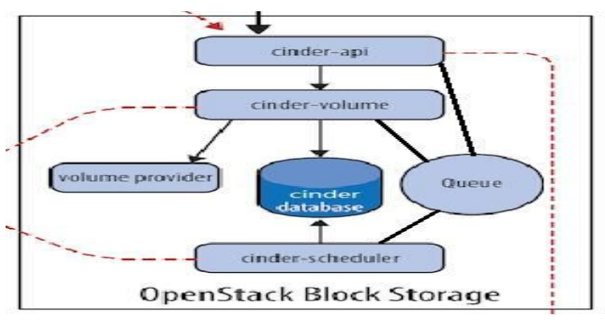

#### Cinder 包含如下几个组件：

##### cinder-api

接收 API 请求， 调用 cinder-volume 。是整个 Cinder 组件的门户，所有 cinder 的请求都首先由cinder-api 处理。cinder-api 向外界暴露若干 HTTP REST API 接口。在 keystone 中我们可以查询cinder-api 的 endponits

客户端可以将请求发送到 endponits 指定的地址，向 cinder-api 请求操作。 当然，作为最终用户的我们不会直接发送 Rest API 请求。OpenStack CLI，Dashboard 和其他需要跟 Cinder 交换的组件会使用这些 API。

cinder-api 对接收到的 HTTP API 请求会做如下处理：

1. 检查客户端传人的参数是否合法有效
2. 调用 cinder 其他子服务的处理客户端请求
3. 将 cinder 其他子服务返回的结果序列号并返回给客户端

cinder-api 接受哪些请求呢？简单的说，只要是 Volume 生命周期相关的操作，cinder-api 都可以响应。大部分操作都可以在 Dashboard 上看到。

##### cinder-volume

管理 volume 的服务，与 volume provider 协调工作，管理 volume 的生命周期。运行 cinder-volume服务的节点被称作为存储节点。

cinder-volume 在存储节点上运行，OpenStack 对 Volume 的操作，最后都是交给 cinder-volume 来完成的。cinder-volume 自身并不管理真正的存储设备，存储设备是由 volume provider 管理的。cinder-volume 与 volume provider 一起实现 volume 生命周期的管理。

通过 Driver 架构支持多种 Volume Provider。

接着的问题是：现在市面上有这么多块存储产品和方案（volume provider），cinder-volume 如何与它们配合呢？

通过的 Driver 架构。 cinder-volume 为这些 volume provider 定义了统一的接口，volume provider只需要实现这些接口，就可以 Driver 的形式即插即用到 OpenStack 系统中。

定期向 OpenStack 报告计算节点的状态

cinder-volume 会定期向 Cinder 报告存储节点的空闲容量来做筛选启动 volume

实现 volume 生命周期管理

Cinder 对 volume 的生命周期的管理最终都是通过 cinder-volume 完成的，包括 volume 的 create、extend、attach、snapshot、delete 等。

##### cinder-scheduler

scheduler 通过调度算法选择最合适的存储节点创建 volume。创建 Volume 时，cinder-scheduler 会基于容量、Volume Type 等条件选择出最合适的存储节点，然后让其创建 Volume。

##### volume provider

数据的存储设备，为 volume 提供物理存储空间。 cinder-volume 支持多种 volume provider，每种volume provider 通过自己的 driver 与 cinder-volume 协调工作。

##### Message Queue

Cinder 各个子服务通过消息队列实现进程间通信和相互协作。因为有了消息队列，子服务之间实现了解耦，这种松散的结构也是分布式系统的重要特征。

##### Database Cinder

有一些数据需要存放到数据库中，一般使用 MySQL。

### Cinder 的设计思想

#### 从 volume 创建流程看 cinder-* 子服务如何协同工作

对于 Cinder 学习来说，Volume 创建是一个非常好的场景，涉及各个 cinder-* 子服务，下面是流程图：

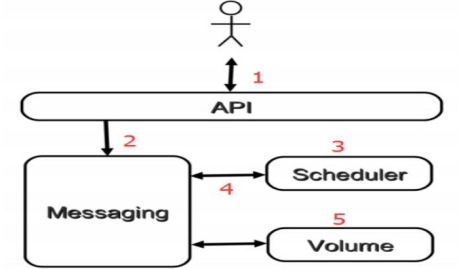

1. 客户（可以是 OpenStack 最终用户，也可以是其他程序）向 API（cinder-api）发送请求：“帮我创建一个 volume”
2. API 对请求做一些必要处理后，向 Messaging（RabbitMQ）发送了一条消息：“让 Scheduler 创建一个 volume”
3. Scheduler（cinder-scheduler）从 Messaging 获取到 API 发给它的消息，然后执行调度算法，从若干计存储点中选出节点 A
4. Scheduler 向 Messaging 发送了一条消息：“让存储节点 A 创建这个 volume”
5. 存储节点 A 的 Volume（cinder-volume）从 Messaging 中获取到 Scheduler 发给它的消息，然后通过 driver 在 volume provider 上创建 volume。

#### API 前端服务

cinder-api 作为 Cinder 组件对外的唯一窗口，向客户暴露 Cinder 能够提供的功能，当客户需要执行volume 相关的操作，能且只能向 cinder-api 发送 REST 请求。这里的客户包括终端用户、命令行和OpenStack 其他组件。

设计 API 前端服务的好处在于：对外提供统一接口，隐藏实现细节

#### API 提供 REST 标准调用服务，便于与第三方系统集成

可以通过运行多个 API 服务实例轻松实现 API 的高可用，比如运行多个 cinder-api 进程Scheduler 调度服务

Cinder 可以有多个存储节点，当需要创建 volume 时，cinder-scheduler 会根据存储节点的属性和资源使用情况选择一个最合适的节点来创建 volume。

调度服务就好比是一个开发团队中的项目经理，当接到新的开发任务时，项目经理会根据任务的难度，每个团队成员目前的工作负荷和技能水平，将任务分配给最合适的开发人员。

#### Worker 工作服务

调度服务只管分配任务，真正执行任务的是 Worker 工作服务。

在 Cinder 中，这个 Worker 就是 cinder-volume 了。这种 Scheduler 和 Worker 之间职能上的划分使得 OpenStack 非常容易扩展：当存储资源不够时可以增加存储节点（增加 Worker）。 当客户的请求量太大调度不过来时，可以增加 Scheduler。

#### Driver 框架

OpenStack 作为开放的 Infrastracture as a Service 云操作系统，支持业界各种优秀的技术，这些技术可能是开源免费的，也可能是商业收费的。

这种开放的架构使得 OpenStack 保持技术上的先进性，具有很强的竞争力，同时又不会造成厂商锁定（Lock-in）。 那 OpenStack 的这种开放性体现在哪里呢？一个重要的方面就是采用基于 Driver 的框架

以 Cinder 为例，存储节点支持多种 volume provider，包括 LVM, NFS, Ceph, GlusterFS，以及 EMC, IBM 等商业存储系统。

cinder-volume 为这些 volume provider 定义了统一的 driver 接口，volume provider 只需要实现这些接口，就可以 driver 的形式即插即用到 OpenStack 中。下面是 cinder driver的架构示意图：

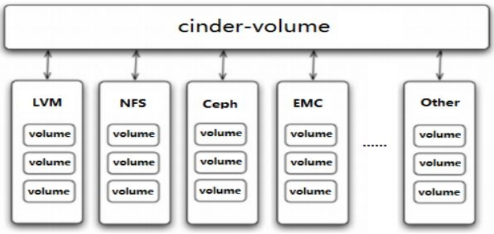

在 cinder-volume 的配置文件 /etc/cinder/cinder.conf 中 volume_driver 配置项设置该存储节点使用哪种 volume provider 的 driver。

## horizon— Web 管理界

### horizon 介绍

Horizon 为 Openstack 提供一个 WEB 前端的管理界面 (UI 服务 )通过 Horizone 所提供的DashBoard 服务 , 管理员可以使用通过 WEB UI 对 Openstack 整体云环境进行管理 , 并可直观看到各种操作结果与运行状态。

### DashBoard 与其他组件的关系

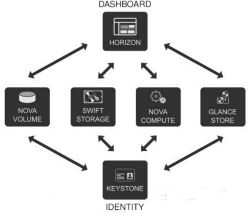

## Reference Links：
