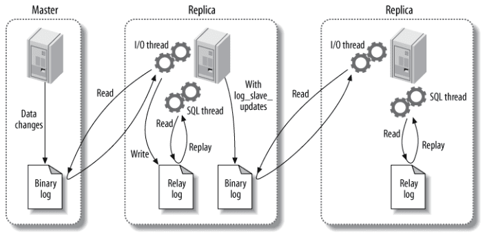
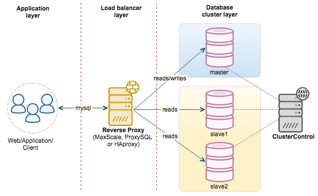

## 主从复制

主要涉及三个线程: binlog 线程、I/O 线程和 SQL 线程。

* **binlog 线程** : 负责将主服务器上的数据更改写入二进制日志中。
* **I/O 线程** : 负责从主服务器上读取二进制日志，并写入从服务器的中继日志中。
* **SQL 线程** : 负责读取中继日志并重放其中的 SQL 语句。



### 主从复制原理步骤简介

1. **`START SLAVE` 启动主从复制：**
   * 在从服务器上执行 `START SLAVE;` 命令，启动从服务器的复制进程。
2. **Slave I/O 线程连接 Master 服务器：**
   * 从服务器的 I/O 线程通过在主服务器上授权的复制用户连接到主服务器。
3. **I/O 线程请求指定 binlog 文件和位置的数据：**
   * 从服务器的 I/O 线程会发送一个请求，包括指定的 binlog 文件名和位置（`CHANGE MASTER TO` 命令中指定）。
4. **Master 的 Binlog Dump 线程响应请求：**
   * Master 服务器上的 Binlog Dump 线程根据从服务器 I/O 线程的请求信息，读取指定 binlog 文件和位置之后的日志信息。
5. **Master 返回 Binlog 数据给 Slave I/O 线程：**
   * Master 服务器将读取到的 binlog 数据返回给从服务器的 I/O 线程。
6. **Slave I/O 线程写入 Relay Log 和更新 Master-Info 文件：**
   * 从服务器的 I/O 线程接收到 Master 返回的 binlog 数据后，将这些数据写入从服务器的 Relay Log（中继日志）。
   * 同时，从服务器更新 Master-Info 文件，记录新的 binlog 文件名和位置，用于下一次读取 binlog 数据时的起点。
7. **Slave SQL 线程执行 Relay Log 中的 SQL 语句：**
   * 从服务器的 SQL 线程实时监测 Relay Log 的新增日志内容，并解析其中的 SQL 语句。
   * SQL 线程按照解析出的 SQL 语句的顺序在从服务器上执行这些语句。

### 配置MySQL主从复制

#### 在主服务器上进行配置

**开启二进制日志：**

* 打开主服务器的 MySQL 配置文件（通常是 `/etc/my.cnf` 或 `/etc/mysql/my.cnf`），添加或修改以下配置：

  ```
  server-id = 1
  log_bin = /var/log/mysql/mysql-bin.log
  ```

  * `server-id` 是主服务器的唯一标识，可以是任意正整数。
  * `log_bin` 指定二进制日志文件的路径。

**创建复制账户：**

* 在 MySQL 中创建一个专用于复制的账户。确保该账户拥有 `REPLICATION SLAVE` 权限。

  ```
  CREATE USER 'replication_user'@'%' IDENTIFIED BY 'password';
  GRANT REPLICATION SLAVE ON *.* TO 'replication_user'@'%';
  FLUSH PRIVILEGES;
  ```

**锁定主服务器并获取二进制日志位置：**

* 在主服务器上执行以下命令，锁定数据库表，获取当前二进制日志的位置信息。

  ```
  FLUSH TABLES WITH READ LOCK;
  SHOW MASTER STATUS;
  ```

  * 记下 `File` 和 `Position` 字段的值，它们将在从服务器上用于指定复制的起始位置。

#### 在从服务器上进行配置

**设置从服务器的唯一标识：**

* 打开从服务器的 MySQL 配置文件，添加或修改以下配置：

  ```
  server-id = 2
  ```

  * `server-id` 是从服务器的唯一标识，确保它与主服务器不同。

**配置从服务器连接主服务器：**

* 执行以下命令配置从服务器连接到主服务器。将 `<Master_IP>`、`<Master_User>`、`<Master_Password>`、`<File>` 和 `<Position>` 替换为实际的值。

  ```
  CHANGE MASTER TO
    MASTER_HOST = '<Master_IP>',
    MASTER_USER = 'replication_user',
    MASTER_PASSWORD = 'password',
    MASTER_LOG_FILE = '<File>',
    MASTER_LOG_POS = <Position>;

  START SLAVE;
  ```

  * 这会启动从服务器的复制过程。

**解锁主服务器：**

* 在主服务器上执行以下命令，解锁表，允许主服务器继续写入数据。

  ```
  UNLOCK TABLES;
  ```

**检查从服务器的复制状态：**

* 在从服务器上执行 `SHOW SLAVE STATUS;` 命令，检查 `Slave_IO_Running` 和 `Slave_SQL_Running` 字段，确保均为 `Yes`，表示复制正在正常运行。

  ```
  SHOW SLAVE STATUS;
  ```

以上是一个基本的配置示例，实际场景可能需要根据需求进行调整和优化。确保网络稳定、账户权限正确，并定期监控复制状态以及主从服务器的性能。


## 读写分离

主服务器处理写操作以及实时性要求比较高的读操作，而从服务器处理读操作。

读写分离能提高性能的原因在于:

* 主从服务器负责各自的读和写，极大程度缓解了锁的争用；
* 从服务器可以使用 MyISAM，提升查询性能以及节约系统开销；
* 增加冗余，提高可用性。

读写分离常用代理方式来实现，代理服务器接收应用层传来的读写请求，然后决定转发到哪个服务器。



# Reference Links

https://pdai.tech/md/db/sql-mysql/sql-mysql-slave.html
