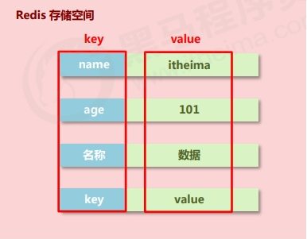
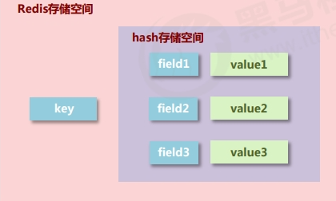
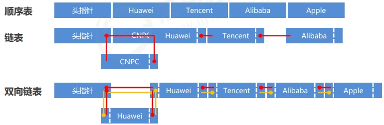
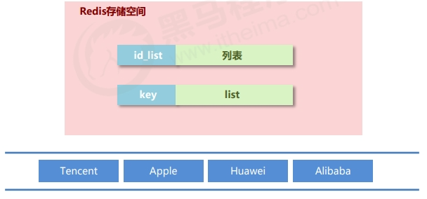
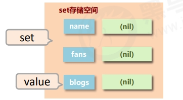
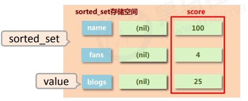

> redis笔记部分内容来哔哩哔哩上黑马程序员redis教学视频，想学习redis的同学可以前去观看。

## Redis简介

Redis（Remote Dictionary Server）是一个开源的内存数据存储系统，它可以用作数据库、缓存和消息中间件。

redis为每个服务提供有16个数据库，编号从0到15。每个数据库之间的数据相互独立

## Redis安装（docker）

编写yml安装文件docker_redis.yml

```
vim /data/sa/docker_redis.yml
#复制以下内容
version: '3.3'
services:
  redis:
    image: redis:latest
    container_name: redis
    networks:
      test_network:
    restart: always
    ports:
      - '6379:6379'
    volumes:
      - /data/app/redis/data:/data
      - /data/app/redis/redis.conf:/usr/local/etc/redis/redis.conf
      - /data/app/redis/logs:/logs
    #配置文件启动
    command: redis-server /usr/local/etc/redis/redis.conf
networks:
    test_network:
```

配置redis.config

```
vim /data/app/redis/redis.conf
#复制以下内容

# Redis 服务器的端口号（默认：6379）
port 6379

# 绑定的 IP 地址，如果设置为 127.0.0.1，则只能本地访问；若设置为 0.0.0.0，则监听所有接口（默认：127.0.0.1）
bind 0.0.0.0

# 设置密码，客户端连接时需要提供密码才能进行操作，如果不设置密码，可以注释掉此行（默认：无）
# requirepass foobared
requirepass xj2023

# 设置在客户端闲置一段时间后关闭连接，单位为秒（默认：0，表示禁用）
# timeout 0

# 是否以守护进程（daemon）模式运行，默认为 "no"，设置为 "yes" 后 Redis 会在后台运行
daemonize no

# 设置日志级别（默认：notice）。可以是 debug、verbose、notice、warning
loglevel notice

# 设置日志文件的路径（默认：空字符串），如果不设置，日志会输出到标准输出
logfile ""

# 设置数据库数量（默认：16），Redis 使用数据库索引从 0 到 15
databases 16

# 是否启用 AOF 持久化，默认为 "no"。如果设置为 "yes"，将在每个写操作执行时将其追加到文件中
appendonly no

# 设置 AOF 持久化的文件路径（默认：appendonly.aof）
# appendfilename "appendonly.aof"

# AOF 持久化模式，默认为 "always"。可以是 always、everysec 或 no
# always：每个写操作都立即同步到磁盘
# everysec：每秒钟同步一次到磁盘
# no：完全依赖操作系统的行为，可能会丢失数据，但性能最高
# appendfsync always

# 设置是否在后台进行 AOF 文件重写，默认为 "no"
# auto-aof-rewrite-on-rewrite no

# 设置 AOF 文件重写触发时，原 AOF 文件大小与新 AOF 文件大小之间的比率（默认：100）
# auto-aof-rewrite-percentage 100

# 设置是否开启 RDB 持久化，默认为 "yes"。如果设置为 "no"，禁用 RDB 持久化功能
save 900 1
save 300 10
save 60 10000

# 设置 RDB 持久化文件的名称（默认：dump.rdb）
# dbfilename dump.rdb

# 设置 RDB 持久化文件的保存路径，默认保存在当前目录
# dir ./

# 设置是否开启对主从同步的支持，默认为 "no"
# slaveof <masterip> <masterport>

# 设置主从同步时是否进行数据完整性校验，默认为 "yes"
# repl-diskless-sync no

# 设置在复制时是否进行异步复制，默认为 "yes"，可以加快复制速度，但会增加数据丢失的风险
# repl-backlog-size 1mb

# 设置是否开启集群模式（cluster mode），默认为 "no"
# cluster-enabled no

# 设置集群中的节点超时时间（默认：15000毫秒）
# cluster-node-timeout 15000

# 设置集群中节点间通信使用的端口号（默认：0）
# cluster-announce-port 0

# 设置集群中节点间通信使用的 IP 地址
# cluster-announce-ip 127.0.0.1

# 设置是否开启慢查询日志，默认为 "no"
# slowlog-log-slower-than 10000

# 设置慢查询日志的最大长度，默认为 128
# slowlog-max-len 128

# 设置每秒最大处理的写入命令数量，用于保护 Redis 服务器不被超负荷写入（默认：0，表示不限制）
# maxclients 10000

# 设置最大连接客户端数量（默认：10000，0 表示不限制）
# maxmemory <bytes>

# 设置最大使用内存的策略（默认：noeviction）。可以是 volatile-lru、allkeys-lru、volatile-random、allkeys-random、volatile-ttl 或 noeviction
# maxmemory-policy noeviction

# 设置允许最大使用内存的比例（默认：0），设置为 0 表示禁用
# maxmemory-samples 5
```

启动redis容器

```
sudo docker compose -f docker_redis.yml up -d
```

## Redis工具

redis官方推荐的工具：[Tools | Redis](https://redis.io/resources/tools/)

windows上常用管理redis的工具：RedisDesktopManager

RedisDesktopManager的 git 地址：[Releases · RedisInsight/RedisDesktopManager (github.com)](https://github.com/RedisInsight/RedisDesktopManager)

## 服务器基础配置

```
#服务器端设定
daemonize yes|no		#设置服务器以守护进程的方式运行
bind 127.0.0.1			#绑定主机地址
port 6379			#设置服务器端口号
databases 16			#设置数据库数量


#日志配置
loglevel debug|verbose|notice|warning	#设置服务器以指定日志记录级别
logfile 端口号.log			#日志记录文件名


#客户端配置
maxclients 0	#设置同一时间最大客户端连接数，默认无限制。当客户端连接到达上限，Redis会关闭新的连接
timeout 300	#客户端闲置等待最大时长，达到最大值后关闭连接。如需关闭该功能，设置为 0


#多服务器快捷配置
include /path/server-端口号.conf		#导入并加载指定配置文件信息，用于快速创建redis公共配置较多的redis实例配置文件，便于维护

```

日志级别开发期设置为verbose即可，生产环境中配置为notice，简化日志输出量，降低写日志IO的频度

## Redis数据结构

* redis 自身是一个 Map，其中所有的数据都是采用 key : value 的形式存储
* 数据类型指的是存储的数据的类型，也就是 value 部分的类型，key 部分永远都是字符串



Redis支持多种数据结构，常用的包括：

* **字符串(String):** 存储字符串、整数或者浮点数。
* **哈希(Hashe):** 存储字段和与其关联的值。
* **列表(List):** 双向链表，可以在两端进行插入和删除操作。
* **集合(Set):** 无序的唯一元素集合。
* **有序集合(Sorted Set):** 元素带有分数，可以按分数排序。

Redis数据结构不止以上几种。

### 字符串（String）

字符串是最简单的数据类型，可以存储文本、整数或二进制数据。通常使用字符串，如果字符串以整数的形式展示，可以作为数字操作使用。在Redis中，字符串的最大长度是512MB。

常见命令：

* `set key value`: 设置键值对。
* `get key`: 获取键对应的值。
* `incr key`: 将键对应的值增加1
* `del key`: 删除键
* `mset key1 key2 key3`: 添加/修改多个数据
* `mset key1 key2 key3`: 获取多个数据
* `strlen key`: 获取数据字符个数（字符串长度）
* `append key`: 追加信息到原始信息后部（如果原始信息存在就追加，否则新建）

#### string 作为数值操作

* string在redis内部存储默认就是一个字符串，当遇到增减类操作incr，decr时会转成数值型进行计算。
  * 按数值进行操作的数据，如果原始数据不能转成数值，或超越了redis 数值上限范围，将报错。
* redis所有的操作都是原子性的，采用单线程处理所有业务，命令是一个一个执行的，因此无需考虑并发
  带来的数据影响。

设置数值数据增加指定范围的值

```
incr key
incrby key increment
incrbyfloat key increment
```

设置数值数据减少指定范围的值

```
decr key
decrby key increment
```

redis 控制数据的生命周期，通过数据是否失效控制业务行为，适用于所有具有时效性限定控制的操作。

设置数据具有指定的生命周期

```
setex key seconds value
psetex key milliseconds value
```

#### string 类型数据操作的注意事项

* 数据操作不成功的反馈与数据正常操作之间的差异
  * 表示运行结果是否成功
    * (integer) 0 → false 失败
    * (integer) 1 → true 成功
  * 表示运行结果值
    * (integer) 3 → 3 （3个）
    * (integer) 1 → 1 （1个）
  * 数据未获取到
    * （nil）等同于null
  * 数据最大存储量
    * 512MB
  * 数值计算最大范围（java中的long的最大值）
    * 9223372036854775807

### 哈希（Hash）

哈希是键值对的集合，适用于存储对象。一个哈希可以包含多个字段和与字段相关联的值。

一个存储空间保存多个键值对数据，底层使用哈希表结构实现数据存储。



#### hash存储结构优化

如果field数量较少，存储结构优化为类数组结构

如果field数量较多，存储结构使用HashMap结构

#### 常见命令

添加/修改数据

```
hset key field value

hmset key field1 value1 field2 value2 … 	#添加/修改多个数据

hincrby key field increment			#设置指定字段的数值数据增加指定范围的值
hincrbyfloat key field increment		#设置指定字段的数值数据增加指定范围的值
```

获取数据

```
hget key field
hgetall key

hmget key field1 field2 …			#获取多个数据
hlen key					#获取哈希表中字段的数量
hexists key field				#获取哈希表中是否存在指定的字段

hkeys key					#获取哈希表中所有的字段名
hvals key					#获取哈希表中所有的字段值
```

删除数据

```
hdel key field1 [field2]
```

#### 使用注意

hash类型下的value只能存储字符串，不允许存储其他数据类型，不存在嵌套现象。如果数据未获取到，对应的值为（nil）

每个 hash 可以存储 2^32-1个键值对

hash类型十分贴近对象的数据存储形式，并且可以灵活添加删除对象属性。但hash设计初衷不是为了存储大量对象而设计的，切记不可滥用，更不可以将hash作为对象列表使用.

hgetall 操作可以获取全部属性，如果内部field过多，遍历整体数据效率就很会低，有可能成为数据访问瓶颈。

### 列表（List）

列表是一个有序的字符串元素集合，可以在两端进行插入和删除操作。可以用来实现队列、栈等数据结构。

一个存储空间保存多个数据，且通过数据可以体现进入顺序。

保存多个数据，底层使用双向链表存储结构实现

redis 应用于具有操作先后顺序的数据控制





#### 常见命令

添加数据

```
lpush key value1 [value2] ……	#将一个或多个值插入到列表的头部。如果键不存在，会先创建一个空列表。
rpush key value1 [value2] ……	#将一个或多个值插入到列表的尾部。如果键不存在，会先创建一个空列表。
```

获取数据

```
lrange key start stop		#获取列表指定范围内的元素，范围由 start 和 stop 指定（包含两端的元素）。
lindex key index		#获取列表中指定位置的元素，索引从0开始。
llen key 			#获取列表的长度，即列表中元素的数量。
```

获取并移除数据

```
lpop key			#移除并返回列表头部的元素。
rpop key			#移除并返回列表尾部的元素。
```

规定时间内获取并移除数据

```
blpop key1 [key2] timeout	#阻塞式的列表弹出操作，从左边弹出元素，如果列表为空，则会阻塞等待有元素可弹出，直到超时。
brpop key1 [key2] timeout	#阻塞式的列表弹出操作，从右边弹出元素，如果列表为空，则会阻塞等待有元素可弹出，直到超时。
brpoplpush source destination timeout	#阻塞式的列表弹出和推入操作，将列表 source 的右侧元素弹出并推入到列表 destination 的左侧，如果 source 为空，则会阻塞等待有元素可弹出，直到超时。
```

移除指定数据

```
lrem key count value
```

从列表中移除元素，count 参数指定了移除的规则：

* count > 0：从列表头开始向尾部移除值为 value 的元素，移除数量为 count。
* count < 0：从列表尾部开始向头部移除值为 value 的元素，移除数量为 count 的绝对值。
* count = 0：移除所有值为 value 的元素。

#### 使用注意

list中保存的数据都是string类型的，数据总容量是有限的，最多2^32-1个元素 (4294967295)。

list具有索引的概念，但是操作数据时通常以队列的形式进行入队出队操作，或以栈的形式进行入栈出栈操作

获取全部数据操作结束索引设置为-1

list可以对数据进行分页操作，通常第一页的信息来自于list，第2页及更多的信息通过数据库的形式加载

### 集合（Set）

集合是一个无序的字符串元素集合，且元素不能重复。适用于存储唯一值。

存储大量的数据，在查询方面提供更高的效率。

与hash存储结构完全相同，仅存储键，不存储值（nil），并且值是不允许重复的




#### 常见命令

添加数据

```
sadd key member1 [member2]
```

获取全部数据

```
smembers key
```

删除数据

```
srem key member1 [member2]
```

获取集合数据总量

```
scard key
```

判断集合中是否包含指定数据

```
sismember key member
```

随机获取集合中指定数量的数据

```
srandmember key [count]
```

随机获取集合中的某个数据并将该数据移出集合

```
spop key [count]
```

求两个集合的交、并、差集

```
sinter key1 [key2] 
sunion key1 [key2] 
sdiff key1 [key2]
```

求两个集合的交、并、差集并存储到指定集合中

```
sinterstore destination key1 [key2] 
sunionstore destination key1 [key2] 
sdiffstore destination key1 [key2] 
```

将指定数据从原始集合中移动到目标集合中

```
smove source destination member
```

#### 使用注意

set 类型不允许数据重复，如果添加的数据在 set 中已经存在，将只保留一份。

set 虽然与hash的存储结构相同，但是无法启用hash中存储值的空间。

### 有序集合（Sorted Set）

有序集合类似于集合，但每个成员都关联一个分数（score），可以用分数来对成员进行排序。



#### 常见命令

添加数据

```
zadd key score1 member1 [score2 member2]
```

获取全部数据

```
zrange key start stop [WITHSCORES]
zrevrange key start stop [WITHSCORES]
```

删除数据

```
zrem key member [member ...]
```

按条件获取数据

```
zrangebyscore key min max [WITHSCORES] [LIMIT]
zrevrangebyscore key max min [WITHSCORES]
```

条件删除数据

```
zremrangebyrank key start stop
zremrangebyscore key min max
```

* min与max用于限定搜索查询的条件
* start与stop用于限定查询范围，作用于索引，表示开始和结束索引
* offset与count用于限定查询范围，作用于查询结果，表示开始位置和数据总量

获取集合数据总量

```
zcard key
zcount key min max
```

集合交、并操作

```
zinterstore destination numkeys key [key ...]
zunionstore destination numkeys key [key ...]
```

## 通用指令

### key 基本操作

删除指定key

```
del key
```

获取key是否存在

```
exists key
```

获取key的类型

```
type key
```

### key 扩展操作（时效性控制）

为指定key设置有效期

```
expire key seconds
pexpire key milliseconds
expireat key timestamp
pexpireat key milliseconds-timestamp
```

获取key的有效时间

```
ttl key
pttl key
```

切换key从时效性转换为永久性

```
persist key
```

### key 扩展操作（查询模式）

查询key

```
keys pattern
```

查询模式规则

* `*`匹配任意数量的任意符号
* `?` 配合一个任意符号
* `[]`匹配一个指定符号

```
keys * 			#查询所有
keys it* 		#查询所有以it开头
keys *heima 		#查询所有以heima结尾
keys ??heima 		#查询所有前面两个字符任意，后面以heima结尾
keys user:? 		#查询所有以user:开头，最后一个字符任意
keys u[st]er:1 		#查询所有以u开头，以er:1结尾，中间包含一个字母，s或t
```

### key 其他操作

为key改名

```
rename key newkey
renamenx key newkey
```

对所有key排序

```
sort
```

其他key通用操作

```
help @generic
```

### 数据库通用操作

切换数据库

```
select index
```

其他操作

```
quit
ping
echo message
```

数据移动

```
move key db
```

数据清除

```
dbsize
flushdb
flushall
```

## Reference Links：

https://www.bilibili.com/video/BV1rV411M7eU
