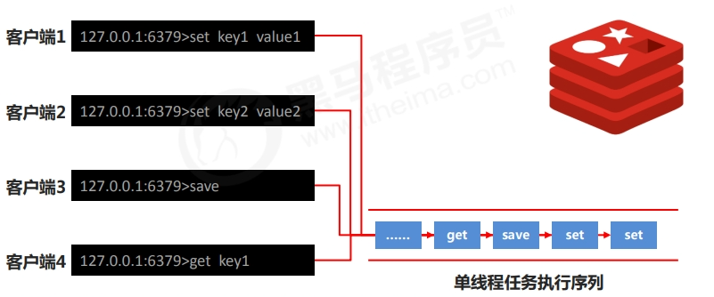
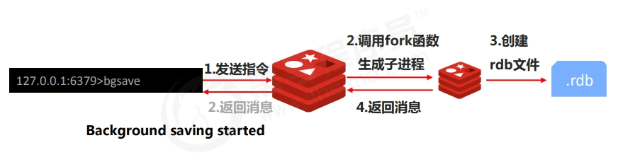
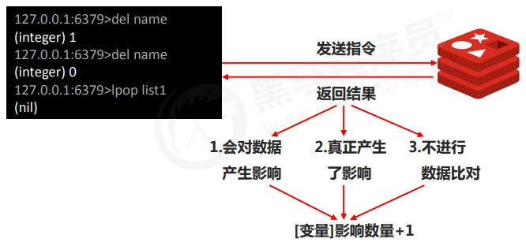
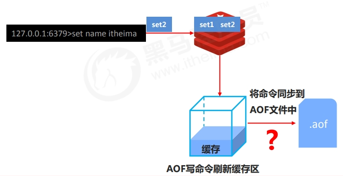
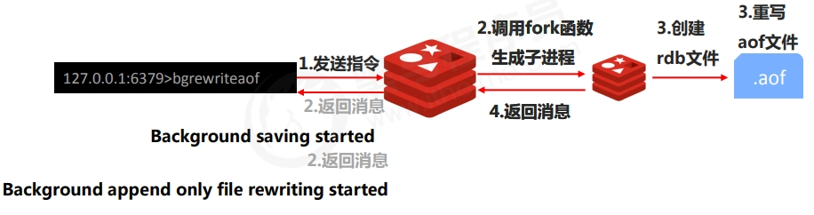
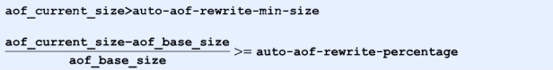
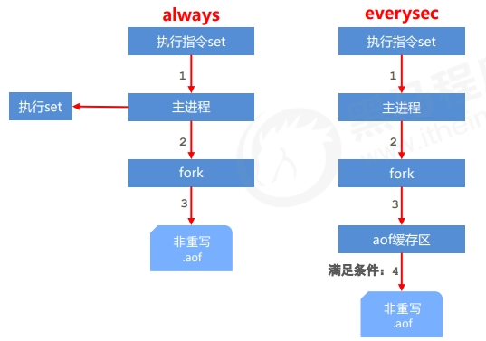
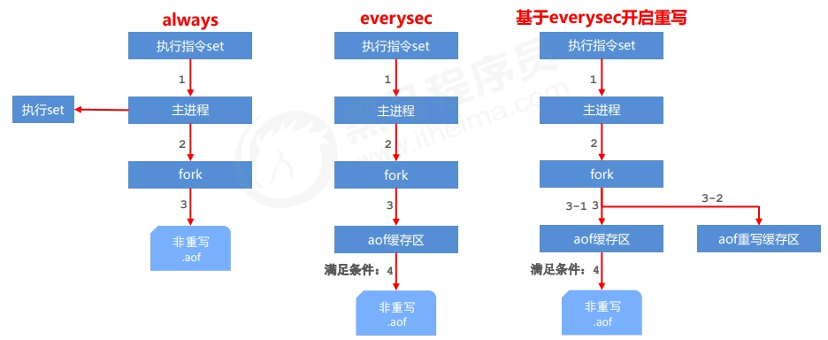
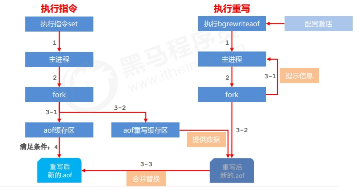

## Redis持久化

利用永久性存储介质将数据进行保存，在特定的时间将保存的数据进行恢复的工作机制称为持久化。持久化可以防止数据的意外丢失，确保数据安全性。

Redis支持两种方式的持久化：

* **RDB（Redis DataBase）快照：** 将数据的快照保存到磁盘。
* **AOF（Append-Only File）日志：** 记录每个写操作，以便在重启时重新执行。

### RDB

#### RDB启动方式 —— save指令

* 手动执行一次保存操作。
* save指令的执行会阻塞当前Redis服务器，直到当前RDB过程完成为止，有可能会造成长时间阻塞，线上环境不建议使用。

```
save
```

#### RDB启动方式 —— save指令相关配置

##### dbfilename dump.rdb

说明：设置本地数据库文件名，默认值为 dump.rdb
经验：通常设置为dump-端口号.rdb

##### dir

说明：设置存储.rdb文件的路径
经验：通常设置成存储空间较大的目录中，目录名称data

##### rdbcompression yes

说明：设置存储至本地数据库时是否压缩数据，默认为 yes，采用 LZF 压缩
经验：通常默认为开启状态，如果设置为no，可以节省 CPU 运行时间，但会使存储的文件变大（巨大）

##### rdbchecksum yes

说明：设置是否进行RDB文件格式校验，该校验过程在写文件和读文件过程均进行
经验：通常默认为开启状态，如果设置为no，可以节约读写性过程约10%时间消耗，但是存储一定的数据损坏风险

#### RDB启动方式 —— save指令工作原理



#### RDB启动方式 —— bgsave指令

* 手动启动后台保存操作，但不是立即执行
* bgsave命令是针对save阻塞问题做的优化。Redis内部所有涉及到RDB操作都采用bgsave的方式，save命令可以放弃使用。

```
bgsave
```

#### RDB启动方式 —— bgsave指令工作原理



#### RDB启动方式 —— bgsave指令相关配置

* dbfilename dump.rdb
* dir
* rdbcompression yes
* rdbchecksum yes
* stop-writes-on-bgsave-error yes
  * 说明：后台存储过程中如果出现错误现象，是否停止保存操作
  * 经验：通常默认为开启状态

#### RDB启动方式 ——save配置

配置

```
save second changes	#满足限定时间范围内key的变化数量达到指定数量即进行持久化
```

* second：监控时间范围
* changes：监控key的变化量

在conf文件中进行配置

示例：

```
save 900 1
save 300 10
save 60 10000
```

#### RDB启动方式 ——save配置原理



##### 注意

* save配置要根据实际业务情况进行设置，频度过高或过低都会出现性能问题，结果可能是灾难性的
* save配置中对于second与changes设置通常具有互补对应关系，尽量不要设置成包含性关系
* save配置启动后执行的是bgsave操作

#### RDB启动方式对比

| 方式           | save指令 | bgsave指令 |
| -------------- | -------- | ---------- |
| 读写           | 同步     | 异步       |
| 阻塞客户端指令 | 是       | 否         |
| 额外内存消耗   | 否       | 是         |
| 启动新进程     | 否       | 是         |

#### RDB特殊启动形式

##### 全量复制

在主从复制中详细讲解

##### 服务器运行过程中重启

```
debug reload
```

##### 关闭服务器时指定保存数据

```
shutdown save
```

默认情况下执行shutdown命令时，自动执行bgsave(如果没有开启AOF持久化功能)

#### RDB优点

* RDB是一个紧凑压缩的二进制文件，存储效率较高
* RDB内部存储的是redis在某个时间点的数据快照，非常适合用于数据备份，全量复制等场景
* RDB恢复数据的速度要比AOF快很多
* 应用：服务器中每X小时执行bgsave备份，并将RDB文件拷贝到远程机器中，用于灾难恢复。

#### Rdb缺点

* RDB方式无论是执行指令还是利用配置，无法做到实时持久化，具有较大的可能性丢失数据
* bgsave指令每次运行要执行fork操作创建子进程，要牺牲掉一些性能
* Redis的众多版本中未进行RDB文件格式的版本统一，有可能出现各版本服务之间数据格式无法兼容现象

#### RDB存储的弊端

* 存储数据量较大，效率较低，基于快照思想，每次读写都是全部数据，当数据量巨大时，效率非常低
* 大数据量下的IO性能较低
* 基于fork创建子进程，内存产生额外消耗
* 宕机带来的数据丢失风险

##### 解决思路

* 不写全数据，仅记录部分数据
* 降低区分数据是否改变的难度，改记录数据为记录操作过程
* 对所有操作均进行记录，排除丢失数据的风险

### AOF

#### AOF概念

AOF(append only file)持久化：以独立日志的方式记录每次写命令，重启时再重新执行AOF文件中命令达到恢复数据的目的。与RDB相比可以简单描述为改记录数据为记录数据产生的过程

AOF的主要作用是解决了数据持久化的实时性，目前已经是Redis持久化的主流方式

#### AOF写数据过程



#### AOF写数据三种策略(appendfsync)

* always(每次）
  * 每次写入操作均同步到AOF文件中，数据零误差，性能较低，不建议使用。
* everysec（每秒）
  * 每秒将缓冲区中的指令同步到AOF文件中，数据准确性较高，性能较高，建议使用，也是默认配置
  * 在系统突然宕机的情况下丢失1秒内的数据
* no（系统控制）
  * 由操作系统控制每次同步到AOF文件的周期，整体过程不可控

### AOF功能开启

```
appendonly yes|no			#是否开启AOF持久化功能，默认为不开启状态
appendfsync always|everysec|no		#AOF写数据策略
appendfilename filename			#AOF持久化文件名，默认文件名未appendonly.aof，建议配置为appendonly-端口号.aof
dir					#AOF持久化文件保存路径，与RDB持久化文件保持一致即可
```

### AOF重写

随着命令不断写入AOF，文件会越来越大，为了解决这个问题，Redis引入了AOF重写机制压缩文件体积。AOF文件重
写是将Redis进程内的数据转化为写命令同步到新AOF文件的过程。简单说就是将对同一个数据的若干个条命令执行结
果转化成最终结果数据对应的指令进行记录。

##### AOF重写作用

* 降低磁盘占用量，提高磁盘利用率
* 提高持久化效率，降低持久化写时间，提高IO性能
* 降低数据恢复用时，提高数据恢复效率

##### AOF重写规则

* 进程内已超时的数据不再写入文件
* 忽略无效指令，重写时使用进程内数据直接生成，这样新的AOF文件只保留最终数据的写入命令
  * 如del key1、 hdel key2、srem key3、set key4 111、set key4 222等
* 对同一数据的多条写命令合并为一条命令
  * 如lpush list1 a、lpush list1 b、 lpush list1 c 可以转化为：lpush list1 a b c。
  * 为防止数据量过大造成客户端缓冲区溢出，对list、set、hash、zset等类型，每条指令最多写入64个元素

##### AOF重写方式

手动重写

```
bgrewriteaof
```

自动重写

```
auto-aof-rewrite-min-size size
auto-aof-rewrite-percentage percentage
```

#### AOF手动重写 —— bgrewriteaof指令工作原理



#### AOF自动重写方式

自动重写触发条件设置

```
auto-aof-rewrite-min-size size
auto-aof-rewrite-percentage percent
```

自动重写触发比对参数（ 运行指令info Persistence获取具体信息 ）

```
aof_current_size
aof_base_size
```

自动重写触发条件



### AOF工作流程



### AOF重写流程





AOF缓冲区同步文件策略，由参数appendfsync控制

系统调用write和fsync说明：

* write操作会触发延迟写（delayed write）机制，Linux在内核提供页缓冲区用来提高硬盘IO性能。write操作在写入系统缓冲区后直接返回。同步硬盘操作依赖于系统调度机制，列如：缓冲区页空间写满或达到特定时间周期。同步文件之前，如果此时系统故障宕机，缓冲区内数据将丢失。
* fsync针对单个文件操作（比如AOF文件），做强制硬盘同步，fsync将阻塞知道写入硬盘完成后返回，保证了数据持久化。

除了write、fsync、Linx还提供了sync、fdatasync操作。

## RDB和AOF

### 对比

| 持久化方式   | RDB                | AOF                |
| ------------ | ------------------ | ------------------ |
| 占用存储空间 | 小（数据级：压缩） | 大（指令级：重写） |
| 存储速度     | 慢                 | 快                 |
| 恢复速度     | 快                 | 慢                 |
| 数据安全性   | 会丢数据           | 一句策略决定       |
| 资源消耗     | 高                 | 低                 |
| 启动优先级   | 低                 | 高                 |

### RDB与AOF的选择

对数据非常敏感，建议使用默认的AOF持久化方案

* AOF持久化策略使用everysecond，每秒钟fsync一次。该策略redis仍可以保持很好的处理性能，当出现问题时，最多丢失0-1秒内的数据。
* 注意：由于AOF文件存储体积较大，且恢复速度较慢

数据呈现阶段有效性，建议使用RDB持久化方案

* 数据可以良好的做到阶段内无丢失（该阶段是开发者或运维人员手工维护的），且恢复速度较快，阶段点数据恢复通常采用RDB方案

综合比对

* RDB与AOF的选择实际上是在做一种权衡，每种都有利有弊
* 如不能承受数分钟以内的数据丢失，对业务数据非常敏感，选用AOF
* 如能承受数分钟以内的数据丢失，且追求大数据集的恢复速度，选用RDB
* 灾难恢复选用RDB
* 双保险策略，同时开启 RDB 和 AOF，重启后，Redis优先使用 AOF 来恢复数据，降低丢失数据的量
