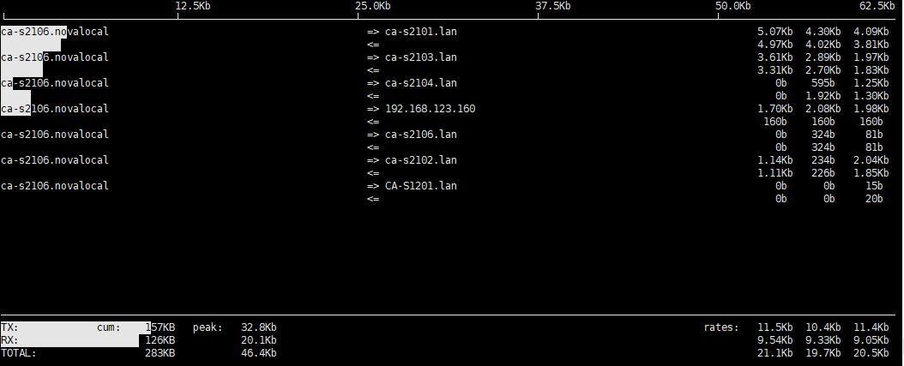

# vi和vim编辑器

## 简介

* vi 和 vim（Vi Improved）是linux系统上的标准编辑器。
* vim是Vi编辑器的增强版本。

## vim三种模式

### 命令模式 (Command Mode)

* 在这个模式下，你可以执行各种命令，例如移动光标、删除字符、复制粘贴等。
* 按 `Esc` 键进入命令模式。

### 插入模式 (Insert Mode)

* 在这个模式下，你可以输入文本。
* 按下 `i` 键进入插入模式，此时你可以开始输入文本。
* 按下 `Esc` 键退出插入模式，返回到命令模式。

### 底行模式 (Ex Mode or Last Line Mode)

* 在这个模式下，你可以保存文件、退出 `vi` 或执行其他一些底层命令。
* 从命令模式按 `:` 进入底行模式，然后输入命令并按下 `Enter` 执行。

## 常用命令

### 移动光标

* `h` ：向左移动一个字符
* `j` ：向下移动一行
* `k` ：向上移动一行
* `l` ：向右移动一个字符
* `0` ：移动到行首
* `$` ：移动到行尾
* `gg` ：移动到文件的开头（常用）
* `G` ：移动到文件的末尾（常用）
* `nG` ：移动到文件的第n行（常用）
* `:n` ：移动到指定第n行（常用）

### 文本编辑

* `i` ：在光标前插入文本（常用）
* `I` ：在当前行的行首插入文本
* `a` ：在光标后插入文本（常用）
* `A` ：在当前行的行尾插入文本
* `o` ：在当前行之后插入新行
* `O` ：在当前行之前插入新行
* `r` ：替换光标处的字符
* `x` ：删除光标处的字符（常用）
* `dd` ：删除当前行（常用）
* `yy` ：复制当前行（常用）
* `p` ：粘贴剪切或复制的文本（常用）

### 撤销和重做

* `u` ：撤销上一次操作（常用）
* `Ctrl + r` ：重做上一次被撤销的操作（常用）

### 查找和替换

* `/pattern` ：向下搜索并移动到第一个匹配pattern（常用）
* `?pattern` ：向上搜索并移动到第一个匹配pattern
* `:s/old/new` ：替换当前行第一次出现的 `old` 为 `new`（常用）
* `:s/old/new/g` ：替换当前行所有出现的 `old` 为 `new`
* `:%s/old/new/g` ：替换整个文件中所有出现的 `old` 为 `new`（常用）

### 保存和退出

* `:w` ：保存当前文件
* `:q` ：退出
* `:x` 或 `:wq` 或  `ZZ` ：保存并退出
* `:q!` ：强制退出并放弃所有更改

### 其他常用命令

* `:e filename` ：打开指定文件
* `:set nu` ：显示行号（常用）
* `:set nonu` ：隐藏行号（常用）
* `:set paste` ：在插入模式下禁用自动缩进，方便粘贴文本
* `:set nopaste` ：恢复正常模式

# 常用指令

## 目录相关命令

* pwd：（Print Working Directory），显示当前工作目录的绝对路径。
* ls：-a：显示当前目录所有的文件和目录，包括隐藏的；
  * -l：以列表的方式显示信息。
  * -h：友好方式显示信息。
* cd：
  * cd ~：回到自己的家目录；
  * cd ..：回到当前目录的上一级目录。
* mkdir：创建目录；
  * -p：创建多级目录。
* rmdir：删除空目录。rmdir不能删除非空的目录。如果需要删除非空的目录，需要使用rm -rf（慎用）。
* cp：拷贝文件到指定目录；
  * -r：递归复制整个文件夹。强制覆盖不提示的方法：cp命令改为\cp
* rm：移除文件或目录；
  * -r：递归删除整个文件夹；
  * -f：强制删除不提示。
* mv：移动文件与目录或重命名。
* touch：创建空文件。可以一次性创建多个文件
  * `touch {1.txt,2.txt}`：使用通配符 `{ }` 一次创建多个文件，`{ }`中的元素使用 ","分隔。
* ln 给文件创建一个软连接
  * ln -s [源文件或目录] [软连接名]

## 文件查看

* cat：查看文件内容。只能浏览文件，而不能修改文件。
  * -n：显示行号。
  * 结尾加上 | more：分页显示，不会全部一下显示完。
* more：是一个基于VI编辑器的文本过滤器，它以全屏幕的方式按页显示文本文件的内容。more还内置了很多快捷键：
  * Space：向下翻一页
  * Enter：向下翻一行
  * q：退出
  * Ctrl + F：向下滚动一屏
  * Ctrl + B：返回上一屏
  * = :输出当前行的行号
  * :f 输出文件名和当前行的行号
* less：用来分屏查看文件内容，与more相似，但是更强大，支持各种显示终端。less指令在显示文件内容时，并不是一次将整个文件加载之后才显示，而是根据显示需要加载内容。对于显示大型文件具有较高的效率。
* head：显示文件的开头部分。
  * -n 5：看前面5行内容。
* tail：输出文件中尾部的内容。
  * -n 5：看后面5行内容。
  * -f：时事追踪该文档的所有更新
* ">"指令：输出重定向。如果不存在会创建文件，否则会将原来的文件内容覆盖。
* ">>"指令：追加。如果不存在会创建文件，否则不会覆盖原来的文件内容，而是追加到文件的尾部。
* echo：输出内容到控制台。
* history：查看历史指令。

## 时间和日期

### date

显示当前日期和时间

* date  "+%Y"：显示当前年份
* date  "+%Y"：显示当前月份
* date  "+%Y-%m-%d %H:%M:%S"：显示年-月-日 时：分：秒
* 设置日期：date -s 字符串时间

### cal

查看日历指令；

* cal [月] [年份]：显示某一年或月的日历

```
cal 2024	#显示2024年完整日历
cal 1 2024	#显示2024年1月日历
```

## 索查找类（重要知识点）

### find

用于在文件系统中搜索文件和目录，可以根据多个条件执行搜索操作。

```
find /path/to/search -options criteria
```

* `/path/to/search`: 要搜索的起始目录路径。
* `-options`: 可选的搜索选项。
* `criteria`: 搜索条件。

```
find /path/to/search -name "filename"	#按文件名搜索文件
find /path/to/search -type f		#按文件类型搜索
find /path/to/search -type d		#按目录类型搜索
find /path/to/search -size +10M		#按文件大小搜索，搜索大小大于10兆字节的文件。+ ：大于，- ：小于，没有符号是等于。
find /path/to/search -perm 644		#按文件权限搜索，搜索权限为644的文件
find /path/to/search -user username	#按用户搜索，搜索属于指定用户的文件
find /path/to/search -group groupname	#按组搜索，搜索属于指定用户组的文件
find /path/to/search -mtime -7		#按修改时间搜索，搜索在最近7天内修改的文件。-mtime +7 表示7天前，-mtime 0 表示今天。
find /path/to/search -atime -7		#按访问时间搜索，搜索在最近7天内访问的文件
find /path/to/search -ctime -7		#按创建时间搜索，搜索在最近7天内创建的文件
find /path/to/search -maxdepth 2	#按深度搜索，限制搜索的深度，这里是2层目录
find /path/to/search -exec command {} \;	#执行命令，对搜索到的每个文件执行指定的命令。{} 会被替换为文件名，\; 表示命令结束。
```

示例：

```
find /path/to/search -name "*.txt"			#搜索所有 .txt 文件
find /path/to/search -size +100M			#搜索大小超过100兆字节的文件
find /path/to/search -name "*.jpg" -user username	#搜索由特定用户拥有的 .jpg 文件
find /path/to/search -name "*.log" -mtime -7		#搜索在最近7天内修改的 .log 文件
find /path/to/search -size -1M -exec rm {} \;		#搜索并删除大小小于1兆字节的文件
find /home -type f -name *cloud* -exec ls -l {} \;	#查找指定目录的指定文件名，显示其信息
```

### grep

用于在文本文件中搜索指定模式的强大工具。它可以根据正则表达式或简单的字符串匹配来查找文件中的内容。

语法：grep [选项] pattern file

* `-v`: 显示不包含匹配模式的所有行。
* `-n`: 显示包含匹配模式的所有行，并显示行号。
* `-w, --word-regexp`: 仅匹配整个单词。
* `-o, --only-matching`: 仅输出匹配的部分而不是整行。
* `-E, --extended-regexp`: 使用扩展的正则表达式语法。
* `-f, --file=文件`: 从文件中读取模式。
* `-n, --line-number`: 输出匹配行的行号。
* `-r`: 递归地在指定目录及其子目录中搜索匹配模式的文本。
* `-i`: 进行大小写不敏感的搜索。
* `-c`: 显示匹配模式的行数，而不是行内容。
* `-A N`: 显示匹配行之后 N 行。
* `-B N`: 显示匹配行之前 N 行。
* `-C N`: 显示匹配行及其上下文（前后 N 行）。

```
grep pattern file
grep -v pattern file
grep -n pattern file
grep -o pattern file
grep -r pattern directory
grep -B N pattern file
grep -A N pattern file
grep -C N pattern file

grep -v 'pattern' file.txt	#输出不匹配模式pattern的行
grep -w 'word' file.txt		#仅匹配整个单词而不是单词的部分
grep "pattern" filename		#在文件中搜索匹配模式
grep -r "pattern" directory	#递归搜索目录中的所有文件
grep -i "pattern" filename	#忽略大小写搜索
grep -C 2 "pattern" filename	#显示匹配行及其上下文
grep -c "pattern" filename	#统计匹配模式的行数
grep pattern *.txt		#在指定文件类型的文件中搜索匹配模式的文本
grep -vc pattern file		#显示不匹配模式的行数


grep -f patterns.txt file.txt		#从文件patterns.txt中读取模式，并在file.txt中搜索匹配的行

#使用正则，grep -e 效果等同于 egrep
grep -ie 'pattern' file.txt		#在文件file.txt中进行忽略大小写的搜索
grep -we 'word' file.txt		#在文件file.txt中进行整词匹配
grep -Ee 'pattern1|pattern2' file.txt	#将使用扩展的正则表达式匹配pattern1或pattern2
grep -E 'pattern1|pattern2' file.txt	#使用扩展的正则表达式匹配pattern1或pattern2
```

示例：

```
ls -l /home | grep "^-" | wc -l			#统计/home文件夹下文件的个数
ls -l /home | grep "^d" | wc -l			#统计/home文件夹下目录的个数
ls -lR /home | grep "^-" | wc -l		#统计/home文件夹下文件的个数，包括子文件夹里的
ls -lR /home | grep "^d" | wc -l		#统计文件夹下目录的个数，包括子文件夹里的

find /home -type f -depth | wc -l		#统计/home文件夹下目录的个数（包括目录）
find /home -type f | wc -l			#统计/home文件夹下目录的个数（不包括目录）
```

上面 `find` 和 `ls` 两个命令差别

**ls -lR /home | grep "^-" | wc -l** 命令将统计 `/home` 目录及其所有子目录中的 **所有普通文件** 的数量。

**find /home -type f -depth | wc -l** 命令将统计 `/home` 目录及其所有子目录中的 **所有文件** 的数量， **包括普通文件、目录、符号链接、特殊文件等** 。

示例：

```
# 创建一些文件和目录
mkdir /home/test
touch /home/test/file1
mkdir /home/test/subdir
touch /home/test/subdir/file2

# 使用 ls 命令统计普通文件数量
ls -lR /home | grep "^-" | wc -l
1

# 使用 find 命令统计所有文件数量
find /home -type f -depth | wc -l
2
```

上面的示例中，`ls` 命令只统计了 `/home/test/file1` 这一个普通文件，而 `find` 命令统计了 `/home/test/file1` 和 `/home/test/subdir/file2` 这两个文件。

虽然这两个命令的功能大致相同，但在某些情况下可能会有微小的性能差异。通常来说，`find` 命令更加灵活。

### wc

用于统计文件中字数、行数和字符数的命令。它的名称代表 "word count"，但它实际上可以用于统计文件中的多种信息。

语法：wc [选项] 文件名

* `-c`： 统计字节数（bytes）。
* `-w`： 统计单词数（words）。
* `-l`： 统计行数（lines）。

统计文件中的行数、单词数和字节数：

```
8  16 277 demo-openrc	#行数、单词数和字节数
```

> 一个完整字符串算一个单词，如：OS_USERNAME=myuser 算一个单词

```
wc -l filename.txt	#统计文件中的行数
wc -c filename.txt	#统计文件中的字节数
wc -w filename.txt	#统计文件中的单词数
```

### awk

是一种用于处理和分析文本数据的强大工具，通常用于逐行处理文件或文本流。

可以读取文件、处理数据，并输出格式化的结果。

```
awk 'pattern { action }' file
```

* **`pattern`：** 匹配条件，如果满足条件则执行对应的 `action`。
* **`action`：** 要执行的命令块，用花括号 `{}` 括起来。
* **`file`：** 要处理的文件名，如果不指定文件名，则默认从标准输入读取数据。

**打印整行**

```
awk '{ print }' file.txt		#打印文件中的每一行
```

**打印特定行**

```
awk 'NR==2{ print $2 }' file.txt	#打印文件第2行第3个字段
```

**打印特定字段**

```
awk '{ print $2 }' file.txt		#打印文件中的每一行的第二个字段
```

**使用条件进行过滤**

```
awk '$3 > 50 { print $1, $3 }' file.txt		#打印文件中第三个字段大于 50 的行的第一个和第三个字段
```

如果第三行是非数字字段，那么 awk 在比较时会将非数字字段视为 0。这可能会影响结果，因为非数字字段被视为小于任何数字。

因此，当数据中存在非数字字段时，需要谨慎处理条件比较。

**计算字段的总和**

```
awk '{ sum += $2 } END { print sum }' file.txt	#计算文件中第二个字段的总和，并在文件处理完毕后打印
```

使用 `END` 在处理之后打印消息。

**使用自定义分隔符**

```
awk -F':' '{ print $1 }' /etc/passwd	#使用冒号作为字段分隔符，打印 /etc/passwd 文件的每一行的第一个字段。
```

**显示行数和字段数量**

```
awk '{ print NR, $0 }' file.txt		#打印文件中的每一行前加上行号
awk '{ print NF, $0 }' file.txt		#打印文件中的每一行前加上行字段数量总和
```

**其他**

```
awk 'NF==3{ print $2 }' cloud-init 	#提取 cloud-init 文件中的 第二個字段，如果该行包含 3 个字段。
```

* `NF==3`：条件判断，**只有行中包含 3 个字段** 时才会执行后续操作。
* 没有 `-F` 选项时默认以空格分隔，无论字段有多长。

#### 内置变量

* **`NF`：** 表示当前行的字段数量。
* **`NR`：** 表示当前行的行号。
* **`$0`：** 表示整个当前行。
* **`$1, $2, ...`：** 表示当前行的第一个、第二个字段，依此类推。索引从1开始。

#### 高级功能

`awk` 提供了许多高级功能，包括自定义函数、模式匹配、循环、数组等。

**自定义函数：**

```
awk 'function myfunc(x) { return x * 2 } { print myfunc($2) }' data.txt
```

定义了一个名为 `myfunc` 的函数，该函数接受一个参数并返回参数的两倍。然后在每一行中调用这个函数来处理第二个字段。

**使用正则表达式进行模式匹配**

```
awk '/Alice/ { print $0 }' data.txt	#打印包含 "Alice" 的行。
```

**使用循环：**

```
awk '{ for (i=1; i<=NF; i++) print $i }' data.txt	#打印每个字段的值，每个字段占一行。
```

**处理不同的字段分隔符**

```
awk -F':' '{ print $1 }' /etc/passwd	#使用冒号作为字段分隔符，打印 /etc/passwd 文件的每一行的第一个字段。
```

**使用数组**

```
awk '{ count[$2]++ } END { for (key in count) print key, count[key] }' data.txt
```

统计文件中第二个字段的不同值的出现次数。

* `'{ count[$2]++}'`:
  * `$2` 表示处理当前行时，将会提取第二个字段的值。
  * `count[$2]++` 是一个动作，它创建了一个关联数组 `count`，以第二个字段的值作为键，每次出现该值时，相应的数组元素值会自增 1。
* `END { for (key in count) print key, count[key]}`:
  * `END` 告诉 awk 在处理完所有行后执行这个部分的命令。
  * `for (key in count)` 遍历数组 `count` 中的所有键。
  * `print key, count[key]` 打印每个键以及其对应的值，即字段值和该字段值出现的次数。

**内置变量和特殊模式**

```
awk 'BEGIN { print "Start processing" } /Alice/ { print $0 } END { print "End processing" }' data.txt
```

使用 `BEGIN` 在处理之前打印消息，使用 `END` 在处理之后打印消息。

### Sort

`sort` 命令用于对文本文件的行进行排序。它可以按照字典顺序（默认，即按照字符的 ASCII 值）或者按照数值大小对行进行排序。它会将大写字母排在小写字母之前，数字排在字母之前。

语法：sort [OPTION]... [FILE]...

常用选项：

* `FILE`: 指定要排序的文件，如果没有指定文件，则默认从标准输入读取。
* `OPTION`:
  * `-r`：逆序排序，即从大到小排序。
  * `-n`：按照数值大小进行排序。
  * `-k`：指定要排序的键。格式为 `-k <起始位置>[,<结束位置>]`，默认为整行。例如，`-k2,2` 表示按照第二个字段进行排序。
  * `-t`：指定字段分隔符，默认为制表符。
  * `-u`：去重，仅显示唯一的行。
  * `-c`：检查文件是否已经排序，如果未排序，则输出未排序的信息并返回非零退出码。
  * `-o <输出文件>`：将排序后的结果输出到指定文件。

按照数值大小逆序排序，并且排序的键是第一个字段，即按照出现次数从大到小排序。

```
sort -nr -k1
```

示例：

nginx日志访问量前十的ip怎么统计？

```
awk  '{print $1}'  /var/nginx/logs/access.log |  sort  |  uniq  -c |  sort  -nr -k1 |  head  -n 10
```

### uniq

`uniq` 命令用于从排序过的文本输入中去除重复的行，并且可以计数重复的行出现的次数。它通常和其他命令（比如 `sort`）一起使用。

语法：uniq [OPTION]... [INPUT [OUTPUT]]

常用选项：

* `INPUT`: 指定输入文件，默认为标准输入。
* `OUTPUT`: 指定输出文件，默认为标准输出。
* `OPTION`:
  * `-c`：在输出中同时显示每行重复出现的次数。
  * `-d`：仅显示重复的行。
  * `-i`：在比较行时忽略大小写。
  * `-u`：仅显示不重复的行。
  * `-f <字段>`：忽略前面的字段，仅对后面的字段进行比较。
  * `-s <字符数>`：跳过指定数量的字符后再比较。

统计文件内容每行出现的次数

```
sort example.txt | uniq -c
```

### Cut

`cut`命令用于从文本文件或标准输入中提取文本的部分，并根据指定的标准进行分隔。

语法：cut OPTION... [FILE]...

常用选项：

* `-c, --characters=LIST`: 根据字符位置进行切割。
* `-f, --fields=LIST`: 根据字段（域）进行切割。
* `-d, --delimiter=DELIM`: 指定字段分隔符，默认为制表符。
* `--output-delimiter=STRING`: 指定输出分隔符。
* `--complement`: 补集，保留未匹配的部分。
* `-s, --only-delimited`: 只输出包含分隔符的行。
* `--help`: 显示帮助信息。
* `--version`: 显示版本信息。

**按字符切割**

```
cut -c 1-5 file.txt		#提取文件file.txt中每行的前5个字符
```

**按字段切割**

```
cut -d',' -f1,3 file.csv	#从以逗号分隔的CSV文件file.csv中提取第1和第3个字段
```

**使用定界符切割**

```
cut -d':' -f1 /etc/passwd	#从/etc/passwd文件中提取以冒号分隔的每行的第一个字段
```

**输出补集**

```
cut -d' ' --complement -f2 file.txt	#从文件file.txt中提取除第二个字段外的所有字段
```

反选功能，类似于 grep -v 选项。

**只输出包含分隔符的行**

```
cut -s -d':' -f1,7 /etc/passwd	#仅输出/etc/passwd文件中包含至少两个冒号的行的第1和第7个字段
```

> 注意：
>
> * `cut`命令默认使用制表符作为字段分隔符。
> * `cut`命令的字符和字段索引都是从1开始计数的。
> * 在处理非常大的文件时，`cut`命令可能不是最有效的选择。对于大文件，更适合使用 `awk`或 `perl`等更灵活的工具。

### Sed

是一个在文本流中进行文本替换和文本处理的流编辑器。它通过逐行处理输入文本并应用指定的编辑命令来实现文本转换。

语法：sed [选项] '编辑命令' 文件

* **编辑命令：** 由 `sed` 执行的操作序列，包括文本替换、删除行、插入文本等。
* **文件：** 要处理的文件名。

**常用选项：**

* **`-n`：** 静默模式，只有经过显式请求的行才会被打印。
* **`-e`：** 允许多个编辑命令。
* **`-i`：** 直接修改文件内容，而不是输出到标准输出。
* **`-r` 或 `--regexp-extended`：** 使用扩展正则表达式（ERE）

**常用编辑命令**

**替换字符串**

```
sed 's/old/new/g' filename		#将文件中所有的 "old" 替换为 "new"
```

* g：全局替换

**删除行**

```
sed '/pattern/d' filename		#删除包含指定模式的行
```

**插入文本**

```
sed '/pattern/i\new_text' filename	#在包含指定模式的行之前插入新文本
```

* i：行前添加文本

**附加文本**

```
sed '/pattern/a\new_text' filename	#在包含指定模式的行之后附加新文本
```

* a：行后添加文本

**替换指定行**

```
sed '3s/old/new/' filename		#在文件的第三行中将 "old" 替换为 "new"
```

* s：替换字符串

**打印指定行**

```
sed -n '5p' filename			#打印文件的第五行
```

* p：打印行

**打印行范围**

```
sed -n '3,7p' filename			#打印文件的第三到第七行
```

#### **高级用法**

`sed` 的功能非常强大，还有一些更高级的用法，包括使用正则表达式、替换多个匹配项、执行多个编辑操作等。

**使用正则表达式**

```
sed -e '/^pattern/s/old/new/' -e '/^another/s/old/new/' filename	#如何在两个不同的行上应用不同的替换
```

**替换多个匹配项**

```
sed 's/\(pattern1\|pattern2\)/new/g' filename	#在一个替换命令中使用 \| 来表示逻辑 "或"，以替换多个匹配项
```

**执行多个编辑操作**

```
sed -e '1,3s/old/new/' -e '4,6d' filename	#在文件的第一到第三行执行替换操作，然后在第四到第六行执行删除操作
```

**范围匹配**

```
sed '/start/,/end/s/old/new/' filename		#在匹配 "start" 和 "end" 之间的行上执行替换操作
```

**使用变量**

```
pattern="pattern"
replacement="new"
sed "s/$pattern/$replacement/g" filename	#使用变量动态地指定模式和替换值
```

**执行条件操作**

```
sed '/pattern/{s/old/new/; s/text/TEXT/}' filename	#在包含 "pattern" 的行上执行两个替换操作
```

### xargs命令

用于构建和执行命令行的实用程序，通常与其他命令一起使用，以便将其输出作为参数传递给另一个命令。`xargs` 可以从标准输入或文件中读取数据，并将其转换成命令行参数。

语法：xargs [选项] [命令]

* **`-n num`：** 每次传递的参数数量。例如，`-n 1` 表示每次传递一个参数。
* **`-I replace-str`：** 指定替换字符串，用输入中的文本替换它。
* **`-d delimiter`：** 指定定界符（默认为空格）。
* **`-p`：** 提示用户确认是否执行命令。
* **`-r`：** 不运行命令，仅打印构建的命令行。
* **`-t`：** 打印构建的命令行。

**从文件读取参数，并传递给命令**

```
cat file.txt | xargs command			#将文件 file.txt 中的内容传递给 command
```

**从标准输入读取参数，并传递给命令**

```
echo "arg1 arg2 arg3" | xargs command		#将标准输入中的文本传递给 command
```

**指定参数数量**

```
echo "arg1 arg2 arg3" | xargs -n 1 command	#每次传递一个参数给 command
```

**使用定界符（例如逗号）**

```
echo "arg1,arg2,arg3" | xargs -d',' command
```

**交互式确认执行命令**

```
find . -type f -name "*.txt" | xargs -p rm	#删除所有找到的 .txt 文件，并在每个文件删除前进行确认
```

**使用占位符 `-I` 进行替换**

```
echo "file1 file2 file3" | xargs -I {} mv {} /destination/directory	#每个参数替换为 {}，然后传递给 mv 命令，将3个文件移动到/destination/directory
```

> * `xargs` 默认使用空格作为参数的定界符，但可以通过 `-d` 选项指定其他定界符。
> * 在使用 `xargs` 时，特别注意输入数据的格式和目标命令的期望参数格式。
> * 通过 `xargs`，你可以有效地将其他命令的输出转换为另一个命令的输入，从而构建更复杂的命令管道。

### locate

用于快速定位文件和目录的命令。它通过搜索一个预建的数据库而不是实时查找文件系统，因此速度较快。为了保证查询结果的准确度，管理员必须定期更新locate时刻。在第一次运行之前，必须使用updatedb指令创建locate数据库。

在第一次运行之前，必须使用updatedb指令创建locate数据库。

```
updatedb		#更新数据库
locate filename		#查找包含指定文件名或目录名的路径
locate -i filename	#大小写不敏感的搜索
locate -b filename	#显示数据库中所有匹配项的路径
locate -n 5 filename	#限制搜索结果数量为5个
locate -S		#显示数据库的更新时间
```

## 压缩和解压

### gzip 和 gunzip

```
gzip filename		#压缩指定的文件。该命令将生成一个压缩后的文件，并原始文件保留。
gzip -k filename	#保留原始文件，即不删除源文件。
gzip -9 filename	#指定压缩级别。级别范围是1到9，1表示最低压缩级别，9表示最高压缩级别。
gzip -r directory	#递归地压缩目录中的所有文件
gzip -q filename	#不显示压缩比

gunzip filename.gz	#解压缩指定的 gzip 压缩文件。该命令将生成一个解压后的文件，并原始压缩文件保留。
gunzip -k filename.gz	#保留原始压缩文件
gunzip -r directory	#归地解压缩目录中的所有 gzip 压缩文件
gunzip -q filename.gz	#不显示解压信息
```

### zip 和 unzip

```
zip archive.zip file1 file2 file3	#创建名为archive.zip的ZIP文件，并将指定的文件file1file2file3添加到ZIP文件中
zip -r archive.zip directory		#递归地将目录 directory 添加到ZIP文件中
zip -v archive.zip file1 file2		#显示详细的添加文件信息
zip -e archive.zip file1 file2		#设置密码保护ZIP文件
zip -0 archive.zip file1 file2		#使用 -0 选项不压缩文件，只打包成ZIP文件

unzip archive.zip			#解压缩名为 archive.zip 的ZIP文件到当前目录
unzip archive.zip -d /path/to/directory	#指定解压缩目录
unzip -l archive.zip			#列出ZIP文件的内容，包括文件名、压缩比、时间戳等信息
unzip archive.zip file1 file2		#解压指定文件，而不是解压整个ZIP文件
unzip -o archive.zip			#覆盖已存在的文件
unzip -v archive.zip			#显示详细的解压信息
unzip -P password archive.zip		#解压加密的ZIP文件
```

### tar

用于创建和提取归档文件的工具

* `-c`: 创建新的归档文件。
* `-v`: 显示详细信息。
* `-f`: 指定归档文件的名称。
* `-z`: 使用 gzip 压缩。
* `-j`: 使用 bzip2 压缩。
* `-x`: 提取归档文件的内容。
* `-t`: 列出归档文件的内容。
* `-C`: 切换到指定目录并创建归档文件。
* `--exclude`：排除符合指定模式的文件或目录。
* `-r`: 将新文件追加到现有归档中。

```
tar -cvf archive.tar file1 file2 directory	#创建 tar 归档文件
tar -czvf archive.tar.gz file1 file2 directory	#创建 tar 归档文件并压缩（gzip）
tar -cjvf archive.tar.bz2 file1 file2 directory	#创建 tar 归档文件并压缩（bzip2）

tar -xvf archive.tar			#提取 tar 归档文件
tar -xzvf archive.tar.gz		#提取 tar 归档文件并解压缩（gzip）
tar -xjvf archive.tar.bz2		#提取 tar 归档文件并解压缩（bzip2）

tar -tvf archive.tar					#列出 tar 归档文件内容
tar -cvf archive.tar -C /path/to/directory .		#切换到/path/to/directory并创建该目录下所有文件的归档文件
tar --exclude=pattern -cvf archive.tar directory	#归档directory时，排除符合指定模式的pattern文件或目录
tar -rvf archive.tar newfile				#将newfile追加到现有归档中
tar -xvf archive.tar file1 file2			#提取归档文件中的file1 file2
```

# 其他命令

## time

`time` 命令用于测量命令或脚本的执行时间。

语法：

```
time command
```

`command` 是要执行的命令或脚本。`time` 命令会输出被测量的命令或脚本的执行时间信息。

`time` 命令输出的常见信息：

* `real`：实际的总运行时间，从命令开始执行到结束的时间。
* `user`：在用户模式下花费的 CPU 时间。
* `sys`：在内核模式下花费的 CPU 时间。

示例：

当你运行 `time sleep 2` 时，将输出类似以下的信息：

```
real    0m2.005s
user    0m0.000s
sys     0m0.000s
```

在这个例子中，`real` 大致等于 2 秒，因为 `sleep 2` 命令休眠了2秒。 `user` 和 `sys` 是0，因为 `sleep` 命令没有在用户或内核模式下花费额外的时间。

如果你想测量一个脚本的执行时间，可以使用：

```
time ./your_script.sh
```

# 常用工具（重要知识点）

## 磁盘相关工具

### df（disk free）

是一个用于显示文件系统磁盘空间使用情况的命令。它可以用于查看挂载的文件系统的剩余空间、已用空间和总空间等信息。

```
df -h		#显示详细信息
df -h /dev/sda1	#显示特定文件系统
df -a		#显示所有文件系统，包括虚拟文件系统
df -i		#显示inode（索引节点）的使用情况
df -l		#只显示本地文件系统，而不显示NFS等网络文件系统
df -T		#显示文件系统的类型
df -a -h --output=source,target,size,used,avail,pcent	#使用--output选项指定要显示的列，可以选择性地显示源、目标、大小、已用空间、剩余空间和使用百分比等信息。
df -t ext4	#只显示指定类型的文件系统，这里以ext4为例
```

### du（Disk Usage）

用于查看文件或目录磁盘使用情况的命令。它会递归地显示指定目录及其子目录的磁盘使用量。

```
du [选项] [文件或目录]		#如果不指定文件或目录，默认显示当前目录的磁盘使用情况。
du filename			#显示指定文件或目录的磁盘使用情况。如果是目录，会递归显示其下所有子目录的磁盘使用情况。
du -h				#友好显示文件大小
du -s				#指定目录占用大小汇总
du -a				#指定目录占用大小汇总
du -c				#只显示总磁盘使用量，不显示每个文件或目录的详细使用情况
du --max-depth=N		#指定递归深度，只显示到指定深度的目录
du | sort -n			#将 du 的输出通过管道传递给 sort -n 命令，按大小升序排序显示。
du --block-size=1M		#指定文件大小的显示格式，这里以兆字节为单位。
du --apparent-size		#显示每个文件的实际大小，而不是磁盘上所占用的大小。
du --exclude=pattern		#排除符合指定模式的文件或目录
```

### tree

```
tree [选项] [目录]		#如果不指定目录，默认会显示当前目录的树状结构
tree				#显示当前目录的树状结构，包括所有子目录和文件
tree -F				#以图形符号（例如 / 表示目录，* 表示可执行文件）显示文件和目录的类型。
tree /path/to/directory		#指定要显示树状结构的目录
tree -d				#只显示目录，而不显示文件
tree -h				#友好显示文件和目录的大小
tree -l				#显示每个文件和目录的详细信息，包括权限、所有者、大小等。
tree -L 2			#限制树状结构的深度，只显示到指定层级
tree > tree_output.txt		#将树状结构的输出保存到文件中
tree --prune -P '*.txt' --ignore 'directory_name'	#使用 --prune 选项可以排除指定文件或目录，并使用 -P 选项指定要包含的文件模式，--ignore 选项指定要排除的文件或目录。
tree -s				#显示目录大小
```

### iostop

`iotop`是一个用于实时监控系统磁盘I/O活动的交互式命令行工具。它会按照磁盘I/O的使用情况列出当前活跃的进程，并显示它们的读取和写入速率。

`iotop` 执行需要root权限

```
Total DISK READ:       0.00 B/s | Total DISK WRITE:      10.25 K/s
TID  PRIO  USER     DISK READ  DISK WRITE  SWAPIN     IO>    COMMAND
   1 be/4 root          0.00 B/s    0.00 B/s  0.00 %  0.00 % systemd
   2 be/4 root          0.00 B/s    0.00 B/s  0.00 %  0.00 % kthreadd
   3 be/4 root          0.00 B/s    0.00 B/s  0.00 %  0.00 % ksoftirqd/0
   5 be/0 root          0.00 B/s    0.00 B/s  0.00 %  0.00 % kworker/0:0H
```

字段简介

* **Total DISK READ:** 所有进程的磁盘读取速率总和。
* **Total DISK WRITE:** 所有进程的磁盘写入速率总和。
* **TID:** 进程线程的ID。
* **PRIO:** 进程的优先级。
* **USER:** 进程的用户名。
* **DISK READ:** 进程的磁盘读取速率。
* **DISK WRITE:** 进程的磁盘写入速率。
* **SWAPIN:** 进程的交换入速率。
* **IO>:** 进程的I/O活动指示符，显示磁盘活动的方向。
* **COMMAND:** 进程的命令名称。

常用操作命令：

* **左右箭头键：**

  * 左右箭头键用于按照不同的列进行排序。默认情况下，`iotop` 按照磁盘I/O活动的总和（IO>列）进行排序。
* **r键：**

  * 反转当前排序的顺序。例如，如果按照磁盘写入速率排序，按下 `r` 键将反转排序顺序。
* **p键：**

  * **操作：** 暂停或继续显示。按下 `p` 键将暂停 `iotop` 的输出，再次按下则恢复。
* **q键：**

  * **操作：** 退出 `iotop`。按下 `q` 键将退出 `iotop`。
* **a键：**

  * **操作：** 切换显示或隐藏累积模式。在累积模式下，每个进程的磁盘 I/O 统计将显示自启动 `iotop` 以来的总和。
* **u键：**

  * **操作：** 选择进程用户。按下 `u` 键将显示一个对话框，允许你选择要显示的特定用户的磁盘 I/O 统计。

### iostat

`iostat` 是一个用于显示系统输入/输出（I/O）统计信息的命令。它提供了有关磁盘、CPU和TTY设备的I/O统计数据，以及关于系统整体性能的一些汇总信息。

`iostat` 命令通常是通过安装 `sysstat` 软件包来获得的。

```
iostat [options] [interval [count]]
```

* `options`：用于指定 `iostat` 的各种选项，包括要显示的统计信息类型。
* `interval`：可选参数，表示显示统计信息的时间间隔（以秒为单位）。如果未提供此参数，默认值为2秒。
* `count`：可选参数，表示显示统计信息的次数。如果未提供此参数，则 `iostat` 将持续显示。

常见的 `iostat` 选项

* `-c`：显示 CPU 使用情况。
* `-d`：显示磁盘 I/O 信息。
* `-k`：以千字节为单位显示块设备的传输速率。
* `-m`：以兆字节为单位显示块设备的传输速率。
* `-t`：在输出中显示时间戳。

`iostat` 默认输出信息如下：

```
Linux 5.14.0-284.30.1.el9_2.x86_64 (ca-s2106.novalocal) 	2024年01月24日 	_x86_64_	(1 CPU)

avg-cpu:  %user   %nice %system %iowait  %steal   %idle
           0.45    0.01    0.20    0.87    0.00   98.47

Device             tps    kB_read/s    kB_wrtn/s    kB_dscd/s    kB_read    kB_wrtn    kB_dscd
sr0               0.00         0.00         0.00         0.00        156          0          0
vda               5.10         1.97        19.18         0.00     806284    7845177          0
```

字段简介：

**系统信息：**

* Linux 5.14.0-284.30.1.el9_2.x86_64 (ca-s2106.novalocal): 操作系统内核版本和主机名。
* 2024年01月24日: 当前日期。
* x86_64 : 系统架构，表示是64位系统。
* (1 CPU): 系统中的CPU数量。

**CPU使用率统计（avg-cpu）：**

* %user: 用户进程占用CPU的百分比。
* %nice: 优先级较高的用户进程占用CPU的百分比。
* %system: 系统进程占用CPU的百分比。
* %iowait: CPU等待I/O完成的百分比。
* %steal: 被虚拟化环境偷取的CPU时间百分比。
* %idle: CPU处于空闲状态的百分比。

**磁盘I/O统计（Device）：**

* tps (Transactions Per Second): 每秒钟的传输次数。`vda` 的tps为5.10，表示每秒进行5.10次读/写操作。
* kB_read/s: 每秒从设备读取的数据量（以KB为单位）。`vda` 每秒读取1.97KB。
* kB_wrtn/s: 每秒写入设备的数据量（以KB为单位）。`vda` 每秒写入19.18KB。
* kB_dscd/s: 每秒从设备丢弃的数据量（以KB为单位）。`vda` 没有数据被丢弃。

示例:

```
iostat -d -k 1		#显示磁盘 I/O 信息，以千字节为单位，间隔为1秒，持续显示
iostat -c -d -m 3 10	#显示 CPU 和磁盘 I/O 信息，以兆字节为单位，间隔为3秒，显示10次
```

## 网络相关工具

### ss

`ss` 命令（Socket Statistics）用于显示套接字统计信息，包括网络连接、路由表、接口统计等。它是 `netstat` 命令的替代品，并提供了更多的功能和性能。

字段简介：

```
Netid	State      Recv-Q    Send-Q     Local Address:Port     Peer Address:Port
tcp	ESTAB      0         0          192.168.1.2:ssh         203.0.113.1:12345
tcp	LISTEN     0         0          *:http                 *:*                                
```

1. **Netid：**
   * 网络标识符，用于标识网络套接字所属的协议族。协议族包括 IPv4、IPv6、UNIX 等
2. **State：**
   * 连接的状态，例如 ESTAB（已建立）、LISTEN（监听）、TIME-WAIT（等待关闭）等。
3. **Recv-Q：**
   * 接收队列的大小，表示等待应用程序接收的数据量。
4. **Send-Q：**
   * 发送队列的大小，表示等待发送的数据量。
5. **Local Address:Port：**
   * 本地地址和端口号。
6. **Peer Address:Port：**
   * 远程地址和端口号。

这个示例表示：

* 有一个已建立的连接（ESTAB）从本地地址 `192.168.1.2` 的 SSH 端口（默认是 22）到远程地址 `203.0.113.1` 的端口 `12345`。
* 有一个处于监听状态（LISTEN）的套接字，等待连接到本地的 HTTP 端口（80）。

常用命令：

```
ss		#显示系统上所有的套接字信息，包括 TCP、UDP、RAW 和 UNIX 套接字。
ss -t		#显示 TCP 套接字信息
ss -u		#显示 UDP 套接字信息
ss -l		#显示所有处于监听状态的套接字信息
ss -a		#显示所有连接的套接字信息，包括监听和非监听状态。
ss -x		#显示所有的 UNIX 域套接字信息
ss -i		#显示详细的接口统计信息，包括数据包的收发情况。
ss -p		#显示与套接字关联的进程信息
ss -e		#显示详细的进程信息，包括命令和用户。
ss sport = :80	#只显示符合条件的套接字信息，示例显示本地端口为 80 的套接字信息。
ss -t4		#显示 IPv4 的 TCP 套接字信息，-t6 用于显示 IPv6 的 TCP 套接字信息。
ss -s		#显示连接状态的统计信息，包括 ESTAB（已建立）、SYN-SENT（发送 SYN）、SYN-RECV（接收 SYN）等。
ss -r		#显示路由表信息
ss -m		#显示 TCP 内存使用情况
watch -n 1 ss	#时更新套接字信息，每 1 秒执行一次。


ss -p -A process_name	#显示特定进程的套接字信息，其中 process_name 是进程的名称。
ss -p -U username	#显示特定用户的套接字信息，其中 username 是用户名。
ss state FIN-WAIT-1	#state 可以仅显示指定状态的套接字信息，示例显示状态为 FIN-WAIT-1 的套接字信息。
ss dport = :80 or sport = :80	#只显示符合条件的套接字信息。示例显示目标端口或源端口为 80 的套接字信息。
ss state time-wait	#显示处于指定状态的套接字信息，示例显示处于 TIME-WAIT 状态的套接字信息。
ss -t -a -Z		#-Z 选项可以显示 SELinux 安全上下文信息，结合 -t 和 -a 可以显示所有 TCP 套接字信息。
ss -o state all		#显示更详细的 TCP 连接信息，示例显示所有状态的 TCP 连接信息。
watch -n 1 ss -t -a	#实时更新指定类型的套接字信息，每 1 秒执行一次。
ss -t -o state established	#显示已建立连接的 IP 地址和端口，示例显示所有已建立连接的 TCP 地址和端口。
ss -i -e		#显示网络接口的详细信息
ss -tulwn		#显示所有监听的 TCP 和 UDP 连接。
```

### netstat

用于显示网络状态和连接信息的命令行工具。它可以列出网络接口、路由表、连接状态等信息，用于网络故障排除和监视网络活动。

**显示所有打开的网络连接**

```
netstat -tulpan		#列出所有打开的 TCP 和 UDP 连接的详细信息，包括本地地址、远程地址、状态、进程 ID 等。
```

* `-t`：显示 TCP 连接。
* `-u`：显示 UDP 连接。
* `-l`：仅显示监听状态的连接。
* `-p`：显示与连接关联的进程信息。
* `-a`：显示所有连接，包括监听和非监听状态。
* `-4`：仅显示 IPv4 连接
* `-6`：仅显示 IPv6 连接

**显示进程和端口的关联信息**

```
netstat -ap		#显示每个网络连接的进程 ID（PID）和进程名称，以及相关的本地和远程端口信息。
```

**显示所有网络接口的信息**

```
netstat -i		#列出所有网络接口的信息，包括接口名称、接收和发送的数据包数量、错误等。
netstat -ie		#显示每个网络接口的详细信息，包括硬件地址、IP 地址、广播地址、掩码等。
netstat -ae		#显示每个套接字的详细信息，包括传输队列、接收队列、错误等
```

**显示路由表**

```
netstat -r		#显示系统的路由表，包括目标网络、网关、接口、Flags 等信息。
```

**显示网络统计信息**

```
netstat -s		#显示各种网络统计信息，包括接收和发送的数据包、错误、丢弃的数据包等。
```

**显示套接字状态**

```
netstat -o		#显示系统中所有套接字的详细状态，包括连接状态、套接字类型等。
```

**使用 `watch` 实时监控连接状态**

```
#使用 watch 命令每秒钟更新一次系统中的 ESTABLISHED（已建立）连接，提供实时的连接状态。
watch -n 1 'netstat -an | grep ESTABLISHED'
```

**查看特定进程的网络连接**

```
netstat -tulpan | grep <PID>	#显示特定进程的所有网络连接信息
```

**查看端口的监听进程**

```
fuser -n tcp <port>/udp <port>	#显示特定端口上正在监听的进程
```

### iftop

`iftop` 是一个用于实时监控系统网络流量的命令行工具。它以图形化的方式显示当前系统中的网络流量情况，列出了正在进行数据传输的网络连接，并按照流量大小进行排序。以下是 `iftop` 的一些常用操作命令：



输出字段简介：

* **中间区域：**
  * 以图形方式显示当前网络流量情况，包括上行和下行。
* **底部信息：**
  * 显示本地和远程主机的IP地址和端口号。
  * 流量传输速率的单位（b表示字节，Kb表示千字节）。
  * 显示流量的上行和下行速率。

## 进程相关工具

### kill - 终止进程

`kill` 命令用于终止或发送信号给进程，通过指定 PID 来选择要终止的进程。

```
kill [signal] PID
```

* `signal`：要发送的信号。如果不指定信号，默认是 `TERM`（15号信号，即终止信号）。
* `PID`：要终止的进程的标识符。

**常用信号**

* **`TERM`（15）：** 默认信号，请求进程正常终止。
* **`KILL`（9）：** 强制终止进程，进程将被立即终止。
* **`HUP`（1）：** 重启进程，通常用于重新加载配置文件。
* **`INT`（2）：** 中断进程，相当于按下 `Ctrl+C`。
* **`STOP`（19）：** 暂停进程的执行。
* **`CONT`（18）：** 恢复被暂停的进程。

```
kill PID	#使用默认信号终止进程
kill -TERM PID	#指定信号终止进程
kill -KILL PID	#使用强制终止信号
kill -HUP PID	#重启进程
kill -STOP PID  # 暂停进程
kill -CONT PID  # 恢复进程


kill -TERM -GROUP_PID	#终止进程组
kill -TERM %job_number	#终止后台作业
```

**注意点：**

* 如果没有指定信号，默认是 `TERM`。
* 使用 `kill -KILL` 是一种强制终止的方法，但它可能导致进程没有机会进行清理操作。
* 进程可能会忽略某些信号，具体取决于进程的信号处理程序。

### killall - 终止指定名称的进程

`killall` 命令用于终止所有具有指定名称的进程。与 `kill` 命令不同，`killall` 不需要指定进程的 PID，而是根据进程的名称来终止匹配的所有进程。

```
killall [options] process_name	#process_name：要终止的进程的名称。
```

* **`-e`：** 显示详细的信息，包括进程的命令行参数。
* **`-i`：** 交互式地询问是否终止进程。
* **`-q`：** 安静模式，不显示任何信息。
* **`-u`：** 指定用户，只终止该用户的进程。

```
killall process_name		#终止指定名称的所有进程
killall -e process_name		#使用 -e 选项显示详细信息
killall -i process_name		#交互式地询问是否终止进程
killall -q process_name		#安静模式，不显示任何信息
killall -u username process_name	#只终止指定用户的进程
```

**注意点：**

* 使用 `killall` 时请小心，确保你不会误伤其他重要的进程。
* 有些系统可能不提供 `killall` 命令，而需要通过安装额外的软件包来获取。

### pkill - 根据名称终止进程

`pkill` 命令用于根据进程的名称终止进程。与 `killall` 类似，`pkill` 不需要指定进程的 PID，而是根据进程的名称来终止匹配的所有进程。

```
pkill [options] pattern		#pattern：要匹配的进程名称模式。
```

* **`-f`：** 匹配整个命令行，而不仅仅是进程名称。
* **`-u`：** 指定用户，只终止该用户的进程。

```
pkill process_name		#终止指定名称的所有进程
pkill -f process_name		#匹配整个命令行并终止进程
pkill -u user1 process_name	#只终止指定用户（例如，user1）的所有进程
```

**注意点：**

* 使用 `pkill` 时请小心，确保你不会误伤其他重要的进程。
* `pkill` 会终止所有匹配的进程，包括与命令行参数匹配的进程。

**pgrep - 根据名称查找进程**

`pgrep` 命令用于根据进程的名称查找进程的 PID。与 `killall` 不同，`pgrep` 只返回匹配的进程的 PID，而不会终止它们。

```
pgrep [options] pattern		#pattern：要查找的进程的名称模式。
```

* **`-a`：** 显示匹配进程的完整命令行。
* **`-l`：** 显示匹配进程的 PID 和名称。
* **`-x`：** 只匹配整个进程名称。
* **`-o`：** 显示最早启动的匹配进程的 PID。

```
pgrep process_name		#查找匹配进程的 PID
pgrep -a process_name		#显示匹配进程的完整命令行
pgrep -l process_name		#显示匹配进程的 PID 和名称
pgrep -x process_name		#只匹配整个进程名称
pgrep -o process_name		#显示最早启动的匹配进程的 PID
```

**注意点：**

* `pgrep` 返回的是进程的 PID，而不是进程名称。
* 如果没有匹配的进程，`pgrep` 不会输出任何内容。

### nohup - 在后台运行进程

`nohup` 允许你在终端退出后仍然能够继续运行该命令。`nohup` 的名称来自"no hang up"的缩写，表明该命令可以在终端挂起（关闭）时继续运行。

```
nohup command [arg]...
```

* `command`：要运行的命令。
* `[arg]...`：命令的参数。

**示例：**

```
nohup command [arg] > output.log 2>&1 &
```

* `>`：将标准输出重定向到指定的文件。
* `2>&1`：将标准错误（2）重定向到与标准输出相同的文件。
* `&`：在后台运行命令。

```
nohup ./my_script.sh > output.log 2>&1 &
```

运行 `./my_script.sh` 脚本，并将标准输出和标准错误重定向到 `output.log` 文件。`&` 符号使命令在后台运行，而 `nohup` 保证了即使终端关闭，该命令也会继续执行。

```
nohup ./my_script.sh > /dev/null 2>&1 &
```

通过将输出重定向到文件，你可以查看命令的输出并调试问题。如果不需要输出，你可以将输出重定向到 `/dev/null`，这样输出就会被丢弃。

**注意点：**

* 使用 `nohup` 启动的命令会忽略 `SIGHUP` 信号，这意味着它们在终端关闭后继续运行。
* 命令在后台运行，可以使用 `jobs` 命令查看后台任务列表。
* 使用 `ps aux | grep command` 可以查看 `nohup` 启动的进程。

### jobs, fg和 bg - 前台作业和后台作业

#### jobs

`jobs` 命令用于列出当前终端上运行的作业（即后台任务）的状态，每个任务都有一个作业号（job number）。

```
jobs [options]
jobs -l [status]
```

* **`-l`：** 显示详细的信息，包括作业号、状态、进程 ID（PID）和命令。
* **`-p`：** 只显示进程 ID。
* **`-n`：** 只显示最近的作业。
* `status`：作业的状态，例如 `running`、`stopped`。

```
jobs		#列出当前终端上运行的所有后台任务。每个任务都有一个作业号（job number）。
jobs -l		#列出当前终端上运行的所有作业的详细信息，包括作业号、状态、PID 和命令。
jobs -l %1	#根据作业号或标识符查看作业信息


./long_running_task.sh &	#long_running_task.sh 是一个需要很长时间才能完成的命令，使用 & 将其放到后台运行。
jobs -l
#输出可能类似于：
[1]+ 10907 Running                 ./long_running_task.sh &	#10907 是任务的 PID
```

#### fg

`fg` 命令用于将后台作业切换到前台运行。

```
fg [job_spec]
```

`job_spec`：作业号或作业标识符（可以是 `%1`、`%2` 等）。

```
fg %1		#把作业号为1的作业切换到前台运行。
```

#### bg

`bg` 命令用于将后台被暂停的任务从后台切换到前台继续运行。

```
bg %1		#将作业号为1被暂停的进程从后台切换到前台继续运行
```

**其他切换任务的方法：**

* **按下 `Ctrl+C` 终止前台任务：**
  在前台运行的任务中，按下 `Ctrl+C` 可以发送中断信号，终止任务。
* **按下 `Ctrl+Z` 暂停前台任务：**
  在前台运行的任务中，按下 `Ctrl+Z` 可以发送暂停信号，将任务置于后台。

### nice - 设置进程优先级

占位

### renice - 修改进程优先级

占位

## 系统资源监控工具

### top - 实时监控进程

`top` 是一个实时的系统监视工具，可以用于查看系统的性能状况、运行中的进程以及资源的使用情况。

**`top` 的界面分区：**

* **顶部信息行：** 包括系统当前时间、运行时间、登录用户数、系统负载等信息。
* **进程信息区域：** 列出当前运行的进程，包括进程 ID、用户、CPU 占用、内存占用、进程状态等。
* **底部任务栏：** 显示一些命令快捷键和当前 `top` 的配置信息。

**top界面参数：**

```
top - 15:18:57 up 1 day,  3:30,  2 users,  load average: 0.00, 0.02, 0.00
Tasks: 134 total,   1 running, 133 sleeping,   0 stopped,   0 zombie
%Cpu(s):  0.0 us,  0.3 sy,  0.0 ni, 99.7 id,  0.0 wa,  0.0 hi,  0.0 si,  0.0 st
MiB Mem :   7836.2 total,   2418.7 free,   3675.4 used,   1742.1 buff/cache
MiB Swap:   8192.0 total,   8192.0 free,      0.0 used.   3636.1 avail Mem 

    PID USER      PR  NI    VIRT    RES    SHR S  %CPU  %MEM     TIME+ COMMAND
   1882 user      20   0 2717656 141032  61268 S   0.3   1.7   1:05.50 gnome-shell
   2410 user      20   0 1868832  66080  46576 S   0.3   0.8   0:04.65 gnome-terminal-
   3195 user      20   0 1399408  83388  53500 S   0.3   1.1   0:02.19 nautilus
   2353 user      20   0 1323288  42732  36000 S   0.0   0.5   0:01.24 update-notifier
```

**系统信息：**

```
top - 15:18:57 up 1 day,  3:30,  2 users,  load average: 0.00, 0.02, 0.00
```

* `15:18:57`：当前系统时间。
* `up 1 day, 3:30`：系统已经运行了1天3小时30分钟。
* `2 users`：当前有2个用户登录。
* `load average: 0.00, 0.02, 0.00`：系统负载，分别是1分钟、5分钟和15分钟的平均负载。

**任务信息：**

```
Tasks: 134 total,   1 running, 133 sleeping,   0 stopped,   0 zombie
```

* `134 total`：系统中总共有134个任务（进程）。
* `1 running`：有1个进程正在运行。
* `133 sleeping`：有133个进程在休眠。
* `0 stopped`：没有进程被暂停。
* `0 zombie`：没有僵尸进程。

**CPU 使用情况：**

```
%Cpu(s):  0.0 us,  0.3 sy,  0.0 ni, 99.7 id,  0.0 wa,  0.0 hi,  0.0 si,  0.0 st
```

* `0.0 us`：用户空间 CPU 使用率。
* `0.3 sy`：系统空间 CPU 使用率。
* `0.0 ni`：改变过优先级的进程 CPU 使用率。
* `99.7 id`：空闲 CPU 百分比。
* `0.0 wa`：等待 I/O 的 CPU 使用率。
* `0.0 hi`：硬中断服务的 CPU 使用率。
* `0.0 si`：软中断服务的 CPU 使用率。
* `0.0 st`：被偷走的 CPU 时间百分比。

**内存信息：**

```
MiB Mem :   7836.2 total,   2418.7 free,   3675.4 used,   1742.1 buff/cache
```

* `7836.2 total`：总内存。
* `2418.7 free`：空闲内存。
* `3675.4 used`：已使用内存。
* `1742.1 buff/cache`：缓存和缓冲区占用的内存。

**交换分区信息：**

```
MiB Swap:   8192.0 total,   8192.0 free,      0.0 used.   3636.1 avail Mem
```

* `8192.0 total`：总交换空间。
* `8192.0 free`：空闲交换空间。
* `0.0 used`：已使用的交换空间。
* `3636.1 avail Mem`：当前可用的内存。

**进程列表：**

```
PID USER      PR  NI    VIRT    RES    SHR S  %CPU  %MEM     TIME+ COMMAND
1882 user      20   0 2717656 141032  61268 S   0.3   1.7   1:05.50 gnome-shell
...
```

* `PID`：进程 ID。
* `USER`：进程所有者。
* `PR`：进程的调度优先级。
* `NI`：进程的优先级。
* `VIRT`：虚拟内存大小。
* `RES`：实际内存大小。
* `SHR`：共享内存大小。
* `S`：进程状态（R=运行，S=睡眠，Z=僵尸等）。
* `%CPU`：进程占用 CPU 百分比。
* `%MEM`：进程占用内存百分比。
* `TIME+`：进程运行的累计 CPU 时间。
* `COMMAND`：启动进程的命令。

**常用快捷键**

* **`q`：** 退出 `top`。
* **`k`：** 终止一个进程，输入进程的 PID 后按 `Enter`。
* **`Space`：** 更新 `top` 的显示。
* **`1`：** 切换到 CPU 使用情况显示。
* **`m`：** 切换到内存使用情况显示。
* **`M`：** 根据内存占用排序。
* **`P`：** 根据 CPU 占用排序。
* **`f`：** 进入字段管理界面，可以选择要显示的字段。
* **`d`：** 指定刷新间隔时间，默认是 3 秒

**常用命令**

```
top -d 5		#-d seconds： 指定刷新间隔时间，默认是 3 秒
top -p 1234		#-p PID： 指定监视某个特定进程。
top -u username		# u username： 显示指定用户的进程。
```

`top` 默认每隔 3 秒更新一次显示，你可以按 `Space` 键手动刷新，也可以使用 `-d` 选项指定刷新间隔。

### ps - 显示进程信息

`ps` 命令用于显示系统中当前运行的进程信息。常和grep结合使用

```
ps [options]
```

* **`a`：** 显示所有终端和用户的进程。
* **`u`：** 以用户为主的格式显示进程信息。
* **`x`：** 显示没有终端的进程（通常是守护进程）。
* **`e`：** 显示所有进程，包括其他用户的。
* **`f`：** 显示进程间的父子关系。
* **`l`：** 显示详细格式，包括更多的列。

```
ps aux		#显示所有进程，包括守护进程
ps -ef		#显示所有进程详细信息
ps -u username	#显示指定用户的进程
ps auxf		#显示所有进程的树形结构
ps -p PID	#显示指定进程的详细信息
ps -efl		#使用 l 选项显示详细格式
```

`ps aux` 输出的列信息如下：

```
ps -aux 
USER         PID %CPU %MEM    VSZ   RSS TTY      STAT START   TIME COMMAND
root           1  0.2  0.7 170916  5540 ?        Ss   Dec08  64:08 /usr/lib/systemd/systemd xx xxx --switched-root --system --deserialize 31
root           2  0.0  0.0      0     0 ?        S    Dec08   0:00 [kthreadd]
root           3  0.0  0.0      0     0 ?        I<   Dec08   0:00 [rcu_gp]
root           4  0.0  0.0      0     0 ?        I<   Dec08   0:00 [rcu_par_gp]
...
```

* **USER：** 进程所有者，即运行进程的用户名。
* **PID：** 进程标识符，是唯一标识一个进程的数字。
* **%CPU：** 进程使用的 CPU 百分比，即在 CPU 时间中所占的比例。
* **%MEM：** 进程使用的内存百分比，即在物理内存中所占的比例。
* **VSZ：** 进程的虚拟内存大小（以 KB 为单位）。虚拟内存包括进程使用的实际内存和交换空间。
* **RSS：** 进程的实际内存大小（以 KB 为单位）。RSS 表示进程实际使用的物理内存，不包括交换空间。
* **TTY：** 控制终端类型。如果进程与终端关联，将显示终端类型（例如 tty1）。如果没有关联，则显示 `?`。
* **STAT：** 进程状态。常见状态包括：
  * **R（Running）：** 运行中。
  * **S（Sleeping）：** 休眠。
  * **D（Disk sleep）：** 等待磁盘 I/O。
  * **Z（Zombie）：** 僵尸进程。
  * **T（Stopped）：** 已停止。
* **START：** 进程启动的时间。显示进程启动的月份和日期，以及启动的时间。
* **TIME：** 进程已经运行的 CPU 时间。格式为分钟:秒。
* **COMMAND：** 进程的命令及参数。显示进程启动时所使用的命令。

### lsof - 监控文件更改

`lsof`（List Open Files）是一个用于显示当前系统中已经打开的文件列表的命令。它可以展示哪些进程打开了哪些文件，包括普通文件、目录、设备文件、网络套接字等。

字段简介

```
lsof
COMMAND     PID   TID TASKCMD             USER   FD      TYPE             DEVICE  SIZE/OFF       NODE NAME
systemd       1                           root  cwd       DIR              253,0       273        128 /
systemd       1                           root  rtd       DIR              253,0       273        128 /
systemd       1                           root  txt       REG              253,0   1609536  805316105 /usr/lib/systemd/systemd
systemd       1                           root  mem       REG              253,0   1598848  806253759 /usr/lib64/libm-2.28.so
...
```

1. **COMMAND：**
   * 显示打开文件的进程的名称。
2. **PID：**
   * 进程 ID，表示打开文件的进程的唯一标识符。
3. **USER：**
   * 进程的拥有者或启动进程的用户。
4. **FD：**
   * 文件描述符，表示文件的打开模式，如读取（`r`）、写入（`w`）等。
5. **TYPE：**
   * 文件类型，如 REG（普通文件）、DIR（目录）、IPv4（IPv4 套接字）等。
6. **DEVICE：**
   * 文件所在的设备号，通常是主设备号和次设备号的组合。
7. **SIZE/OFF：**
   * 文件的大小或偏移量。
8. **NODE：**
   * 文件的 inode 号。
9. **NAME：**
   * 打开文件的路径或网络套接字的地址。

示例：

```
COMMAND   PID   USER   FD   TYPE   DEVICE  SIZE/OFF  NODE   NAME
nginx     123   root   10u  IPv4   12345   0t0       TCP   *:80 (LISTEN)
```

这个示例表示进程 PID 为 123（属于 root 用户）正在监听端口 80，用于提供 HTTP 服务。 `10u` 表示文件描述符 10 是一个网络套接字，`IPv4` 表示这是一个 IPv4 套接字。

常用命令：

```
lsof			#列出当前系统中所有打开的文件。但请注意，这可能会产生非常大的输出。
lsof -p PID		#指定要列出的进程的 PID
lsof -u username	#列出指定用户的打开文件
lsof /path/to/file	#列出指定文件的打开进程
lsof -i			#列出所有的网络连接，包括套接字和网络文件。
lsof -i :port		#列出指定端口的网络连接
lsof -U			#列出所有的 UNIX 域套接字
lsof +D /path/to/directory	#列出指定目录的打开文件
lsof /mnt		#列出指定文件系统的打开文件,lsof /mnt 将列出所有位于 /mnt 文件系统上的打开文件。
lsof -i4		#列出 IPv4 网络连接, -i6 用于列出 IPv6 网络连接。
lsof -a -d DEL		#显示被删除但仍被进程打开的文件, -a 可以显示符合多个条件的文件，-d DEL 显示被删除但仍被进程打开的文件。
lsof -d 1		#显示文件描述符号为某个值的文件
lsof -t /path/to/fifo	#显示命名管道（FIFO）, 仅显示文件的进程 ID
lsof -V			#显示文件的引用计数, 即有多少个进程打开了该文件。

#示例
lsof -p 1234 		#将列出进程 ID 为 1234 的所有打开文件。
lsof -u user1		#将列出用户名为 "user1" 的所有打开文件。
lsof /var/log/syslog 	#将列出打开 /var/log/syslog 文件的进程。
lsof -i :80 		#将列出所有占用端口 80 的进程。
lsof +D /tmp 		#将列出所有在 /tmp 目录中打开的文件。
lsof -d 1 		#将显示文件描述符号为 1 的文件。
lsof -t /tmp/myfifo 	#将显示命名管道 /tmp/myfifo 的进程 ID。
watch -n 2 lsof		#实时更新 lsof 的输出，每 2 秒执行一次。
```

### dstat - 实时系统性能监控工具

`dstat` 是一个强大的实时系统性能监控工具，可以同时显示各种系统资源的统计信息。

```
dstat [options] [interval [count]]	#默认情况下，dstat 将以1秒的间隔显示CPU、内存、磁盘I/O和网络I/O等统计信息。
```

* `options`：用于指定 `dstat` 的各种选项，包括要显示的统计信息类型。
* `interval`：可选参数，表示显示统计信息的时间间隔（以秒为单位）。如果未提供此参数，默认值为1秒。
* `count`：可选参数，表示显示统计信息的次数。如果未提供此参数，则 `dstat` 将持续显示。

常见的 `dstat` 选项：

* `-c` 或 `--cpu`：显示 CPU 使用情况。
* `-m` 或 `--memory`：显示内存使用情况。
* `-d` 或 `--disk`：显示磁盘 I/O 信息。
* `-n` 或 `--net`：显示网络 I/O 信息。
* `-y` 或 `--sys`：显示系统信息。
* `-p` 或 `--proc`：显示进程信息。
* `-f` 或 `--fs`：显示文件系统信息。

`dstat`输出的列信息如下：

```
You did not select any stats, using -cdngy by default.
----total-usage---- -dsk/total- -net/total- ---paging-- ---system--
usr sys idl wai stl| read  writ| recv  send|  in   out | int   csw 
  0   0  99   0   0|   0  8185B|2554B 3256B|   0     0 | 155   333 
  0   1  99   1   0|   0  8192B| 773B 1131B|   0     0 | 134   320 
  1   0  99   1   0|   0    16k|2343B 2547B|   0     0 | 149   287 
......
```

示例：

```
dstat -t --time 5	#指定时间间隔和持续时间,5秒的间隔显示统计信息，并持续显示。


```

```
dstat -c -m 2 5		#显示 CPU 和内存信息，间隔为2秒，显示5次
dstat -d		#显示磁盘 I/O 信息，间隔为1秒，持续显示
dstat -n 3 10		#显示网络 I/O 信息，间隔为3秒，显示10次
```

# Reference Links

**#文章内容参考以下链接**

**#VIM和常用指令**

https://github.com/shiguangwl/Linux_Note

https://github.com/shiguangwl/Linux_Note/tree/main/课程笔记

https://www.runoob.com/linux/linux-command-manual.html
