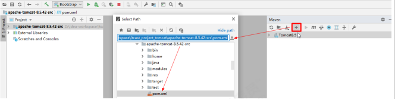

> Tomcat系列笔记内容来之黑马程序员Tomcat培训视频
>
> 视频学习地址：https://www.bilibili.com/video/BV1dJ411N7Um/

## 常见的web服务器软件

* webLogic：oracle公司，大型的JavaEE服务器，支持所有的JavaEE规范，收费的。
* webSphere：IBM公司，大型的JavaEE服务器，支持所有的JavaEE规范，收费的。
* JBOSS：JBOSS公司的，大型的JavaEE服务器，支持所有的JavaEE规范，收费的。
* Tomcat：Apache基金组织，中小型的JavaEE服务器，仅仅支持少量的JavaEE规范
* servlet/jsp。开源的，免费的。

## Tomcat 安装

### 下载

官网地址：https://tomcat.apache.org/download-80.cgi

```
wget https://dlcdn.apache.org/tomcat/tomcat-8/v8.5.99/bin/apache-tomcat-8.5.99.tar.gz
```

windows上也可以直接下载msi安装包

### 安装

将下载的压缩包 ， 解压到系统的目录下即可。

## Tomcat 目录结构

Tomcat 的主要目录文件如下 ：

* bin：存放Tomcat的启动、停止等批处理脚本文件
  * startup.bat ,startup.sh：用于在windows和linux下的启动脚本
  * shutdown.bat ,shutdown.sh：用于在windows和linux下的停止脚本
* conf：用于存放Tomcat的相关配置文件
  * Catalina：用于存储针对每个虚拟机的Context配置
  * context.xml：用于定义所有web应用均需加载的Context配置，如果web应用指定了自己的context.xml，该文件将被覆盖
  * catalina.properties：Tomcat 的环境变量配置
  * catalina.policy：Tomcat 运行的安全策略配置
  * logging.properties：Tomcat 的日志配置文件， 可以通过该文件修改Tomcat 的日志级别及日志路径等
  * server.xml：Tomcat 服务器的核心配置文件
  * tomcat-users.xml：定义Tomcat默认的用户及角色映射信息配置
  * web.xml：Tomcat 中所有应用默认的部署描述文件， 主要定义了基础Servlet和MIME映射。
* lib：Tomcat 服务器的依赖包
* logs：Tomcat 默认的日志存放目录
* webapps：Tomcat 默认的Web应用部署目录
* work：Web 应用JSP代码生成和编译的临时目录

## Tomcat 启动停止

```
#启动
双击 bin/startup.bat 文件 ；

#停止
双击 bin/shutdown.bat 文件 ；

#访问
http://localhost:8080
```


## Tomcat源码

### 下载

下载地址：https://dlcdn.apache.org/tomcat/tomcat-8/v8.5.99/src/apache-tomcat-8.5.99-src.tar.gz

### 运行

解压压缩包

进入解压目录，并创建一个目录，命名为home ， 并将conf、webapps目录移入home 目录中

在当前目录下创建一个 pom.xml 文件，引入tomcat的依赖包

```
<?xml version="1.0" encoding="UTF‐8"?>
<project xmlns="http://maven.apache.org/POM/4.0.0"
         xmlns:xsi="http://www.w3.org/2001/XMLSchema‐instance"
         xsi:schemaLocation="http://maven.apache.org/POM/4.0.0
http://maven.apache.org/xsd/maven‐4.0.0.xsd">
    <modelVersion>4.0.0</modelVersion>
    <groupId>org.apache.tomcat</groupId>
    <artifactId>apache‐tomcat‐8.5.42‐src</artifactId>
    <name>Tomcat8.5</name>
    <version>8.5</version>
    <build>
        <finalName>Tomcat8.5</finalName>
        <sourceDirectory>java</sourceDirectory>
        <!‐‐ <testSourceDirectory>test</testSourceDirectory>‐‐>
        <resources>
            <resource>
                <directory>java</directory>
            </resource>
        </resources>
        <!‐‐
        <testResources>
            <testResource>
                <directory>test</directory>
            </testResource>
        </testResources>
        ‐‐>
        <plugins>
            <plugin>
                <groupId>org.apache.maven.plugins</groupId>
                <artifactId>maven‐compiler‐plugin</artifactId>
                <version>2.3</version>
                <configuration>
                    <encoding>UTF‐8</encoding>
                    <source>1.8</source>
                    <target>1.8</target>
                </configuration>
            </plugin>
        </plugins>
    </build>
    <dependencies>
        <dependency>
            <groupId>junit</groupId>
            <artifactId>junit</artifactId>
            <version>4.12</version>
            <scope>test</scope>
        </dependency>
        <dependency>
            <groupId>org.easymock</groupId>
            <artifactId>easymock</artifactId>
            <version>3.4</version>
        </dependency>
        <dependency>
            <groupId>ant</groupId>
            <artifactId>ant</artifactId>
            <version>1.7.0</version>
        </dependency>
        <dependency>
            <groupId>wsdl4j</groupId>
            <artifactId>wsdl4j</artifactId>
            <version>1.6.2</version>
        </dependency>
        <dependency>
            <groupId>javax.xml</groupId>
            <artifactId>jaxrpc</artifactId>
            <version>1.1</version>
        </dependency>
        <dependency>
            <groupId>org.eclipse.jdt.core.compiler</groupId>
            <artifactId>ecj</artifactId>
            <version>4.5.1</version>
        </dependency>
    </dependencies>
</project>
```

在idea中， 导入该工程。



配置idea的启动类， 配置 MainClass ， 并配置 VM 参数。

```
‐Dcatalina.home=D:/idea‐workspace/itcast_project_tomcat/apache‐tomcat‐8.5.42‐src/home
‐Dcatalina.base=D:/idea‐workspace/itcast_project_tomcat/apache‐tomcat‐8.5.42‐src/home
‐Djava.util.logging.manager=org.apache.juli.ClassLoaderLogManager
‐Djava.util.logging.config.file=D:/idea‐workspace/itcast_project_tomcat/apache‐tomcat‐8.5.42‐src/home/conf/logging.properties
```


启动主方法， 运行Tomcat ， 访问Tomcat 。


出现上述异常的原因，是我们直接启动org.apache.catalina.startup.Bootstrap的时候没有加载JasperInitializer，从而无法编译JSP。解决办法是在tomcat的源码ContextConfig中的configureStart函数中手动将JSP解析器初始化：

```
context.addServletContainerInitializer(new JasperInitializer(), null);
```


重启tomcat就可以正常访问了。
