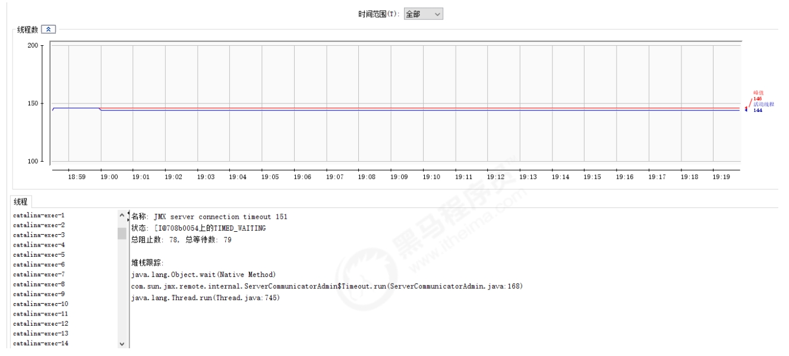

Tomcat 服务器的配置主要集中于 tomcat/conf 下的 catalina.policy、catalina.properties、context.xml、server.xml、tomcat-users.xml、web.xml 文件。

## server.xml

server.xml 是tomcat 服务器的核心配置文件，包含了Tomcat的 Servlet 容器（Catalina）的所有配置。由于配置的属性特别多，我们在这里主要讲解其中的一部分重要配置。

### Server

Server是server.xml的根元素，用于创建一个Server实例，默认使用的实现类是org.apache.catalina.core.StandardServer。

```
<Server port="8005" shutdown="SHUTDOWN">
...
</Server>
```

* port : Tomcat 监听的关闭服务器的端口。
* shutdown： 关闭服务器的指令字符串。
* Server内嵌的子元素为 Listener、GlobalNamingResources、Service。

默认配置的5个Listener 的含义：

```
<!‐‐ 用于以日志形式输出服务器 、操作系统、JVM的版本信息 ‐‐>
<Listener className="org.apache.catalina.startup.VersionLoggerListener"/>

<!‐‐ 用于加载（服务器启动） 和 销毁 （服务器停止） APR。 如果找不到APR库， 则会输出日志， 并不影响Tomcat启动 ‐‐>
<Listener className="org.apache.catalina.core.AprLifecycleListener" SSLEngine="on" />

<!‐‐ 用于避免JRE内存泄漏问题 ‐‐>
<Listener className="org.apache.catalina.core.JreMemoryLeakPreventionListener" />

<!‐‐ 用户加载（服务器启动） 和 销毁（服务器停止） 全局命名服务 ‐‐>
<Listener className="org.apache.catalina.mbeans.GlobalResourcesLifecycleListener"/>

<!‐‐ 用于在Context停止时重建Executor 池中的线程， 以避免ThreadLocal 相关的内存泄漏 ‐‐>
<Listener className="org.apache.catalina.core.ThreadLocalLeakPreventionListener" />
```

GlobalNamingResources 中定义了全局命名服务：

```
<!‐‐ Global JNDI resources
        Documentation at /docs/jndi‐resources‐howto.html
        ‐‐>
<GlobalNamingResources>
<!‐‐ Editable user database that can also be used by
UserDatabaseRealm to authenticate users
‐‐>
<Resource name="UserDatabase" auth="Container"
          type="org.apache.catalina.UserDatabase"
          description="User database that can be updated and saved"
          factory="org.apache.catalina.users.MemoryUserDatabaseFactory"
          pathname="conf/tomcat‐users.xml" />
</GlobalNamingResources>
```

## Service

该元素用于创建 Service 实例，默认使用 org.apache.catalina.core.StandardService。默认情况下，Tomcat 仅指定了Service 的名称， 值为 "Catalina"。Service 可以内嵌的元素为 ： Listener、Executor、Connector、Engine，其中 ：

* Listener 用于为Service添加生命周期监听器
* Executor 用于配置Service 共享线程池
* Connector 用于配置Service 包含的链接器
* Engine 用于配置Service中链接器对应的Servlet 容器引擎

```
<Service name="Catalina">
...
</Service>
```

一个Server服务器，可以包含多个Service服务。

## Executor

默认情况下，Service 并未添加共享线程池配置。 如果我们想添加一个线程池， 可以在下添加如下配置：

```
<Executor name="tomcatThreadPool"
          namePrefix="catalina‐exec‐"
          maxThreads="200"
          minSpareThreads="100"
          maxIdleTime="60000"
          maxQueueSize="Integer.MAX_VALUE"
          prestartminSpareThreads="false"
          threadPriority="5"
          className="org.apache.catalina.core.StandardThreadExecutor"/>
```

属性说明：

* name：线程池名称，用于 Connector中指定。
* namePrefix：所创建的每个线程的名称前缀，一个单独的线程名称为namePrefix+threadNumber。
* maxThreads：池中最大线程数。
* minSpareThreads：活跃线程数，也就是核心池线程数，这些线程不会被销毁，会一直存在。
* maxIdleTime：线程空闲时间，超过该时间后，空闲线程会被销毁，默认值为6000（1分钟），单位毫秒。
* maxQueueSize：在被执行前最大线程排队数目，默认为Int的最大值，也就是广义的无限。除非特殊情况，这个值不需要更改，否则会有请求不会被处理的情况发生。
* prestartminSpareThreads：启动线程池时是否启动 minSpareThreads部分线程。默认值为false，即不启动。
* threadPriority：线程池中线程优先级，默认值为5，值从1到10。
* className：线程池实现类，未指定情况下，默认实现类为org.apache.catalina.core.StandardThreadExecutor。
  如果想使用自定义线程池首先需要实现org.apache.catalina.Executor接口。



### Connector

Connector 用于创建链接器实例。默认情况下，server.xml 配置了两个链接器，一个支持HTTP协议，一个支持AJP协议。因此大多数情况下，我们并不需要新增链接器配置，只是根据需要对已有链接器进行优化。

```
<Connector port="8080" protocol="HTTP/1.1" connectionTimeout="20000" redirectPort="8443" />

<Connector port="8009" protocol="AJP/1.3" redirectPort="8443" />
```

属性说明：

* port： 端口号，Connector 用于创建服务端Socket 并进行监听， 以等待客户端请求链接。如果该属性设置为0，Tomcat将会随机选择一个可用的端口号给当前Connector使用。
* protocol ： 当前Connector 支持的访问协议。 默认为 HTTP/1.1 ， 并采用自动切换机制选择一个基于 JAVA NIO 的链接器或者基于本地APR的链接器（根据本地是否含有Tomcat的本地库判定）。
  如果不希望采用上述自动切换的机制， 而是明确指定协议， 可以使用以下值。
  * Http协议：

    ```
    org.apache.coyote.http11.Http11NioProtocol ， 非阻塞式 Java NIO 链接器
    org.apache.coyote.http11.Http11Nio2Protocol ， 非阻塞式 JAVA NIO2 链接器
    org.apache.coyote.http11.Http11AprProtocol ， APR 链接器
    ```
  * AJP协议 ：

    ```
    org.apache.coyote.ajp.AjpNioProtocol ， 非阻塞式 Java NIO 链接器
    org.apache.coyote.ajp.AjpNio2Protocol ，非阻塞式 JAVA NIO2 链接器
    org.apache.coyote.ajp.AjpAprProtocol ， APR 链接器
    ```
* connectionTimeOut : Connector 接收链接后的等待超时时间， 单位为 毫秒。 -1 表示不超时。
* redirectPort：当前Connector 不支持SSL请求， 接收到了一个请求， 并且也符合security-constraint 约束， 需要SSL传输，Catalina自动将请求重定向到指定的端口。
* executor ： 指定共享线程池的名称， 也可以通过maxThreads、minSpareThreads等属性配置内部线程池。
* URIEncoding : 用于指定编码URI的字符编码， Tomcat8.x版本默认的编码为 UTF-8 , Tomcat7.x版本默认为ISO-8859-1。

完整的配置如下：

```
<Connector port="8080"
           protocol="HTTP/1.1"
           executor="tomcatThreadPool"
           maxThreads="1000"
           minSpareThreads="100"
           acceptCount="1000"
           maxConnections="1000"
           connectionTimeout="20000"
           compression="on"
           compressionMinSize="2048"
           disableUploadTimeout="true"
           redirectPort="8443"
           URIEncoding="UTF‐8" />
```

### Engine

Engine 作为Servlet 引擎的顶级元素，内部可以嵌入： Cluster、Listener、Realm、Valve和Host。

```
<Engine name="Catalina" defaultHost="localhost">
...
</Engine>
```

属性说明：

* name： 用于指定Engine 的名称， 默认为Catalina 。该名称会影响一部分Tomcat的存储路径（如临时文件）。
* defaultHost ： 默认使用的虚拟主机名称， 当客户端请求指向的主机无效时， 将交由默认的虚拟主机处理， 默认为localhost。

### Host

Host 元素用于配置一个虚拟主机， 它支持以下嵌入元素：Alias、Cluster、Listener、Valve、Realm、Context。如果在Engine下配置Realm， 那么此配置将在当前Engine下的所有Host中共享。 同样，如果在Host中配置Realm ， 则在当前Host下的所有Context中共享。Context中的Realm优先级 > Host 的Realm优先级 > Engine中的Realm优先级。

```
<Host name="localhost" appBase="webapps" unpackWARs="true"
      autoDeploy="true">
    ...
</Host>
```

属性说明：

* name: 当前Host通用的网络名称， 必须与DNS服务器上的注册信息一致。 Engine中包含的Host必须存在一个名称与Engine的defaultHost设置一致。
* appBase： 当前Host的应用基础目录， 当前Host上部署的Web应用均在该目录下可以是绝对目录，相对路径）。默认为webapps。
* unpackWARs： 设置为true， Host在启动时会将appBase目录下war包解压为目录。设置为false， Host将直接从war文件启动。
* autoDeploy： 控制tomcat是否在运行时定期检测并自动部署新增或变更的web应用。

通过给Host添加别名，我们可以实现同一个Host拥有多个网络名称，配置如下：

```
<Host name="www.web1.com" appBase="webapps" unpackWARs="true"
      autoDeploy="true">
    <Alias>www.web2.com</Alias>
</Host>
```

这个时候，我们就可以通过两个域名访问当前Host下的应用（需要确保DNS或hosts中添加了域名的映射配置）。

### Context

Context 用于配置一个Web应用，默认的配置如下：

```
<Context docBase="myApp" path="/myApp">
    ....
</Context>
```

属性描述：

* docBase：Web应用目录或者War包的部署路径。可以是绝对路径，也可以是相对于Host appBase的相对路径。
* path：Web应用的Context 路径。如果我们Host名为localhost， 则该web应用访问的根路径为： http://localhost:8080/myApp。它支持的内嵌元素为：CookieProcessor， Loader， Manager，Realm，Resources，WatchedResource，JarScanner，Valve。

```
<Host name="www.tomcat.com" appBase="webapps" unpackWARs="true"
      autoDeploy="true">
    <Context docBase="D:\servlet_project03" path="/myApp"></Context>
    <Valve className="org.apache.catalina.valves.AccessLogValve"
           directory="logs"
           prefix="localhost_access_log" suffix=".txt"
           pattern="%h %l %u %t "%r" %s %b" />
</Host>
```

## tomcat-users.xml

该配置文件中，主要配置的是Tomcat的用户，角色等信息，用来控制Tomcat中manager， host-manager的访问权限。
