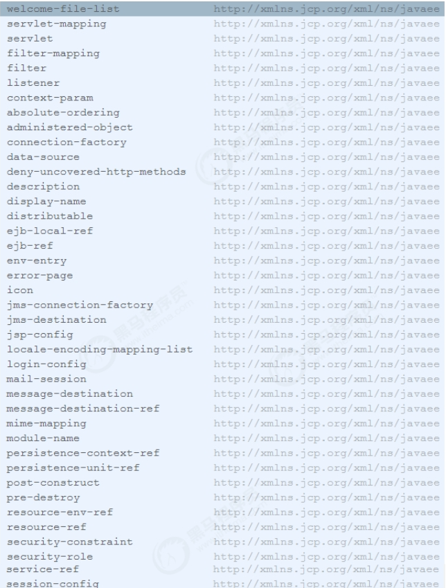

web.xml 是web应用的描述文件， 它支持的元素及属性来自于Servlet 规范定义 。 在Tomcat 中， Web 应用的描述信息包括 tomcat/conf/web.xml 中默认配置 以及 Web应用 WEB-INF/web.xml 下的定制配置。



## ServletContext 初始化参数

我们可以通过 添加ServletContext 初始化参数，它配置了一个键值对，这样我们可以在应用程序中使用 javax.servlet.ServletContext.getInitParameter()方法获取参数。

```
<context‐param>
    <param‐name>contextConfigLocation</param‐name>
    <param‐value>classpath:applicationContext‐*.xml</param‐value>
    <description>Spring Config File Location</description>
</context‐param>
```

## 会话配置

用于配置Web应用会话，包括 超时时间、Cookie配置以及会话追踪模式。它将覆盖server.xml 和 context.xml 中的配置。

```
<session‐config>
    <session‐timeout>30</session‐timeout>
        <cookie‐config>
            <name>JESSIONID</name>
            <domain>www.itcast.cn</domain>
            <path>/</path>
            <comment>Session Cookie</comment>
            <http‐only>true</http‐only>
            <secure>false</secure>
            <max‐age>3600</max‐age>
        </cookie‐config>
    <tracking‐mode>COOKIE</tracking‐mode>
</session‐config>
```

配置解析：

* session‐timeout ： 会话超时时间，单位 分钟
* cookie‐config： 用于配置会话追踪Cookie
  * name：Cookie的名称
  * domain：Cookie的域名
  * path：Cookie的路径
  * comment：注释
  * http‐only：cookie只能通过HTTP方式进行访问，JS无法读取或修改，此项可以增加网站访问的安全性。
  * secure：此cookie只能通过HTTPS连接传递到服务器，而HTTP 连接则不会传递该信息。注意是从浏览器传递到服务器，服务器端的Cookie对象不受此项影响。
  * max‐age：以秒为单位表示cookie的生存期，默认为‐1表示是会话Cookie，浏览器关闭时就会消失。
* tracking‐mode ：用于配置会话追踪模式，Servlet3.0版本中支持的追踪模式：COOKIE、URL、SSL
  * COOKIE : 通过HTTP Cookie 追踪会话是最常用的会话追踪机制， 而且Servlet规范也要求所有的Servlet规范都需要支持Cookie追踪。
  * URL : URL重写是最基本的会话追踪机制。当客户端不支持Cookie时，可以采用URL重写的方式。当采用URL追踪模式时，请求路径需要包含会话标识信息，Servlet容器会根据路径中的会话标识设置请求的会话信息。如：http：//www.myserver.com/user/index.html;jessionid=1234567890。
  * SSL : 对于SSL请求， 通过SSL会话标识确定请求会话标识。

## Servlet配置

Servlet 的配置主要是两部分， servlet 和 servlet-mapping ：

```
<servlet>
    <servlet‐name>myServlet</servlet‐name>
    <servlet‐class>cn.itcast.web.MyServlet</servlet‐class>
    <init‐param>
        <param‐name>fileName</param‐name>
        <param‐value>init.conf</param‐value>
    </init‐param>
    <load‐on‐startup>1</load‐on‐startup>
    <enabled>true</enabled>
</servlet>

<servlet‐mapping>
    <servlet‐name>myServlet</servlet‐name>
    <url‐pattern>*.do</url‐pattern>
    <url‐pattern>/myservet/*</url‐pattern>
</servlet‐mapping>
```

配置说明：

* servlet‐name : 指定servlet的名称， 该属性在web.xml中唯一。
* servlet‐class : 用于指定servlet类名
* init‐param： 用于指定servlet的初始化参数， 在应用中可以通过HttpServlet.getInitParameter 获取。
* load‐on‐startup： 用于控制在Web应用启动时，Servlet的加载顺序。 值小于0，web应用启动时，不加载该servlet, 第一次访问时加载。
* enabled： true ， false 。 若为false ，表示Servlet不处理任何请求。
* url‐pattern： 用于指定URL表达式，一个 servlet‐mapping可以同时配置多个 url‐pattern。

Servlet 中文件上传配置：

```
<servlet>
    <servlet‐name>uploadServlet</servlet‐name>
    <servlet‐class>cn.itcast.web.UploadServlet</servlet‐class>
    <multipart‐config>
        <location>C://path</location>
        <max‐file‐size>10485760</max‐file‐size>
        <max‐request‐size>10485760</max‐request‐size>
        <file‐size‐threshold>0</file‐size‐threshold>
    </multipart‐config>
</servlet>
```

配置说明：

location：存放生成的文件地址。

* max‐file‐size：允许上传的文件最大值。 默认值为‐1， 表示没有限制。
* max‐request‐size：针对该 multi/form‐data 请求的最大数量，默认值为‐1， 表示无限制。
* file‐size‐threshold：当数量量大于该值时， 内容会被写入文件。

## Listener配置

Listener用于监听servlet中的事件，例如context、request、session对象的创建、修改、删除，并触发响应事件。Listener是观察者模式的实现，在servlet中主要用于对context、request、session对象的生命周期进行监控。在servlet2.5规范中共定义了8中Listener。在启动时，ServletContextListener 的执行顺序与web.xml 中的配置顺序一致， 停止时执行顺序相反。

```
<listener>
    <listener‐class>org.springframework.web.context.ContextLoaderListener</listener‐class>
</listener>
```

## Filter配置

filter 用于配置web应用过滤器， 用来过滤资源请求及响应。 经常用于认证、日志、加密、数据转换等操作， 配置如下：

```
<filter>
    <filter‐name>myFilter</filter‐name>
    <filter‐class>cn.itcast.web.MyFilter</filter‐class>
    <async‐supported>true</async‐supported>
    <init‐param>
        <param‐name>language</param‐name>
        <param‐value>CN</param‐value>
    </init‐param>
</filter>

<filter‐mapping>
    <filter‐name>myFilter</filter‐name>
    <url‐pattern>/*</url‐pattern>
</filter‐mapping>
```

配置说明：

* filter‐name： 用于指定过滤器名称，在web.xml中，过滤器名称必须唯一。
* filter‐class ： 过滤器的全限定类名， 该类必须实现Filter接口。
* async‐supported： 该过滤器是否支持异步
* init‐param ：用于配置Filter的初始化参数， 可以配置多个， 可以通过FilterConfig.getInitParameter获取
* url‐pattern： 指定该过滤器需要拦截的URL。

## 欢迎页面配置

welcome-file-list 用于指定web应用的欢迎文件列表。尝试请求的顺序，从上到下。

```
<welcome‐file‐list>
    <welcome‐file>index.html</welcome‐file>
    <welcome‐file>index.htm</welcome‐file>
    <welcome‐file>index.jsp</welcome‐file>
</welcome‐file‐list>
```

### 错误页面配置

error-page 用于配置Web应用访问异常时定向到的页面，支持HTTP响应码和异常类两种形式。

```
<error‐page>
    <error‐code>404</error‐code>
    <location>/404.html</location>
</error‐page>

<error‐page>
    <error‐code>500</error‐code>
    <location>/500.html</location>
</error‐page>

<error‐page>
    <exception‐type>java.lang.Exception</exception‐type>
    <location>/error.jsp</location>
</error‐page>
```
