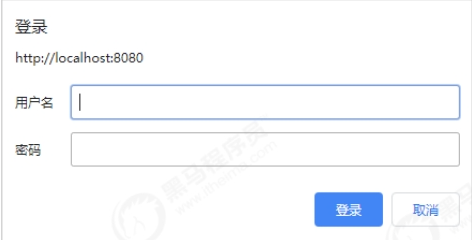
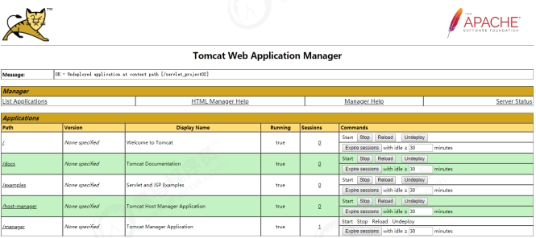

从早期的Tomcat版本开始，就提供了Web版的管理控制台，他们是两个独立的Web应用，位于webapps目录下。Tomcat 提供的管理应用有用于管理的Host的host-manager和用于管理Web应用的manager。

## host-manager

Tomcat启动之后，可以通过 http://localhost:8080/host-manager/html 访问该Web应用。 host-manager 默认添加了访问权限控制，当打开网址时，需要输入用户名和密码（conf/tomcat-users.xml中配置） 。所以要想访问该页面，需要在conf/tomcatusers.xml 中配置，并分配对应的角色：

* admin-gui：用于控制页面访问权限
* admin-script：用于控制以简单文本的形式进行访问

配置如下：

```
<role rolename="admin‐gui"/>
<role rolename="admin‐script"/>
<user username="itcast" password="itcast" roles="admin‐script,admin‐gui"/>
```

登录：



界面：


## manager

manager的访问地址为 http://localhost:8080/manager， 同样， manager也添加了页面访问控制，因此我们需要为登录用户分配角色为：

```
<role rolename="manager‐gui"/>
<role rolename="manager‐script"/>
<user username="itcast" password="itcast" roles="admin‐script,admin‐gui,manager‐gui,manager‐script"/>
```

界面：



### Server Status


