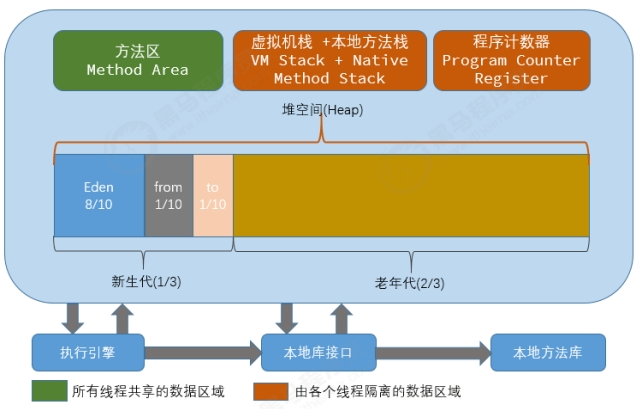
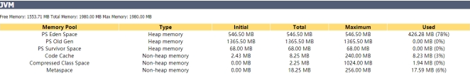

最常见的JVM配置当属内存分配，因为在绝大多数情况下，JVM默认分配的内存可能不能够满足我们的需求，特别是在生产环境，此时需要手动修改Tomcat启动时的内存参数分配。

## JVM内存模型图



## JVM配置选项

windows 平台(catalina.bat)：

```
set JAVA_OPTS=‐server ‐Xms2048m ‐Xmx2048m ‐XX:MetaspaceSize=256m ‐XX:MaxMetaspaceSize=256m ‐XX:SurvivorRatio=8

```

linux 平台(catalina.sh)：

```
JAVA_OPTS="‐server ‐Xms1024m ‐Xmx2048m ‐XX:MetaspaceSize=256m ‐XX:MaxMetaspaceSize=512m ‐XX:SurvivorRatio=8"
```

参数说明 ：

* -Xms：堆内存的初始大小
* -Xmx：堆内存的最大大小
* -Xmn：新生代的内存大小，官方建议是整个堆得3/8
* -XX:MetaspaceSize：元空间内存初始大小， 在JDK1.8版本之前配置为 -XX:PermSize（永久代）
* -XX:MaxMetaspaceSize：元空间内存最大大小， 在JDK1.8版本之前配置为 -XX:MaxPermSize（永久代）
* -XX:InitialCodeCacheSize：代码缓存区大小
* -XX:ReservedCodeCacheSize：代码缓存区大小
* -XX:NewRatio：设置新生代和老年代的相对大小比例。这种方式的优点是新生代大小会随着整个堆大小动态扩展。如 -XX:NewRatio=3 指定老年代 /新生代为 3/1。 老年代占堆大小的 3/4，新生代占 1/4 。
* -XX:SurvivorRatio：指定伊甸园区 (Eden) 与幸存区大小比例。如-XX:SurvivorRatio=10 表示伊甸园区 (Eden)是 幸存区 To 大小的 10 倍 (也是幸存区 From的 10 倍)。 所以， 伊甸园区 (Eden) 占新生代大小的 10/12， 幸存区 From 和幸存区 To 每个占新生代的 1/12 。 注意， 两个幸存区永远是一样大的。

配置之后, 重新启动Tomcat ,访问 :


