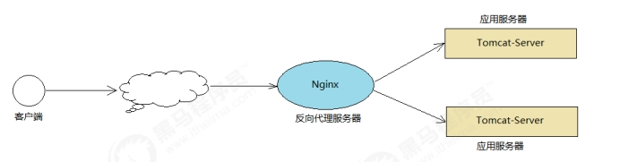
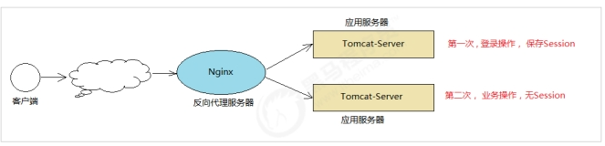
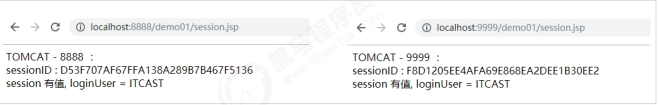
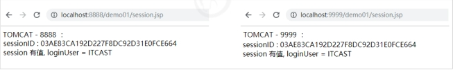
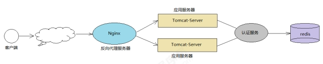

## 简介

由于单台Tomcat的承载能力是有限的，当我们的业务系统用户量比较大，请求压力比较大时，单台Tomcat是扛不住的，这个时候，就需要搭建Tomcat的集群，而目前比较流程的做法就是通过Nginx来实现Tomcat集群的负载均衡。



## 环境准备

### 准备Tomcat

在服务器上, 安装两台tomcat, 然后分别改Tomcat服务器的端口号 :

```
#原端口---->两台tomcat更改后的端口
8005 ‐‐‐‐‐‐‐‐‐> 8015 ‐‐‐‐‐‐‐‐‐> 8025
8080 ‐‐‐‐‐‐‐‐‐> 8888 ‐‐‐‐‐‐‐‐‐> 9999
8009 ‐‐‐‐‐‐‐‐‐> 8019 ‐‐‐‐‐‐‐‐‐> 8029
```

### 安装配置Nginx

在当前服务器上 , 安装Nginx , 然后再配置Nginx, 配置nginx.conf :

```
upstream serverpool{
    server localhost:8888;
    server localhost:9999;
}
server {
    listen 99;
    server_name localhost;
    location / {
    proxy_pass http://serverpool/;
    }
}
```

## 负载均衡策略

### 轮询

最基本的配置方法，它是upstream模块默认的负载均衡默认策略。每个请求会按时间顺序逐一分配到不同的后端服务器。

```
upstream serverpool{
    server localhost:8888;
    server localhost:9999;
}
```

参数说明:

* fail_timeout：与max_fails结合使用
* max_fails：设置在fail_timeout参数设置的时间内最大失败次数，如果在这个时间内，所有针对该服务器的请求都失败了，那么认为该服务器会被认为是停机了
* fail_time：服务器会被认为停机的时间长度,默认为10s
* backup：标记该服务器为备用服务器。当主服务器停止时，请求会被发送到它这里
* down：标记服务器永久停机了

### weight权重

权重方式，在轮询策略的基础上指定轮询的几率。

```
upstream serverpool{
    server localhost:8888 weight=3;
    server localhost:9999 weight=1;
}
```

weight参数用于指定轮询几率，weight的默认值为1；weight的数值与访问比率成正比，比如8888服务器上的服务被访问的几率为9999服务器的三倍。

此策略比较适合服务器的硬件配置差别比较大的情况。

### ip_hash

指定负载均衡器按照基于客户端IP的分配方式，这个方法确保了相同的客户端的请求一直发送到相同的服务器，以保证session会话。这样每个访客都固定访问一个后端服务器，可以解决session不能跨服务器的问题。

```
upstream serverpool{
    ip_hash;
    server 192.168.192.133:8080;
    server 192.168.192.137:8080;
}
```

## Session共享方案

在Tomcat集群中，如果应用需要用户进行登录，那么这个时候，用于tomcat做了负载均衡，则用户登录并访问应用系统时，就会出现问题 。



解决上述问题， 有以下几种方案：

### ip_hash 策略

一个用户发起的请求，只会请求到tomcat1上进行操作，另一个用户发起的请求只在tomcat2上进行操作 。那么这个时候，同一个用户发起的请求，都会通过nginx的ip_hash策略，将请求转发到其中的一台Tomcat上。

### Session复制

在servlet_demo01 工程中 , 制作session.jsp页面，分别将工程存放在两台 tomcat 的webapps/ 目录下：

```
<%@ page contentType="text/html;charset=UTF‐8" language="java" %>
<html>
<head>
    <title>Title</title>
</head>
<body>
    TOMCAT ‐ 9999 ：
    <br/>
    sessionID : <%= session.getId()%>
    <br/>
    <%
    Object loginUser = session.getAttribute("loginUser");
    if(loginUser != null && loginUser.toString().length()>0){
    out.println("session 有值, loginUser = " + loginUser);
    }else{
    session.setAttribute("loginUser","ITCAST");
    out.println("session 没有值");
    }
    %>
</body>
</html>
```

通过nginx访问 ， http://localhost:99/demo01/session.jsp ，访问到的两台Tomcat出现的sessionID是不一样的：



上述现象，则说明两台Tomcat的Session各是各的，并没有进行同步，这在集群环境下是存在问题的。

Session同步的配置如下：

1. 在Tomcat的conf/server.xml 配置如下:

   ```
   <Cluster className="org.apache.catalina.ha.tcp.SimpleTcpCluster"/>
   ```
2. 在Tomcat部署的应用程序 servlet_demo01 的web.xml 中加入如下配置 ：

   ```
   <distributable/>
   ```
3. 配置完毕之后， 再次重启两个 Tomcat服务。

   

上述方案，适用于较小的集群环境（节点数不超过4个），如果集群的节点数比较多的话，通过这种广播的形式来完成Session的复制，会消耗大量的网络带宽，影响服务的性能。

### SSO-单点登录

单点登录（Single Sign On），简称为 SSO，是目前比较流行的企业业务整合的解决方案之一。SSO的定义是在多个应用系统中，用户只需要登录一次就可以访问所有相互信任的应用系统，也是用来解决集群环境Session共享的方案之一 。


