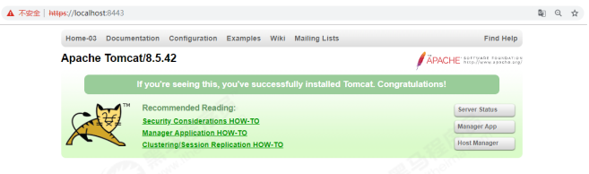

## 配置安全

* 删除webapps目录下的所有文件，禁用tomcat管理界面；
* 注释或删除tomcat-users.xml文件内的所有用户权限；
* 更改关闭tomcat指令或禁用；

  * tomcat的server.xml中定义了可以直接关闭 Tomcat 实例的管理端口（默认8005）。可以通过 telnet 连接上该端口之后，输入 SHUTDOWN （此为默认关闭指令）即可关闭Tomcat 实例（注意，此时虽然实例关闭了，但是进程还是存在的）。由于默认关闭Tomcat 的端口和指令都很简单。默认端口为8005，指令为SHUTDOWN 。

    方案一：更改端口号和指令

    ```
    <Server port="8456" shutdown="itcast_shut">
    ```

    方案二：禁用8005端口

    ```
    <Server port="‐1" shutdown="SHUTDOWN">
    ```
* 定义错误页面。在webapps/ROOT目录下定义错误页面 404.html，500.html；然后在tomcat/conf/web.xml中进行配置 ， 配置错误页面：

  ```
  <error‐page>
      <error‐code>404</error‐code>
      <location>/404.html</location>
  </error‐page>

  <error‐page>
      <error‐code>500</error‐code>
      <location>/500.html</location>
  </error‐page>
  ```

  这样配置之后，用户在访问资源时出现404,500这样的异常，就能看到我们自定义的错误页面，而不会看到异常的堆栈信息，提高了用户体验，也保障了服务的安全性。

## 应用安全

在大部分的Web应用中，特别是一些后台应用系统，都会实现自己的安全管理模块（权限模块），用于控制应用系统的安全访问，基本包含两个部分：认证（登录/单点登录）和授权（功能权限、数据权限）两个部分。对于当前的业务系统，可以自己做一套适用于自己业务系统的权限模块，也有很多的应用系统直接使用一些功能完善的安全框架，将其集成到我们的web应用中，如：SpringSecurity、Apache Shiro等。

## 传输安全

### HTTPS介绍

HTTPS的全称是超文本传输安全协议（Hypertext Transfer Protocol Secure），是一种网络安全传输协议。在HTTP的基础上加入SSL/TLS来进行数据加密，保护交换数据不被泄露、窃取。

SSL 和 TLS 是用于网络通信安全的加密协议，它允许客户端和服务器之间通过安全链接通信。SSL 协议的3个特性：

* 保密：通过SSL链接传输的数据时加密的。
* 鉴别：通信双方的身份鉴别，通常是可选的，单至少有一方需要验证。
* 完整性：传输数据的完整性检查。

从性能角度考虑，加解密是一项计算昂贵的处理，因为尽量不要将整个Web应用采用SSL链接， 实际部署过程中， 选择有必要进行安全加密的页面（存在敏感信息传输的页面）采用SSL通信。

HTTPS和HTTP的区别主要为以下四点：

1. HTTPS协议需要到证书颁发机构CA申请SSL证书, 然后与域名进行绑定，HTTP不用申请证书；
2. HTTP是超文本传输协议，属于应用层信息传输，HTTPS 则是具有SSL加密传安全性传输协议，对数据的传输进行加密，相当于HTTP的升级版；
3. HTTP和HTTPS使用的是完全不同的连接方式，用的端口也不一样，前者是8080，后者是8443。
4. HTTP的连接很简单，是无状态的；HTTPS协议是由SSL+HTTP协议构建的可进行加密传输、身份认证的网络协议，比HTTP协议安全。

HTTPS协议优势：

1. 提高网站排名，有利于SEO。谷歌已经公开声明两个网站在搜索结果方面相同，如果一个网站启用了SSL，它可能会获得略高于没有SSL网站的等级，而且百度也表明对安装了SSL的网站表示友好。因此，网站上的内容中启用SSL都有明显的SEO优势。
2. 隐私信息加密，防止流量劫持。特别是涉及到隐私信息的网站，互联网大型的数据泄露的事件频发发生，网站进行信息加密势在必行。
3. 浏览器受信任。 自从各大主流浏览器大力支持HTTPS协议之后，访问HTTP的网站都会提示“不安全”的警告信息。

### Tomcat支持HTTPS

1. 生成秘钥库文件。

   ```
   keytool ‐genkey ‐alias tomcat ‐keyalg RSA ‐keystore tomcatkey.keystore
   ```
   

   输入对应的密钥库密码， 秘钥密码等信息之后，会在当前文件夹中出现一个秘钥库文件：tomcatkey.keystore
2. 将秘钥库文件 tomcatkey.keystore 复制到tomcat/conf 目录下。
3. 配置tomcat/conf/server.xm

   ```
   <Connector port="8443"
              protocol="org.apache.coyote.http11.Http11NioProtocol"
              maxThreads="150" schema="https" secure="true" SSLEnabled="true">
       <SSLHostConfig certificateVerification="false">
           <Certificate
                   certificateKeystoreFile="D:/DevelopProgramFile/apache‐tomcat‐8.5.42‐
   windows‐x64/apache‐tomcat‐8.5.42/conf/tomcatkey.keystore"
                   certificateKeystorePassword="itcast" type="RSA" />
       </SSLHostConfig>
   </Connector>
   ```
4. 访问Tomcat ，使用https协议。

   
