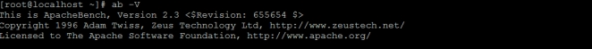

## Tomcat 性能测试

对于系统性能，用户最直观的感受就是系统的加载和操作时间，即用户执行某项操作的耗时。从更为专业的角度上讲，性能测试可以从以下两个指标量化。

1. 响应时间：如上所述，为执行某个操作的耗时。大多数情况下，我们需要针对同一个操作测试多次，以获取操作的平均响应时间。
2. 吞吐量：即在给定的时间内，系统支持的事务数量，计算单位为 TPS。

通常情况下，我们需要借助于一些自动化工具来进行性能测试，因为手动模拟大量用户的并发访问几乎是不可行的，而且现在市面上也有很多的性能测试工具可以使用，如：ApacheBench、ApacheJMeter、WCAT、WebPolygraph、LoadRunner。

我们课程上主要介绍两款免费的工具：ApacheBench。

### ApacheBench

ApacheBench（ab）是一款ApacheServer基准的测试工具，用户测试Apache Server的服务能力（每秒处理请求数），它不仅可以用户Apache的测试，还可以用于测试Tomcat、Nginx、lighthttp、IIS等服务器。

1. 安装

   ```
   yum install httpd‐tools
   ```
2. 查看版本号

   ```
   ab ‐V
   ```

   
3. 部署war包， 准备环境

   1. 在Linux系统上安装Tomcat

      ```
      #下载tomcat软件包apache‐tomcat‐8.5.42.tar.gz，此步骤略过。
      #解压
      tar ‐zxvf apache‐tomcat‐8.5.42.tar.gz ‐C /usr/local

      #修改端口号：8005 ， 8080 ， 8009
      ```
   2. 将资料中的war包上传至Tomcat的webapps下。
   3. 导入SQL脚本 ， 准备环境。
4. 测试性能

   ```
   ab ‐n 1000 ‐c 100 ‐p data.json ‐T application/json
   http://localhost:9000/course/search.do?page=1&pageSize=10
   ```

参数说明：

* -n：在测试会话中所执行的请求个数，默认只执行一次请求
* -c：一次产生的请求个数，默认一次一个
* -p：包含了需要POST的数据文件
* -t：测试所进行的最大秒数，默认没有时间限制
* -T：POST数据所需要使用的Content-Type头信息
* -v：设置显示信息的详细程度
* -w：以HTML表的格式输出结果，默认是白色背景的两列宽度的一张表

会得到类似以下结果：（以下结果并非上面给出的性能测试代码的结果）

```
Concurrency Level:      100
Time taken for tests:   10.321 seconds
Complete requests:      1000
Failed requests:        0
Total transferred:      329000 bytes
HTML transferred:       151000 bytes
Requests per second:    96.84 [#/sec] (mean)
Time per request:       1032.123 [ms] (mean)
Time per request:       10.321 [ms] (mean, across all concurrent requests)
Transfer rate:          31.17 [Kbytes/sec] received
```

结果指标说明：

* Server Software：服务器软件
* Server Hostname：主机名
* Server Port：端口号
* Document Path：测试的页面
* Document Length：测试的页面大小
* Concurrency Level：并发数
* Time taken for tests：整个测试持续的时间
* Complete requests：完成的请求数量
* Failed requests：失败的请求数量，这里的失败是指请求的连接服务器、发送数据、接收数据等环节发生异常，以及无响应后超时的情况。
* Write errors：输出错误数量
* Total transferred：整个场景中的网络传输量，表示所有请求的响应数据长度总和，包括每个http响应数据的头信息和正文数据的长度。
* HTML transferred：整个场景中的HTML内容传输量，表示所有请求的响应数据中正文数据的总和
* Requests per second：每秒钟平均处理的请求数（相当于 LR 中的 每秒事务数）这便是我们重点关注的吞吐率，它等于：Complete requests / Time taken for tests
* Time per request：每个线程处理请求平均消耗时间（相当于 LR 中的 平均事务响应时间）用户平均请求等待时间
* Transfer rate：平均每秒网络上的流量
* Percentage of the requests served within a certain time (ms)：指定时间里，执行的请求百分比

其中重要指标：

Requests per second：吞吐率:服务器并发处理能力的量化描述，单位是reqs/s，指的是在某个并发用户数下单位时间内处理的请求数。某个并发用户数下单位时间内能处理的最大请求数，称之为最大吞吐率。这个数值表示当前机器的整体性能，值越大越好。

Time per request：用户平均请求等待时间：从用户角度看，完成一个请求所需要的时间

Time per request:across all concurrent requests：服务器平均请求等待时间：服务器完成一个请求的时间

Concurrency Level：并发用户数

## Tomcat 性能优化

### JVM参数调优

Tomcat是一款Java应用，那么JVM的配置便与其运行性能密切相关，而JVM优化的重点则集中在内存分配和GC策略的调整上，因为内存会直接影响服务的运行效率和吞吐量，JVM垃圾回收机制则会不同程度地导致程序运行中断。可以根据应用程序的特点，选择不同的垃圾回收策略，调整JVM垃圾回收策略，可以极大减少垃圾回收次数，提升垃圾回收效率，改善程序运行性能。

#### JVM内存参数

| 参数                 | 参数作用                                          | 优化建议                |
| -------------------- | ------------------------------------------------- | ----------------------- |
| -server              | 启动Server，以服务端模式运行                      | 服务端模式建议开启      |
| -Xms                 | 最小堆内存                                        | 建议与-Xmx设置相同      |
| -Xmx                 | 最大堆内存                                        | 建议设置为可用内存的80% |
| -XX:MetaspaceSize    | 元空间初始值                                      |                         |
| -XX:MaxMetaspaceSize | 元空间最大内存                                    | 默认无限                |
| -XX:MaxNewSize       | 新生代最大内存                                    | 默认16M                 |
| -XX:NewRatio         | 年轻代和老年代大小比值，取值为整数，默认为2       | 不建议修改              |
| -XX:SurvivorRatio    | Eden区与Survivor区大小的比值，取值为整数，默认为8 | 不建议修改              |
