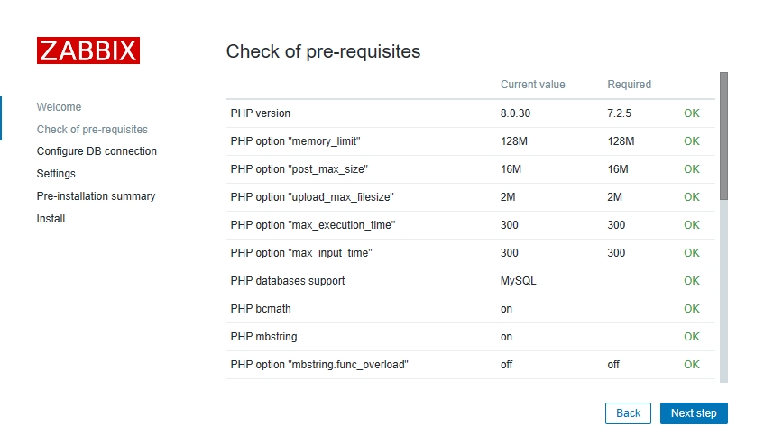
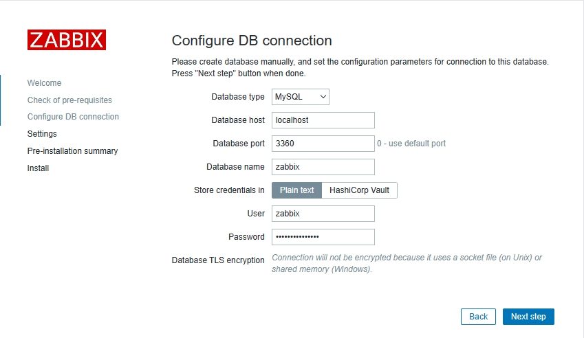
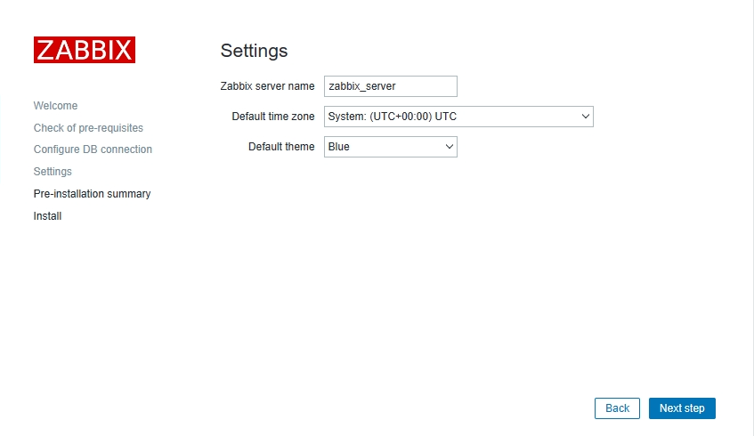
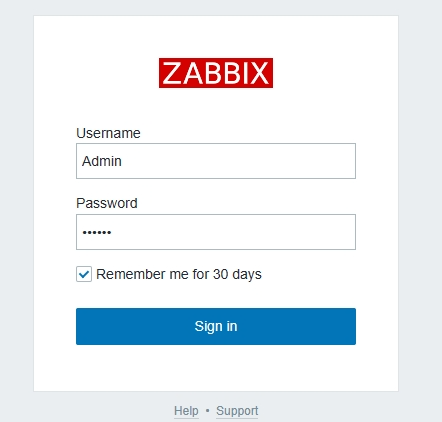

## 简介

### 监控的目的

* 报告系统运行状况
  * 每一部分必须同时监控内容包括吞吐量、反应事件、使用率
* 提前发现问题
  * 进行服务器性能调整前，知道调整什么
  * 找出系统的瓶颈在什么地方

### 监控的资源类别

* 公开数据
  * Web、FTP、SSH、数据库等应用服务
  * TCP或UDP端口
* 私有数据
  * CPU、内存、磁盘、网卡流量等使用信息
  * 用户、进程等运行信息

### 手动系统监控命令

* ps
* uptim
* iostat
* ss
* 其他

### 自动化监控系统

* Cacti
  * 基于SNMP协议的监控软件，强大的绘图能力
* Nagios
  * 基于Agent监控，强大的监控状态检查与报警机制
  * 插件极多，自己写监控脚本嵌入到Nagios非常方便
* Zabbix
  * 基于多种监控机制，支持分布式监控

## Zabbix简介

zabbix是一个企业级的高度集成的开源监控软件，提供了分布式监控解决方案，可以用来监控设备、服务等的可用性和性能。

zabbix的通用架构采用客户端/服务器端模式，分布式架构采用客户端/代理端/服务器端模式，Zabbix-Server将采集到的数据持久地存储到数据库中，用前端UI友好地展示给用户。

* 高度集成的监控解决方案
* 可以实现企业级的开源分布式监控
* 通过C/S模式采集监控数据
* 通过B/S模式实现Web管理

### 监控拓扑

* 监控服务器
  * 监控服务器可以通过SNMP或Agent采集数据
  * 数据可以写入MySQL、Oracle等数据库中
  * 服务器使用LNMP实现web前端管理
* 被监控主机
  * 被监控主机需要安装Agent
  * 常见的网络设备一般支持SNMP

## Zabbix安装

### 环境说明：

* 监控服务器

  * 设置主机名：zabbix server
  * 设置IP地址：192.168.123.200
  * 关闭防火墙、selinux
  * 系统：rockylinux9.2
* 监控客户端

  * 主机web1：192.168.123.210
  * 主机web1：192.168.123.211
  * 关闭防火墙、selinux
  * 系统：rockylinux9.2
* 软件配置

  * nginx版本：1.20
  * zabbix版本：6.0.4
  * mariadb版本：10.5
  * php版本：8.0.3

> zabbix-server内存尽量大些，4G为好

### 环境初始化

zabbix官网：https://www.zabbix.com/

#### 关闭selinux

```
sudo sed -i 's/SELINUX=enforcing/SELINUX=disabled/g' /etc/selinux/config
sudo setenforce 0

sudo reboot
```

#### 关闭防火墙

```
sudo systemctl disable firewalld && systemctl stop firewalld
sudo systemctl status firewalld
```

### 安装Zabbix服务端

获取zabbix下载源并安装

```
sudo vim  /etc/yum.repos.d/epel.repo
#在epel块添加以下内容
[epel]
...
excludepkgs=zabbix*
```

```
sudo rpm -Uvh https://repo.zabbix.com/zabbix/6.0/rhel/9/x86_64/zabbix-release-6.0-4.el9.noarch.rpm
sudo dnf clean all
```

安装Zabbix server，Web前端，agent

```
sudo dnf -y install zabbix-server-mysql zabbix-web-mysql zabbix-nginx-conf zabbix-sql-scripts zabbix-selinux-policy zabbix-agent
```

#### 安装mariadb数据库

```
sudo dnf install -y mariadb-server
```

修改配置数据库配置

```
sudo vim /etc/my.cnf.d/mariadb-server.cnf
#添加以下内容
[mysqld]
skip_name_resolve = ON		#跳过主机名解析
innodb_file_per_table = ON	#开启独立表空间
innodb_buffer_pool_size = 256M	#缓存池大小
max_connections = 2000		#最大连接数
log-bin = master-log		#开启二进制日志
```

重启数据库服务

```
sudo systemctl restart mariadb

mysql_secure_installation
#root密码：LLYntU8moM3Rvrb

#设置数据库自启
sudo systemctl enable mariadb
```

创建zabbix数据库并授权账号

```
create database zabbix character set utf8mb4 collate utf8mb4_bin;
create user zabbix@localhost identified by 'HjdqTo5aChKp581';
grant all privileges on zabbix.* to zabbix@localhost;
set global log_bin_trust_function_creators = 1;
quit;
```

导入zabbix导入初始架构和数据，系统将提示您输入新创建的密码。

```
zcat /usr/share/zabbix-sql-scripts/mysql/server.sql.gz | mysql --default-character-set=utf8mb4 -uzabbix -p zabbix
```

Disable log_bin_trust_function_creators option after importing database schema.

```
#进入数据库
mysql -uroot -p
#禁用权限
set global log_bin_trust_function_creators = 0;
quit;
```

#### 配置Zabbix Server端

```
sudo vim /etc/zabbix/zabbix_server.conf
ListenPort=10051		#默认监听端口
SourceIP=192.168.123.200	#发送采样数据请求的IP

#数据库配置
DBName=zabbix
DBUser=zabbix
DBPassword=HjdqTo5aChKp581
```

> 安装完成后，如果报错：Get value from agent failed: bind() failed: [99] Address not available
>
> 则注释掉server端的SourceIP=192.168.123.200 这个参数

#### 为zabbix前端配置PHP

```
sudo vim /etc/nginx/conf.d/zabbix.conf
#取消注释以下内容
listen          8080;
server_name     example.com;
```

#### 启动Zabbix server和agent进程

```
sudo systemctl restart zabbix-server zabbix-agent nginx php-fpm
#设置服务自启
sudo systemctl enable zabbix-server zabbix-agent nginx php-fpm
sudo systemctl status zabbix-server zabbix-agent nginx php-fpm
```

#### 在Zabbix web 界面配置

访问以下地址

```
http://192.168.123.200:8080/setup.php
```

#### 检查依赖，确保全部是OK

非OK的选项需要更改配置满足，不然可能无法进行安装



#### 配置数据库连接

* Database port：数据库端口，3306，或0(0表示默认端口)
* Database name：数据库名称，zabbix
* User：zabbix
* Password：HjdqTo5aChKp581



下一步



预安装信息确认无误后，下一步


#### 登录zabbix

默认账号密码是：Admin  zabbix



#### 修改管理员密码

User settings > User profile > change password

新密码：7c_rU[beoy9&jZ]


#### 修改页面语言为中文

```
sudo locale -a				#查看安装的语言包，没有中文
dnf install glibc-langpack-zh 		#安装中文语言包
sudo yum install langpacks-zh_CN	#设置默认语言
```

> 中文语言设置完重启zabbix服务就行，不需要重启服务器

#### 其他注意点

停止zabbix服务命令

```
killall -9 zabbix-server
```

### 安装zabbix客户端

操作步骤和安装server端差不多，客户端监控只需要有agent就行

获取zabbix agent下载源并安装

```
sudo vim  /etc/yum.repos.d/epel.repo
#在epel块添加以下内容
[epel]
excludepkgs=zabbix*
```

```
sudo rpm -Uvh https://repo.zabbix.com/zabbix/6.0/rhel/9/x86_64/zabbix-release-6.0-4.el9.noarch.rpm
sudo dnf clean all
```

安装zabbix agent

```
sudo dnf -y install zabbix-agent
```

配置zabbix agent端

```
sudo vim /etc/zabbix/zabbix_agentd.conf
#需要修改以下参数
Server=127.0.0.1,192.168.123.200	#指明监控服务器IP
ListenPort=10050			#本机监听的端口
ListenIP=0.0.0.0			#本机监听的IP，
ServerActive=192.168.123.200:10051	#主动监控时的服务器,端口可以不写
Hostname=ca-s2102.novalocal		#本机能被server端识别的名称
```

启动服务

```
sudo systemctl start zabbix-agent && sudo systemctl enable zabbix-agent
#设置自启
sudo systemctl status zabbix-agent

#查看端口是否开启
sudo ss -lntup | grep zabbix
```

# Reference Links：

#培训视频

https://www.bilibili.com/video/BV1Mb4y1f7JT

#笔记参考

https://github.com/adampielak/zabbix-notes

#其他

#关于zabbix6.0的聚合图形和仪表盘

https://www.talkwithtrend.com/Question/464335
