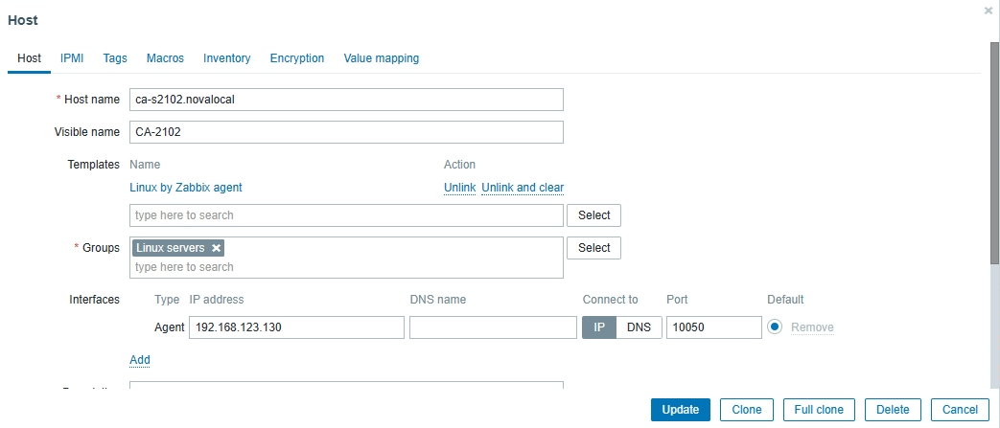
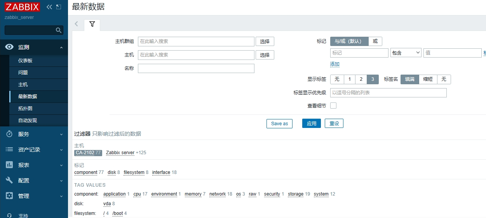
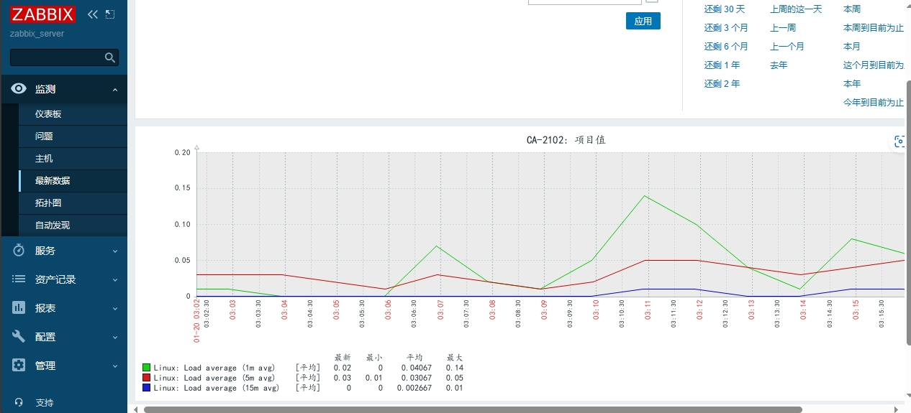
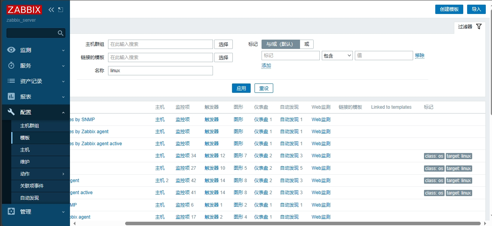
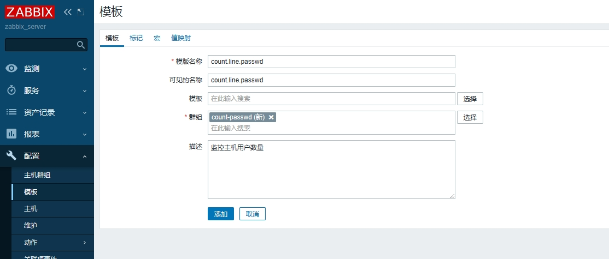
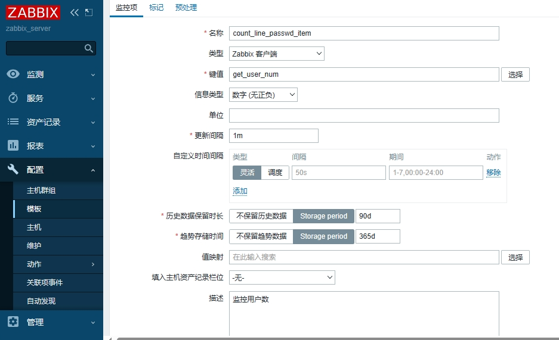
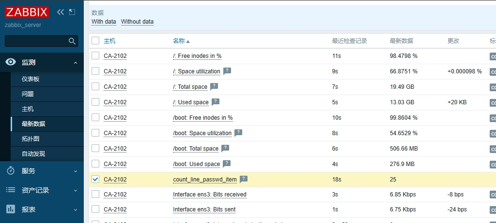

## 监控主机

### 添加监控主机

Host（主机）是监控的基本载体

Zabbix所有监控都是基于Host

**主要步骤：**

* 添加监控主机
* 应用监控模板
* 查看监控信息

#### 添加监控主机

通过 Configuration > Hosts > Create Host 创建

根据提示输入：

* Host name：主机名
* Visible name：显示的名称
* Templates：应用的模板
* Group：所属组
* Interfaces
  * IP address：被监控主机IP
  * DNS name：可以不填
  * Connect to：选IP
  * Port：10050
* 其他默认


创建完成后，会立即显示添加的主机，状态显示：Enabled


#### 应用监控模板

* 为主机添加关联的监控模板
* 在“Configuration > Templates”模板选项卡页面中
* 找到Links new templates, select选择合适的模板添加
* 这里我们选择 Linux by Zabbix agent 模板



#### 查看监控信息

* 点击“Monitoring > Latest data”
* 在过滤器中填写条件，根据群组和主机搜索即可



* 勾选需要的数据，点击后面的Graph


* 然后会显示相关数据图



## 自定义监控

zabbix自带监控参数不能满足需求时，可以在客户端编写监控脚本给监控服务器使用。

* 配置客户端
  * 启用自定义监控项
  * 编写监控脚本
  * 重启agent
  * 测试编写的监控脚本
* 配置服务端

### 启用自定义监控项

更改客户端配置文件中的以下参数

```
sudo vim /etc/zabbix/zabbix_agentd.conf
Include=/etc/zabbix/zabbix_agentd.d/*.conf	#自定义配置文件存放路径，默认启用了
UnsafeUserParameters=1				#开启自定义监控
```

> 有些版本的zabbix配置文件的自定义监控脚本路径也可能是：Include=/usr/local/etc/zabbix_agentd.conf.d/*.conf

> 自定义监控配置文件编写规则在zabbix_agentd.conf中有写

#### 自定义监控项格式

Format: UserParameter=`<key>`,`<shell command>`

* UserParameter：定义监控项的关键字
* key：该监控项名称
* shell command：要执行的自定义脚本，可以是shell脚本，也可是shell命令

一行就是一个监控命令，多个监控命令需要写多行

### 编写监控脚本

示例：创建自定义key

```
sudo vim /etc/zabbix/zabbix_agentd.d/get_user_num.conf
#添加以下内容
#统计主机有多少个用户
UserParameter=get_user_num,wc -l /etc/passwd | awk '{print $1}'
```

### 重启agent服务

```
sudo systemctl restart zabbix-agent
sudo systemctl status zabbix-agent
```

### 测试自定义key是否生效

```
zabbix_get -s 127.0.0.1 -k get_user_num
#结果显示有25个用户
25
```

> 如果提示：**zabbix_get :command not found。**
>
> 说明需要安装zabbix-get包，如下：
>
> ```
> sudo dnf install zabbix-get-y
> ```

## 配置服务端

* 创建自定义监控模板
* 设置监控命令对应的监控项
* 应用创建的模板监控主机
* 查看监控数据

> 在 Zabbix 6.0 版本中，删除了"应用集"（Application Sets）这个功能。

### 创建自定义监控模板

在“Configuration > Templates”点击右上角“创建模板”



设置模板名称和组名称

* Template name
* Visible name
* New group



### 设置监控命令对应的监控项

在"Configuration > Templates > Items > Create item"，创建监控项


设置项目参数

* 项目名称
* 类型：一般选zabbix客户端
* 键值：如果监控项使用的zabbix内置的命令的化，可以选择zabbix内置命令。这里填自定义命名的key：get_user_num，自定义key，必须与配置文件一致。
* 信息类型：自定义监控命令返回的结果类型



### 应用创建的模板监控主机

与监控项目类似，为监控数据创建图形

* 设置图形参数
  * 填写名称
  * 图形类别（以此为线条，填充图，饼图，分割饼图）
  * 添加监控项目

"Configuration > Hosts > 选择主机" 点击“选择”，添加上文设置的自定义模板链接即可


### 查看监控数据

两种方法查看：

在“监测 > 最新数据 > 选择对应主机”能看到所有的监控项，其中有我们设置的自定义监控项



"监测 > 主机" 选择对应的主机，然后查看自动生成的图表


# Reference Links：

#培训视频

https://www.bilibili.com/video/BV1Mb4y1f7JT

#笔记参考

https://github.com/adampielak/zabbix-notes
