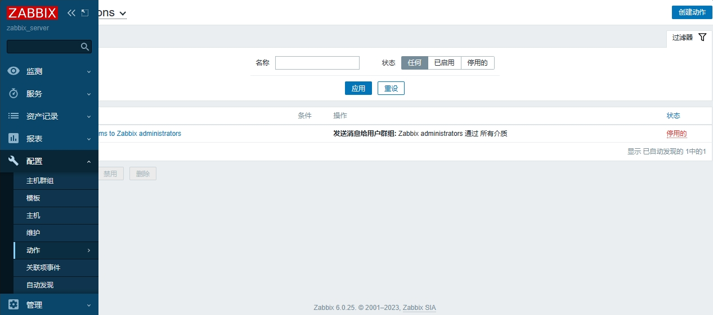
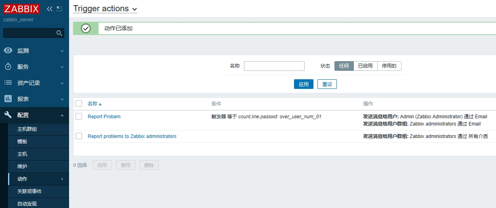
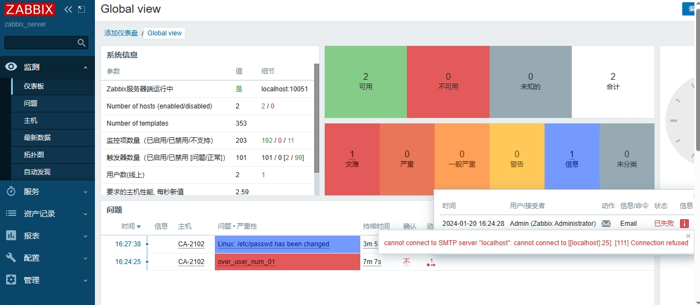

## 报警机制

当监控的参数超过设定值时，报警提醒。

* 邮件：自带
* 即时消息：自带
* 短信：需要购买电信运营商短信包
* 微信：需要安装插件

自定义的监控项默认不会自动报警

首页也不会提示错误

需要配置触发器与报警动作才能自动报警

## 触发器（trigger）

### 定义

* 表达式，如内存不足300M，用户超过30个等
* 当触发条件发生后，会导致一个触发事件
* 触发事件会执行某个动作

步骤：

* 创建触发器
* 编写触发器表达式

### 创建触发器

“Configuration > Templates > 选择对应模板 > 点击Triggers > Create trigger”


### 编写触发器表达式

#### 触发器表达式定义

Expression表达式：触发异常的条件

```
{<server>:<key>.<function>(<parameter)}<operator>
<constant>
{主机:key.函数名(参数)}<表达式>常数
```

* server：服务器名
* key：命令
* function：函数名，是zabbix内置的命令
* 表达式：比较符号，如  > , < , =
* 常数：预设值，超过该值会报警

表达式示例：

* 如果web1主机最新的CPU平均负载值大于5，则触发器状态Porblem

  ```
  {web1:system.cpu.load[all,avg1].last(0)}>5	#0为最新数据
  ```
* 根分区，最近5分钟的最大容量小于10G，则状态进入Problem

  ```
  {vfs.fs.size[/,free].max(5m)}<10G		#5m为最近5分钟
  ```
* 最新一次校验/etc/passwd如果与上一次有变化，则状态进入Problem

  ```
  {vfs.file.cksum[/etc/passwd].diff(0)}>0		#0为最新数据
  ```

#### 函数简介

* 大多数函数使用秒作为参数，使用#代表不同含义
* avg，count，last，min，max 函数支持额外的第二参数 time shift（事件偏移量，或间隔(秒)）
* 这个参数允许从过去一段时间内引用数据

| 函数内容   | 描述                  |
| ---------- | --------------------- |
| sum(600)   | 600秒内所有值的总和   |
| sum(#5)    | 最后5个值的总和       |
| last(20)   | 最后20秒的值          |
| last(#5)   | 倒数第5个值           |
| avg(1h,1d) | 一天前的1小时的平均值 |

#### 添加表达式

* 监控项选择(Item)：count_line_passwd_item
* 功能(Function)：选last()最新数据
* 间隔(秒)(Time shift)：间隔多少秒
* 结果(N)：需要大于30


表达式添加完成后，点击添加


触发器添加完成，如下图


验证是否能够正常触发报警

```
#在主机上添加以下用户
sudo useradd test001 
sudo useradd test0012 
sudo useradd test0013
sudo useradd test0014 
sudo useradd test0015 
sudo useradd test0016 
sudo useradd test00151 
sudo useradd test00161 

#测试完成后记得删除
sudo userdel -r test001 	#-r：删除家目录和mail
sudo userdel -r test0012 
sudo userdel -r test0013
sudo userdel -r test0014 
sudo userdel -r test0015 
sudo userdel -r test0016 
sudo userdel -r test00151 
sudo userdel -r test00161 
```

添加完成后能够正常报警，没问题。


删除用户后，显示已解决


## 动作（action）

### 创建动作步骤

* 配置邮件服务
  * 安装邮件服务和收发邮箱
* 设置邮件服务器
  * zabbix web 界面配置邮件服务器

### 配置邮件服务

安装邮件服务

```
sudo dnf install -y sendmail
#启动服务，并设置自启
sudo systemctl start sendmail && sudo systemctl enable sendmail
sudo systemctl status sendmail
```

> 使用环境rockylinux9.2中没有mailx或mail的包，所以改用sendmail

测试发邮件

```
echo -e "Subject: 测试邮件\nFrom: fams_itoper01@localhost\n\nHello, 这是一封测试邮件。" | sendmail -v fams_itoper01@localhost
```

测试接收邮件

```
cd /var/spool/		#会提示有新邮件
```

> 如果邮件无法发送成功，可能需要添加主机解析记录

### web端设置邮件服务器

"Administartion > Media Type > 选择Email邮件"


设置邮件服务器信息

* SMTP服务器：localhost
* SMTP服务器端口：25
* SMTP HELO：server5，随便填
* SMTP电邮：root@localhost


邮件服务器添加成功


关联邮件服务和Zabbix用户

“管理 > 用户 > 选择相应用户 > 报警媒介 > 点击添加”


配置报警媒介

* 类型：Email
* 收件人：root@localhost.localdomain
* 当启用时：接收邮件的事件，周一到周日，0点到24点这个时间段接收邮件


> 添加邮件时，显示root@localhost无效的邮件地址，所以改成root@localhost.localdomain
>
> 原因是 Zabbix 对电子邮件地址有一些验证规则，要求提供一个有效的电子邮件格式。

添加完成后，点击"更新"即可。


### 创建Action

定义当触发器被触发时，执行什么样的Action

通过"Configuration > Actions > Create actions" 创建



#### 配置Action

* 条件：配置导致动作的触发器，选择，这里是账户数大于26

添加触发条件


#### 配置操作

配置动作的具体操作行为（发送信息或执行远程命令）

* 下图是无限次数发送邮件，60秒发送1次，发送给Admin用户，问题解决后停止发送
* 可以自定义发送邮件的消息，消息中可以使用zabbix内置变量


动作添加完成



#### 测试配置

* 触发器被触发后执行动作
* 查看是否收到邮件

发送失败了，尝试了网易邮箱配置，能够正常发送邮件，所以应该没问题。



# Reference Links：

#培训视频

https://www.bilibili.com/video/BV1Mb4y1f7JT

#笔记参考

https://github.com/adampielak/zabbix-notes
