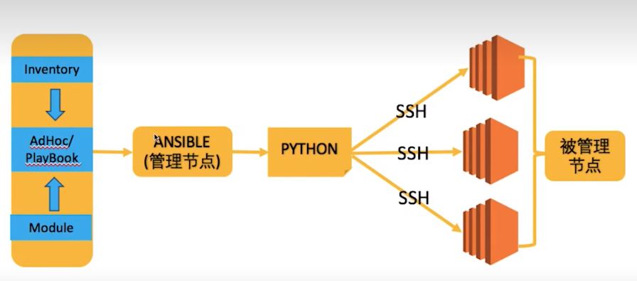

> 笔记参考bilibili千锋学习视频和鸿鹄论坛网友提供的资料
>
> 视频地址：https://www.bilibili.com/video/BV1eT4y177kx
>
> 资料地址：https://bbs.hh010.com/thread-648075-1-1.html

## 实验环境

系统版本：rockylinux9.2

## 简介

Ansible是一种由python编写的开源的自动化工具，用于配置管理、应用部署和任务自动化。它允许系统管理员通过定义和管理主机配置文件，轻松地自动执行复杂的任务，而无需编写大量的脚本或手动操作。Ansible采用声明性语言，用户可以使用YAML格式的Playbooks来描述任务和配置。

以下是Ansible的一些主要特点：

1. **简单性** : Ansible的Playbooks使用简单的YAML语法，易于理解和编写。无需深厚的编程技能，即可创建自动化任务。
2. **无需客户端** : Ansible不需要在远程主机上安装客户端，只需在控制节点上安装即可。这降低了配置和管理的复杂性。
3. **Agentless架构** : Ansible使用SSH协议来连接和执行任务，无需在远程主机上安装代理。这使得部署和维护变得更加简单。
4. **模块化** : Ansible提供了众多的模块，用于执行不同的任务。这些模块包括文件操作、软件包管理、服务管理等，用户可以根据需要组合这些模块构建自己的自动化任务。
5. **扩展性** : Ansible具有丰富的插件和模块系统，允许用户编写自定义插件以满足特定需求。
6. **多平台支持** : Ansible支持在各种操作系统上运行，包括Linux、Windows和Unix。

## 工作原理

### 架构图简介



### 主要组成部分

1. **控制节点(Control Node)** : 控制节点是执行Ansible命令的机器，通常是管理员的工作站或服务器。在控制节点上，Ansible命令和Playbooks被创建和执行。
2. **目标主机(Managed Nodes)** : 这是管理员希望进行配置管理或任务自动化的机器。在目标主机上，Ansible会通过SSH连接执行特定的任务，而无需在远程主机上安装任何额外的代理。
3. **Inventory(资产或清单)** : 清单是一份描述目标主机的清单文件，其中包含目标主机的IP地址或主机名，以及可以对其执行的特定组或变量。清单文件是一个文本文件，也可以是一个动态清单，通过脚本或外部系统生成。
4. **模块(Modules)** : 模块是Ansible中执行具体任务的组件。每个模块负责完成一个特定的任务，比如文件操作、软件包管理、用户管理等。Ansible模块是可重用的，并且可以组合在一起以构建更复杂的任务。
5. **Playbooks(剧本)** : Playbooks是由YAML格式编写的文本文件，用于定义一系列任务和配置。Playbooks描述了一组操作，包括目标主机、要运行的角色（roles）、变量、任务等。通过执行Playbooks，管理员可以轻松地自动化复杂的系统管理任务。
6. **角色(Roles)** : 角色是一种组织和封装Playbooks的方式，用于将相关的任务和配置分组。通过使用角色，可以更好地组织和重用Ansible的配置。
7. **任务(Tasks)** : 任务是Playbooks的基本单位，它们定义了要在目标主机上执行的具体操作。每个任务通常由一个或多个模块组成。
8. **变量(Variables)** : 变量允许管理员在Playbooks中定义可重用的值。这些值可以是常量、动态生成的值或来自清单文件中的值。使用变量可以使Playbooks更加灵活和可配置。

### 运行流程

1. **解析Inventory** : Ansible首先会解析清单文件（Inventory），其中包含了目标主机的信息，如主机名、IP地址、组等。这一步用于确定要操作的目标主机。
2. **连接到目标主机** : Ansible通过SSH协议连接到目标主机。这要求在目标主机上配置了正确的SSH密钥或用户名/密码，以确保与目标主机的安全连接。
3. **加载变量和配置** : Ansible会加载Playbooks中定义的变量以及Ansible配置文件中的配置项。这些变量可以包括用于定制任务行为的值。
4. **解析Playbooks** : Ansible会解析用户提供的Playbooks，这是YAML格式的文件，其中定义了一系列任务、角色、变量和其他配置。这一步用于确定要在目标主机上执行的操作。
5. **执行任务** : Ansible按照Playbooks中的定义，逐一执行任务。每个任务通常包含一个或多个模块，用于完成特定的操作，比如复制文件、安装软件包、配置服务等。
6. **生成事实(Facts)** : 在执行任务的过程中，Ansible会收集关于目标主机的信息，这些信息被称为事实（Facts）。这些事实可以在后续任务中使用。
7. **报告结果** : Ansible会生成执行结果的报告，包括每个任务的执行状态、错误信息等。这些报告对于了解任务的执行情况和排查问题非常有用。
8. **清理** : 在所有任务完成后，Ansible会关闭与目标主机的连接，释放资源，并在控制节点上生成详细的执行日志。

## 安装ansible

### epel源安装

```
sudo dnf install epel-release -y	#安装epel源
sudo dnf install ansible -y
#验证
ansible -v				#有结果说明安装成功
ansible [core 2.14.9]
......
```

### pip安装

```
pip install ansible
```

## 控制节点建立与目标主机连接

### 设置免密登录

**生成SSH密钥对**

```
ssh-keygen -t rsa
```

在 `~/.ssh/`目录下生成私钥文件（默认为 `id_rsa`）和公钥文件（默认为 `id_rsa.pub`）

**分发公钥到目标主机**

```
ssh-copy-id user@target_host	#将公钥添加到目标主机用户的authorized_keys文件，允许控制节点通过私钥进行身份验证
```

也可以手动复制并粘贴公钥到目标主机的 `~/.ssh/authorized_keys`文件中

## 快速入门

### 示例1：测试控制节点与目标主机网络连通性

* 控制节点
  * 192.168.123.200
* 目标节点
  * 192.168.123.130
  * 192.168.123.131

#### 配置免密登录

在192.168.123.200主机上操作：

```
ssh-keygen -t rsa
ssh-copy-id fams_itoper01@192.168.123.130	#fams_itoper01是用户名
ssh-copy-id fams_itoper01@192.168.123.131
```

验证

```
ssh fams_itoper01@192.168.123.130
ssh fams_itoper01@192.168.123.131
```

能正常登录以上两台主机的话说明免密配置正常

#### 测试网络连通性

在控制节点执行

```
ansible all -i 192.168.123.130,192.168.123.131 -m ping
#结果正常
192.168.123.131 | SUCCESS => {
    "ansible_facts": {
        "discovered_interpreter_python": "/usr/bin/python3"
    },
    "changed": false,
    "ping": "pong"
}
192.168.123.130 | SUCCESS => {
    "ansible_facts": {
        "discovered_interpreter_python": "/usr/bin/python3"
    },
    "changed": false,
    "ping": "pong"
}
```

命令简介：

* `all`：Ansible 主机模式的指定方式，表示命令将对所有主机执行。也可以用星号”*“。
* `-i`：指定 Inventory 文件。Inventory 文件用于定义 Ansible 将要管理的主机及其组。在这个命令中，直接使用了一个逗号分隔的列表，表示两个目标主机。
* **`-m ping`** : 使用的 Ansible 模块和模块参数。在这里，`-m ping` 表示使用 ping 模块。ping 模块实际上并不执行常规的 ICMP ping 操作，而是简单地测试是否可以与目标主机建立连接。

### 示例2：将 /tmp/test.conf 发布到所有目标节点

```
#创建测试文件
echo "just test file" >> /tmp/test.conf

#执行ansible
#结果显示已成功
ansible all -i 192.168.123.130,192.168.123.131 -m copy -a "src=/tmp/test.conf dest=/tmp/test.conf"
192.168.123.130 | CHANGED => {
    "ansible_facts": {
        "discovered_interpreter_python": "/usr/bin/python3"
    },
    "changed": true,
    "checksum": "a2132f3f42d345a21a497ea4e9c38f894265a7c3",
    "dest": "/tmp/test.conf",
    "gid": 1000,
    "group": "fams_itoper01",
    "md5sum": "3f1b5460018e776424c7e2ec9f1fbe4d",
    "mode": "0644",
    "owner": "fams_itoper01",
    "size": 15,
    "src": "/home/fams_itoper01/.ansible/tmp/ansible-tmp-1705911687.6517296-50530-46790991355510/source",
    "state": "file",
    "uid": 1000
}
......


#在192.168.123.130上确实存在该文件，说明ansible执行成功
ll /tmp/test.conf
-rw-r--r-- 1 fams_itoper01 fams_itoper01 15 Jan 22 16:21 /tmp/test.conf
```

命令简介：

* **`-m copy`** : 表示使用 `copy` 模块，该模块用于在远程主机上复制文件。
* **`-a "src=/tmp/test.conf dest=/tmp/test.conf"`** :
  * `-a` 表示传递模块的参数，参数是一个键值对列表，包含 `src` 和 `dest`。
  * 具体含义是将本地文件 `/tmp/test.conf` 复制到目标主机的 `/tmp/test.conf`。
