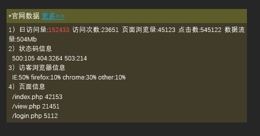
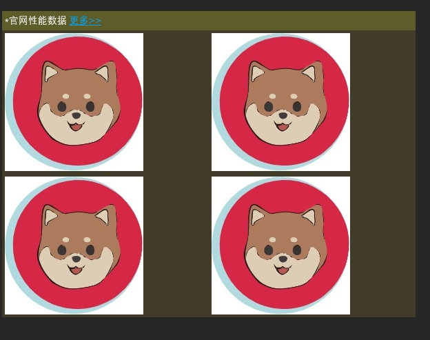

## 简介

`smtplib` 模块是 Python 标准库中用于发送邮件的模块。它提供了一个简单的方法来连接 SMTP 服务器并发送电子邮件。下面是对 `smtplib` 模块的详细解释：

## 使用思路

1. **SMTP 类** ：`smtplib` 模块中最重要的类是 `SMTP`。它代表了一个 SMTP 服务器的连接，并提供了一系列方法来发送电子邮件。
2. **SMTP 连接** ：要连接到 SMTP 服务器，创建一个 `SMTP` 对象，并调用其 `connect()` 方法来连接到指定的 SMTP 服务器。通过提供 SMTP 服务器的主机名和端口号来指定要连接的服务器。
3. **登录** ：连接到 SMTP 服务器后，调用 `login()` 方法来登录到 SMTP 服务器。
4. **发送邮件** ：登录成功后，使用 `sendmail()` 方法来发送电子邮件。该方法接受发件人地址、收件人地址和邮件内容作为参数，并将邮件发送到 SMTP 服务器进行传递。
5. **退出** ：发送完所有邮件后，应该调用 `quit()` 方法来关闭与 SMTP 服务器的连接。

## 示例

* 发送一封测试邮件

```
import smtplib
from email.mime.text import MIMEText

# 邮件内容
msg = MIMEText('这是一封测试邮件。')
msg['Subject'] = '测试邮件'
msg['From'] = 'zerotier_497@outlook.com'
msg['To'] = 'yuzhuang233@outlook.com'

# SMTP 服务器配置
smtp_server = 'smtp-mail.outlook.com'
smtp_port = 587
username = 'xxxxx@outlook.com'
password = 'xxxxx'

# 连接到 SMTP 服务器
server = smtplib.SMTP(smtp_server, smtp_port)
server.starttls()  # 开启 TLS 加密
server.login(username, password)

# 发送邮件
server.sendmail('xxxxx@outlook.com', ['xxxx@outlook.com'], msg.as_string())

# 退出 SMTP 服务器
server.quit()
```

优化后的代码：

```
import smtplib
from email.mime.text import MIMEText
from email.mime.multipart import MIMEMultipart

def send_email(smtp_server, smtp_port, sender_email, sender_password, recipient_email, subject, message):
    """
    发送电子邮件

    参数：
    - sender_email: 发件人邮箱地址
    - sender_password: 发件人邮箱密码
    - recipient_email: 收件人邮箱地址
    - subject: 邮件主题
    - message: 邮件内容

    返回：
    - 发送结果（成功/失败）
    """
    try:
        # 创建邮件对象
        msg = MIMEMultipart()
        msg['From'] = sender_email
        msg['To'] = recipient_email
        msg['Subject'] = subject

        # 添加邮件内容
        body = MIMEText(message, 'plain')
        msg.attach(body)

        # 连接到 SMTP 服务器
        server = smtplib.SMTP(smtp_server, smtp_port)
        server.starttls()  # 开启 TLS 加密
        server.login(sender_email, sender_password)

        # 发送邮件
        server.sendmail(sender_email, recipient_email, msg.as_string())

        # 退出 SMTP 服务器
        server.quit()

        return "邮件发送成功"
    except Exception as e:
        return f"邮件发送失败：{e}"


if __name__ == "__main__":
    # SMTP 服务器配置
    smtp_server = 'smtp-mail.outlook.com'
    smtp_port = 587
    # 示例：发送邮件
    sender_email = 'xxxx@outlook.com'
    sender_password = 'xxxx'
    recipient_email = 'xxxxx@outlook.com'
    subject = '测试邮件'
    message = '这是一封测试邮件。'

    result = send_email(smtp_server, smtp_port, sender_email, sender_password, recipient_email, subject, message)
    print(result)
```

再优化，使用html格式是MIMEText：

```
import smtplib
from email.mime.text import MIMEText
from email.mime.multipart import MIMEMultipart


def send_email(smtp_server, smtp_port, sender_email, sender_password, recipient_email, subject, message):
    """
    发送电子邮件

    参数：
    - sender_email: 发件人邮箱地址
    - sender_password: 发件人邮箱密码
    - recipient_email: 收件人邮箱地址
    - subject: 邮件主题
    - message: 邮件内容

    返回：
    - 发送结果（成功/失败）
    """
    try:
        # 创建邮件对象
        msg = MIMEMultipart()
        msg['From'] = sender_email
        msg['To'] = recipient_email
        msg['Subject'] = subject

        # 添加邮件内容
        # body = MIMEText(message, 'plain')
        body = MIMEText(message, "html", "utf-8")		#使用html 和 UTF8格式
        msg.attach(body)

        # 连接到 SMTP 服务器
        server = smtplib.SMTP(smtp_server, smtp_port)
        server.starttls()  # 开启 TLS 加密
        server.login(sender_email, sender_password)

        # 发送邮件
        server.sendmail(sender_email, recipient_email, msg.as_string())

        # 退出 SMTP 服务器
        server.quit()

        return "邮件发送成功"
    except Exception as e:
        return f"邮件发送失败：{e}"


if __name__ == "__main__":
    # SMTP 服务器配置
    smtp_server = 'smtp-mail.outlook.com'
    smtp_port = 587
    # 示例：发送邮件
    sender_email = 'xxxx@outlook.com'
    sender_password = 'xxxx'
    recipient_email = 'xxxxx@outlook.com'
    subject = '测试邮件'
    message = """
    <table width="800" border="0" cellspacing="0" cellpadding="4">
      <tr>
        <td bgcolor="#CECFAD" height="20" style="font-size:14px">*官网数据  <a href="monitor.domain.com">更多>></a></td>
      </tr>
      <tr>
        <td bgcolor="#EFEBDE" height="100" style="font-size:13px">
        1）日访问量:<font color=red>152433</font>  访问次数:23651 页面浏览量:45123 点击数:545122  数据流量:504Mb<br>
        2）状态码信息<br>
          500:105  404:3264  503:214<br>
        3）访客浏览器信息<br>
          IE:50%  firefox:10% chrome:30% other:10%<br>
        4）页面信息<br>
          /index.php 42153<br>
          /view.php 21451<br>
          /login.php 5112<br>
    	</td>
      </tr>
    </table>"""

    result = send_email(smtp_server, smtp_port, sender_email, sender_password, recipient_email, subject, message)
    print(result)
```

收到邮件的格式是html



## 示例：添加图片到邮件

```
import smtplib
from email.mime.image import MIMEImage
from email.mime.text import MIMEText
from email.mime.multipart import MIMEMultipart


def add_image(src, img_id):
    with open(src, 'rb') as fp:
        msg_image = MIMEImage(fp.read())
    msg_image.add_header('Content-ID', img_id)
    return msg_image


def send_email(smtp_server, smtp_port, sender_email, sender_password, recipient_email, subject, message):
    """
    发送电子邮件

    参数：
    - sender_email: 发件人邮箱地址
    - sender_password: 发件人邮箱密码
    - recipient_email: 收件人邮箱地址
    - subject: 邮件主题
    - message: 邮件内容

    返回：
    - 发送结果（成功/失败）
    """
    try:
        # 创建邮件对象
        msg = MIMEMultipart()
        msg['From'] = sender_email
        msg['To'] = recipient_email
        msg['Subject'] = subject

        # 添加邮件内容
        body = MIMEText(message, "html", "utf-8")		#使用html 和 UTF8格式
        msg.attach(body)
        msg.attach(add_image("img/bytes_io.png", "io"))
        msg.attach(add_image("img/myisam_key_hit.png", "key_hit"))
        msg.attach(add_image("img/os_mem.png", "men"))
        msg.attach(add_image("img/os_swap.png", "swap"))

        # 连接到 SMTP 服务器
        server = smtplib.SMTP(smtp_server, smtp_port)
        server.starttls()  # 开启 TLS 加密
        server.login(sender_email, sender_password)

        # 发送邮件
        server.sendmail(sender_email, recipient_email, msg.as_string())

        # 退出 SMTP 服务器
        server.quit()

        return "邮件发送成功"
    except Exception as e:
        return f"邮件发送失败：{e}"


if __name__ == "__main__":
    # SMTP 服务器配置
    smtp_server = 'smtp-mail.outlook.com'
    smtp_port = 587
    # 示例：发送邮件
    sender_email = 'xxxxxx@outlook.com'
    sender_password = 'xxxxxx'
    recipient_email = 'xxxxxx@outlook.com'
    subject = '业务性能数据报表'
    message = """
<table width="600" border="0" cellspacing="0" cellpadding="4">
      <tr bgcolor="#CECFAD" height="20" style="font-size:14px">
        <td colspan=2>*官网性能数据  <a href="monitor.domain.com">更多>></a></td>
      </tr>
      <tr bgcolor="#EFEBDE" height="100" style="font-size:13px">
        <td>
         </td><td>
         </td>
      </tr>
      <tr bgcolor="#EFEBDE" height="100" style="font-size:13px">
         <td>
         </td><td>
         </td>
      </tr>
    </table>"""

    result = send_email(smtp_server, smtp_port, sender_email, sender_password, recipient_email, subject, message)
    print(result)

```

邮件发送成功



## 示例：添加附件

```
import smtplib
from email import encoders
from email.mime.application import MIMEApplication
from email.mime.image import MIMEImage
from email.mime.text import MIMEText
from email.mime.multipart import MIMEMultipart


def add_image(msg, image_path, content_id):
    with open(image_path, 'rb') as fp:
        msg_image = MIMEImage(fp.read())
    msg_image.add_header('Content-ID', f'<{content_id}>')
    msg.attach(msg_image)

# 下面的代码，发送附件时，对方收到的附件时bin格式
# def add_attachment(msg, attachment_path, filename):
#     with open(attachment_path, 'rb') as fp:
#         attach = MIMEBase('application', 'octet-stream')
#         attach.set_payload(fp.read())
#     encoders.encode_base64(attach)
#     attach.add_header('Content-Disposition', f'attachment; filename={filename}')
#     msg.attach(attach)


# 下面是修正后的代码，明确指定 MIME 类型为 Excel 文件的 MIME 类型
def add_attachment(msg, attachment_path, filename):
    with open(attachment_path, 'rb') as fp:
        attach = MIMEApplication(fp.read(), _subtype='xlsx')
    attach.add_header('Content-Disposition', 'attachment', filename=filename)
    msg.attach(attach)


def send_email(smtp_server, smtp_port, sender_email, sender_password, recipient_email, subject, message, image_path, attachment_path):
    """
    发送电子邮件

    参数：
    - sender_email: 发件人邮箱地址
    - sender_password: 发件人邮箱密码
    - recipient_email: 收件人邮箱地址
    - subject: 邮件主题
    - message: 邮件内容

    返回：
    - 发送结果（成功/失败）
    """
    try:
        # 创建邮件对象
        msg = MIMEMultipart()
        msg['From'] = sender_email
        msg['To'] = recipient_email
        msg['Subject'] = subject

        # 添加邮件内容
        html_content = f"<font color=red>{message}<br><br>详细内容见附件。</font>"
        body = MIMEText(html_content, "html", "utf-8")
        msg.attach(body)

        # 添加图片
        add_image(msg, image_path, 'weekly')

        # 添加附件
        add_attachment(msg, attachment_path, '业务服务质量周报(12周).xlsx')

        # 连接到 SMTP 服务器
        server = smtplib.SMTP(smtp_server, smtp_port)
        server.starttls()  # 开启 TLS 加密
        server.login(sender_email, sender_password)

        # 发送邮件
        server.sendmail(sender_email, recipient_email, msg.as_string())

        # 退出 SMTP 服务器
        server.quit()

        return "邮件发送成功"
    except Exception as e:
        return f"邮件发送失败：{e}"


if __name__ == "__main__":
    # SMTP 服务器配置
    smtp_server = 'smtp-mail.outlook.com'
    smtp_port = 587
    # 示例：发送邮件
    sender_email = 'xxxx@outlook.com'
    sender_password = 'xxxx'
    recipient_email = 'xxxx@outlook.com'
    subject = '官网业务服务质量周报'
    message = "官网业务周平均延时图表"
    image_path = "img/weekly.png"
    attachment_path = "doc/week_report.xlsx"

    result = send_email(smtp_server, smtp_port, sender_email, sender_password, recipient_email, subject, message, image_path, attachment_path)
    print(result)
```
