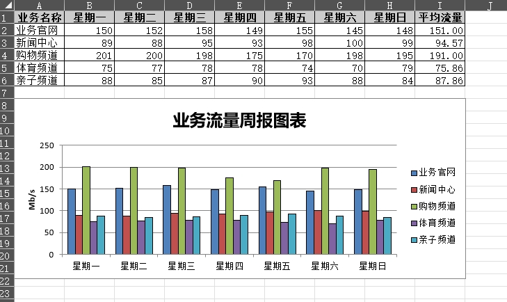

## 简介

`xlsxwriter` 是一个 Python 模块，用于创建 Excel 文件（.xlsx 格式）。它提供了一种简单的方式来生成具有样式和格式的 Excel 表格，包括数值、日期、字符串等数据类型的写入，以及图表、图像等的插入。

### 特性

1. 支持多种数据类型： 可以将整数、浮点数、字符串、日期等各种数据类型写入 Excel 单元格。
2. 支持样式和格式： 可以设置单元格的字体、颜色、边框、背景色等样式，以及单元格的宽度、高度等格式。
3. 支持图表和图像： 可以插入图表和图像到 Excel 文件中。
4. 高性能： `xlsxwriter` 是一个高性能的 Excel 写入库，能够处理大量数据。
5. 多平台兼容： 可以在 Windows、Linux、macOS 等多个平台上运行。

## 使用

基本步骤如下：

1. 导入 `xlsxwriter` 模块。
2. 创建一个 `Workbook` 对象，该对象代表了一个 Excel 文件。
3. 在 `Workbook` 对象上创建一个或多个工作表（`Worksheet`）。
4. 在工作表上写入数据，并设置样式、格式等。
5. 最后保存 Excel 文件并关闭 `Workbook` 对象。

## 示例

```
#coding: utf-8
import xlsxwriter


# 创建一个 Workbook 对象，指定了 Excel 文件的名称为 demo1.xlsx
workbook = xlsxwriter.Workbook('demo1.xlsx')
# 在 Workbook 对象上创建一个工作表
worksheet = workbook.add_worksheet()

# 设置了第一列的宽度为 20 个字符
worksheet.set_column('A:A', 20)

# 创建了一个格式对象 bold，用于设置文本加粗
# bold = workbook.add_format({'bold': True})
bold = workbook.add_format()
bold.set_bold()

# 在单元格 A1 中写入了文本 "Hello"
worksheet.write('A1', 'Hello')

# 在单元格 A2 中写入了文本 "World"，并应用了加粗格式
worksheet.write('A2', 'World', bold)

# 在单元格 B2 中写入了中文文本，并应用了加粗格式。
worksheet.write('B2', u'中文测试', bold)

# 在第 3、4、5 行的第 1 列分别写入了数字 32、35.5，以及一个公式计算结果，求和了 A3 到 A4 单元格的值
# 行的索引从0开始
worksheet.write(2, 0, 32)		#（行，列，数据）
worksheet.write(3, 0, 35.5)
worksheet.write(4, 0, '=SUM(A3:A4)')	#属性是A3和A4的和


# 在 B5 单元格位置插入了一张图片，图片的路径为 'img/python-logo.png'
worksheet.insert_image('B5', 'img/python-logo.png')

# 关闭了 Workbook 对象，保存并生成 Excel 文件。
workbook.close()
```

除了上面的操作，还有以下操作：

```
# 创建一个格式对象，可以设置字体加粗、斜体、背景颜色等样式。
format = workbook.add_format({'bold': True, 'italic': True, 'bg_color': 'yellow'})

# 向单元格写入浮点数
worksheet.write('B1', 123.45)		#第一个参数是单元格的坐标，第二个参数是要写入的数据。

# 指定单元格属性
worksheet.write('A2', 'World', format)

# 设置行高，列宽
worksheet.set_column('A:A', 20)		#列宽
worksheet.set_row(0, 30)		#行高

# 合并单元格，并在合并后的单元格中写入数据
worksheet.merge_range('A1:B2', 'Merged Cells', format)

# 设置打印区域
worksheet.print_area('A1:D10')

# 冻结窗口
worksheet.freeze_panes(1, 0)	#冻结第2行

# 创建一个图表对象，可以设置图表的类型和样式
chart = workbook.add_chart({'type': 'column'})
```

## 示例：

* 将excel表格转换成直方图图表

```
# coding: utf-8
import xlsxwriter

workbook = xlsxwriter.Workbook('chart.xlsx')
worksheet = workbook.add_worksheet()

# 添加了一个图表，并将其类型设置为柱形图（'type': 'column'）。
# `workbook.add_chart()` 方法创建一个新的图表对象，并指定图表类型为柱形图（`'type': 'column'`）
chart = workbook.add_chart({'type': 'column'})

title = [u'业务名称', u'星期一', u'星期二', u'星期三', u'星期四', u'星期五', u'星期六', u'星期日', u'平均流量']
buname = [u'业务官网', u'新闻中心', u'购物频道', u'体育频道', u'亲子频道']

data = [
    [150, 152, 158, 149, 155, 145, 148],
    [89, 88, 95, 93, 98, 100, 99],
    [201, 200, 198, 175, 170, 198, 195],
    [75, 77, 78, 78, 74, 70, 79],
    [88, 85, 87, 90, 93, 88, 84],
]

# 构造格式对象，设置边框为1
format = workbook.add_format()
format.set_border(1)

format_title = workbook.add_format()
format_title.set_border(1)
# 设置标题背景颜色
format_title.set_bg_color('#cccccc')
# 设置文本格式居中
format_title.set_align('center')
format_title.set_bold()

format_ave = workbook.add_format()
format_ave.set_border(1)
# 设置format_ave对象数据精度为小数点后2位
format_ave.set_num_format('0.00')

worksheet.write_row('A1', title, format_title)
worksheet.write_column('A2', buname, format)
worksheet.write_row('B2', data[0], format)
worksheet.write_row('B3', data[1], format)
worksheet.write_row('B4', data[2], format)
worksheet.write_row('B5', data[3], format)
worksheet.write_row('B6', data[4], format)


def chart_series(cur_row):
    # worksheet.write_formula() 方法在工作表中的某个单元格（当前行的第9列）写入一个 Excel 公式
    # 该公式用于计算该行数据的平均值。
    worksheet.write_formula('I' + cur_row,	#字符串拼接，第I列多少行
                            '=AVERAGE(B' + cur_row + ':H' + cur_row + ')', format_ave)
    # chart.add_series() 方法向图表中添加数据系列
    chart.add_series({
        # 指定了图表中的 x 轴数据，即工作表中第 1 行的 B 列到 H 列数据（即星期一到星期日）作为 x 轴
        'categories': '=Sheet1!$B$1:$H$1',
        # 指定了图表中的 y 轴数据，即工作表中当前行的数据作为 y 轴
        'values': '=Sheet1!$B$' + cur_row + ':$H$' + cur_row,
        # 设置了数据系列线条的颜色为黑色
        'line': {'color': 'black'},
        'name': '=Sheet1!$A$' + cur_row,
    })


for row in range(2, 7):
    chart_series(str(row))

# chart.set_table()
# chart.set_style(30)
# 设置了图表的大小,宽度为 577 个像素，高度为 287 个像素
chart.set_size({'width': 577, 'height': 287})
# 图表的标题，u 前缀表示字符串是 Unicode 类型，支持中文字符。
chart.set_title({'name': u'业务流量周报图表'})
# 设置了 Y 轴的名称，名称为 "Mb/s"
chart.set_y_axis({'name': 'Mb/s'})

指定了图表的左上角单元格的位置，即图表的起始位置，
worksheet.insert_chart('A8', chart)
workbook.close()
```

生成带图表的表格，如下图



生成图表的代码详解：

**`worksheet.write_formula('I' + cur_row, '=AVERAGE(B' + cur_row + ':H' + cur_row + ')', format_ave)`** ：

* 这一行使用 `worksheet.write_formula()` 方法在工作表中的某个单元格（当前行的第9列）写入一个 Excel 公式，该公式用于计算该行数据的平均值。
* `cur_row` 是当前行的行号，用于确定要写入公式的单元格。
* 公式 `'=AVERAGE(B' + cur_row + ':H' + cur_row + ')'` 计算了当前行中从 B 列到 H 列的数据的平均值。
* `format_ave` 是用于设置平均值单元格格式的格式对象。

**`chart.add_series({...})`** ：

* 这一部分使用 `chart.add_series()` 方法向图表中添加数据系列。
* `'categories': '=Sheet1!$B$1:$H$1'` 指定了图表中的 x 轴数据，即工作表中第 1 行的 B 列到 H 列数据（即星期一到星期日）作为 x 轴。
* `'values': '=Sheet1!$B$' + cur_row + ':$H$' + cur_row` 指定了图表中的 y 轴数据，即工作表中当前行的数据作为 y 轴。
* `'line': {'color': 'black'}` 设置了数据系列线条的颜色为黑色。
* `cur_row` 是一个字符串类型，代表当前行的行号。因此，`'=Sheet1!$A$' + cur_row` 就表示数据系列名称所在的单元格地址，例如，如果 `cur_row` 的值是 "2"，那么这个表达式就等同于 "=Sheet1!$A$2"，意味着数据系列的名称在工作表中的 A 列的第 2 行。
