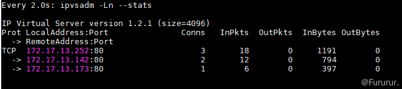

## 测试环境

软件环境：CentOS7、Keepalived1.3.5、ipvsadm1.27

DS1(MASTER)：172.17.13.120

DS1(BACKUP)：172.17.13.123

RS1：172.17.13.142:80 Nginx

RS1：172.17.13.173:80 Nginx

VIP：172.17.13.252

```lua
                              |
             +----------------+-----------------+
             |                                  |
172.17.13.120|----     VIP:172.17.13.252    ----|172.17.13.123
     +-------+--------+                +--------+-------+
     | 	    DS1       |                |       DS2      |
     | LVS+Keepalived |                | LVS+Keepalived |
     +-------+--------+                +--------+-------+
             |			                |
             +----------------+-----------------+
                              |
  +------------+              |               +------------+
  |     RS1    |172.17.13.142 |  172.17.13.173|     RS2    |
  | Web Server +--------------+---------------+ Web Server |
  +------------+                              +------------+
```

集群的架构图如上图所示。DS1、DS2 为两个 LB 节点，RS1、RS2 为两个真实的服务节点，通过一个虚拟的 IP 地址对外提供服务。

最终我们要达到的目标为：

1. Client 通过 VIP 访问服务能够将请求根据配置的规则进行分发（LB）
2. 当 MATSER 的 LB 节点故障时，自动切换到 BACKUP 的 LB 节点上，保证服务正常访问；MASTER 恢复后，再次作为主 LB 负载节点
3. 当某个 RS 节点故障时，自动剔除该节点；恢复后，再次加入集群

## 详细配置流程

### 安装相关软件

```bash
[root@localhost ~]# yum install ipvsadm keepalived -y
```

### 配置 Keepalived

1. DS1(MASTER) 节点

```bash
[root@localhost ~]# vi /etc/keepalived/keepalived.conf

! Configuration File for keepalived
global_defs {
   router_id LVS_DEVEL
}

vrrp_instance VI_1 {
    state MASTER            # 两个 DS，一个为 MASTER 一个为 BACKUP
    interface enp1s0        # 当前 IP 对应的网络接口，通过 ifconfig 查询
    virtual_router_id 62    # 虚拟路由 ID(0-255)，在一个 VRRP 实例中主备服务器 ID 必须一样
    priority 200            # 优先级值设定：MASTER 要比 BACKUP 的值大
    advert_int 1            # 通告时间间隔：单位秒，主备要一致
    authentication {        # 认证机制，主从节点保持一致即可
        auth_type PASS
        auth_pass 1111
    }
    virtual_ipaddress {
        172.17.13.252       # VIP，可配置多个
    }
}

# LB 配置
virtual_server 172.17.13.252 80  {
    delay_loop 3                    # 设置健康状态检查时间
    lb_algo rr                      # 调度算法，这里用了 rr 轮询算法
    lb_kind DR                      # 这里测试用了 Direct Route 模式
    persistence_timeout 50          # 持久连接超时时间
    protocol TCP
	real_server 172.17.13.173 80 {
        weight 1
        TCP_CHECK {
            connect_timeout 10　　　
            retry 3　　　　　　      # 旧版本为 nb_get_retry 
            delay_before_retry 3　　　
            connect_port 80
        }
    }
	 real_server 172.17.13.142 80 {
        weight 1
        TCP_CHECK {
            connect_timeout 10
            retry 3
            delay_before_retry 3
            connect_port 80
        }
    }
}
```

2. DS2(BACKUP) 节点

复制之前的配置文件，修改 `vrrp_instance VI_1` 中的 `state` 为 `BACKUP`。

配置完成后，分别重启 Keepalived 服务。

```bash
[root@localhost ~]# systemctl restart keepalived
```

### 配置 RS

RS 配置主要分两部分，一部分是 web 服务，另一部分是网络转发配置。

web 服务部署不多展开了，根据实际情况来，可以是 Tomcat 也可以是 Nginx，只要能通过 ip:port 能访问到即可。

在网络转发配置上，LVS 支持多种通信模型（NAT、DR、TUN），本文采用 DR 模型来进行通信，大致的流程如下图所示。请求数据包从到达 LB 后，LVS 会将这个数据包的 MAC 地址改成轮询到的 RS 的 MAC 地址，并丢给交换机；RS 收到后进行处理并从网卡的 lo 端口发送出去，响应报文到达交换机后直接转发给 Client。


因此，我们需要在 RS 的网卡上配置 lo 为 VIP。配置脚本如下

```
#!/bin/bash 
SNS_VIP=172.17.13.252
case "$1" in
start)
       ifconfig lo:0 $SNS_VIP netmask 255.255.255.255 broadcast $SNS_VIP
       /sbin/route add -host $SNS_VIP dev lo:0
       echo "1" >/proc/sys/net/ipv4/conf/lo/arp_ignore
       echo "2" >/proc/sys/net/ipv4/conf/lo/arp_announce
       echo "1" >/proc/sys/net/ipv4/conf/all/arp_ignore
       echo "2" >/proc/sys/net/ipv4/conf/all/arp_announce
       sysctl -p >/dev/null 2>&1
       echo "RealServer Start OK"
       ;;
stop)
       ifconfig lo:0 down
       route del $SNS_VIP >/dev/null 2>&1
       echo "0" >/proc/sys/net/ipv4/conf/lo/arp_ignore
       echo "0" >/proc/sys/net/ipv4/conf/lo/arp_announce
       echo "0" >/proc/sys/net/ipv4/conf/all/arp_ignore
       echo "0" >/proc/sys/net/ipv4/conf/all/arp_announce
       echo "RealServer Stoped"
       ;;
*)
       echo "Usage: $0 {start|stop}"
       exit 1
esac
exit 0
```

本地创建完后，并执行。

```
[root@localhost ~]# chmod a+x lvs-web.sh
[root@localhost ~]# ./lvs-web.sh start
```

## HA 测试

配置完双机热备后，我们就可以测试下，节点发生故障后以及 LB 切换失败后，能否保证服务的 HA。

在 LB 的主节点上输入 `ip a`，可以看到 VIP 目前已经正确配置在网卡上。


输入 `watch ipvsadm -Ln --stats` 可实时看到负载均衡的结果，正常。



接下面我们试着访问一下 VIP。

```
[root@localhost ~]# while true ; do curl 172.17.13.252; sleep 1;done
```

看到服务可正常轮询。


此时手动停止一个 RS，再次访问 VIP，LVS 会自动剔除无法访问的服务，重启后，服务会被自动添加。


如果此时，手动停止 MASTER 上的 Keepalived，模拟 LB MASTER 节点挂了，VIP 会自动飘到 BACKUP LB 上。


此时，如果重启 MASTER 后，VIP 又会飘回去。MASTER 的优先级高于 BACKUP，从而实现 HA。


## Reference Links：

#Fururur

https://www.cnblogs.com/Sinte-Beuve/p/13392747.html
