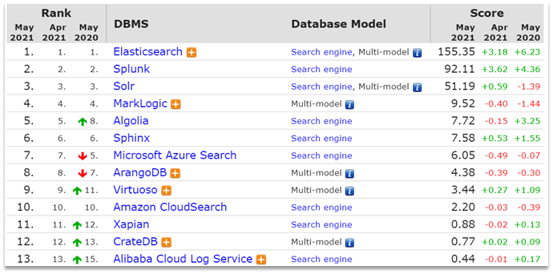

> ELK学习笔记内容来自黑马程序员，视频学习地址：https://www.bilibili.com/video/BV1R4411C7Tf/

## 了解ES

### elasticsearch的作用

elasticsearch是一款非常强大的开源搜索引擎，具备非常多强大功能，可以帮助我们从海量数据中快速找到需要的内容

例如：

* 在GitHub搜索代码

  
* 在电商网站搜索商品

  
* 在谷歌搜索答案

  
* 在打车软件搜索附近的车

  

### ELK技术栈

elasticsearch结合kibana、Logstash、Beats，也就是elastic stack（ELK）。被广泛应用在日志数据分析、实时监控等领域：


而elasticsearch是elastic stack的核心，负责存储、搜索、分析数据。


### elasticsearch和lucene

elasticsearch底层是基于**lucene**来实现的。

**Lucene**是一个Java语言的搜索引擎类库，是Apache公司的顶级项目，由DougCutting于1999年研发。官网地址：https://lucene.apache.org/ 。


elasticsearch的发展历史：

* 2004年Shay Banon基于Lucene开发了Compass
* 2010年Shay Banon 重写了Compass，取名为Elasticsearch。

官网地址是：https://www.elastic.co

为什么不是其他搜索技术？

目前比较知名的搜索引擎技术排名：



虽然在早期，Apache Solr是最主要的搜索引擎技术，但随着发展elasticsearch已经渐渐超越了Solr，独占鳌头：

### 总结

什么是elasticsearch？

* 一个开源的分布式搜索引擎，可以用来实现搜索、日志统计、分析、系统监控等功能

什么是elastic stack（ELK）？

* 是以elasticsearch为核心的技术栈，包括beats、Logstash、kibana、elasticsearch

什么是Lucene？

* 是Apache的开源搜索引擎类库，提供了搜索引擎的核心API

## 倒排索引

倒排索引的概念是基于MySQL这样的正向索引而言的。

### 正向索引

那么什么是正向索引呢？例如给下表（tb_goods）中的id创建索引：


如果是根据id查询，那么直接走索引，查询速度非常快。

但如果是基于title做模糊查询，只能是逐行扫描数据，流程如下：

1. 用户搜索数据，条件是title符合 `"%手机%"`
2. 逐行获取数据，比如id为1的数据
3. 判断数据中的title是否符合用户搜索条件
4. 如果符合则放入结果集，不符合则丢弃。回到步骤1

逐行扫描，也就是全表扫描，随着数据量增加，其查询效率也会越来越低。当数据量达到数百万时，就是一场灾难。

### 倒排索引

倒排索引中有两个非常重要的概念：

* 文档（`Document`）：用来搜索的数据，其中的每一条数据就是一个文档。例如一个网页、一个商品信息
* 词条（`Term`）：对文档数据或用户搜索数据，利用某种算法分词，得到的具备含义的词语就是词条。例如：我是中国人，就可以分为：我、是、中国人、中国、国人这样的几个词条

创建倒排索引是对正向索引的一种特殊处理，流程如下：

* 将每一个文档的数据利用算法分词，得到一个个词条
* 创建表，每行数据包括词条、词条所在文档id、位置等信息
* 因为词条唯一性，可以给词条创建索引，例如hash表结构索引

如图：


倒排索引的搜索流程如下（以搜索"华为手机"为例）：

1. 用户输入条件 `"华为手机"`进行搜索。
2. 对用户输入内容分词，得到词条：`华为`、`手机`。
3. 拿着词条在倒排索引中查找，可以得到包含词条的文档id：1、2、3。
4. 拿着文档id到正向索引中查找具体文档。

如图：


虽然要先查询倒排索引，再查询正向索引，但是无论是词条、还是文档id都建立了索引，查询速度非常快！无需全表扫描

### 正向和倒排

那么为什么一个叫做正向索引，一个叫做倒排索引呢？

* 正向索引是最传统的，根据id索引的方式。但根据词条查询时，必须先逐条获取每个文档，然后判断文档中是否包含所需要的词条，是根据文档找词条的过程。
* 而倒排索引则相反，是先找到用户要搜索的词条，根据词条得到包括词条的文档的id，然后根据id获取文档。是根据词条找文档的过程。

是不是恰好反过来了？

那么两者方式的优缺点是什么呢？

正向索引：

* 优点：
  * 可以给多个字段创建索引
  * 根据索引字段搜索、排序速度非常快
* 缺点：
  * 根据非索引字段，或者索引字段中的部分词条查找时，只能全表扫描。

倒排索引：

* 优点：
  * 根据词条搜索、模糊搜索时，速度非常快
* 缺点：
  * 只能给词条创建索引，而不是字段
  * 无法根据字段做排序

## es的一些概念

elasticsearch中有很多独有的概念，与mysql中略有差别，但也有相似之处。

### 文档和字段

elasticsearch是面向文档（Document）存储的，可以是数据库中的一条商品数据，一个订单信息。文档数据会被序列化为json格式后存储在elasticsearch中：


而Json文档中往往包含很多的字段（Field），类似于数据库中的列。

### 索引和映射

索引（Index），就是相同类型的文档的集合。

例如：

* 所有用户文档，就可以组织在一起，称为用户的索引；
* 所有商品的文档，可以组织在一起，称为商品的索引；
* 所有订单的文档，可以组织在一起，称为订单的索引；


因此，我们可以把索引当做是数据库中的表。

数据库的表会有约束信息，用来定义表的结构、字段的名称、类型等信息。因此，索引库中就有映射（mapping），是索引中文档的字段约束信息，类似表的结构约束。

### mysql与elasticsearch

我们统一的把mysql与elasticsearch的概念做一下对比：

| MySQL  | Elasticsearch | 说明                                                                              |
| ------ | ------------- | --------------------------------------------------------------------------------- |
| Table  | Index         | 索引(index)，就是文档的集合，类似数据库的表(table)                                |
| Row    | Document      | 文档（Document），就是一条条的数据，类似数据库中的行（Row），文档都是JSON格式     |
| Column | Field         | 字段（Field），就是JSON文档中的字段，类似数据库中的列（Column）                   |
| Schema | Mapping       | Mapping（映射）是索引中文档的约束，例如字段类型约束。类似数据库的表结构（Schema） |
| SQL    | DSL           | DSL是elasticsearch提供的JSON风格的请求语句，用来操作elasticsearch，实现CRUD       |

是不是说，我们学习了elasticsearch就不再需要mysql了呢？

并不是如此，两者各自有自己的擅长支出：

* Mysql：擅长事务类型操作，可以确保数据的安全和一致性
* Elasticsearch：擅长海量数据的搜索、分析、计算

因此在企业中，往往是两者结合使用：

* 对安全性要求较高的写操作，使用mysql实现
* 对查询性能要求较高的搜索需求，使用elasticsearch实现
* 两者再基于某种方式，实现数据的同步，保证一致性


## 安装es、kibana

### 部署单点es

#### 创建网络

因为我们还需要部署kibana容器，因此需要让es和kibana容器互联。这里先创建一个网络：

```
docker network create es-net
```

#### 加载镜像

这里我们采用elasticsearch的7.12.1版本的镜像，这个镜像体积非常大，接近1G。

#### 运行

运行docker命令，部署单点es：

```
docker run -d \
	--name es \
    -e "ES_JAVA_OPTS=-Xms512m -Xmx512m" \
    -e "discovery.type=single-node" \
    -v es-data:/usr/share/elasticsearch/data \
    -v es-plugins:/usr/share/elasticsearch/plugins \
    --privileged \
    --network es-net \
    -p 9200:9200 \
    -p 9300:9300 \
elasticsearch:7.12.1
```

命令解释：

* `-e "cluster.name=es-docker-cluster"`：设置集群名称
* `-e "http.host=0.0.0.0"`：监听的地址，可以外网访问
* `-e "ES_JAVA_OPTS=-Xms512m -Xmx512m"`：内存大小
* `-e "discovery.type=single-node"`：非集群模式
* `-v es-data:/usr/share/elasticsearch/data`：挂载逻辑卷，绑定es的数据目录
* `-v es-logs:/usr/share/elasticsearch/logs`：挂载逻辑卷，绑定es的日志目录
* `-v es-plugins:/usr/share/elasticsearch/plugins`：挂载逻辑卷，绑定es的插件目录
* `--privileged`：授予逻辑卷访问权
* `--network es-net` ：加入一个名为es-net的网络中
* `-p 9200:9200`：端口映射配置

在浏览器中输入：http://192.168.150.101:9200 即可看到elasticsearch的响应结果：


### 部署kibana

kibana可以给我们提供一个elasticsearch的可视化界面，便于我们学习。

#### 部署

运行docker命令，部署kibana

```
docker run -d \
--name kibana \
-e ELASTICSEARCH_HOSTS=http://es:9200 \
--network=es-net \
-p 5601:5601  \
kibana:7.12.1
```

* `--network es-net` ：加入一个名为es-net的网络中，与elasticsearch在同一个网络中
* `-e ELASTICSEARCH_HOSTS=http://es:9200"`：设置elasticsearch的地址，因为kibana已经与elasticsearch在一个网络，因此可以用容器名直接访问elasticsearch
* `-p 5601:5601`：端口映射配置

kibana启动一般比较慢，需要多等待一会，可以通过命令：

```
docker logs -f kibana
```

查看运行日志，当查看到下面的日志，说明成功：


此时，在浏览器输入地址访问：

```
http://192.168.150.101:5601
```

#### DevTools

kibana中提供了一个DevTools界面：


这个界面中可以编写DSL来操作elasticsearch。并且对DSL语句有自动补全功能。

### 安装IK分词器

#### 在线安装ik插件（较慢）

```
# 进入容器内部
docker exec -it elasticsearch /bin/bash

# 在线下载并安装
./bin/elasticsearch-plugin  install https://github.com/medcl/elasticsearch-analysis-ik/releases/download/v7.12.1/elasticsearch-analysis-ik-7.12.1.zip

#退出
exit
#重启容器
docker restart elasticsearch
```

#### 测试

IK分词器包含两种模式：

* `ik_smart`：最少切分
* `ik_max_word`：最细切分

```
GET /_analyze
{
  "analyzer": "ik_max_word",
  "text": "黑马程序员学习java太棒了"
}
```

结果：

```
{
  "tokens" : [
    {
      "token" : "黑马",
      "start_offset" : 0,
      "end_offset" : 2,
      "type" : "CN_WORD",
      "position" : 0
    },
    {
      "token" : "程序员",
      "start_offset" : 2,
      "end_offset" : 5,
      "type" : "CN_WORD",
      "position" : 1
    },
    {
      "token" : "程序",
      "start_offset" : 2,
      "end_offset" : 4,
      "type" : "CN_WORD",
      "position" : 2
    },
    {
      "token" : "员",
      "start_offset" : 4,
      "end_offset" : 5,
      "type" : "CN_CHAR",
      "position" : 3
    },
    {
      "token" : "学习",
      "start_offset" : 5,
      "end_offset" : 7,
      "type" : "CN_WORD",
      "position" : 4
    },
    {
      "token" : "java",
      "start_offset" : 7,
      "end_offset" : 11,
      "type" : "ENGLISH",
      "position" : 5
    },
    {
      "token" : "太棒了",
      "start_offset" : 11,
      "end_offset" : 14,
      "type" : "CN_WORD",
      "position" : 6
    },
    {
      "token" : "太棒",
      "start_offset" : 11,
      "end_offset" : 13,
      "type" : "CN_WORD",
      "position" : 7
    },
    {
      "token" : "了",
      "start_offset" : 13,
      "end_offset" : 14,
      "type" : "CN_CHAR",
      "position" : 8
    }
  ]
}
```

### 扩展词词典

随着互联网的发展，“造词运动”也越发的频繁。出现了很多新的词语，在原有的词汇列表中并不存在。比如：“奥力给”，“传智播客” 等。

所以我们的词汇也需要不断的更新，IK分词器提供了扩展词汇的功能。

1. 打开IK分词器config目录：
   
2. 在IKAnalyzer.cfg.xml配置文件内容添加：

   ```
   <?xml version="1.0" encoding="UTF-8"?>
   <!DOCTYPE properties SYSTEM "http://java.sun.com/dtd/properties.dtd">
   <properties>
           <comment>IK Analyzer 扩展配置</comment>
           <!--用户可以在这里配置自己的扩展字典 *** 添加扩展词典-->
           <entry key="ext_dict">ext.dic</entry>
   </properties>
   ```
3. 新建一个 ext.dic，可以参考config目录下复制一个配置文件进行修改

   ```
   传智播客
   奥力给
   ```
4. 重启elasticsearch

   ```
   docker restart es

   # 查看 日志
   docker logs -f elasticsearch
   ```

   

   日志中已经成功加载ext.dic配置文件
5. 测试效果：

   ```
   GET /_analyze
   {
     "analyzer": "ik_max_word",
     "text": "传智播客Java就业超过90%,奥力给！"
   }
   ```

   > 注意：当前文件的编码必须是 UTF-8 格式，严禁使用Windows记事本编辑
   >

### 停用词词典

在互联网项目中，在网络间传输的速度很快，所以很多语言是不允许在网络上传递的，如：关于宗教、政治等敏感词语，那么我们在搜索时也应该忽略当前词汇。

IK分词器也提供了强大的停用词功能，让我们在索引时就直接忽略当前的停用词汇表中的内容。

1. IKAnalyzer.cfg.xml配置文件内容添加：

   ```
   <?xml version="1.0" encoding="UTF-8"?>
   <!DOCTYPE properties SYSTEM "http://java.sun.com/dtd/properties.dtd">
   <properties>
           <comment>IK Analyzer 扩展配置</comment>
           <!--用户可以在这里配置自己的扩展字典-->
           <entry key="ext_dict">ext.dic</entry>
            <!--用户可以在这里配置自己的扩展停止词字典  *** 添加停用词词典-->
           <entry key="ext_stopwords">stopword.dic</entry>
   </properties>
   ```
2. 在 stopword.dic 添加停用词

   ```
   习大大
   ```
3. 重启elasticsearch

   ```
   # 重启服务
   docker restart elasticsearch
   docker restart kibana

   # 查看 日志
   docker logs -f elasticsearch
   ```

   日志中已经成功加载stopword.dic配置文件
4. 测试效果：

   ```
   GET /_analyze
   {
     "analyzer": "ik_max_word",
     "text": "传智播客Java就业率超过95%,习大大都点赞,奥力给！"
   }
   ```

### 部署es集群

部署es集群可以直接使用docker-compose来完成，不过要求你的Linux虚拟机至少有4G的内存空间

首先编写一个docker-compose文件，内容如下：

```
version: '2.2'
services:
  es01:
    image: docker.elastic.co/elasticsearch/elasticsearch:7.12.1
    container_name: es01
    environment:
      - node.name=es01
      - cluster.name=es-docker-cluster
      - discovery.seed_hosts=es02,es03
      - cluster.initial_master_nodes=es01,es02,es03
      - bootstrap.memory_lock=true
      - "ES_JAVA_OPTS=-Xms512m -Xmx512m"
    ulimits:
      memlock:
        soft: -1
        hard: -1
    volumes:
      - data01:/usr/share/elasticsearch/data
    ports:
      - 9200:9200
    networks:
      - elastic
  es02:
    image: docker.elastic.co/elasticsearch/elasticsearch:7.12.1
    container_name: es02
    environment:
      - node.name=es02
      - cluster.name=es-docker-cluster
      - discovery.seed_hosts=es01,es03
      - cluster.initial_master_nodes=es01,es02,es03
      - bootstrap.memory_lock=true
      - "ES_JAVA_OPTS=-Xms512m -Xmx512m"
    ulimits:
      memlock:
        soft: -1
        hard: -1
    volumes:
      - data02:/usr/share/elasticsearch/data
    networks:
      - elastic
  es03:
    image: docker.elastic.co/elasticsearch/elasticsearch:7.12.1
    container_name: es03
    environment:
      - node.name=es03
      - cluster.name=es-docker-cluster
      - discovery.seed_hosts=es01,es02
      - cluster.initial_master_nodes=es01,es02,es03
      - bootstrap.memory_lock=true
      - "ES_JAVA_OPTS=-Xms512m -Xmx512m"
    ulimits:
      memlock:
        soft: -1
        hard: -1
    volumes:
      - data03:/usr/share/elasticsearch/data
    networks:
      - elastic

volumes:
  data01:
    driver: local
  data02:
    driver: local
  data03:
    driver: local

networks:
  elastic:
    driver: bridge
```

运行：

```
docker-compose up
```

### 总结

分词器的作用是什么？

* 创建倒排索引时对文档分词
* 用户搜索时，对输入的内容分词

IK分词器有几种模式？

* ik_smart：智能切分，粗粒度
* ik_max_word：最细切分，细粒度

IK分词器如何拓展词条？如何停用词条？

* 利用config目录的IkAnalyzer.cfg.xml文件添加拓展词典和停用词典
* 在词典中添加拓展词条或者停用词条
