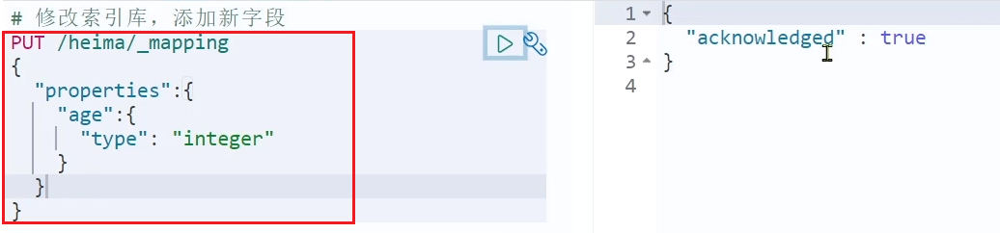

索引库就类似数据库表，mapping映射就类似表的结构。

我们要向es中存储数据，必须先创建“库”和“表”。

## mapping映射属性

mapping是对索引库中文档的约束，常见的mapping属性包括：

* type：字段数据类型，常见的简单类型有：
  * 字符串：text（可分词的文本）、keyword（精确值，例如：品牌、国家、ip地址）
  * 数值：long、integer、short、byte、double、float、
  * 布尔：boolean
  * 日期：date
  * 对象：object
* index：是否创建索引，默认为true
* analyzer：使用哪种分词器
* properties：该字段的子字段

例如下面的json文档：

```
{
    "age": 21,
    "weight": 52.1,
    "isMarried": false,
    "info": "黑马程序员Java讲师",
    "email": "zy@itcast.cn",
    "score": [99.1, 99.5, 98.9],
    "name": {
        "firstName": "云",
        "lastName": "赵"
    }
}
```

对应的每个字段映射（mapping）：

* age：类型为 integer；参与搜索，因此需要index为true；无需分词器
* weight：类型为float；参与搜索，因此需要index为true；无需分词器
* isMarried：类型为boolean；参与搜索，因此需要index为true；无需分词器
* info：类型为字符串，需要分词，因此是text；参与搜索，因此需要index为true；分词器可以用ik_smart
* email：类型为字符串，但是不需要分词，因此是keyword；不参与搜索，因此需要index为false；无需分词器
* score：虽然是数组，但是我们只看元素的类型，类型为float；参与搜索，因此需要index为true；无需分词器
* name：类型为object，需要定义多个子属性
  * name.firstName；类型为字符串，但是不需要分词，因此是keyword；参与搜索，因此需要index为true；无需分词器
  * name.lastName；类型为字符串，但是不需要分词，因此是keyword；参与搜索，因此需要index为true；无需分词器

## 索引库的CRUD

这里我们统一使用Kibana编写DSL的方式来演示。

### 创建索引库和映射

基本语法

* 请求方式：PUT
* 请求路径：/索引库名，可以自定义
* 请求参数：mapping映射

格式：

```
PUT /索引库名称
{
  "mappings": {
    "properties": {
      "字段名":{
        "type": "text",
        "analyzer": "ik_smart"
      },
      "字段名2":{
        "type": "keyword",
        "index": "false"
      },
      "字段名3":{
        "properties": {
          "子字段": {
            "type": "keyword"
          }
        }
      },
      // ...略
    }
  }
}
```

示例：

```
PUT /heima
{
  "mappings": {
    "properties": {
      "info":{
        "type": "text",
        "analyzer": "ik_smart"
      },
      "email":{
        "type": "keyword",
        "index": "falsae"
      },
      "name":{
        "properties": {
          "firstName": {
            "type": "keyword"
          }
        }
      },
      // ... 略
    }
  }
}
```

### 查询索引库

基本语法

* 请求方式：GET
* 请求路径：/索引库名
* 请求参数：无

格式：

```
GET /索引库名
```

示例：


### 修改索引库

倒排索引结构虽然不复杂，但是一旦数据结构改变（比如改变了分词器），就需要重新创建倒排索引，这简直是灾难。因此索引库一旦创建，无法修改mapping。

虽然无法修改mapping中已有的字段，但是却允许添加新的字段到mapping中，因为不会对倒排索引产生影响。

语法说明：

```
PUT /索引库名/_mapping
{
  "properties": {
    "新字段名":{
      "type": "integer"
    }
  }
}
```

示例：



### 删除索引库

基本语法

* 请求方式：DELETE
* 请求路径：/索引库名
* 请求参数：无

格式：

```
DELETE /索引库名
```

在kibana中测试：


### 总结

索引库操作有哪些？

* 创建索引库：PUT /索引库名
* 查询索引库：GET /索引库名
* 删除索引库：DELETE /索引库名
* 添加字段：PUT /索引库名/_mapping
