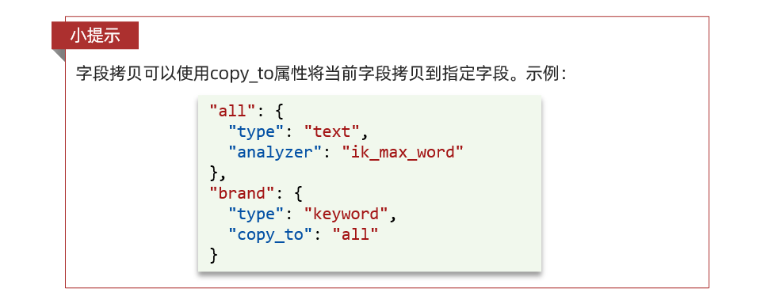

ES官方提供了各种不同语言的客户端，用来操作ES。这些客户端的本质就是组装DSL语句，通过http请求发送给ES。官方文档地址：https://www.elastic.co/guide/en/elasticsearch/client/index.html

其中的Java Rest Client又包括两种：

* Java Low Level Rest Client
* Java High Level Rest Client


我们学习的是Java HighLevel Rest Client客户端API


## 导入Demo工程

### 导入数据

首先导入课前资料提供的数据库数据：


数据结构如下：

```
CREATE TABLE `tb_hotel` (
  `id` bigint(20) NOT NULL COMMENT '酒店id',
  `name` varchar(255) NOT NULL COMMENT '酒店名称；例：7天酒店',
  `address` varchar(255) NOT NULL COMMENT '酒店地址；例：航头路',
  `price` int(10) NOT NULL COMMENT '酒店价格；例：329',
  `score` int(2) NOT NULL COMMENT '酒店评分；例：45，就是4.5分',
  `brand` varchar(32) NOT NULL COMMENT '酒店品牌；例：如家',
  `city` varchar(32) NOT NULL COMMENT '所在城市；例：上海',
  `star_name` varchar(16) DEFAULT NULL COMMENT '酒店星级，从低到高分别是：1星到5星，1钻到5钻',
  `business` varchar(255) DEFAULT NULL COMMENT '商圈；例：虹桥',
  `latitude` varchar(32) NOT NULL COMMENT '纬度；例：31.2497',
  `longitude` varchar(32) NOT NULL COMMENT '经度；例：120.3925',
  `pic` varchar(255) DEFAULT NULL COMMENT '酒店图片；例:/img/1.jpg',
  PRIMARY KEY (`id`)
) ENGINE=InnoDB DEFAULT CHARSET=utf8mb4;
```

### 导入项目

然后导入课前资料提供的项目:


项目结构如图：


### mapping映射分析

创建索引库，最关键的是mapping映射，而mapping映射要考虑的信息包括：

* 字段名
* 字段数据类型
* 是否参与搜索
* 是否需要分词
* 如果分词，分词器是什么？

其中：

* 字段名、字段数据类型，可以参考数据表结构的名称和类型
* 是否参与搜索要分析业务来判断，例如图片地址，就无需参与搜索
* 是否分词呢要看内容，内容如果是一个整体就无需分词，反之则要分词
* 分词器，我们可以统一使用ik_max_word

来看下酒店数据的索引库结构:

```
PUT /hotel
{
  "mappings": {
    "properties": {
      "id": {
        "type": "keyword"
      },
      "name":{
        "type": "text",
        "analyzer": "ik_max_word",
        "copy_to": "all"
      },
      "address":{
        "type": "keyword",
        "index": false
      },
      "price":{
        "type": "integer"
      },
      "score":{
        "type": "integer"
      },
      "brand":{
        "type": "keyword",
        "copy_to": "all"
      },
      "city":{
        "type": "keyword",
        "copy_to": "all"
      },
      "starName":{
        "type": "keyword"
      },
      "business":{
        "type": "keyword"
      },
      "location":{
        "type": "geo_point"
      },
      "pic":{
        "type": "keyword",
        "index": false
      },
      "all":{
        "type": "text",
        "analyzer": "ik_max_word"
      }
    }
  }
}
```

几个特殊字段说明：

- location：地理坐标，里面包含精度、纬度
- all：一个组合字段，其目的是将多字段的值 利用copy_to合并，提供给用户搜索

地理坐标说明：


copy_to说明：



### 初始化RestClient

在elasticsearch提供的API中，与elasticsearch一切交互都封装在一个名为RestHighLevelClient的类中，必须先完成这个对象的初始化，建立与elasticsearch的连接。

分为三步：

* 引入es的RestHighLevelClient依赖：

  ```
  <dependency>
      <groupId>org.elasticsearch.client</groupId>
      <artifactId>elasticsearch-rest-high-level-client</artifactId>
  </dependency>
  ```
* 因为SpringBoot默认的ES版本是7.6.2，所以我们需要覆盖默认的ES版本：

  ```
  <properties>
      <java.version>1.8</java.version>
      <elasticsearch.version>7.12.1</elasticsearch.version>
  </properties>
  ```
* 初始化RestHighLevelClient：

  初始化的代码如下：

  ```
  RestHighLevelClient client = new RestHighLevelClient(RestClient.builder(
          HttpHost.create("http://192.168.150.101:9200")
  ));
  ```

  这里为了单元测试方便，我们创建一个测试类HotelIndexTest，然后将初始化的代码编写在@BeforeEach方法中：

  ```
  package cn.itcast.hotel;

  import org.apache.http.HttpHost;
  import org.elasticsearch.client.RestHighLevelClient;
  import org.junit.jupiter.api.AfterEach;
  import org.junit.jupiter.api.BeforeEach;
  import org.junit.jupiter.api.Test;

  import java.io.IOException;

  public class HotelIndexTest {
      private RestHighLevelClient client;

      @BeforeEach
      void setUp() {
          this.client = new RestHighLevelClient(RestClient.builder(
                  HttpHost.create("http://192.168.150.101:9200")
          ));
      }

      @AfterEach
      void tearDown() throws IOException {
          this.client.close();
      }
  }
  ```

## 创建索引库

### 代码解读

创建索引库的API如下：


代码分为三步：

* 创建Request对象。因为是创建索引库的操作，因此Request是CreateIndexRequest。
* 添加请求参数，其实就是DSL的JSON参数部分。因为json字符串很长，这里是定义了静态字符串常MAPPING_TEMPLATE，让代码看起来更加优雅。
* 发送请求，client.indices()方法的返回值是IndicesClient类型，封装了所有与索引库操作有关的方法。

### 完整示例

在hotel-demo的cn.itcast.hotel.constants包下，创建一个类，定义mapping映射的JSON字符串常量：

```
package cn.itcast.hotel.constants;

public class HotelConstants {
    public static final String MAPPING_TEMPLATE = "{\n" +
            "  \"mappings\": {\n" +
            "    \"properties\": {\n" +
            "      \"id\": {\n" +
            "        \"type\": \"keyword\"\n" +
            "      },\n" +
            "      \"name\":{\n" +
            "        \"type\": \"text\",\n" +
            "        \"analyzer\": \"ik_max_word\",\n" +
            "        \"copy_to\": \"all\"\n" +
            "      },\n" +
            "      \"address\":{\n" +
            "        \"type\": \"keyword\",\n" +
            "        \"index\": false\n" +
            "      },\n" +
            "      \"price\":{\n" +
            "        \"type\": \"integer\"\n" +
            "      },\n" +
            "      \"score\":{\n" +
            "        \"type\": \"integer\"\n" +
            "      },\n" +
            "      \"brand\":{\n" +
            "        \"type\": \"keyword\",\n" +
            "        \"copy_to\": \"all\"\n" +
            "      },\n" +
            "      \"city\":{\n" +
            "        \"type\": \"keyword\",\n" +
            "        \"copy_to\": \"all\"\n" +
            "      },\n" +
            "      \"starName\":{\n" +
            "        \"type\": \"keyword\"\n" +
            "      },\n" +
            "      \"business\":{\n" +
            "        \"type\": \"keyword\"\n" +
            "      },\n" +
            "      \"location\":{\n" +
            "        \"type\": \"geo_point\"\n" +
            "      },\n" +
            "      \"pic\":{\n" +
            "        \"type\": \"keyword\",\n" +
            "        \"index\": false\n" +
            "      },\n" +
            "      \"all\":{\n" +
            "        \"type\": \"text\",\n" +
            "        \"analyzer\": \"ik_max_word\"\n" +
            "      }\n" +
            "    }\n" +
            "  }\n" +
            "}";
}
```

在hotel-demo中的HotelIndexTest测试类中，编写单元测试，实现创建索引：

```
@Test
void createHotelIndex() throws IOException {
    // 1.创建Request对象
    CreateIndexRequest request = new CreateIndexRequest("hotel");
    // 2.准备请求的参数：DSL语句
    request.source(MAPPING_TEMPLATE, XContentType.JSON);
    // 3.发送请求
    client.indices().create(request, RequestOptions.DEFAULT);
}
```

## 删除索引库

删除索引库的DSL语句非常简单：

```
DELETE /hotel
```

与创建索引库相比：

* 请求方式从PUT变为DELTE
* 请求路径不变
* 无请求参数

所以代码的差异，注意体现在Request对象上。依然是三步走：

1. 创建Request对象。这次是DeleteIndexRequest对象
1. 准备参数。这里是无参
1. 发送请求。改用delete方法

在hotel-demo中的HotelIndexTest测试类中，编写单元测试，实现删除索引：

```
@Test
void testDeleteHotelIndex() throws IOException {
    // 1.创建Request对象
    DeleteIndexRequest request = new DeleteIndexRequest("hotel");
    // 2.发送请求
    client.indices().delete(request, RequestOptions.DEFAULT);
}
```

### 判断索引库是否存在

判断索引库是否存在，本质就是查询，对应的DSL是：

```
GET /hotel
```

因此与删除的Java代码流程是类似的。依然是三步走：

1. 创建Request对象。这次是GetIndexRequest对象
1. 准备参数。这里是无参
1. 发送请求。改用exists方法

```
@Test
void testExistsHotelIndex() throws IOException {
    // 1.创建Request对象
    GetIndexRequest request = new GetIndexRequest("hotel");
    // 2.发送请求
    boolean exists = client.indices().exists(request, RequestOptions.DEFAULT);
    // 3.输出
    System.err.println(exists ? "索引库已经存在！" : "索引库不存在！");
}
```

## 总结

JavaRestClient操作elasticsearch的流程基本类似。核心是client.indices()方法来获取索引库的操作对象。

索引库操作的基本步骤：

1. 初始化RestHighLevelClient
1. 创建XxxIndexRequest。XXX是Create、Get、Delete
1. 准备DSL（ Create时需要，其它是无参）
1. 发送请求。调用RestHighLevelClient#indices().xxx()方法，xxx是create、exists、delete
