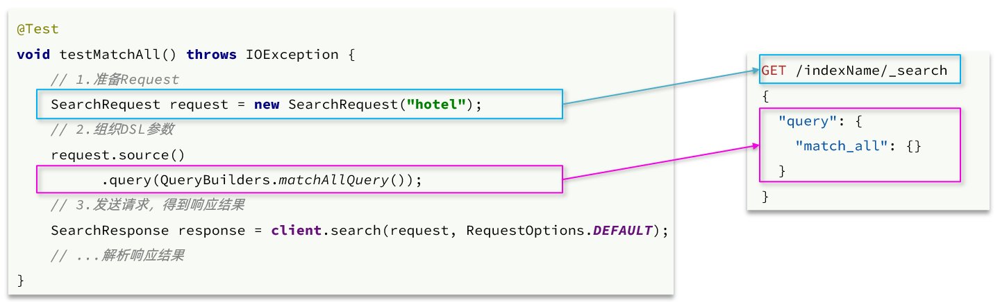
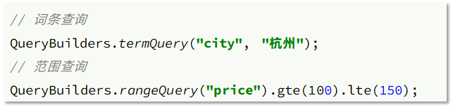

文档的查询同样适用RestHighLevelClient对象，基本步骤包括：

* 准备Request对象
* 准备请求参数
* 发起请求
* 解析响应

## 快速入门

我们以match_all查询为例

### 发起查询请求



代码解读：

* 第一步，创建 `SearchRequest`对象，指定索引库名
* 第二步，利用 `request.source()`构建DSL，DSL中可以包含查询、分页、排序、高亮等
  * `query()`：代表查询条件，利用 `QueryBuilders.matchAllQuery()`构建一个match_all查询的DSL
* 第三步，利用client.search()发送请求，得到响应

这里关键的API有两个，一个是 `request.source()`，其中包含了查询、排序、分页、高亮等所有功能：


另一个是 `QueryBuilders`，其中包含match、term、function_score、bool等各种查询：


### 解析响应

响应结果的解析：


elasticsearch返回的结果是一个JSON字符串，结构包含：

* `hits`：命中的结果
  * `total`：总条数，其中的value是具体的总条数值
  * `max_score`：所有结果中得分最高的文档的相关性算分
  * `hits`：搜索结果的文档数组，其中的每个文档都是一个json对象
    * `_source`：文档中的原始数据，也是json对象

因此，我们解析响应结果，就是逐层解析JSON字符串，流程如下：

* `SearchHits`：通过response.getHits()获取，就是JSON中的最外层的hits，代表命中的结果
  * `SearchHits#getTotalHits().value`：获取总条数信息
  * `SearchHits#getHits()`：获取SearchHit数组，也就是文档数组
    * `SearchHit#getSourceAsString()`：获取文档结果中的_source，也就是原始的json文档数据

### 完整代码

完整代码如下：

```
@Test
void testMatchAll() throws IOException {
    // 1.准备Request
    SearchRequest request = new SearchRequest("hotel");
    // 2.准备DSL
    request.source()
        .query(QueryBuilders.matchAllQuery());
    // 3.发送请求
    SearchResponse response = client.search(request, RequestOptions.DEFAULT);

    // 4.解析响应
    handleResponse(response);
}

private void handleResponse(SearchResponse response) {
    // 4.解析响应
    SearchHits searchHits = response.getHits();
    // 4.1.获取总条数
    long total = searchHits.getTotalHits().value;
    System.out.println("共搜索到" + total + "条数据");
    // 4.2.文档数组
    SearchHit[] hits = searchHits.getHits();
    // 4.3.遍历
    for (SearchHit hit : hits) {
        // 获取文档source
        String json = hit.getSourceAsString();
        // 反序列化
        HotelDoc hotelDoc = JSON.parseObject(json, HotelDoc.class);
        System.out.println("hotelDoc = " + hotelDoc);
    }
}
```

### 小结

查询的基本步骤是：

1. 创建SearchRequest对象
2. 准备Request.source()，也就是DSL。
   * QueryBuilders来构建查询条件
   * 传入Request.source() 的 query() 方法
3. 发送请求，得到结果
4. 解析结果（参考JSON结果，从外到内，逐层解析）

## match查询

全文检索的match和multi_match查询与match_all的API基本一致。差别是查询条件，也就是query的部分。


因此，Java代码上的差异主要是request.source().query()中的参数了。同样是利用QueryBuilders提供的方法：


而结果解析代码则完全一致，可以抽取并共享。

完整代码如下：

```
@Test
void testMatch() throws IOException {
    // 1.准备Request
    SearchRequest request = new SearchRequest("hotel");
    // 2.准备DSL
    request.source()
        .query(QueryBuilders.matchQuery("all", "如家"));
    // 3.发送请求
    SearchResponse response = client.search(request, RequestOptions.DEFAULT);
    // 4.解析响应
    handleResponse(response);

}
```

## 精确查询

精确查询主要是两者：

* term：词条精确匹配
* range：范围查询

与之前的查询相比，差异同样在查询条件，其它都一样。

查询条件构造的API如下：



## 布尔查询

布尔查询是用must、must_not、filter等方式组合其它查询，代码示例如下：


可以看到，API与其它查询的差别同样是在查询条件的构建，QueryBuilders，结果解析等其他代码完全不变。

完整代码如下：

```
@Test
void testBool() throws IOException {
    // 1.准备Request
    SearchRequest request = new SearchRequest("hotel");
    // 2.准备DSL
    // 2.1.准备BooleanQuery
    BoolQueryBuilder boolQuery = QueryBuilders.boolQuery();
    // 2.2.添加term
    boolQuery.must(QueryBuilders.termQuery("city", "杭州"));
    // 2.3.添加range
    boolQuery.filter(QueryBuilders.rangeQuery("price").lte(250));

    request.source().query(boolQuery);
    // 3.发送请求
    SearchResponse response = client.search(request, RequestOptions.DEFAULT);
    // 4.解析响应
    handleResponse(response);

}
```

## 排序、分页

搜索结果的排序和分页是与query同级的参数，因此同样是使用request.source()来设置。

对应的API如下：


完整代码示例：

```
@Test
void testPageAndSort() throws IOException {
    // 页码，每页大小
    int page = 1, size = 5;

    // 1.准备Request
    SearchRequest request = new SearchRequest("hotel");
    // 2.准备DSL
    // 2.1.query
    request.source().query(QueryBuilders.matchAllQuery());
    // 2.2.排序 sort
    request.source().sort("price", SortOrder.ASC);
    // 2.3.分页 from、size
    request.source().from((page - 1) * size).size(5);
    // 3.发送请求
    SearchResponse response = client.search(request, RequestOptions.DEFAULT);
    // 4.解析响应
    handleResponse(response);

}
```

## 高亮

高亮的代码与之前代码差异较大，有两点：

- 查询的DSL：其中除了查询条件，还需要添加高亮条件，同样是与query同级。
- 结果解析：结果除了要解析_source文档数据，还要解析高亮结果

### 高亮请求构建

高亮请求的构建API如下：


上述代码省略了查询条件部分，但是大家不要忘了：高亮查询必须使用全文检索查询，并且要有搜索关键字，将来才可以对关键字高亮。

完整代码如下：

```
@Test
void testHighlight() throws IOException {
    // 1.准备Request
    SearchRequest request = new SearchRequest("hotel");
    // 2.准备DSL
    // 2.1.query
    request.source().query(QueryBuilders.matchQuery("all", "如家"));
    // 2.2.高亮
    request.source().highlighter(new HighlightBuilder().field("name").requireFieldMatch(false));
    // 3.发送请求
    SearchResponse response = client.search(request, RequestOptions.DEFAULT);
    // 4.解析响应
    handleResponse(response);

}
```

### 高亮结果解析

高亮的结果与查询的文档结果默认是分离的，并不在一起。

因此解析高亮的代码需要额外处理：


代码解读：

* 第一步：从结果中获取source。hit.getSourceAsString()，这部分是非高亮结果，json字符串。还需要反序列为HotelDoc对象
* 第二步：获取高亮结果。hit.getHighlightFields()，返回值是一个Map，key是高亮字段名称，值是HighlightField对象，代表高亮值
* 第三步：从map中根据高亮字段名称，获取高亮字段值对象HighlightField
* 第四步：从HighlightField中获取Fragments，并且转为字符串。这部分就是真正的高亮字符串了
* 第五步：用高亮的结果替换HotelDoc中的非高亮结果

完整代码如下：

```
private void handleResponse(SearchResponse response) {
    // 4.解析响应
    SearchHits searchHits = response.getHits();
    // 4.1.获取总条数
    long total = searchHits.getTotalHits().value;
    System.out.println("共搜索到" + total + "条数据");
    // 4.2.文档数组
    SearchHit[] hits = searchHits.getHits();
    // 4.3.遍历
    for (SearchHit hit : hits) {
        // 获取文档source
        String json = hit.getSourceAsString();
        // 反序列化
        HotelDoc hotelDoc = JSON.parseObject(json, HotelDoc.class);
        // 获取高亮结果
        Map<String, HighlightField> highlightFields = hit.getHighlightFields();
        if (!CollectionUtils.isEmpty(highlightFields)) {
            // 根据字段名获取高亮结果
            HighlightField highlightField = highlightFields.get("name");
            if (highlightField != null) {
                // 获取高亮值
                String name = highlightField.getFragments()[0].string();
                // 覆盖非高亮结果
                hotelDoc.setName(name);
            }
        }
        System.out.println("hotelDoc = " + hotelDoc);
    }
}
```
