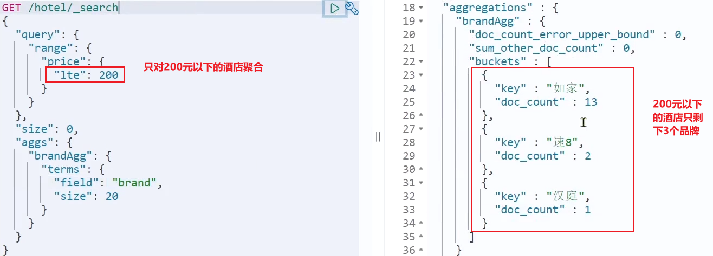

[聚合（](https://www.elastic.co/guide/en/elasticsearch/reference/current/search-aggregations.html)[aggregations](https://www.elastic.co/guide/en/elasticsearch/reference/current/search-aggregations.html)[）](https://www.elastic.co/guide/en/elasticsearch/reference/current/search-aggregations.html)可以让我们极其方便的实现对数据的统计、分析、运算。例如：

* 什么品牌的手机最受欢迎？
* 这些手机的平均价格、最高价格、最低价格？
* 这些手机每月的销售情况如何？

实现这些统计功能的比数据库的sql要方便的多，而且查询速度非常快，可以实现近实时搜索效果。

## 聚合的种类

聚合常见的有三类：

* 桶（Bucket）聚合：用来对文档做分组
  * TermAggregation：按照文档字段值分组，例如按照品牌值分组、按照国家分组
  * Date Histogram：按照日期阶梯分组，例如一周为一组，或者一月为一组
* 度量（Metric）聚合：用以计算一些值，比如：最大值、最小值、平均值等
  * Avg：求平均值
  * Max：求最大值
  * Min：求最小值
  * Stats：同时求max、min、avg、sum等
* 管道（pipeline）聚合：其它聚合的结果为基础做聚合

> 注意：参加聚合的字段必须是keyword、日期、数值、布尔类型

## DSL实现聚合

现在，我们要统计所有数据中的酒店品牌有几种，其实就是按照品牌对数据分组。此时可以根据酒店品牌的名称做聚合，也就是Bucket聚合。

### Bucket聚合语法

语法如下：

```
GET /hotel/_search
{
  "size": 0,  // 设置size为0，结果中不包含文档，只包含聚合结果
  "aggs": { // 定义聚合
    "brandAgg": { //给聚合起个名字
      "terms": { // 聚合的类型，按照品牌值聚合，所以选择term
        "field": "brand", // 参与聚合的字段
        "size": 20 // 希望获取的聚合结果数量
      }
    }
  }
}
```

结果如图：


### 聚合结果排序

默认情况下，Bucket聚合会统计Bucket内的文档数量，记为*count，并且按照*count降序排序。

我们可以指定order属性，自定义聚合的排序方式：

```
GET /hotel/_search
{
  "size": 0, 
  "aggs": {
    "brandAgg": {
      "terms": {
        "field": "brand",
        "order": {
          "_count": "asc" // 按照_count升序排列
        },
        "size": 20
      }
    }
  }
}
```

### 限定聚合范围

默认情况下，Bucket聚合是对索引库的所有文档做聚合，但真实场景下，用户会输入搜索条件，因此聚合必须是对搜索结果聚合。那么聚合必须添加限定条件。

我们可以限定要聚合的文档范围，只要添加query条件即可：

```
GET /hotel/_search
{
  "query": {
    "range": {
      "price": {
        "lte": 200 // 只对200元以下的文档聚合
      }
    }
  }, 
  "size": 0, 
  "aggs": {
    "brandAgg": {
      "terms": {
        "field": "brand",
        "size": 20
      }
    }
  }
}
```

这次，聚合得到的品牌明显变少了：



### Metric聚合语法

上节课，我们对酒店按照品牌分组，形成了一个个桶。现在我们需要对桶内的酒店做运算，获取每个品牌的用户评分的min、max、avg等值。

这就要用到Metric聚合了，例如stat聚合：就可以获取min、max、avg等结果。

语法如下：

```
GET /hotel/_search
{
  "size": 0, 
  "aggs": {
    "brandAgg": { 
      "terms": { 
        "field": "brand", 
        "size": 20
      },
      "aggs": { // 是brands聚合的子聚合，也就是分组后对每组分别计算
        "score_stats": { // 聚合名称
          "stats": { // 聚合类型，这里stats可以计算min、max、avg等
            "field": "score" // 聚合字段，这里是score
          }
        }
      }
    }
  }
}
```

这次的score_stats聚合是在brandAgg的聚合内部嵌套的子聚合。因为我们需要在每个桶分别计算。

另外，我们还可以给聚合结果做个排序，例如按照每个桶的酒店平均分做排序：


### 小结

aggs代表聚合，与query同级，此时query的作用是？

* 限定聚合的的文档范围

聚合必须的三要素：

* 聚合名称
* 聚合类型
* 聚合字段

聚合可配置属性有：

* size：指定聚合结果数量
* order：指定聚合结果排序方式
* field：指定聚合字段

## RestAPI实现聚合

### API语法

聚合条件与query条件同级别，因此需要使用request.source()来指定聚合条件。

聚合条件的语法：


聚合的结果也与查询结果不同，API也比较特殊。不过同样是JSON逐层解析：


### 业务需求

需求：搜索页面的品牌、城市等信息不应该是在页面写死，而是通过聚合索引库中的酒店数据得来的：


分析：

目前，页面的城市列表、星级列表、品牌列表都是写死的，并不会随着搜索结果的变化而变化。但是用户搜索条件改变时，搜索结果会跟着变化。

例如：用户搜索“东方明珠”，那搜索的酒店肯定是在上海东方明珠附近，因此，城市只能是上海，此时城市列表中就不应该显示北京、深圳、杭州这些信息了。

也就是说，搜索结果中包含哪些城市，页面就应该列出哪些城市；搜索结果中包含哪些品牌，页面就应该列出哪些品牌。

如何得知搜索结果中包含哪些品牌？如何得知搜索结果中包含哪些城市？

使用聚合功能，利用Bucket聚合，对搜索结果中的文档基于品牌分组、基于城市分组，就能得知包含哪些品牌、哪些城市了。

因为是对搜索结果聚合，因此聚合是限定范围的聚合，也就是说聚合的限定条件跟搜索文档的条件一致。

查看浏览器可以发现，前端其实已经发出了这样的一个请求：


请求参数与搜索文档的参数完全一致。

返回值类型就是页面要展示的最终结果：


结果是一个Map结构：

* key是字符串，城市、星级、品牌、价格
* value是集合，例如多个城市的名称

### 业务实现

在 `cn.itcast.hotel.web`包的 `HotelController`中添加一个方法，遵循下面的要求：

* 请求方式：`POST`
* 请求路径：`/hotel/filters`
* 请求参数：`RequestParams`，与搜索文档的参数一致
* 返回值类型：`Map<String, List<String>>`

代码：

```
    @PostMapping("filters")
    public Map<String, List<String>> getFilters(@RequestBody RequestParams params){
        return hotelService.getFilters(params);
    }
```

这里调用了IHotelService中的getFilters方法，尚未实现。

在 `cn.itcast.hotel.service.IHotelService`中定义新方法：

```
Map<String, List<String>> filters(RequestParams params);
```

在 `cn.itcast.hotel.service.impl.HotelService`中实现该方法：

```
@Override
public Map<String, List<String>> filters(RequestParams params) {
    try {
        // 1.准备Request
        SearchRequest request = new SearchRequest("hotel");
        // 2.准备DSL
        // 2.1.query
        buildBasicQuery(params, request);
        // 2.2.设置size
        request.source().size(0);
        // 2.3.聚合
        buildAggregation(request);
        // 3.发出请求
        SearchResponse response = client.search(request, RequestOptions.DEFAULT);
        // 4.解析结果
        Map<String, List<String>> result = new HashMap<>();
        Aggregations aggregations = response.getAggregations();
        // 4.1.根据品牌名称，获取品牌结果
        List<String> brandList = getAggByName(aggregations, "brandAgg");
        result.put("品牌", brandList);
        // 4.2.根据品牌名称，获取品牌结果
        List<String> cityList = getAggByName(aggregations, "cityAgg");
        result.put("城市", cityList);
        // 4.3.根据品牌名称，获取品牌结果
        List<String> starList = getAggByName(aggregations, "starAgg");
        result.put("星级", starList);

        return result;
    } catch (IOException e) {
        throw new RuntimeException(e);
    }
}

private void buildAggregation(SearchRequest request) {
    request.source().aggregation(AggregationBuilders
                                 .terms("brandAgg")
                                 .field("brand")
                                 .size(100)
                                );
    request.source().aggregation(AggregationBuilders
                                 .terms("cityAgg")
                                 .field("city")
                                 .size(100)
                                );
    request.source().aggregation(AggregationBuilders
                                 .terms("starAgg")
                                 .field("starName")
                                 .size(100)
                                );
}

private List<String> getAggByName(Aggregations aggregations, String aggName) {
    // 4.1.根据聚合名称获取聚合结果
    Terms brandTerms = aggregations.get(aggName);
    // 4.2.获取buckets
    List<? extends Terms.Bucket> buckets = brandTerms.getBuckets();
    // 4.3.遍历
    List<String> brandList = new ArrayList<>();
    for (Terms.Bucket bucket : buckets) {
        // 4.4.获取key
        String key = bucket.getKeyAsString();
        brandList.add(key);
    }
    return brandList;
}
```
