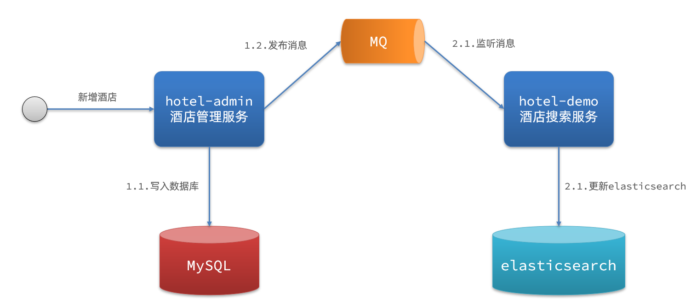
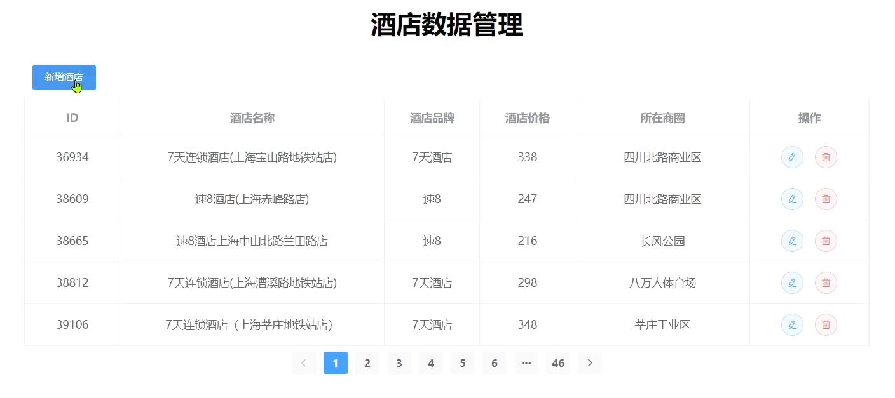

elasticsearch中的酒店数据来自于mysql数据库，因此mysql数据发生改变时，elasticsearch也必须跟着改变，这个就是elasticsearch与mysql之间的数据同步。


## 思路分析

常见的数据同步方案有三种：

* 同步调用
* 异步通知
* 监听binlog

### 同步调用

方案一：同步调用


基本步骤如下：

* hotel-demo对外提供接口，用来修改elasticsearch中的数据
* 酒店管理服务在完成数据库操作后，直接调用hotel-demo提供的接口

### 异步通知

方案二：异步通知



流程如下：

- hotel-admin对mysql数据库数据完成增、删、改后，发送MQ消息
- hotel-demo监听MQ，接收到消息后完成elasticsearch数据修改

### 监听binlog

方案三：监听binlog


流程如下：

* 给mysql开启binlog功能
* mysql完成增、删、改操作都会记录在binlog中
* hotel-demo基于canal监听binlog变化，实时更新elasticsearch中的内容

### 选择

方式一：同步调用

* 优点：实现简单，粗暴
* 缺点：业务耦合度高

方式二：异步通知

* 优点：低耦合，实现难度一般
* 缺点：依赖mq的可靠性

方式三：监听binlog

* 优点：完全解除服务间耦合
* 缺点：开启binlog增加数据库负担、实现复杂度高

## 实现数据同步

### 思路

利用课前资料提供的hotel-admin项目作为酒店管理的微服务。当酒店数据发生增、删、改时，要求对elasticsearch中数据也要完成相同操作。

步骤：

* 导入课前资料提供的hotel-admin项目，启动并测试酒店数据的CRUD
* 声明exchange、queue、RoutingKey
* 在hotel-admin中的增、删、改业务中完成消息发送
* 在hotel-demo中完成消息监听，并更新elasticsearch中数据
* 启动并测试数据同步功能

### 导入demo

导入课前资料提供的hotel-admin项目：


运行后，访问 [http://localhost:8099](http://localhost:8099/)



其中包含了酒店的CRUD功能：


### 声明交换机、队列

MQ结构如图：


#### 引入依赖

在hotel-admin、hotel-demo中引入rabbitmq的依赖：

```
<!--amqp-->
<dependency>
    <groupId>org.springframework.boot</groupId>
    <artifactId>spring-boot-starter-amqp</artifactId>
</dependency>
```

#### 声明队列交换机名称

在hotel-admin和hotel-demo中的 `cn.itcast.hotel.constatnts`包下新建一个类 `MqConstants`：

```
package cn.itcast.hotel.constatnts;

    public class MqConstants {
    /**
     * 交换机
     */
    public final static String HOTEL_EXCHANGE = "hotel.topic";
    /**
     * 监听新增和修改的队列
     */
    public final static String HOTEL_INSERT_QUEUE = "hotel.insert.queue";
    /**
     * 监听删除的队列
     */
    public final static String HOTEL_DELETE_QUEUE = "hotel.delete.queue";
    /**
     * 新增或修改的RoutingKey
     */
    public final static String HOTEL_INSERT_KEY = "hotel.insert";
    /**
     * 删除的RoutingKey
     */
    public final static String HOTEL_DELETE_KEY = "hotel.delete";
}
```

#### 声明队列交换机

在hotel-demo中，定义配置类，声明队列、交换机：

```
package cn.itcast.hotel.config;

import cn.itcast.hotel.constants.MqConstants;
import org.springframework.amqp.core.Binding;
import org.springframework.amqp.core.BindingBuilder;
import org.springframework.amqp.core.Queue;
import org.springframework.amqp.core.TopicExchange;
import org.springframework.context.annotation.Bean;
import org.springframework.context.annotation.Configuration;

@Configuration
public class MqConfig {
    @Bean
    public TopicExchange topicExchange(){
        return new TopicExchange(MqConstants.HOTEL_EXCHANGE, true, false);
    }

    @Bean
    public Queue insertQueue(){
        return new Queue(MqConstants.HOTEL_INSERT_QUEUE, true);
    }

    @Bean
    public Queue deleteQueue(){
        return new Queue(MqConstants.HOTEL_DELETE_QUEUE, true);
    }

    @Bean
    public Binding insertQueueBinding(){
        return BindingBuilder.bind(insertQueue()).to(topicExchange()).with(MqConstants.HOTEL_INSERT_KEY);
    }

    @Bean
    public Binding deleteQueueBinding(){
        return BindingBuilder.bind(deleteQueue()).to(topicExchange()).with(MqConstants.HOTEL_DELETE_KEY);
    }
}
```

### 发送MQ消息

在hotel-admin中的增、删、改业务中分别发送MQ消息：


### 接收MQ消息

hotel-demo接收到MQ消息要做的事情包括：

* 新增消息：根据传递的hotel的id查询hotel信息，然后新增一条数据到索引库
* 删除消息：根据传递的hotel的id删除索引库中的一条数据

1）首先在hotel-demo的 `cn.itcast.hotel.service`包下的 `IHotelService`中新增新增、删除业务

```
void deleteById(Long id);

void insertById(Long id);
```

2）给hotel-demo中的 `cn.itcast.hotel.service.impl`包下的HotelService中实现业务：

```
@Override
public void deleteById(Long id) {
    try {
        // 1.准备Request
        DeleteRequest request = new DeleteRequest("hotel", id.toString());
        // 2.发送请求
        client.delete(request, RequestOptions.DEFAULT);
    } catch (IOException e) {
        throw new RuntimeException(e);
    }
}

@Override
public void insertById(Long id) {
    try {
        // 0.根据id查询酒店数据
        Hotel hotel = getById(id);
        // 转换为文档类型
        HotelDoc hotelDoc = new HotelDoc(hotel);

        // 1.准备Request对象
        IndexRequest request = new IndexRequest("hotel").id(hotel.getId().toString());
        // 2.准备Json文档
        request.source(JSON.toJSONString(hotelDoc), XContentType.JSON);
        // 3.发送请求
        client.index(request, RequestOptions.DEFAULT);
    } catch (IOException e) {
        throw new RuntimeException(e);
    }
}
```

3）编写监听器

在hotel-demo中的 `cn.itcast.hotel.mq`包新增一个类：

```
package cn.itcast.hotel.mq;

import cn.itcast.hotel.constants.MqConstants;
import cn.itcast.hotel.service.IHotelService;
import org.springframework.amqp.rabbit.annotation.RabbitListener;
import org.springframework.beans.factory.annotation.Autowired;
import org.springframework.stereotype.Component;

@Component
public class HotelListener {

    @Autowired
    private IHotelService hotelService;

    /**
     * 监听酒店新增或修改的业务
     * @param id 酒店id
     */
    @RabbitListener(queues = MqConstants.HOTEL_INSERT_QUEUE)
    public void listenHotelInsertOrUpdate(Long id){
        hotelService.insertById(id);
    }

    /**
     * 监听酒店删除的业务
     * @param id 酒店id
     */
    @RabbitListener(queues = MqConstants.HOTEL_DELETE_QUEUE)
    public void listenHotelDelete(Long id){
        hotelService.deleteById(id);
    }
}
```
