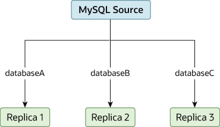

在某些情况下，可能只有一个源服务器，并且希望将不同的数据库复制到不同的副本。 例如，希望将不同的销售数据分发到不同的部门，以帮助分散数据分析期间的负载。 图 19.2 “将数据库复制到单独的副本”中显示了这种布局的示例。

图 19.2 将数据库复制到单独的副本

可以通过正常配置源和副本来实现这种分离，然后通过在每个副本上使用 --replicate-wild-do-table 配置选项来限制每个副本处理的二进制日志语句。

> 重要：
>
> 使用基于语句的复制时，不应将 --replicate-do-db 用于此目的，因为基于语句的复制会导致此选项的效果根据当前选择的数据库而变化。 这也适用于混合格式复制，因为这使得可以使用基于语句的格式复制某些更新。
>
> 但是，如果仅使用基于行的复制，则为此目的使用 --replicate-do-db 应该是安全的，因为在这种情况下，当前选择的数据库对该选项的操作没有影响。

例如，为了支持图 19.2“将数据库复制到单独的副本”中所示的分离，应该在执行 START REPLICA 之前按如下方式配置每个副本：

* 副本 1 应使用 --replicate-wild-do-table=databaseA.%。
* 副本 2 应使用 --replicate-wild-do-table=databaseB.%。
* 副本 3 应使用 --replicate-wild-do-table=databaseC.%。

此配置中的每个副本都会从源接收整个二进制日志，但仅执行二进制日志中适用于该副本上生效的 --replicate-wild-do-table 选项所包含的数据库和表的事件。

如果有必须在复制开始之前同步到副本的数据，有多种选择：

* 将所有数据同步到每个副本，并删除不想保留的数据库、表或两者。
* 使用 mysqldump 为每个数据库创建单独的转储文件，并在每个副本上加载适当的转储文件。
* 使用原始数据文件转储并仅包含每个副本所需的特定文件和数据库。（这不适用于 InnoDB 数据库，除非使用 innodb_file_per_table。）
