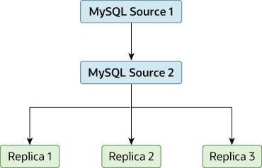

随着连接到源的副本数量的增加，负载虽然很小，但也会增加，因为每个副本都使用到源的客户端连接。 此外，由于每个副本必须接收源二进制日志的完整副本，因此源上的网络负载也可能会增加并产生瓶颈。

如果正在使用连接到一个源的大量副本，并且该源也忙于处理请求（例如，作为横向扩展解决方案的一部分），那么可能希望提高复制过程的性能。

提高复制过程性能的一种方法是创建更深的复制结构，使源只能复制到一个副本，而其余副本则连接到该主副本以满足其各自的复制要求。 图 19.3 “使用附加复制源提高性能”显示了此结构的示例。

图 19.3 使用额外的复制源来提高性能

为此，必须按如下方式配置 MySQL 实例：

源 1 是主要源，所有更改和更新都写入数据库。 两个源服务器上均启用二进制日志记录，这是默认设置。

源 2 是服务器源 1 的副本，为复制结构中的其余副本提供复制功能。 源 2 是唯一允许连接到源 1 的计算机。源 2 启用了 --log-replica-updates 选项（默认）。 使用此选项，来自源 1 的复制指令也会写入源 2 的二进制日志，以便随后可以将它们复制到真正的副本。

副本 1、副本 2 和副本 3 充当源 2 的副本，并复制源 2 中的信息，该信息实际上包含源 1 上记录的升级。

上述解决方案减少了主源上的客户端负载和网络接口负载，当用作直接数据库解决方案时，这应该会提高主源的整体性能。

如果副本无法跟上源上的复制过程，可以使用多种选项：

* 如果可能，请将中继日志和数据文件放在不同的物理驱动器上。 为此，请设置relay_log系统变量以指定中继日志的位置。
* 如果读取二进制日志文件和中继日志文件的大量磁盘 I/O 活动是一个问题，请考虑增加 rpl_read_size 系统变量的值。 此系统变量控制从日志文件读取的最小数据量，当操作系统当前未缓存文件数据时，增加该变量可能会减少文件读取和 I/O 停顿。 请注意，为从二进制日志和中继日志文件读取的每个线程分配一个该值大小的缓冲区，包括源上的转储线程和副本上的协调器线程。 因此，设置较大的值可能会影响服务器的内存消耗。
* 如果副本比源慢得多，可能需要划分将不同数据库复制到不同副本的责任。 请参见文章： “将不同数据库复制到不同副本”。
* 如果的源使用事务并且不关心副本上的事务支持，请在副本上使用 MyISAM 或其他非事务引擎。
* 如果的副本不充当源，并且有一个潜在的解决方案来确保在发生故障时可以启动源，那么可以禁用 log_replica_updates。 这可以防止“哑”副本将它们执行的事件也记录到自己的二进制日志中。
