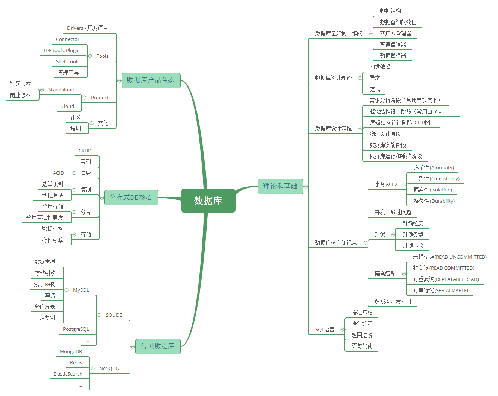

> 数据库系列文章大纲和全部内容 均 copy 自 https://pdai.tech/md/db/sql/sql-db.html @pdai 有兴趣的网友可直接到该网址查看内容。

> 本系列主要介绍数据库相关的知识体系。@pdai

## 知识体系结构

> **A. 了解数据库基础和理论知识** ：在学习数据库之前，不要一上来就是SQL语句；这里建议从数据结构开始切入到数据库，然后再理解数据库是如何工作的，紧接着理解数据库系统的原理知识点和相关知识体系。
>
> **B. 完全掌握SQL语言** ：在了解数据库基础之后，如下章节将重点阐述SQL语言相关的知识；主要顺序是：SQL语法->SQL语句练习->SQL题目进阶->SQL语句优化建议等。

## Reference Links：

https://pdai.tech/md/db/sql/sql-db.html
