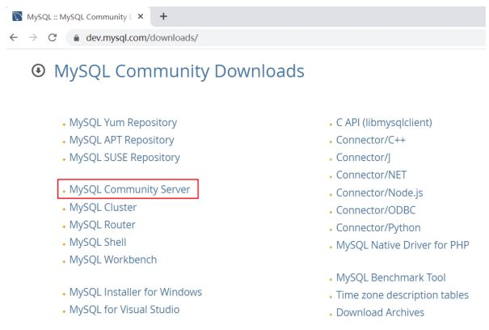

# MySQL的下载、安装、配置

## MySQL的4大版本

* MySQL Community Server 社区版本，开源免费，自由下载，但不提供官方技术支持，适用于大多数普通用户。
* MySQL Enterprise Edition 企业版本，需付费，不能在线下载，可以试用30天。提供了更多的功能和更完备的技术支持，更适合于对数据库的功能和可靠性要求较高的企业客户。
* MySQL Cluster 集群版，开源免费。用于架设集群服务器，可将几个MySQL Server封装成一个Server。需要在社区版或企业版的基础上使用。
* MySQL Cluster CGE 高级集群版，需付费。

本课程中使用 8.0.26版本

此外，官方还提供了 MySQL Workbench （GUITOOL）一款专为MySQL设计的 图形界面管理工具 。

MySQLWorkbench又分为两个版本，分别是 社区版 （MySQL Workbench OSS）、 商用版 （MySQL WorkbenchSE）。

## 软件的下载

### 下载

官网：https://www.mysql.com/

（直达下载地址：[MySQL :: Download MySQL Community Server](https://dev.mysql.com/downloads/mysql/)）

开官网，点击DOWNLOADS，然后，点击 MySQL Community(GPL) Downloads


点击 MySQL Community Server



在General Availability(GA) Releases中选择适合的版本

Windows平台下提供两种安装文件：MySQL二进制分发版（.msi安装文件）和免安装版（.zip压缩文
件）。一般来讲，应当使用二进制分发版，因为该版本提供了图形化的安装向导过程，比其他的分发版
使用起来要简单，不再需要其他工具启动就可以运行MySQL。

这里在Windows 系统下推荐下载 MSI安装程序 ；点击 Go to Download Page 进行下载即可


Windows下的MySQL8.0安装有两种安装程序

* mysql-installer-web-community-8.0.26.0.msi 下载程序大小：2.4M；安装时需要联网安装组件。
* mysql-installer-community-8.0.26.0.msi 下载程序大小：450.7M；安装时离线安装即可。推荐。

> 如果安装MySQL5.7版本的话，选择 Archives ，接着选择MySQL5.7的相应版本即可。这里下载最近
> 期的MySQL5.7.34版本。

## MySQL8.0 版本的安装

MySQL下载完成后，找到下载文件，双击进行安装，具体操作步骤如下。

* 步骤1：双击下载的mysql-installer-community-8.0.26.0.msi文件，打开安装向导。
* 步骤2：打开“Choosing a Setup Type”（选择安装类型）窗口，在其中列出了5种安装类型，分别是Developer Default（默认安装类型）、Server only（仅作为服务器）、Client only（仅作为客户端）、Full（完全安装）、Custom（自定义安装）。这里选择“Custom（自定义安装）”类型按钮，单击“Next(下一步)”按钮。


步骤3：打开“Select Products” （选择产品）窗口，可以定制需要安装的产品清单。例如，选择“MySQLServer 8.0.26-X64”后，单击“→”添加按钮，即可选择安装MySQL服务器，如图所示。采用通用的方法，可以添加其他你需要安装的产品


此时如果直接“Next”（下一步），则产品的安装路径是默认的。如果想要自定义安装目录，则可以选中对应的产品，然后在下面会出现“Advanced Options”（高级选项）的超链接。


单击“Advanced Options”（高级选项）则会弹出安装目录的选择窗口，如图所示，此时你可以分别设置MySQL的服务程序安装目录和数据存储目录。如果不设置，默认分别在C盘的Program Files目录和ProgramData目录（这是一个隐藏目录）。如果自定义安装目录，请避免“中文”目录。另外，建议服务目录和数据目录分开存放。


步骤4：在上一步选择好要安装的产品之后，单击“Next”（下一步）进入确认窗口，如图所示。单击“Execute”（执行）按钮开始安装。


步骤5：安装完成后在“Status”（状态）列表下将显示“Complete”（安装完成），如图所示。


## 配置MySQL8.0

MySQL安装之后，需要对服务器进行配置。具体的配置步骤如下。

步骤1：在上一个小节的最后一步，单击“Next”（下一步）按钮，就可以进入产品配置窗口。


步骤2：单击“Next”（下一步）按钮，进入MySQL服务器类型配置窗口，如图所示。端口号一般选择默认端口号3306。


其中，“Config Type”选项用于设置服务器的类型。单击该选项右侧的下三角按钮，即可查看3个选项，如图所示。


* Development Machine（开发机器） ：该选项代表典型个人用桌面工作站。此时机器上需要运行多个应用程序，那么MySQL服务器将占用最少的系统资源。
* Server Machine（服务器） ：该选项代表服务器，MySQL服务器可以同其他服务器应用程序一起运行，例如Web服务器等。MySQL服务器配置成适当比例的系统资源。
* Dedicated Machine（专用服务器） ：该选项代表只运行MySQL服务的服务器。MySQL服务器配置成使用所有可用系统资源。

步骤3：单击“Next”（下一步）按钮，打开设置授权方式窗口。其中，上面的选项是MySQL8.0提供的新的授权方式，采用SHA256基础的密码加密方法；下面的选项是传统授权方法（保留5.x版本兼容性）。


步骤4：单击“Next”（下一步）按钮，打开设置服务器root超级管理员的密码窗口，如图所示，需要输入两次同样的登录密码。也可以通过“Add User”添加其他用户，添加其他用户时，需要指定用户名、允许该用户名在哪台/哪些主机上录，还可以指定用户角色等。此处暂不添加用户，用户管理在MySQL高级特性篇中讲解。


步骤5：单击“Next”（下一步）按钮，打开设置服务器名称窗口，如图所示。该服务名会出现在Windows
服务列表中，也可以在命令行窗口中使用该服务名进行启动和停止服务。本书将服务名设置为“MySQL80”。如果希望开机自启动服务，也可以勾选“Start the MySQL Server at System Startup”选项（推荐）。

下面是选择以什么方式运行服务？可以选择“Standard System Account”(标准系统用户)或者“Custom User”(自定义用户)中的一个。这里推荐前者。


步骤6：单击“Next”（下一步）按钮，打开确认设置服务器窗口，单击“Execute”（执行）按钮。


步骤7：完成配置，如图所示。单击“Finish”（完成）按钮，即可完成服务器的配置。


步骤8：如果还有其他产品需要配置，可以选择其他产品，然后继续配置。如果没有，直接选择“Next”
（下一步），直接完成整个安装和配置过程。


## 配置MySQL8.0 环境变量

如果不配置MySQL环境变量，就不能在命令行直接输入MySQL登录命令。下面说如何配置MySQL的环境
变量：

步骤1：在桌面上右击【此电脑】图标，在弹出的快捷菜单中选择【属性】菜单命令。

步骤2：打开【系统】窗口，单击【高级系统设置】链接。

步骤3：打开【系统属性】对话框，选择【高级】选项卡，然后单击【环境变量】按钮。

步骤4：打开【环境变量】对话框，在系统变量列表中选择path变量。

步骤5：单击【编辑】按钮，在【编辑环境变量】对话框中，将MySQL应用程序的bin目录（C:\ProgramFiles\MySQL\MySQL Server 8.0\bin）添加到变量值中，用分号将其与其他路径分隔开。

步骤6：添加完成之后，单击【确定】按钮，这样就完成了配置path变量的操作，然后就可以直接输入MySQL命令来登录数据库了。

# MySQL的登录

## 服务的启动与停止

MySQL安装完毕之后，需要启动服务器进程，不然客户端无法连接数据库。

在前面的配置过程中，已经将MySQL安装为Windows服务，并且勾选当Windows启动、停止时，MySQL也自动启动、停止。

### 使用图形界面工具

步骤1：打开windows服务

* 方式1：计算机（点击鼠标右键）→ 管理（点击）→ 服务和应用程序（点击）→ 服务（点击）
* 方式2：控制面板（点击）→ 系统和安全（点击）→ 管理工具（点击）→ 服务（点击）
* 方式3：任务栏（点击鼠标右键）→ 启动任务管理器（点击）→ 服务（点击）
* 方式4：单击【开始】菜单，在搜索框中输入“services.msc”，按Enter键确认

步骤2：找到MySQL80（点击鼠标右键）→ 启动或停止（点击）

### 使用命令行工具

```
# 启动 MySQL 服务命令：
net start MySQL服务名

# 停止 MySQL 服务命令：
net stop MySQL服务名
```

> 说明：
>
> 1. start和stop后面的服务名应与之前配置时指定的服务名一致。
> 2. 如果当你输入命令后，提示“拒绝服务”，请以 系统管理员身份 打开命令提示符界面重新尝试。

## 自带客户端的登录与退出

当MySQL服务启动完成后，便可以通过客户端来登录MySQL数据库。注意：确认服务是开启的。

### 登录方式1：MySQL自带客户端

> 说明：仅限于root用户

开始菜单 → 所有程序 → MySQL → MySQL 8.0 Command Line Client

### 登录方式2：windows命令行

```
#格式
mysql -h 主机名 -P 端口号 -u 用户名 -p密码

#示例
mysql -h localhost -P 3306 -u root -pabc123 # 这里我设置的root用户的密码是abc123
```

注意：

* -p与密码之间不能有空格，其他参数名与参数值之间可以有空格也可以没有空格。
* 密码建议在下一行输入，保证安全
* 客户端和服务器在同一台机器上，所以输入localhost或者IP地址127.0.0.1。同时，因为是连接本机： -hlocalhost就可以省略，如果端口号没有修改：-P3306也可以省略

获取MySQL Server服务版本的信息

```
mysql -V
#或
mysql --version

#或登录后，通过以下方式查看当前版本信息
select version();
```

退出登录

```
exit
或
quit
```

# MySQL演示使用

## 基础数据库说明

* “information_schema”
  * 是 MySQL 系统自带的数据库，主要保存 MySQL 数据库服务器的系统信息，比如数据库的名称、数据表的名称、字段名称、存取权限、数据文件 所在的文件夹和系统使用的文件夹，等等
* “performance_schema”
  * 是 MySQL 系统自带的数据库，可以用来监控 MySQL 的各类性能指标。
* “sys”数据
  * 是 MySQL 系统自带的数据库，主要作用是以一种更容易被理解的方式展示 MySQL 数据库服务器的各类性能指标，帮助系统管理员和开发人员监控 MySQL 的技术性能。
* “mysql”数据库
  * 保存了 MySQL 数据库服务器运行时需要的系统信息，比如数据文件夹、当前使用的字符集、约束检查信息，等等

## MySQL的编码设置

### 查看编码命令

```
show variables like 'character_%';
show variables like 'collation_%';
```

### 修改编码

修改mysql的数据目录下的my.ini配置文件

```
[mysql] #大概在63行左右，在其下添加
...
default-character-set=utf8 #默认字符集
[mysqld] # 大概在76行左右，在其下添加
...
character-set-server=utf8
collation-server=utf8_general_ci
```

> 注意：建议修改配置文件使用notepad++等高级文本编辑器，使用记事本等软件打开修改后可能会导致文件编码修改为“含BOM头”的编码，从而服务重启失败。

> 在MySQL 8.0版本之前，默认字符集为latin1，utf8字符集指向的是utf8mb3。网站开发人员在数据库设计的时候往往会将编码修改为utf8字符集。如果遗忘修改默认的编码，就会出现乱码的问题。从MySQL 8.0开始，数据库的默认编码改为 utf8mb4 ，从而避免了上述的乱码问题。

# MySQL图形化管理工具

MySQL图形化管理工具极大地方便了数据库的操作与管理，常用的图形化管理工具有：MySQL Workbench、phpMyAdmin、Navicat Preminum、MySQLDumper、SQLyog、dbeaver、MySQL ODBC
Connector。

## 工具1. MySQL Workbench

MySQL官方提供的图形化管理工具MySQL Workbench完全支持MySQL 5.0以上的版本。MySQL Workbench
分为社区版和商业版，社区版完全免费，而商业版则是按年收费。

MySQL Workbench 为数据库管理员、程序开发者和系统规划师提供可视化设计、模型建立、以及数据库管理功能。它包含了用于创建复杂的数据建模ER模型，正向和逆向数据库工程，也可以用于执行通常需要花费大量时间的、难以变更和管理的文档任务。

下载地址：http://dev.mysql.com/downloads/workbench/

### 使用

首先，我们点击 Windows 左下角的“开始”按钮，如果你是 Win10 系统，可以直接看到所有程序。接着，找到“MySQL”，点开，找到“MySQL Workbench 8.0 CE”。点击打开 Workbench，如下图所示：


左下角有个本地连接，点击，录入 Root 的密码，登录本地 MySQL 数据库服务器，如下图所示：


这是一个图形化的界面，我来给你介绍下这个界面。

* 上方是菜单。左上方是导航栏，这里我们可以看到 MySQL 数据库服务器里面的数据 库，包括数据表、视图、存储过程和函数；左下方是信息栏，可以显示上方选中的数据 库、数据表等对象的信息。
* 中间上方是工作区，你可以在这里写 SQL 语句，点击上方菜单栏左边的第三个运行按 钮，就可以执行工作区的 SQL 语句了。
* 中间下方是输出区，用来显示 SQL 语句的运行情况，包括什么时间开始运行的、运行的 内容、运行的输出，以及所花费的时长等信息。

## 工具2：dbeaver

DBeaver是一个通用的数据库管理工具和 SQL 客户端，支持所有流行的数据库：MySQL、PostgreSQL、SQLite、Oracle、DB2、SQL Server、 Sybase、MS Access、Teradata、 Firebird、Apache Hive、Phoenix、Presto等。DBeaver比大多数的SQL管理工具要轻量，而且支持中文界面。DBeaver社区版作为一个免费开源的产品，和其他类似的软件相比，在功能和易用性上都毫不逊色。

唯一需要注意是 DBeaver 是用Java编程语言开发的，所以需要拥有 JDK（Java Development ToolKit）环境。如果电脑上没有JDK，在选择安装DBeaver组件时，勾选“Include Java”即可。

下载地址：https://dbeaver.io/download/


### 可能出现连接问题：

有些图形界面工具，特别是旧版本的图形界面工具，在连接MySQL8时出现“Authentication plugin 'caching_sha2_password' cannot be loaded”错误。


出现这个原因是MySQL8之前的版本中加密规则是mysql_native_password，而在MySQL8之后，加密规则是caching_sha2_password。解决问题方法有两种，第一种是升级图形界面工具版本，第二种是把MySQL8用户登录密码加密规则还原成mysql_native_password。

第二种解决方案如下，用命令行登录MySQL数据库之后，执行如下命令修改用户密码加密规则并更新用户密码，这里修改用户名为“root@localhost”的用户密码规则为“mysql_native_password”，密码值为“123456”，如图所示。

```
#使用mysql数据库
USE mysql;

#修改'root'@'localhost'用户的密码规则和密码
ALTER USER 'root'@'localhost' IDENTIFIED WITH mysql_native_password BY 'abc123';

#刷新权限
FLUSH PRIVILEGES;
```

# MySQL目录结构与源码

## 主要目录结构

| MySQL的目录结构                             | 说明                                 |
| ------------------------------------------- | ------------------------------------ |
| bin目录                                     | 所有MySQL的可执行文件。如：mysql.exe |
| MySQLInstanceConfig.exe                     | 数据库的配置向导，在安装时出现的内容 |
| data目录                                    | 系统数据库所在的目录                 |
| my.ini文件                                  | MySQL的主要配置文件                  |
| c:\ProgramData\MySQL\MySQL Server 8.0\data\ | 用户创建的数据库所在的目录           |

## MySQL 源代码获取

首先，你要进入 MySQL下载界面。 这里你不要选择用默认的“Microsoft Windows”，而是要通过下拉栏，找到“Source Code”，在下面的操作系统版本里面， 选择 Windows（Architecture Independent），然后点击下载。

接下来，把下载下来的压缩文件解压，我们就得到了 MySQL 的源代码。MySQL 是用 C++ 开发而成的，我简单介绍一下源代码的组成。mysql-8.0.22 目录下的各个子目录，包含了 MySQL 各部分组件的源代码：

* sql 子目录是 MySQL 核心代码；
* libmysql 子目录是客户端程序 API；
* mysql-test 子目录是测试工具；
* mysys 子目录是操作系统相关函数和辅助函数；

源代码可以用记事本打开查看，如果你有 C++ 的开发环境，也可以在开发环境中打开查看。

# 常见问题的解决(课外内容)

## 问题1：root用户密码忘记，重置的操作

1: 通过任务管理器或者服务管理，关掉mysqld(服务进程) 

2: 通过命令行+特殊参数开启mysqld mysqld --defaults-file="D:\ProgramFiles\mysql\MySQLServer5.7Data\my.ini" --skip-grant-tables

3: 此时，mysqld服务进程已经打开。并且不需要权限检查

4: mysql -uroot 无密码登陆服务器。另启动一个客户端进行

5: 修改权限表 

（1） use mysql; 

（2）update user set authentication_string=password('新密码') where user='root' and Host='localhost'; 

（3）flush privileges;

6: 通过任务管理器，关掉mysqld服务进程。 

7: 再次通过服务管理，打开mysql服务。 8: 即可用修改后的新密码登陆。

## 问题2：mysql命令报“不是内部或外部命令”

把mysql安装目录的bin目录配置到环境变量path中。

## 问题3：错误ERROR ：没有选择数据库就操作表格和数据

报错：ERROR 1046 (3D000): No database selected

解决方案一：就是使用“USE 数据库名;”语句，这样接下来的语句就默认针对这个数据库进行操作

解决方案二：就是所有的表对象前面都加上“数据库.”

## 问题4：命令行客户端的字符集问题

```
mysql> INSERT INTO t_stu VALUES(1,'张三','男');
ERROR 1366 (HY000): Incorrect string value: '\xD5\xC5\xC8\xFD' for column 'sname' at row 1
```

原因：服务器端认为你的客户端的字符集是utf-8，而实际上你的客户端的字符集是GBK。


查看所有字符集：SHOW VARIABLES LIKE 'character_set_%';

解决方案，设置当前连接的客户端字符集 “SET NAMES GBK;”

## 问题5：修改数据库和表的字符编码

修改编码：
（1)先停止服务，（2）修改my.ini文件（3）重新启动服务

说明：

如果是在修改my.ini之前建的库和表，那么库和表的编码还是原来的Latin1，要么删了重建，要么使用alter语句修改编码。

```
alter table student charset utf8; #修改表字符编码为UTF8
alter database 0728db charset utf8; #修改数据库的字符编码为utf8
```
