# 函数的理解

## 什么是函数

函数在计算机语言的使用中贯穿始终，函数的作用是什么呢？它可以把我们经常使用的代码封装起来，需要的时候直接调用即可。这样既 提高了代码效率 ，又 提高了可维护性 。在 SQL 中我们也可以使用函数对检索出来的数据进行函数操作。使用这些函数，可以极大地 提高用户对数据库的管理效率 。

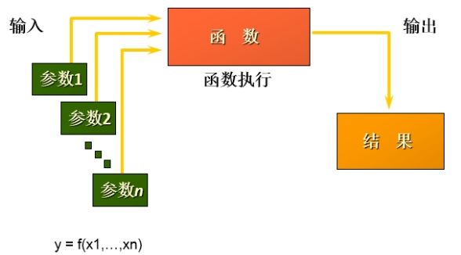

从函数定义的角度出发，我们可以将函数分成 **内置函数** 和 **自定义函数** 。在 SQL 语言中，同样也包括了内置函数和自定义函数。内置函数是系统内置的通用函数，而自定义函数是我们根据自己的需要编写的，本章及下一章讲解的是 SQL 的内置函数。

## 不同DBMS函数的差异

我们在使用 SQL 语言的时候，不是直接和这门语言打交道，而是通过它使用不同的数据库软件，即DBMS。DBMS 之间的差异性很大，远大于同一个语言不同版本之间的差异。实际上，只有很少的函数是被 DBMS 同时支持的。比如，大多数 DBMS 使用（||）或者（+）来做拼接符，而在 MySQL 中的字符串拼接函数为concat()。大部分 DBMS 会有自己特定的函数，这就意味着采用 SQL 函数的代码可移植性是很差的，因此在使用函数的时候需要特别注意。

## MySQL的内置函数及分类

MySQL提供了丰富的内置函数，这些函数使得数据的维护与管理更加方便，能够更好地提供数据的分析与统计功能，在一定程度上提高了开发人员进行数据分析与统计的效率。

MySQL提供的内置函数从 实现的功能角度 可以分为数值函数、字符串函数、日期和时间函数、流程控制函数、加密与解密函数、获取MySQL信息函数、聚合函数等。这里，我将这些丰富的内置函数再分为两类： 单行函数 、 聚合函数（或分组函数） 。

### 两种SQL函数

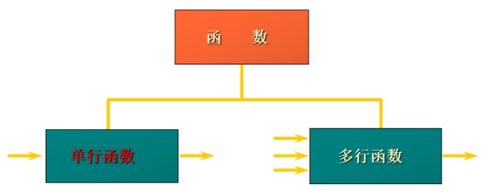

#### 单行函数

* 操作数据对象
* 接受参数返回一个结果
* 只对一行进行变换
* 每行返回一个结果
* 可以嵌套
* 参数可以是一列或一个值

# 数值函数

## 基本函数

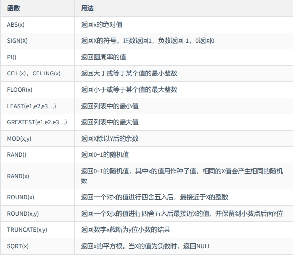

举例：

```
SELECT
ABS(-123),ABS(32),SIGN(-23),SIGN(43),PI(),CEIL(32.32),CEILING(-43.23),FLOOR(32.32),
FLOOR(-43.23),MOD(12,5)
FROM DUAL;
```

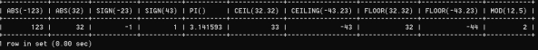

```
SELECT RAND(),RAND(),RAND(10),RAND(10),RAND(-1),RAND(-1)
FROM DUAL;
```

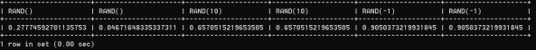

```
SELECT
ROUND(12.33),ROUND(12.343,2),ROUND(12.324,-1),TRUNCATE(12.66,1),TRUNCATE(12.66,-1)
FROM DUAL;
```

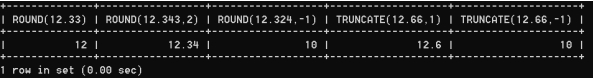

## 角度与弧度互换函数

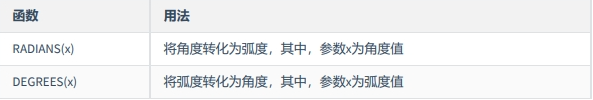

```
SELECT RADIANS(30),RADIANS(60),RADIANS(90),DEGREES(2*PI()),DEGREES(RADIANS(90))
FROM DUAL;
```

## 三角函数

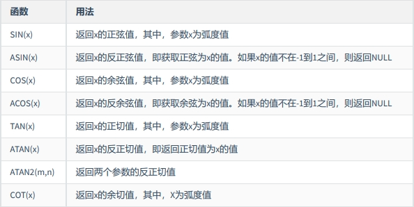

举例：

ATAN2(M,N)函数返回两个参数的反正切值。 与ATAN(X)函数相比，ATAN2(M,N)需要两个参数，例如有两个点point(x1,y1)和point(x2,y2)，使用ATAN(X)函数计算反正切值为ATAN((y2-y1)/(x2-x1))，使用ATAN2(M,N)计算反正切值则为ATAN2(y2-y1,x2-x1)。由使用方式可以看出，当x2-x1等于0时，ATAN(X)函数会报错，而ATAN2(M,N)函数则仍然可以计算。

ATAN2(M,N)函数的使用示例如下：

```
SELECT
SIN(RADIANS(30)),DEGREES(ASIN(1)),TAN(RADIANS(45)),DEGREES(ATAN(1)),DEGREES(ATAN2(1,1))
FROM DUAL;
```

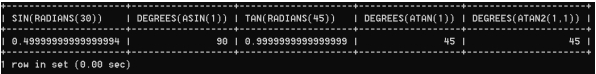

## 指数与对数

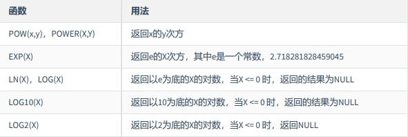

```
SELECT POW(2,5),POWER(2,4),EXP(2),LN(10),LOG10(10),LOG2(4)
-> FROM DUAL;
+----------+------------+------------------+-------------------+-----------+---------+
| POW(2,5) | POWER(2,4) | EXP(2) | LN(10) | LOG10(10) | LOG2(4) |
+----------+------------+------------------+-------------------+-----------+---------+
| 32 | 16 | 7.38905609893065 | 2.302585092994046 | 1 | 2 |
+----------+------------+------------------+-------------------+-----------+---------+
1 row in set (0.00 sec)
```

## 进制间的转换

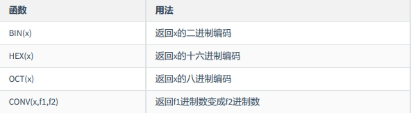

```
SELECT BIN(10),HEX(10),OCT(10),CONV(10,2,8)
-> FROM DUAL;
+---------+---------+---------+--------------+
| BIN(10) | HEX(10) | OCT(10) | CONV(10,2,8) |
+---------+---------+---------+--------------+
| 1010 | A | 12 | 2 |
+---------+---------+---------+--------------+
1 row in set (0.00 sec)
```

## 字符串函数

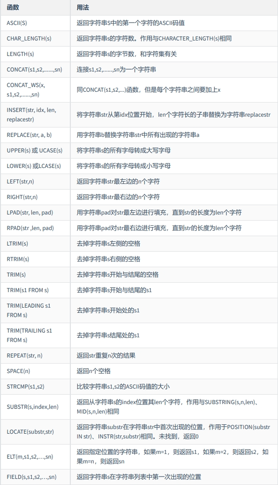

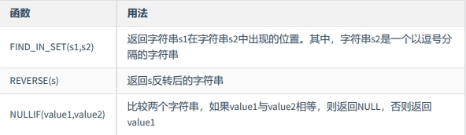

> 注意：MySQL中，字符串的位置是从1开始的。

举例：

```
SELECT FIELD('mm','hello','msm','amma'),FIND_IN_SET('mm','hello,mm,amma')
-> FROM DUAL;
+----------------------------------+-----------------------------------+
| FIELD('mm','hello','msm','amma') | FIND_IN_SET('mm','hello,mm,amma') |
+----------------------------------+-----------------------------------+
| 0 | 2 |
+----------------------------------+-----------------------------------+
1 row in set (0.00 sec)

SELECT NULLIF('mysql','mysql'),NULLIF('mysql', '');
+-------------------------+---------------------+
| NULLIF('mysql','mysql') | NULLIF('mysql', '') |
+-------------------------+---------------------+
| NULL | mysql |
+-------------------------+---------------------+
1 row in set (0.00 sec)
```

# 日期和时间函数

## 获取日期、时间

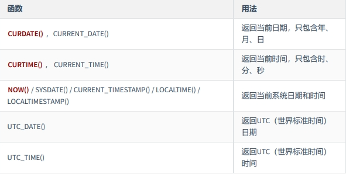

举例：

```
SELECT
CURDATE(),CURTIME(),NOW(),SYSDATE()+0,UTC_DATE(),UTC_DATE()+0,UTC_TIME(),UTC_TIME()+0
FROM DUAL;
```

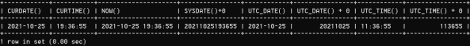

## 日期与时间戳的转换

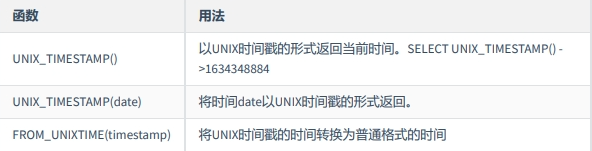

举例：

```
SELECT UNIX_TIMESTAMP(now());
+-----------------------+
| UNIX_TIMESTAMP(now()) |
+-----------------------+
| 1576380910 |
+-----------------------+
1 row in set (0.01 sec)

SELECT UNIX_TIMESTAMP(CURDATE());
+---------------------------+
| UNIX_TIMESTAMP(CURDATE()) |
+---------------------------+
| 1576339200 |
+---------------------------+
1 row in set (0.00 sec)

SELECT UNIX_TIMESTAMP(CURTIME());
+---------------------------+
| UNIX_TIMESTAMP(CURTIME()) |
+---------------------------+
| 1576380969 |
+---------------------------+
1 row in set (0.00 sec)

SELECT UNIX_TIMESTAMP('2011-11-11 11:11:11')
+---------------------------------------+
| UNIX_TIMESTAMP('2011-11-11 11:11:11') |
+---------------------------------------+
| 1320981071 |
+---------------------------------------+
1 row in set (0.00 sec)

SELECT FROM_UNIXTIME(1576380910);
+---------------------------+
| FROM_UNIXTIME(1576380910) |
+---------------------------+
| 2019-12-15 11:35:10 |
+---------------------------+
1 row in set (0.00 sec)
```

## 获取月份、星期、星期数、天数等函数

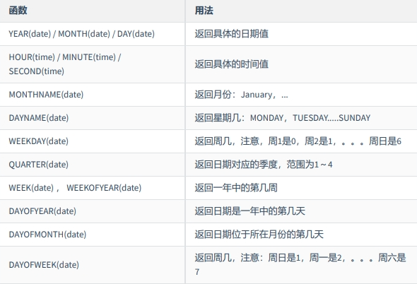

举例：

```
SELECT YEAR(CURDATE()),MONTH(CURDATE()),DAY(CURDATE()),
HOUR(CURTIME()),MINUTE(NOW()),SECOND(SYSDATE())
FROM DUAL;
```

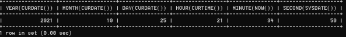

```
SELECT MONTHNAME('2021-10-26'),DAYNAME('2021-10-26'),WEEKDAY('2021-10-26'),
QUARTER(CURDATE()),WEEK(CURDATE()),DAYOFYEAR(NOW()),
DAYOFMONTH(NOW()),DAYOFWEEK(NOW())
FROM DUAL;
```

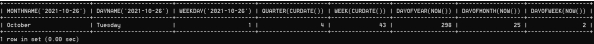

## 日期的操作函数


EXTRACT(type FROM date)函数中type的取值与含义：

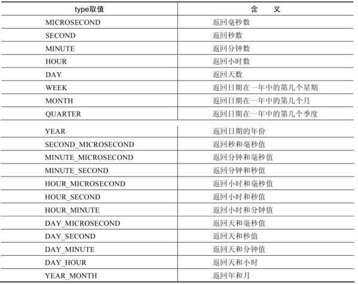

```
SELECT EXTRACT(MINUTE FROM NOW()),EXTRACT( WEEK FROM NOW()),
EXTRACT( QUARTER FROM NOW()),EXTRACT( MINUTE_SECOND FROM NOW())
FROM DUAL;
```

## 时间和秒钟转换的函数

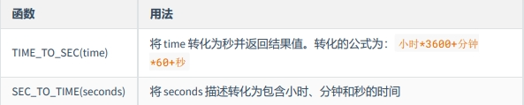

举例：

```
SELECT TIME_TO_SEC(NOW());
+--------------------+
| TIME_TO_SEC(NOW()) |
+--------------------+
| 78774 |
+--------------------+
1 row in set (0.00 sec)

SELECT SEC_TO_TIME(78774);
+--------------------+
| SEC_TO_TIME(78774) |
+--------------------+
| 21:52:54 |
+--------------------+
1 row in set (0.12 sec)
```

## 计算日期和时间的函数

**第1组：**

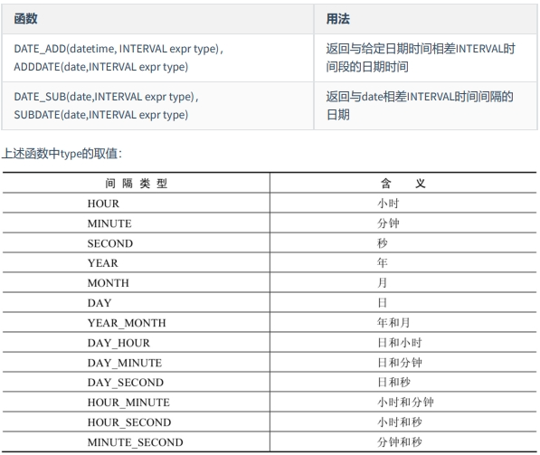

举例：

```
SELECT DATE_ADD(NOW(), INTERVAL 1 DAY) AS col1,DATE_ADD('2021-10-21 23:32:12',INTERVAL
1 SECOND) AS col2,
ADDDATE('2021-10-21 23:32:12',INTERVAL 1 SECOND) AS col3,
DATE_ADD('2021-10-21 23:32:12',INTERVAL '1_1' MINUTE_SECOND) AS col4,
DATE_ADD(NOW(), INTERVAL -1 YEAR) AS col5, #可以是负数
DATE_ADD(NOW(), INTERVAL '1_1' YEAR_MONTH) AS col6 #需要单引号
FROM DUAL;

SELECT DATE_SUB('2021-01-21',INTERVAL 31 DAY) AS col1,
SUBDATE('2021-01-21',INTERVAL 31 DAY) AS col2,
DATE_SUB('2021-01-21 02:01:01',INTERVAL '1 1' DAY_HOUR) AS col3
FROM DUAL;
```

**第2组：**

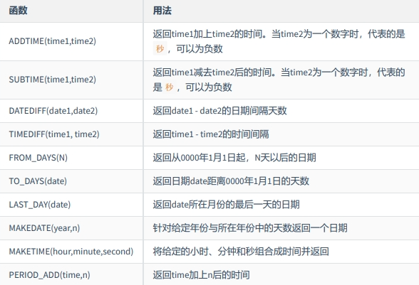

举例：

```
SELECT
ADDTIME(NOW(),20),SUBTIME(NOW(),30),SUBTIME(NOW(),'1:1:3'),DATEDIFF(NOW(),'2021-10-
01'),
TIMEDIFF(NOW(),'2021-10-25 22:10:10'),FROM_DAYS(366),TO_DAYS('0000-12-25'),
LAST_DAY(NOW()),MAKEDATE(YEAR(NOW()),12),MAKETIME(10,21,23),PERIOD_ADD(20200101010101,
10)
FROM DUAL;
```

```
mysql> SELECT ADDTIME(NOW(), 50);
+---------------------+
| ADDTIME(NOW(), 50) |
+---------------------+
| 2019-12-15 22:17:47 |
+---------------------+
1 row in set (0.00 sec)

mysql> SELECT ADDTIME(NOW(), '1:1:1');
+-------------------------+
| ADDTIME(NOW(), '1:1:1') |
+-------------------------+
| 2019-12-15 23:18:46 |
+-------------------------+
1 row in set (0.00 sec)

mysql> SELECT SUBTIME(NOW(), '1:1:1');
+-------------------------+
| SUBTIME(NOW(), '1:1:1') |
+-------------------------+
| 2019-12-15 21:23:50 |
+-------------------------+
1 row in set (0.00 sec)

mysql> SELECT SUBTIME(NOW(), '-1:-1:-1');
+----------------------------+
| SUBTIME(NOW(), '-1:-1:-1') |
+----------------------------+
| 2019-12-15 22:25:11 |
+----------------------------+
1 row in set, 1 warning (0.00 sec)

mysql> SELECT FROM_DAYS(366);
+----------------+
| FROM_DAYS(366) |
+----------------+
| 0001-01-01 |
+----------------+
1 row in set (0.00 sec)

mysql> SELECT MAKEDATE(2020,1);
+------------------+
| MAKEDATE(2020,1) |
+------------------+
| 2020-01-01 |
+------------------+
1 row in set (0.00 sec)

mysql> SELECT MAKEDATE(2020,32);
+-------------------+
| MAKEDATE(2020,32) |
+-------------------+
| 2020-02-01 |
+-------------------+
1 row in set (0.00 sec)

mysql> SELECT MAKETIME(1,1,1);
+-----------------+
| MAKETIME(1,1,1) |
+-----------------+
| 01:01:01 |
+-----------------+
1 row in set (0.00 sec)

mysql> SELECT PERIOD_ADD(20200101010101,1);
+------------------------------+
| PERIOD_ADD(20200101010101,1) |
+------------------------------+
| 20200101010102 |
+------------------------------+
1 row in set (0.00 sec)

mysql> SELECT TO_DAYS(NOW());
+----------------+
| TO_DAYS(NOW()) |
+----------------+
| 737773 |
+----------------+
1 row in set (0.00 sec)
```

举例：查询 7 天内的新增用户数有多少？

```
SELECT COUNT(*) as num FROM new_user WHERE TO_DAYS(NOW())-TO_DAYS(regist_time)<=7
```

## 日期的格式化与解析

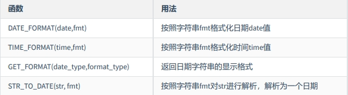

上述 非GET_FORMAT 函数中fmt参数常用的格式符：

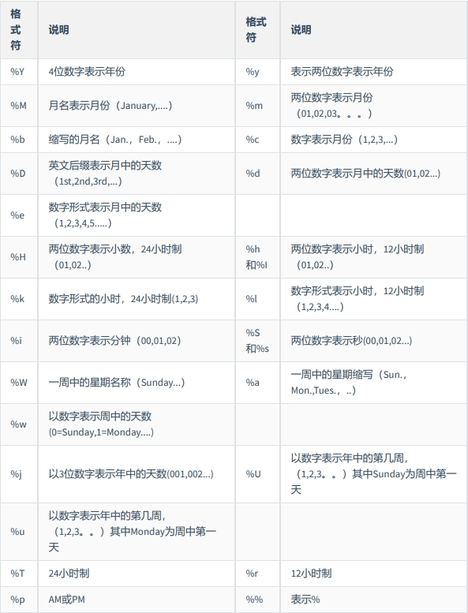

GET_FORMAT函数中date_type和format_type参数取值如下:

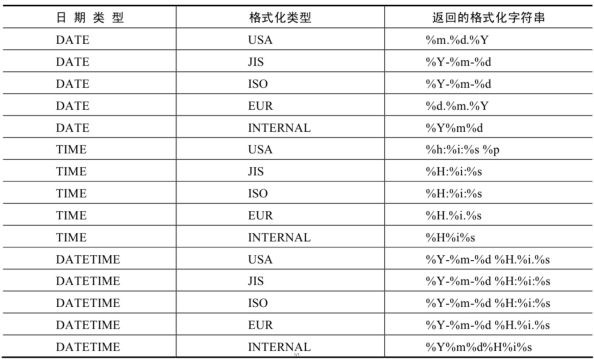

举例：

```
mysql> SELECT DATE_FORMAT(NOW(), '%H:%i:%s');
+--------------------------------+
| DATE_FORMAT(NOW(), '%H:%i:%s') |
+--------------------------------+
| 22:57:34 |
+--------------------------------+
1 row in set (0.00 sec)
```

```
SELECT STR_TO_DATE('09/01/2009','%m/%d/%Y')
FROM DUAL;

SELECT STR_TO_DATE('20140422154706','%Y%m%d%H%i%s')
FROM DUAL;

SELECT STR_TO_DATE('2014-04-22 15:47:06','%Y-%m-%d %H:%i:%s')
FROM DUAL;
```

```
mysql> SELECT GET_FORMAT(DATE, 'USA');
+-------------------------+
| GET_FORMAT(DATE, 'USA') |
+-------------------------+
| %m.%d.%Y |
+-------------------------+
1 row in set (0.00 sec)

SELECT DATE_FORMAT(NOW(),GET_FORMAT(DATE,'USA')),
FROM DUAL;
```

```
mysql> SELECT STR_TO_DATE('2020-01-01 00:00:00','%Y-%m-%d');
+-----------------------------------------------+
| STR_TO_DATE('2020-01-01 00:00:00','%Y-%m-%d') |
+-----------------------------------------------+
| 2020-01-01 |
+-----------------------------------------------+
1 row in set, 1 warning (0.00 sec)
```

# 流程控制函数

流程处理函数可以根据不同的条件，执行不同的处理流程，可以在SQL语句中实现不同的条件选择。

MySQL中的流程处理函数主要包括IF()、IFNULL()和CASE()函数。

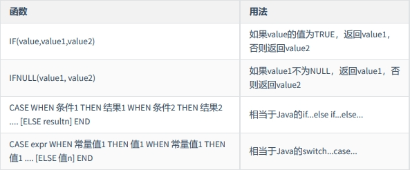

```
SELECT IF(1 > 0,'正确','错误')
->正确

SELECT IFNULL(null,'Hello Word')
->Hello Word

SELECT CASE
WHEN 1 > 0
THEN '1 > 0'
WHEN 2 > 0
THEN '2 > 0'
ELSE '3 > 0'
END
->1 > 0

SELECT CASE 1
WHEN 1 THEN '我是1'
WHEN 2 THEN '我是2'
ELSE '你是谁'

SELECT employee_id,salary, CASE WHEN salary>=15000 THEN '高薪'
WHEN salary>=10000 THEN '潜力股'
WHEN salary>=8000 THEN '屌丝'
ELSE '草根' END "描述"
FROM employees;

SELECT oid,`status`, CASE `status` WHEN 1 THEN '未付款'
WHEN 2 THEN '已付款'
WHEN 3 THEN '已发货'
WHEN 4 THEN '确认收货'
ELSE '无效订单' END
FROM t_order;
```

```
mysql> SELECT CASE WHEN 1 > 0 THEN 'yes' WHEN 1 <= 0 THEN 'no' ELSE 'unknown' END;
+---------------------------------------------------------------------+
| CASE WHEN 1 > 0 THEN 'yes' WHEN 1 <= 0 THEN 'no' ELSE 'unknown' END |
+---------------------------------------------------------------------+
| yes |
+---------------------------------------------------------------------+
1 row in set (0.00 sec)

mysql> SELECT CASE WHEN 1 < 0 THEN 'yes' WHEN 1 = 0 THEN 'no' ELSE 'unknown' END;
+--------------------------------------------------------------------+
| CASE WHEN 1 < 0 THEN 'yes' WHEN 1 = 0 THEN 'no' ELSE 'unknown' END |
+--------------------------------------------------------------------+
| unknown |
+--------------------------------------------------------------------+
1 row in set (0.00 sec)
```

```
mysql> SELECT CASE 1 WHEN 0 THEN 0 WHEN 1 THEN 1 ELSE -1 END;
+------------------------------------------------+
| CASE 1 WHEN 0 THEN 0 WHEN 1 THEN 1 ELSE -1 END |
+------------------------------------------------+
| 1 |
+------------------------------------------------+
1 row in set (0.00 sec)

mysql> SELECT CASE -1 WHEN 0 THEN 0 WHEN 1 THEN 1 ELSE -1 END;
+-------------------------------------------------+
| CASE -1 WHEN 0 THEN 0 WHEN 1 THEN 1 ELSE -1 END |
+-------------------------------------------------+
| -1 |
+-------------------------------------------------+
1 row in set (0.00 sec)
```

```
SELECT employee_id,12 * salary * (1 + IFNULL(commission_pct,0))
FROM employees;
```

```
SELECT last_name, job_id, salary,
CASE job_id WHEN 'IT_PROG' THEN 1.10*salary
WHEN 'ST_CLERK' THEN 1.15*salary
WHEN 'SA_REP' THEN 1.20*salary
ELSE salary END "REVISED_SALARY"
FROM employees;
```

# 加密与解密函数

加密与解密函数主要用于对数据库中的数据进行加密和解密处理，以防止数据被他人窃取。这些函数在保证数据库安全时非常有用。

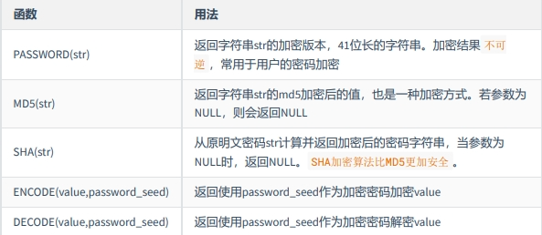

可以看到，ENCODE(value,password_seed)函数与DECODE(value,password_seed)函数互为反函数。

举例：

```
mysql> SELECT PASSWORD('mysql'), PASSWORD(NULL);
+-------------------------------------------+----------------+
| PASSWORD('mysql') | PASSWORD(NULL) |
+-------------------------------------------+----------------+
| *E74858DB86EBA20BC33D0AECAE8A8108C56B17FA | 		     |
+-------------------------------------------+----------------+
1 row in set, 1 warning (0.00 sec)
```

```
SELECT md5('123')
->202cb962ac59075b964b07152d234b7

SELECT SHA('Tom123')
->c7c506980abc31cc390a2438c90861d0f1216d50
```

```
mysql> SELECT ENCODE('mysql', 'mysql');
+--------------------------+
| ENCODE('mysql', 'mysql') |
+--------------------------+
| íg ¼ ìÉ |
+--------------------------+
1 row in set, 1 warning (0.01 sec)

mysql> SELECT DECODE(ENCODE('mysql','mysql'),'mysql');
+-----------------------------------------+
| DECODE(ENCODE('mysql','mysql'),'mysql') |
+-----------------------------------------+
| mysql |
+-----------------------------------------+
1 row in set, 2 warnings (0.00 sec)
```

# MySQL信息函数

MySQL中内置了一些可以查询MySQL信息的函数，这些函数主要用于帮助数据库开发或运维人员更好地对数据库进行维护工作。

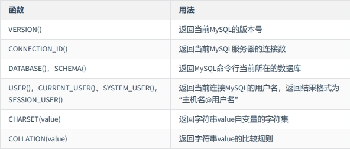

举例：

```
mysql> SELECT DATABASE();
+------------+
| DATABASE() |
+------------+
| test |
+------------+
1 row in set (0.00 sec)

mysql> SELECT DATABASE();
+------------+
| DATABASE() |
+------------+
| test |
+------------+
1 row in set (0.00 sec)

mysql> SELECT USER(), CURRENT_USER(), SYSTEM_USER(),SESSION_USER();
+----------------+----------------+----------------+----------------+
| USER() | CURRENT_USER() | SYSTEM_USER() | SESSION_USER() |
+----------------+----------------+----------------+----------------+
| root@localhost | root@localhost | root@localhost | root@localhost |
+----------------+----------------+----------------+----------------+

mysql> SELECT CHARSET('ABC');
+----------------+
| CHARSET('ABC') |
+----------------+
| utf8mb4 |
+----------------+
1 row in set (0.00 sec)

mysql> SELECT COLLATION('ABC');
+--------------------+
| COLLATION('ABC') |
+--------------------+
| utf8mb4_general_ci |
+--------------------+
1 row in set (0.00 sec)
```

# 其他函数

MySQL中有些函数无法对其进行具体的分类，但是这些函数在MySQL的开发和运维过程中也是不容忽视的。

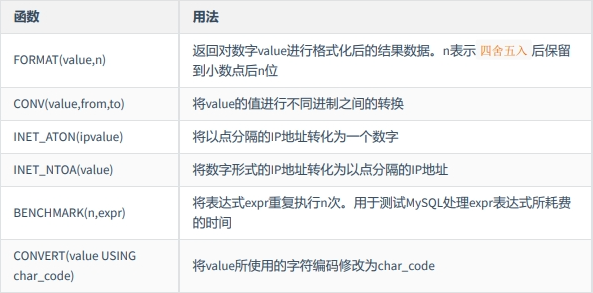

举例：

```
# 如果n的值小于或者等于0，则只保留整数部分
mysql> SELECT FORMAT(123.123, 2), FORMAT(123.523, 0), FORMAT(123.123, -2);
+--------------------+--------------------+---------------------+
| FORMAT(123.123, 2) | FORMAT(123.523, 0) | FORMAT(123.123, -2) |
+--------------------+--------------------+---------------------+
| 123.12 | 124 | 123 |
+--------------------+--------------------+---------------------+
1 row in set (0.00 sec)

mysql> SELECT CONV(16, 10, 2), CONV(8888,10,16), CONV(NULL, 10, 2);
+-----------------+------------------+-------------------+
| CONV(16, 10, 2) | CONV(8888,10,16) | CONV(NULL, 10, 2) |
+-----------------+------------------+-------------------+
| 10000 | 22B8 | NULL |
+-----------------+------------------+-------------------+
1 row in set (0.00 sec)

mysql> SELECT INET_ATON('192.168.1.100');
+----------------------------+
| INET_ATON('192.168.1.100') |
+----------------------------+
| 3232235876 |
+----------------------------+
1 row in set (0.00 sec)
# 以“192.168.1.100”为例，计算方式为192乘以256的3次方，加上168乘以256的2次方，加上1乘以256，再加上
100。

mysql> SELECT INET_NTOA(3232235876);
+-----------------------+
| INET_NTOA(3232235876) |
+-----------------------+
| 192.168.1.100 |
+-----------------------+
1 row in set (0.00 sec)

mysql> SELECT BENCHMARK(1, MD5('mysql'));
+----------------------------+
| BENCHMARK(1, MD5('mysql')) |
+----------------------------+
| 0 |
+----------------------------+
1 row in set (0.00 sec)

mysql> SELECT BENCHMARK(1000000, MD5('mysql'));
+----------------------------------+
| BENCHMARK(1000000, MD5('mysql')) |
+----------------------------------+
| 0 |
+----------------------------------+
1 row in set (0.20 sec)

mysql> SELECT CHARSET('mysql'), CHARSET(CONVERT('mysql' USING 'utf8'));
+------------------+----------------------------------------+
| CHARSET('mysql') | CHARSET(CONVERT('mysql' USING 'utf8')) |
+------------------+----------------------------------------+
| utf8mb4 | utf8 |
+------------------+----------------------------------------+
1 row in set, 1 warning (0.00 sec)

```
