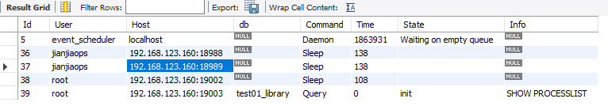

## 简介

`SHOW PROCESSLIST` 是 MySQL 提供的一个命令，用于查看当前正在执行的 MySQL 连接和查询的信息。它可以帮助你监视数据库服务器上的活动，并检查是否有长时间运行的查询或占用大量资源的连接。

这对于监视数据库服务器的性能、识别慢查询和占用资源过多的连接非常有用。

## 示例

使用SHOW PROCESSLIST;后会显示类似以下信息。



```
SHOW PROCESSLIST;


# Id, User, Host, db, Command, Time, State, Info
5, event_scheduler, localhost, , Daemon, 1863931, Waiting on empty queue, 
36, jianjiaops, 192.168.123.160:18988, , Sleep, 138, , 
37, jianjiaops, 192.168.123.160:18989, , Sleep, 138, , 
38, root, 192.168.123.160:19002, , Sleep, 108, , 
39, root, 192.168.123.160:19003, test01_library, Query, 0, init, SHOW PROCESSLIST
```

字段简介：

* `Id`：连接 ID，用于唯一标识每个连接。
* `User`：连接的用户名。
* `Host`：连接的主机名。
* `db`：连接当前正在使用的数据库。
* `Command`：客户端当前执行的命令。常见的命令包括 `Query`（执行查询）、`Sleep`（连接空闲）、`Connect`（连接建立）等。
* `Time`：连接或查询已经运行的时间（以秒为单位）。
* `State`：连接或查询的当前状态。例如，如果查询正在执行，则状态可能为 `Executing`，如果连接空闲，则状态可能为 `Idle`。
* `Info`：查询的详细信息。如果正在执行查询，则该字段包含查询文本。

## 终止线程

有时候，写的SQL查询有问题，可以使用KILL命令终止线程。查询线程被成功终止后，相应的连接将被关闭，并释放相关资源。

具体步骤：

1. 首先，执行 `SHOW PROCESSLIST;` 命令，找到要终止的查询线程的连接 ID。
2. 然后，使用 `KILL` 命令，后跟连接 ID，来终止该查询线程。

```
# 查看当前连接和查询线程的状态
SHOW PROCESSLIST;

# 终止查询线程，线程ID为123
KILL 123;
```

## 注意点

`SHOW PROCESSLIST` 可能会对数据库服务器的性能产生一定的影响，因为它需要查看当前连接和查询的状态信息。因此，在生产环境中，建议谨慎使用，并避免频繁执行该命令。

使用 `KILL` 命令终止查询线程可能会中断正在执行的查询操作，并对数据库服务器产生一定影响。因此，在生产环境中，建议仔细评估终止查询的影响，并谨慎操作。
