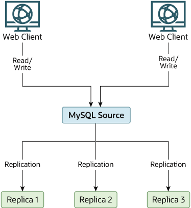
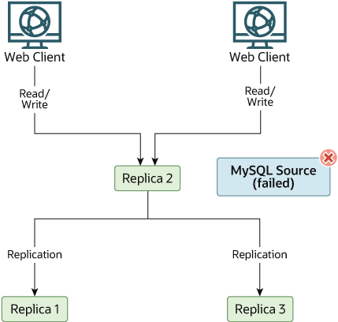

可以使用 CHANGE REPLICATION SOURCE TO 语句告诉副本更改为新源。 副本不会检查源上的数据库与副本上的数据库是否兼容； 它只是开始从新源的二进制日志中的指定坐标读取并执行事件。 在故障转移情况下，组中的所有服务器通常从同一二进制日志文件执行相同的事件，因此更改事件源不应影响数据库的结构或完整性。

副本应在启用二进制日志记录（--log-bin 选项）的情况下运行，这是默认设置。 如果不使用 GTID 进行复制，则还应使用 --log-replica-updates=OFF 运行副本（默认情况下记录副本更新）。 这样，副本就可以成为源，而无需重新启动副本 mysqld。 假设具有图 19.4 “使用复制的冗余，初始结构”所示的结构。

图 19.4 使用复制的冗余，初始结构

在此图中，Source 保存源数据库，Replica* 主机是副本，Web 客户端计算机发出数据库读取和写入操作。 仅发出读取（并且通常连接到副本）的 Web 客户端不会显示，因为它们在发生故障时不需要切换到新服务器。

每个 MySQL 副本（副本 1、副本 2 和副本 3）都是在启用二进制日志记录且 --log-replica-updates=OFF 的情况下运行的副本。 由于当指定 --log-replica-updates=OFF 时，副本从源接收的更新不会写入二进制日志，因此每个副本上的二进制日志最初为空。 如果由于某种原因源变得不可用，可以选择其中一个副本作为新源。 例如，如果选择副本 1，则所有 Web 客户端都应重定向到副本 1，该副本将更新写入其二进制日志。 然后，副本 2 和副本 3 应从副本 1 进行复制。

使用 --log-replica-updates=OFF 运行副本的原因是为了防止副本接收两次更新，以防导致副本之一成为新源。 如果副本 1 启用了 --log-replica-updates（默认设置），它将将从源接收到的任何更新写入自己的二进制日志中。 这意味着，当副本 2 从源更改为副本 1 作为其源时，它可能会从副本 1 接收到已经从源接收到的更新。

确保所有副本都已处理其中继日志中的所有语句。 在每个副本上，发出 STOP REPLICA IO_THREAD，然后检查 SHOW PROCESSLIST 的输出，直到看到已读取所有中继日志。 当所有副本都是如此时，可以将它们重新配置为新设置。 在被提升为源的副本副本 1 上，发出 STOP REPLICA 和 RESET BINARY LOGS AND GTIDS。

在其他副本副本 2 和副本 3 上，使用 STOP REPLICA 并将 REPLICATION SOURCE TO SOURCE_HOST='Replica1' （其中 'Replica1' 表示副本 1 的真实主机名）。 要使用 CHANGE REPLICATION SOURCE TO，请添加有关如何从副本 2 或副本 3 连接到副本 1 的所有信息（用户、密码、端口）。 在这种情况下发出语句时，无需指定要读取的副本 1 二进制日志文件的名称或日志位置，因为第一个二进制日志文件和位置 4 是默认值。 最后，在副本 2 和副本 3 上执行 START REPLICA。

一旦新的复制设置到位，需要告诉每个 Web 客户端将其语句定向到副本 1。从那时起，Web 客户端发送到副本 1 的所有更新都将写入副本 1 的二进制日志，然后 包含自源不可用以来发送到副本 1 的所有更新。

最终的服务器结构如图 19.5 “源故障后使用复制的冗余”所示。

图 19.5 源故障后使用复制实现冗余

当源再次可用时，应该将其设为副本 1 的副本。为此，请在源上发出与之前在副本 2 和副本 3 上发出的相同的 CHANGE REPLICATION SOURCE TO 语句。 然后，源成为副本 1 的副本，并拾取它在脱机时错过的 Web 客户端写入。

要使源再次成为源，请使用前面的过程，就好像副本 1 不可用并且源将成为新源一样。 在此过程中，不要忘记在创建源的副本 1、副本 2 和副本 3 副本之前在源上运行 RESET BINARY LOGS AND GTIDS。 如果未能执行此操作，副本可能会从 Web 客户端应用程序中获取源不可用之前的陈旧写入。

应该意识到，即使副本共享相同的源，副本之间也不会同步，因此某些副本可能会远远领先于其他副本。 这意味着在某些情况下，上一示例中概述的过程可能无法按预期工作。 然而，实际上，所有副本上的中继日志应该相对靠近。

让应用程序了解源位置的一种方法是拥有源主机的动态 DNS 条目。 通过 BIND，可以使用 nsupdate 动态更新 DNS。
