## 概述

官方文档地址：https://learn.microsoft.com/zh-cn/sql/database-engine/install-windows/install-sql-server?view=sql-server-ver16

软件包下载地址：https://www.microsoft.com/zh-cn/sql-server/sql-server-downloads

管理工具下载地址：https://learn.microsoft.com/en-us/sql/ssms/download-sql-server-management-studio-ssms?view=sql-server-ver16

需要安装数据库服务（SQL SERVER）和管理工具（SSMS）2个部分。

## 下载

下载地址：https://www.microsoft.com/zh-cn/sql-server/sql-server-downloads

软件包图标如下：

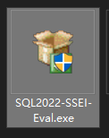

## 安装

双击运行SQL2022-SSEI-Eval.exe程序

选择“基础安装”

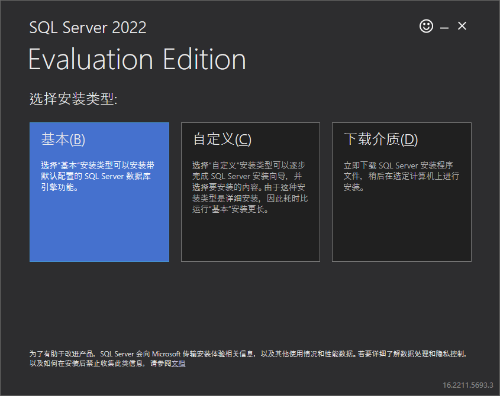

同意并下一步

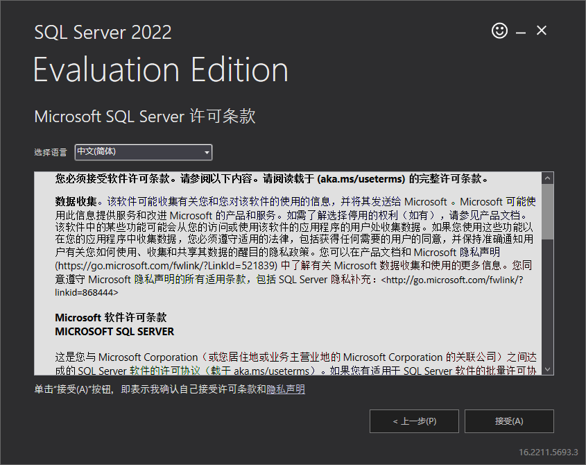

选择安装位置，一般默认即可。

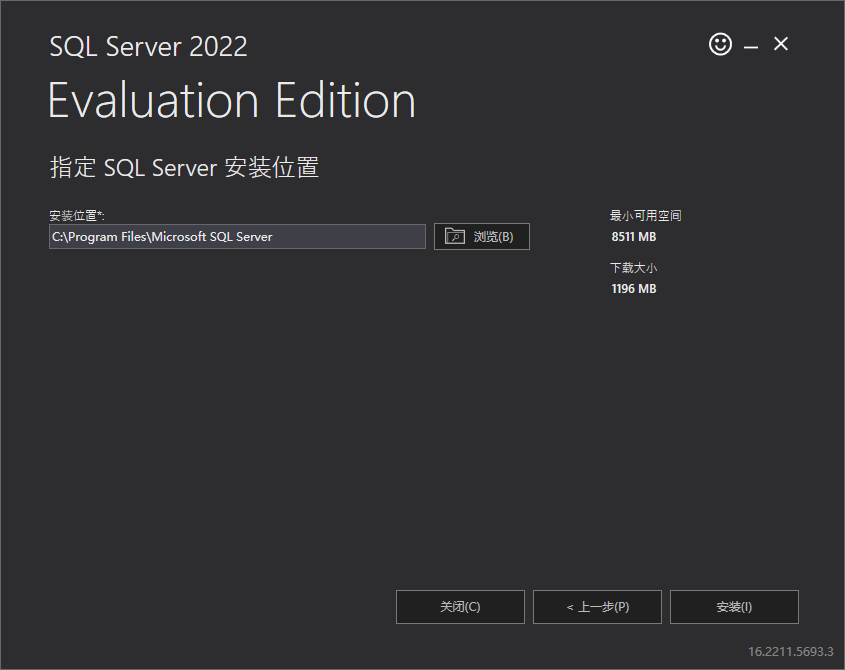

选择安装后，会进行下载软件包。等待安装完成即可。

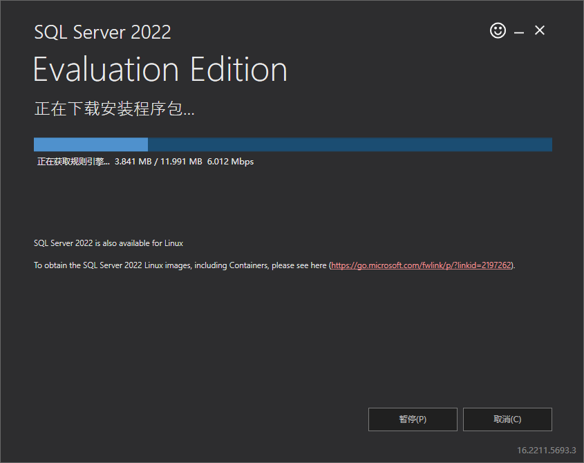

安装完成，如下图：

选择“自定义”选项

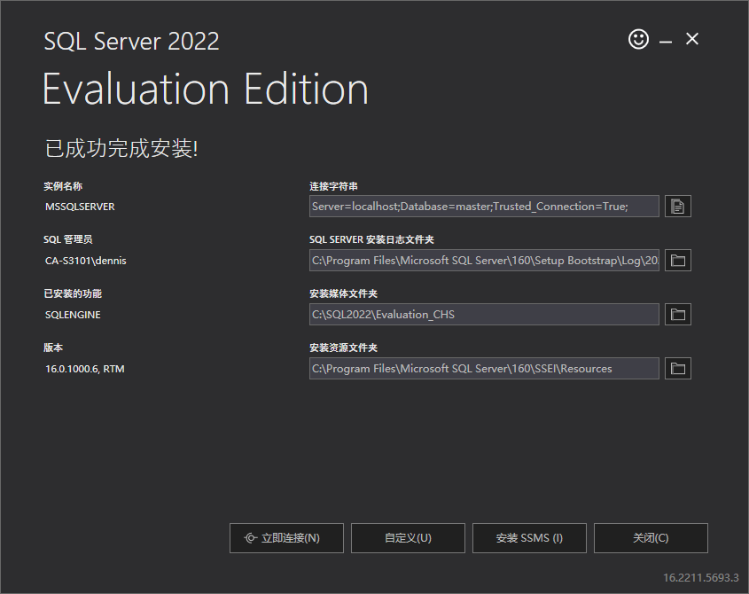

下一步，忽视警告。

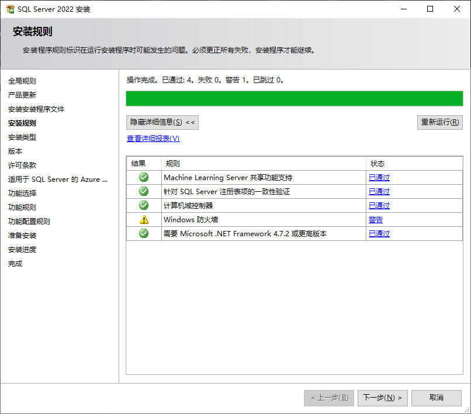

下一步，执行全新安装

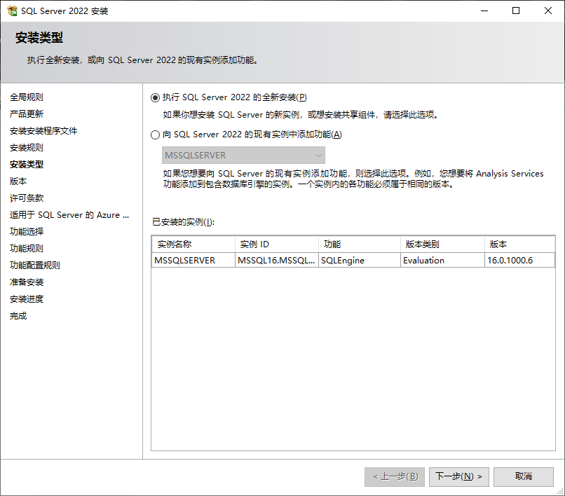

填入密钥，此处是使用版本，不需要密钥。

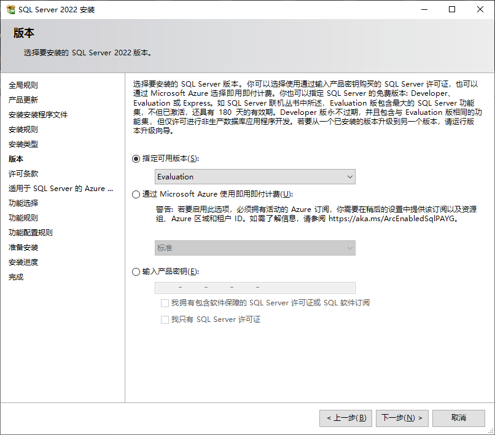

接受条款，并下一步

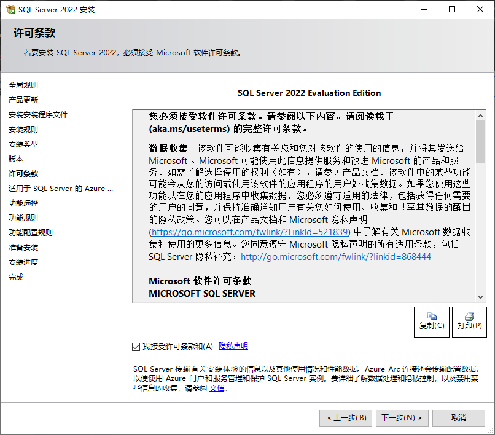

取消适用于SQL Server的Azure选项

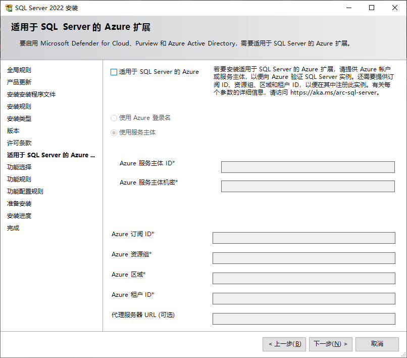

实例功能默认即可

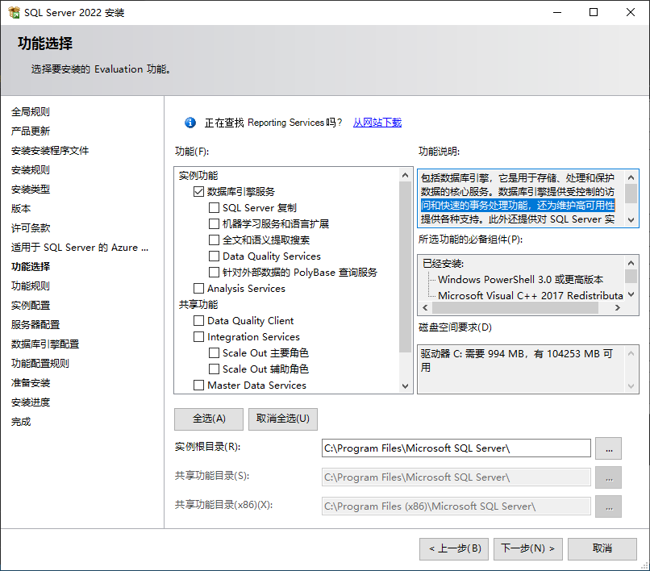

实例配置选默认实例

（未完成，占位）

<<<<<<< HEAD
## 启动和连接数据库

### 启动数据库

有多种方法：

1. 命令行启动

   ```
   net start mssqlserver	#需要管理员权限
   ```
2. SQL SERVER配置管理器启动
   右击SQL Server（MSSQLSERVER）启动服务

   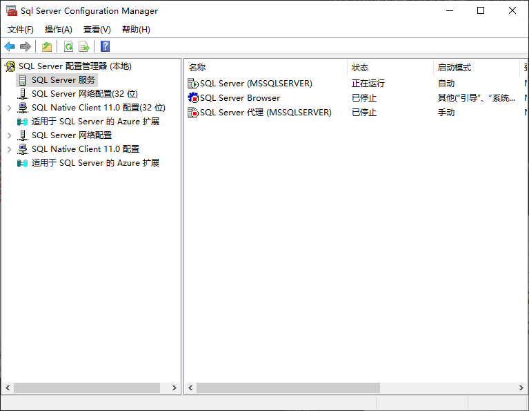
3. Windows服务器启动

   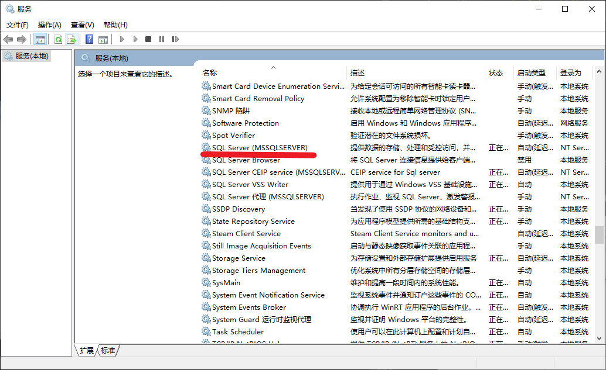

### 连接数据库

1. 从SQL SERVER Managment Studio，使用工具连接到数据库。
2. 身份验证可以选择：
   1. Windows身份验证
   2. SQL SERVER身份验证

## 数据库基本操作

1. 建库
2. 建表
3. 数据维护

=======
>>>>>>> 6c5ebe4c951dea1ae82f2078a5ec9f170381f74c
## Reference Links

#安装教程

https://zhuanlan.zhihu.com/p/376812785
