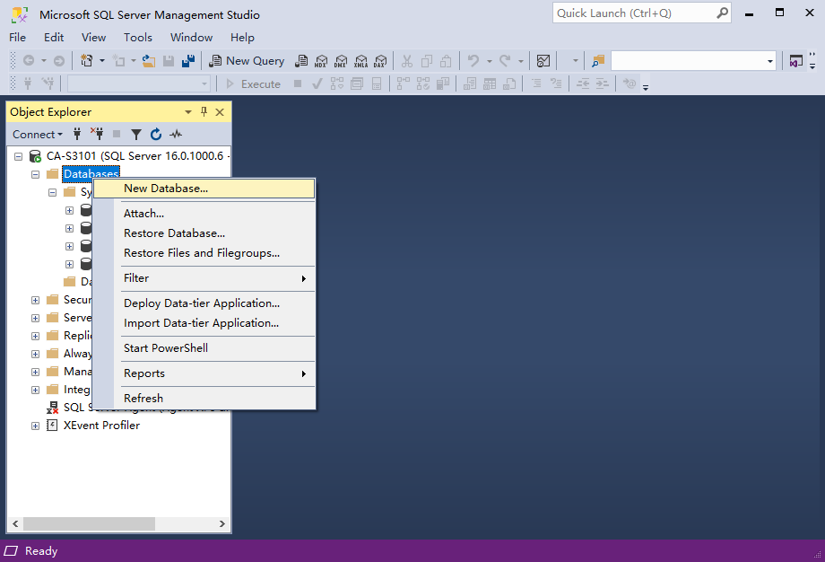
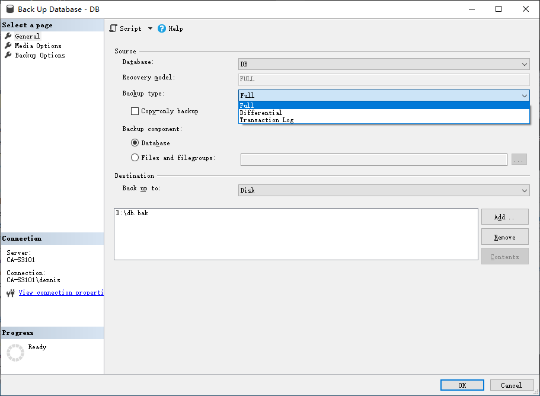

## 建库

右击Databases，选择新建数据库，数据库名称为DB




新建数据库完成，操作界面出现DB数据库。

## 建表

右击数据库DB > Tables > New > Table


输入表字段信息。如定义一张学生表，有StudentId，StudentName，StudentPhone三个字段。


### 设置自增

设置StudentId自增。将Identify Specification设置成Yes（默认no），双击Is Identity即可改成yes。


### 设置主键

右击StudentId字段，选择Set Primary Key。即可将StudentId设置成主键。


StudentId字段带有黄色小钥匙，代表主键设置成功。

## 插入数据

右击Student这张表，选择Edit Top 200 Rows可以编辑前200行数据。


插入三条数据

StudentName，StudentPhone

张三，18000000

李四，17000000

王五，16000000

设置主键后，StudnetId会自增。


## 删除数据

右击记录，选择Del，即可删除一条记录。


## 数据库的迁移

1. 数据库的分离，附加；（分离和删除的区别在于硬盘上是否还留存有数据库文件）
   分离附加过程中，数据库是出于不可用状态。
2. 数据库的备份，还原；
   备份还原过程中，数据库处于可用状态。
3. 数据库脚本的保存；

### 数据库分离和附加

#### 数据库文件保存位置

右击数据库DB > Properties > Files


File栏目可以查看到数据库文件的保存位置


可以将目录复制粘贴到文件栏

```
C:\Program Files\Microsoft SQL Server\MSSQL16.MSSQLSERVER\MSSQL\DATA
```

和DB数据库相关的文件有两个

```
DB.mdf		#数据库数据文件，保存数据文件
DB_log.ldf	#数据库日志文件，保存对数据库的操作日志
```


#### 分离数据库

右击数据库 > Tasks > Detach


将 Drop 和 Update 选中，点击确定。


分离后数据库DB会从管理工具界面消失


之后就可以将 DB.mdf 和 DB_log.ldf 拷贝带走迁移到其他数据库或者备份。

> 注意：
>
> 如果不分离的话，不能直接拷贝数据库文件，此时拷贝文件时会显示数据库文件被占用。

#### 数据库附加

右击 Databases > Attach


点击 Add


找到需要附加数据库的保存位置，选择对应的数据库文件，此处是 DB.mdf ，然后点击OK。


选择对应的数据库文件后，可以查看到显示信息。点击OK。


数据库附加完成。管理工具界面出现 DB 数据库。


### 数据库备份和还原

#### 数据库备份

右击DB数据库 > Tasks > BackUp


可以选择备份类型，和备份保存的磁盘路径，也可以将备份保存到URL。

此处备份类型选择全量备份，备份地址选择D盘。



备份成功后会提示，如下：


#### 数据库恢复

模拟数据库文件损坏的操作，将数据库删除。然后将之前的备份文件恢复。

> 注意：
>
> 删除会同时删除数据库文件和日志文件。请谨慎操作。

删除后，恢复操作如下：

右击Databases > Restore Database 


选择 Device > 添加需要恢复的数据库备份 > 选择要恢复的数据库DB。然后点击OK。


还原成功后会有提示。


### 数据库脚本方式保存和恢复数据库

#### 使用脚本保存数据库

选择需要保存的数据库 > Tasks > Generate Scripts 


选择备份整个数据库和数据库对象


在Set Scripting Options > Advance > Types of data to script > 设置成Schema and data。

默认是仅保存表结构，Schema and data是同时保存表结构和数据。


然后选择保存到脚本 > 单个脚本文件Single Script file > 自定保存位置和脚本文件名 > 格式是Unicode Text。

然后一直下一步，直到保存完成。


#### 恢复数据库

使用管理工具打开备份好的Script文件

File > Open > File > 选择Script文件


打开Script文件，内容如下：

点击 Execute 执行恢复操作。


恢复过程中会显示日志信息，下图显示脚本已运行完成。


