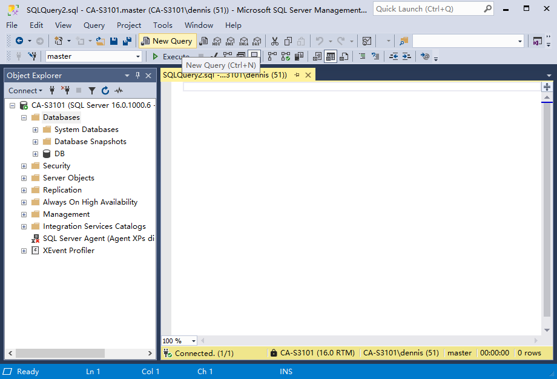

点击工具栏 New Query ，会生成一个空白文本输入框，可以输入SQL命令。



## 新建数据库

将以下内容复制到文本框中，并Execute。

命令格式

```
--创建数据库
create database DBTEST
on --数据文件
(
	name = 'DBTEST1', --逻辑名称
	filename = 'D:\sqlservertest\DBTEST1.mdf',--数据文件物理路径名称
	size = 5MB,--size是数据库文件初始文件大小
	filegrowth = 2MB --数据文件增长方式
)
log on --日志文件，设置和数据文件相似
(
	name = 'DBTEST1_log', --日志文件名
	filename = 'D:\sqlservertest\DBTEST1_log.ldf',
	size = 5MB,
	filegrowth = 2MB
)
```

简介：

* on：标识下面的内容是数据文件。
* sql server中使用 -- 标识注释。
* name：逻辑名称，一般和数据库名称保持一致。
* size：数据库文件初始文件大小，此处新建数据库后文件大小是5M。
* filegrowth：数据文件增长方式，也可以用百分比 = 20% 会增长1M大小。
* 最后一个字段不要加逗号，不然格式会报错。
* log on：标识下面的内容是数据库日志文件。
* DBTEST1_log：日志文件命名方式一般是数据库名后加 _log如：xxx_log
* 

运行后显示建库命令运行成功：

```
Commands completed successfully.

Completion time: 2024-04-25T11:03:07.6693800+08:00
```
