## 前置操作

KVM（Kernel-based Virtual Machine） [http://www.linux-kvm.org/](http://www.linux-kvm.org/) ，基于内核的虚拟机，配合QEMU（处理器虚拟软件），需要CPU支持虚拟化技术（并且在BIOS里打开虚拟化选项），效率可达到物理机的80％以上。

### 查看cpu是否支持

```
sudo grep -E 'svm|vmx' /proc/cpuinfo

#返回以下内容说明主机支持KVM
- vmx is for Intel processors
- svm is for AMD processors
```

## 安装虚拟化软件

```
sudo dnf install qemu-kvm libvirt virt-install bridge-util

#图形化工具：
yum install virt-manager virt-viewer
#开启 libvirtd 服务:
systemctl enable libvirtd && systemctl start libvirtd
```

> 注意：安装软件时一定要确实真正安装上了，如果个别软件无法yum安装，可以先安装epel源。

## 安装KVM

### 环境要求：

如果是物理服务器，需要在BIOS中打开虚拟化功能（Virtualization Technology），一般的服务器默认是打开这个功能的。

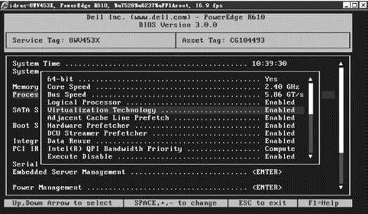

如果是用VMware Workstation做实验，建立的虚拟机的CPU要勾选虚拟化功能，这样虚拟机才会支持KVM虚拟化


### 安装方式：

验证cpu是否支持虚拟化

```bash
egrep -c "(vmx|svm)" /proc/cpuinfo
```

#### 安装系统的时候安装

最简单的安装方法就是在安装系统的时候，安装上虚拟化功能，这里以CentOS7.3为例，选择安装包的时候，如下图选择即可，选择“带GUI的服务器”，并勾选 **“虚拟化客户端”，“虚拟化Hypervisor”，“虚拟化工具”** 。

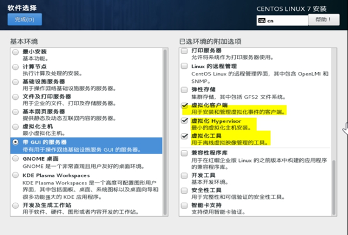

#### 安装系统后安装

如果你的系统是最小化安装的，那你应该安装以下所需软件：

```php
yum groupinstall "GNOME 桌面" -y  //安装GNOME桌面环境
yum install qemu-kvm -y      //KVM核心模块
yum install qemu-kvm-tools -y  //KVM调试工具，可以选择性安装
yum install qemu-img -y      //创建、转换和修改镜像，能处理被qemu支持的所有镜像格式
yum install libvirt -y      //管理虚拟机的工具包
yum install virt-install -y   //virt-install是一个使用libvirt库构建新虚拟机的命令行工具
yum install virt-manager -y    //图形界面管理虚拟机
yum install bridge-utils -y    //配置linux以太网桥
```

#### 验证

检查KVM模块是否安装

```perl
lsmod | grep kvm
kvm_intel             170181  0
kvm                   554609  1 kvm_intel
irqbypass              13503  1 kvm

systemctl status libvirtd
```

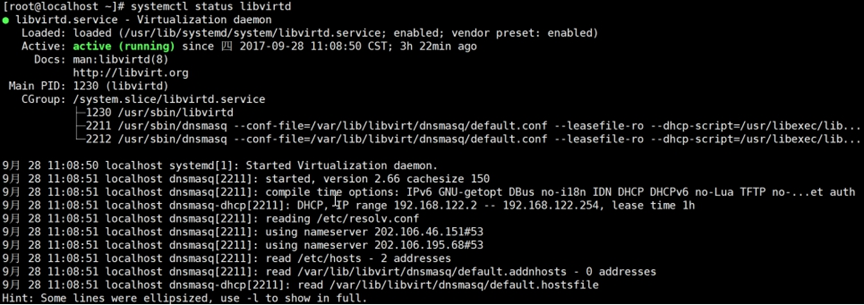

如果libvirtd服务停止运行，那么你将不能管理虚拟机，也就是不能使用virt-manager等工具来管理虚拟机。

## 创建虚拟机

### 1.准备工作：

1. 操作系统安装介质：ISO文件，并上传到系统的/iso目录下

   ```
   ls /iso/
   CentOS-7-x86_64-DVD-1611.iso
   ```

### 2. 磁盘空间准备：

#### 2.1. 添加新磁盘

##### 2.2. 创建LVM

动态识别新磁盘

```
grep mpt /sys/class/scsi_host/host?/proc_name

echo "- - -" >/sys/class/scsi_host/host2/scan

lsblk
```

### 2.3. 创建文件系统及挂载点，并设置开机自动挂载

```bash
pvcreate /dev/sdb
vgcreate vmvg /dev/sdb
lvcreate -n kvmlv  -l 20479 vmvg

mkdir  /kvm-vm
mount /dev/vmvg/kvm-lv /kvm-vm/
```

2、使用virt-manager图形界面创建

virt-manager是基于libvirt的图形化虚拟机管理软件。在命令行中以root身份输入virt-manager命令，出现virt-manager管理界面

### 3.创建存储池

双击“QEMU/KVM”，然后选择“存储”选项卡，然后单击“+”按钮新建存储池，命名为“vm”，单击“前进”，然后输入上面创建的lvm挂载目录，单击完成。

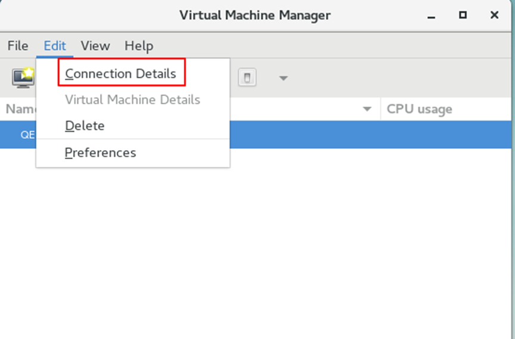

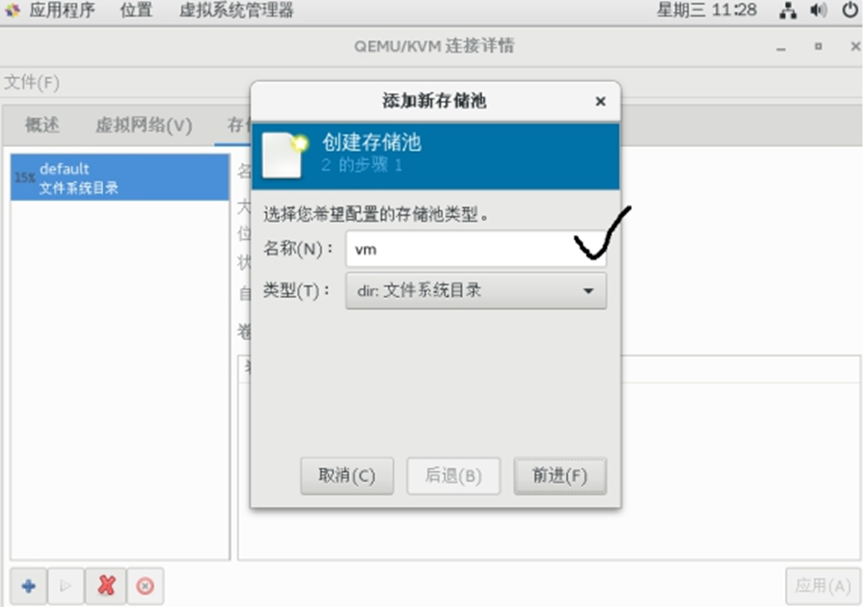

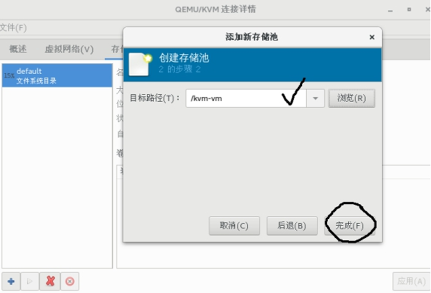

以同样的方法创建一个镜像存储池，命名为vm_iso,目录为/iso即可，用于放置以后KVM虚拟机使用的iso光盘镜像文件。

### 4.创建存储卷

其实就是KVM虚拟机的硬盘文件，选择刚建的“vm”存储卷，点击新建卷，设置名字和大小。

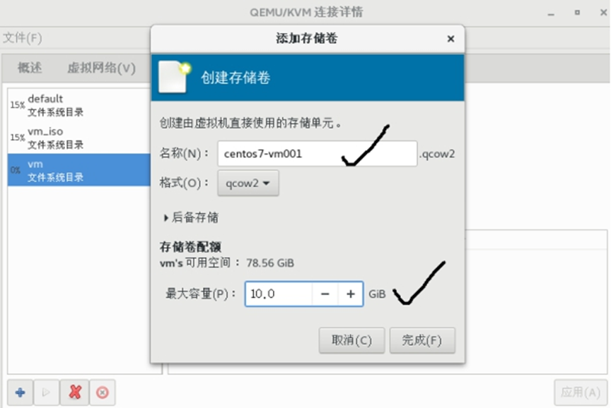

在虚拟系统管理器中选择“新建虚拟机”，选择“本地安装介质”，“前进”

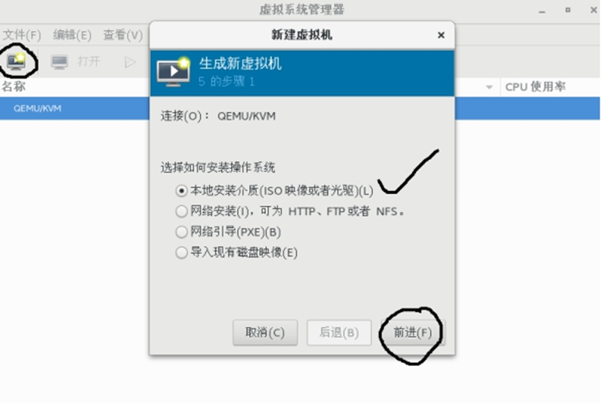

选择“浏览”，选择镜像文件

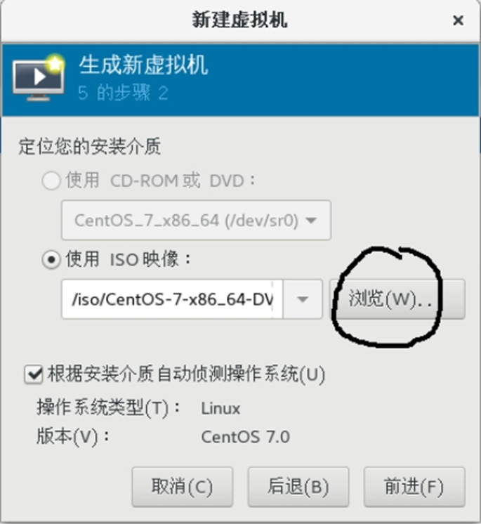

选择内存和CPU设置

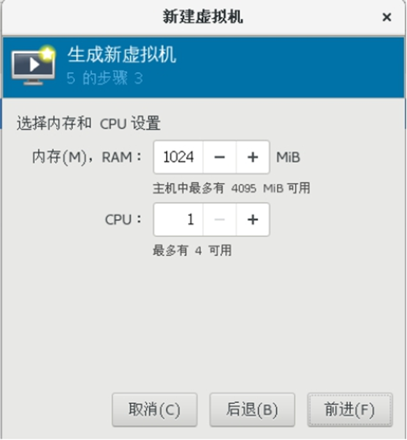

选择虚拟机存储硬盘，选择刚刚创建的硬盘文件。

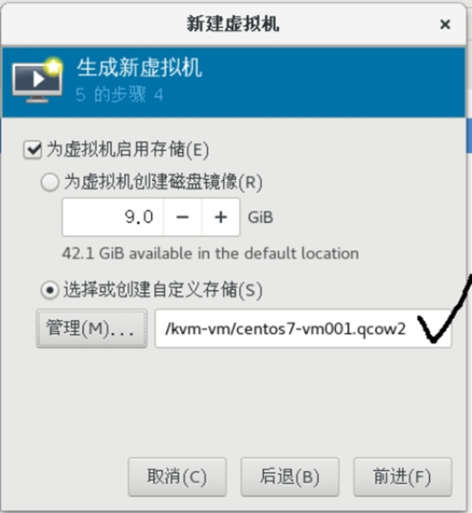

单击完成后，虚拟机就开始创建，然后按照操作系统即可

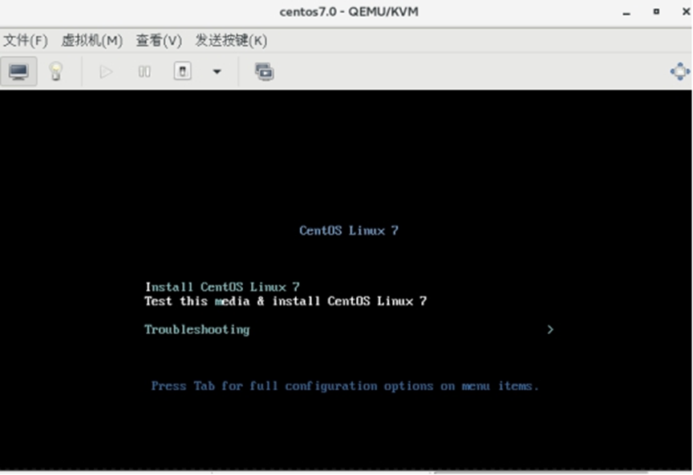

虚拟机的所有配置是放置在一个xml文件中，位置在/etc/libvirt/qemu/目录中

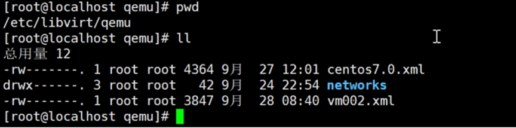

可以看到创建的2个虚拟机，libvirt的xml文件分为几个重要部分，整体结构如下：

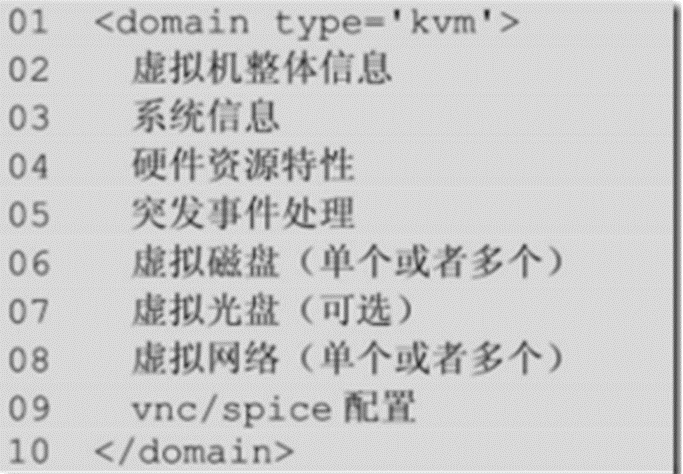

下面是部分截图：

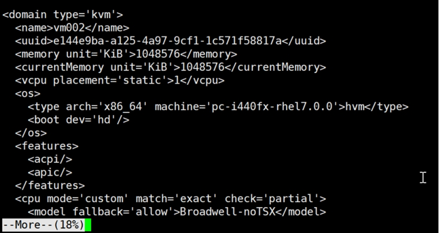

## 使用virt-manager管理虚拟机

virt-manager应用程序是一个桌面用户接口，用于通过libvirt管理虚拟机。它的主要目标是管理KVM,不过也可以管理Xen和LXC（Linux容器）。它提供了运行域的汇总视图，当前性能和资源利用统计。向导可以允许创建新域，以及配置、调整域的资源分配和虚拟硬件。内嵌的VNC和SPICE的客户端提供了一个全图形控制台。

### virt-manager主要功能：

* 定义和创建虚拟机
* 硬件管理
* 性能监视
* 虚拟机的保存和恢复、暂停和继续、关闭和启动
* 控制台
* 在线和离线迁移
* 启用virt-manager

### 管理本地虚拟机

方法1：应用程序----系统工具----虚拟系统管理器

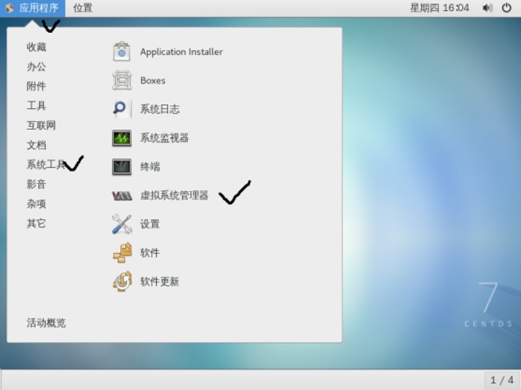

方法2：输入virt-manager命令

配置虚拟机启动选项：

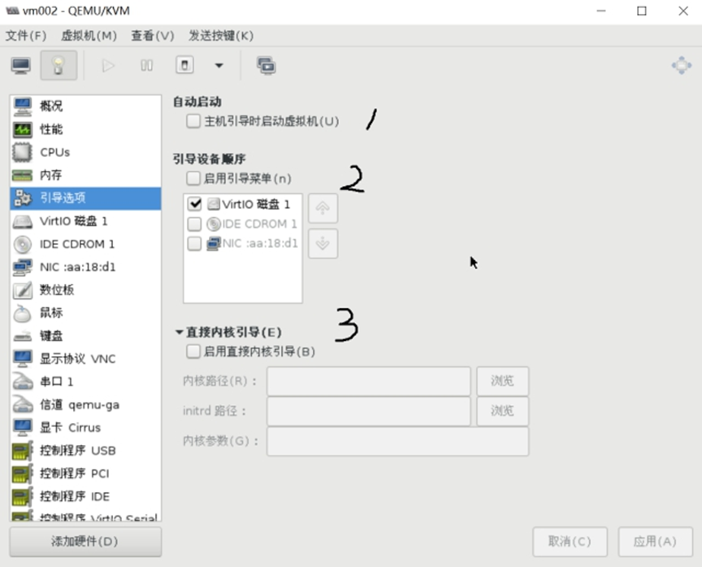

在1的位置如果勾选，可以设置虚拟机随物理主机启动而启动

在2的位置如果勾选，那么虚拟机启动的时候就会出现启动菜单，然后可以选择从哪里启动

在3的位置如果勾选，那么可以让虚拟机启动时候使用宿主机中的内核文件启动

添加USB设备：

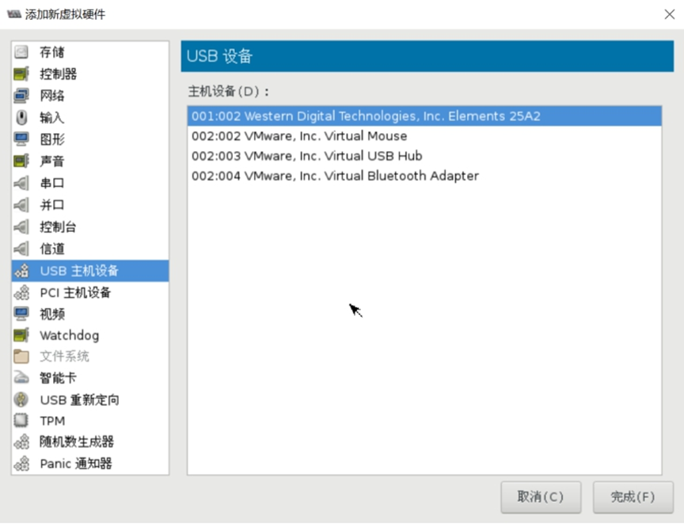

可以添加宿主机上的USB设备到虚拟机中使用，选择添加硬件，添加”USB主机设备”，选择要连接的宿主机上的USB设备即可。

调整监视参数，默认只监视CPU。

先调整首选项，然后在“查看”--“图形”中勾选监控参数即可

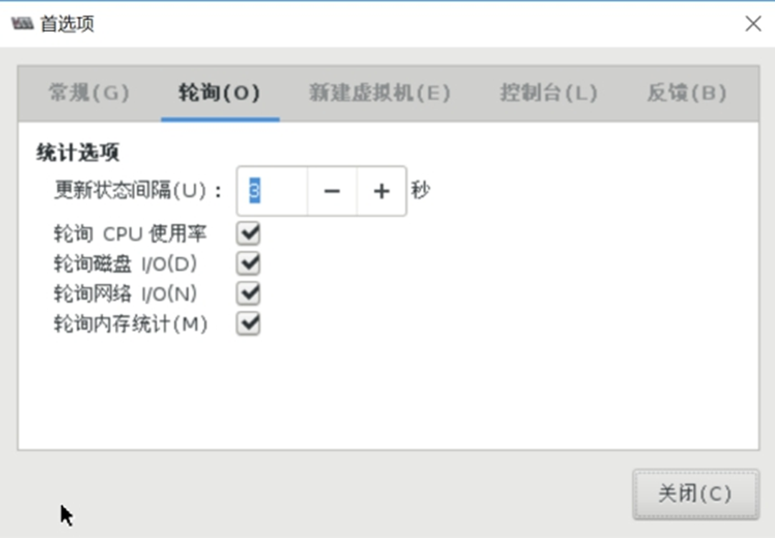

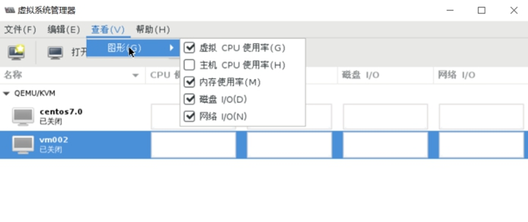

### 管理远程虚拟机

连接远程的KVM主机，进行管理

首先“添加连接”

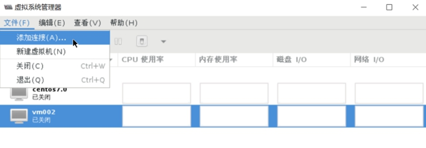

建立连接，添加必要的参数。需要openssh-askpass软件包支持。

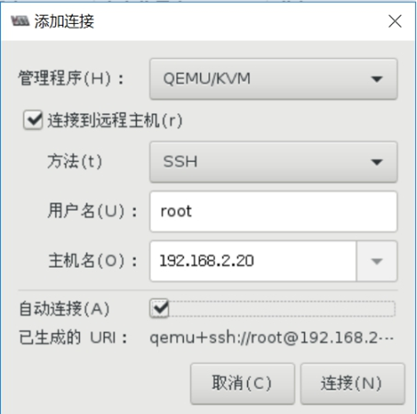

结果如下：

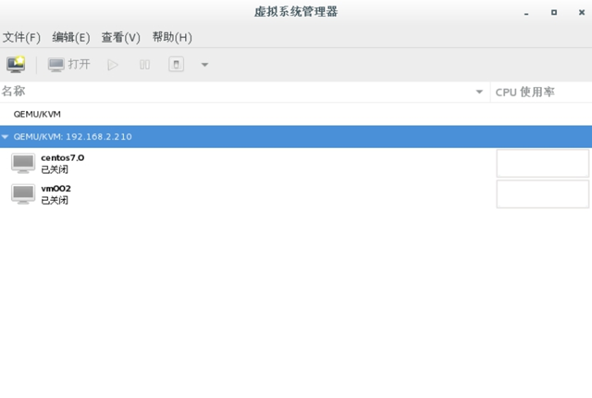

## Reference Links：

https://edu.51cto.com/lecturer/9286589-c81.html

#刘世民

https://www.cnblogs.com/sammyliu/p/4543110.html
